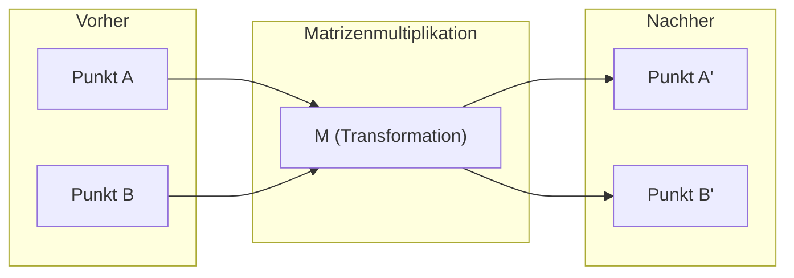
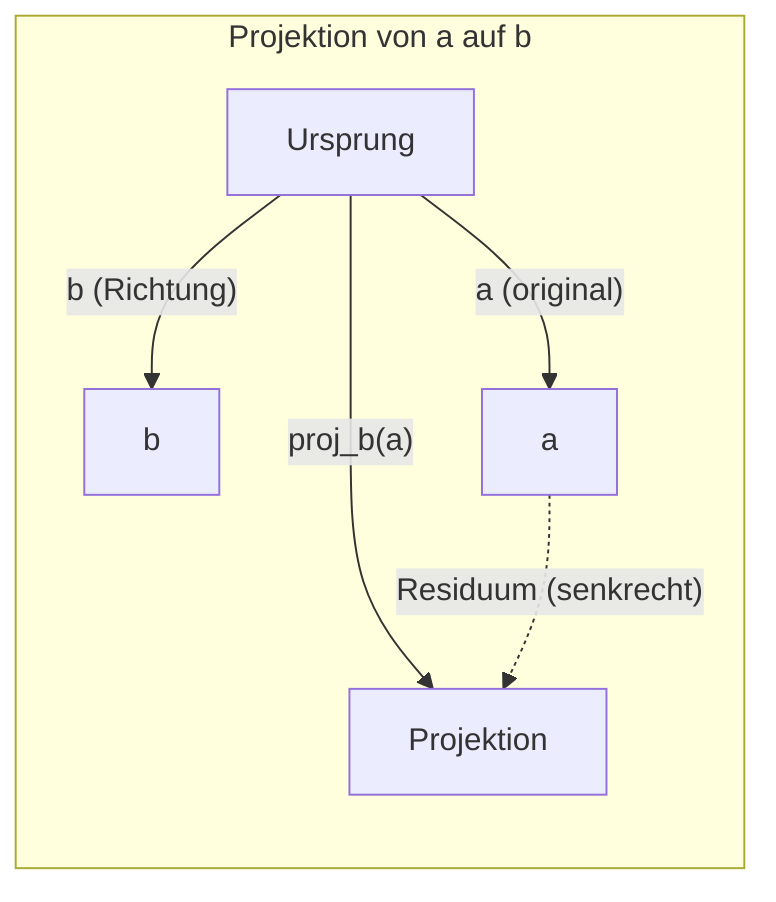

# Lineare Algebra – Intuition

> Jedes KI-Modell ist im Grunde nur Matrizenrechnung mit einem schicken Hut.

**Typ:** Lernen
**Sprachen:** Python, Julia
**Voraussetzungen:** Phase 0
**Zeit:** ~60 Minuten

## Lernziele

- Vektor- und Matrizenoperationen (Addition, Skalarprodukt, Matrizenmultiplikation) von Grund auf in Python implementieren
- Geometrisch erklären, was Skalarprodukt, Projektion und Gram-Schmidt-Verfahren bewirken
- Lineare Unabhängigkeit, Rang und Basis einer Menge von Vektoren mithilfe der Zeilenreduktion bestimmen
- Konzepte der linearen Algebra mit ihren KI-Anwendungen verknüpfen: Embeddings, Attention-Scores und LoRA

## Das Problem

Öffne ein beliebiges ML-Paper. Schon auf der ersten Seite begegnen dir Vektoren, Matrizen, Skalarprodukte und Transformationen. Ohne ein intuitives Verständnis linearer Algebra sind das nur Symbole. Mit diesem Verständnis siehst du, was ein neuronales Netz wirklich tut – es bewegt Punkte im Raum.

Du musst kein Mathematiker sein. Du musst verstehen, was diese Operationen geometrisch bedeuten, und sie dann selbst programmieren.

## Das Konzept

### Vektoren sind Punkte (und Richtungen)

Ein Vektor ist eine geordnete Liste von Zahlen. Diese Zahlen bedeuten etwas – sie sind Koordinaten im Raum.

**2D-Vektor [3, 2]:**

| x | y | Punkt |
|---|---|-------|
| 3 | 2 | Der Vektor zeigt vom Ursprung (0,0) nach (3, 2) in der Ebene |

Der Vektor hat den Betrag sqrt(3^2 + 2^2) = sqrt(13) und zeigt nach oben rechts.

In der KI repräsentieren Vektoren alles:
- Ein Wort → ein Vektor aus 768 Zahlen (seine „Bedeutung" im Embedding-Raum)
- Ein Bild → ein Vektor aus Millionen von Pixelwerten
- Ein Benutzer → ein Vektor aus Präferenzen

### Matrizen sind Transformationen

Eine Matrix transformiert einen Vektor in einen anderen. Sie kann rotieren, skalieren, strecken oder projizieren.



In der KI SIND Matrizen das Modell:
- Gewichte eines neuronalen Netzes → Matrizen, die Eingaben in Ausgaben transformieren
- Attention-Scores → Matrizen, die entscheiden, worauf der Fokus liegt
- Embeddings → Matrizen, die Wörter auf Vektoren abbilden

### Das Skalarprodukt misst Ähnlichkeit

Das Skalarprodukt zweier Vektoren gibt an, wie ähnlich sie sind.

```
a · b = a₁×b₁ + a₂×b₂ + ... + aₙ×bₙ

Gleiche Richtung:       a · b > 0  (ähnlich)
Senkrecht:              a · b = 0  (unabhängig)
Entgegengesetzte Richtung:  a · b < 0  (unähnlich)
```

Genau so funktionieren Suchmaschinen, Empfehlungssysteme und RAG – sie finden Vektoren mit hohem Skalarprodukt.

### Lineare Unabhängigkeit

Vektoren sind linear unabhängig, wenn kein Vektor der Menge als Linearkombination der anderen dargestellt werden kann. Wenn v1, v2, v3 unabhängig sind, spannen sie einen 3D-Raum auf. Wenn einer eine Kombination der anderen ist, spannen sie nur eine Ebene auf.

Warum das für KI wichtig ist: Deine Feature-Matrix sollte linear unabhängige Spalten haben. Wenn zwei Features perfekt korreliert (linear abhängig) sind, kann das Modell ihre Effekte nicht unterscheiden. Das verursacht Multikollinearität in der Regression – die Gewichtsmatrix wird instabil, und kleine Eingabeänderungen führen zu wilden Ausgabschwankungen.

**Konkretes Beispiel:**

```
v1 = [1, 0, 0]
v2 = [0, 1, 0]
v3 = [2, 1, 0]   # v3 = 2*v1 + v2
```

v1 und v2 sind unabhängig. Aber v3 = 2*v1 + v2, daher ist {v1, v2, v3} eine abhängige Menge. Diese drei Vektoren liegen alle in der xy-Ebene. Man kann sie nicht kombinieren, um [0, 0, 1] zu erreichen. Man hat drei Vektoren, aber nur zwei Freiheitsgrade.

### Basis und Rang

Eine Basis ist eine minimale Menge linear unabhängiger Vektoren, die den gesamten Raum aufspannen. Die Anzahl der Basisvektoren ist die Dimension des Raums.

Die Standardbasis für den 3D-Raum ist {[1,0,0], [0,1,0], [0,0,1]}. Aber jede drei unabhängigen Vektoren im 3D bilden eine gültige Basis.

Rang einer Matrix = Anzahl linear unabhängiger Spalten = Anzahl linear unabhängiger Zeilen. Wenn Rang < min(Zeilen, Spalten), ist die Matrix rang-defizient:
- Das System hat unendlich viele Lösungen (oder keine)
- Information geht bei der Transformation verloren
- Die Matrix ist nicht invertierbar

| Situation | Rang | Bedeutung für ML |
|-----------|------|-----------------|
| Voll-Rang (Rang = min(m, n)) | Maximum | Eindeutige Least-Squares-Lösung. Gut konditioniert. |
| Rang-defizient (Rang < min(m, n)) | Unter Maximum | Features sind redundant. Unendlich viele Gewichtslösungen. Regularisierung nötig. |
| Rang 1 | 1 | Jede Spalte ist ein skaliertes Abbild eines Vektors. Alle Daten liegen auf einer Linie. |
| Fast rang-defizient (kleine Singulärwerte) | Numerisch niedrig | Matrix ist schlecht konditioniert. Kleines Eingangsrauschen führt zu großen Ausgabeänderungen. |

### Projektion

Die Projektion des Vektors **a** auf den Vektor **b** ergibt die Komponente von **a** in Richtung **b**:

```
proj_b(a) = (a · b / b · b) * b
```

Das Residuum (a - proj_b(a)) ist senkrecht zu b. Diese orthogonale Zerlegung ist die Grundlage der Methode der kleinsten Quadrate.

Projektion ist überall in ML:
- Lineare Regression minimiert den Abstand von Beobachtungen zum Spaltenraum – die Lösung IST eine Projektion
- PCA projiziert Daten auf die Richtungen maximaler Varianz
- Attention in Transformern berechnet Projektionen von Queries auf Keys



**Beispiel:** a = [3, 4], b = [1, 0]

proj_b(a) = (3*1 + 4*0) / (1*1 + 0*0) * [1, 0] = 3 * [1, 0] = [3, 0]

Die Projektion lässt die y-Komponente fallen. Das ist Dimensionsreduktion in ihrer einfachsten Form.

### Gram-Schmidt-Verfahren

Konvertierung einer Menge unabhängiger Vektoren in eine orthonormale Basis. Orthonormal bedeutet: jeder Vektor hat Länge 1, und jedes Paar ist senkrecht zueinander.

Der Algorithmus:
1. Ersten Vektor nehmen, normieren
2. Zweiten Vektor nehmen, seine Projektion auf den ersten abziehen, normieren
3. Dritten Vektor nehmen, seine Projektionen auf alle vorherigen abziehen, normieren
4. Für verbleibende Vektoren wiederholen

```
Eingabe:  v1, v2, v3, ... (linear unabhängig)

u1 = v1 / |v1|

w2 = v2 - (v2 · u1) * u1
u2 = w2 / |w2|

w3 = v3 - (v3 · u1) * u1 - (v3 · u2) * u2
u3 = w3 / |w3|

Ausgabe: u1, u2, u3, ... (orthonormale Basis)
```

So funktioniert die QR-Zerlegung intern. Q ist die orthonormale Basis, R enthält die Projektionskoeffizienten.

## Umsetzung

### Schritt 1: Vektoren von Grund auf (Python)

```python
class Vector:
    def __init__(self, components):
        self.components = list(components)
        self.dim = len(self.components)

    def __add__(self, other):
        return Vector([a + b for a, b in zip(self.components, other.components)])

    def __sub__(self, other):
        return Vector([a - b for a, b in zip(self.components, other.components)])

    def dot(self, other):
        return sum(a * b for a, b in zip(self.components, other.components))

    def magnitude(self):
        return sum(x**2 for x in self.components) ** 0.5

    def normalize(self):
        mag = self.magnitude()
        return Vector([x / mag for x in self.components])

    def cosine_similarity(self, other):
        return self.dot(other) / (self.magnitude() * other.magnitude())

    def __repr__(self):
        return f"Vector({self.components})"


a = Vector([1, 2, 3])
b = Vector([4, 5, 6])

print(f"a + b = {a + b}")
print(f"a · b = {a.dot(b)}")
print(f"|a| = {a.magnitude():.4f}")
print(f"Kosinus-Ähnlichkeit = {a.cosine_similarity(b):.4f}")
```

### Schritt 2: Matrizen von Grund auf (Python)

```python
class Matrix:
    def __init__(self, rows):
        self.rows = [list(row) for row in rows]
        self.shape = (len(self.rows), len(self.rows[0]))

    def __matmul__(self, other):
        if isinstance(other, Vector):
            return Vector([
                sum(self.rows[i][j] * other.components[j] for j in range(self.shape[1]))
                for i in range(self.shape[0])
            ])
        rows = []
        for i in range(self.shape[0]):
            row = []
            for j in range(other.shape[1]):
                row.append(sum(
                    self.rows[i][k] * other.rows[k][j]
                    for k in range(self.shape[1])
                ))
            rows.append(row)
        return Matrix(rows)

    def transpose(self):
        return Matrix([
            [self.rows[j][i] for j in range(self.shape[0])]
            for i in range(self.shape[1])
        ])

    def __repr__(self):
        return f"Matrix({self.rows})"


rotation_90 = Matrix([[0, -1], [1, 0]])
point = Vector([3, 1])

rotated = rotation_90 @ point
print(f"Original: {point}")
print(f"Um 90° gedreht: {rotated}")
```

### Schritt 3: Warum das für KI wichtig ist

```python
import random

random.seed(42)
weights = Matrix([[random.gauss(0, 0.1) for _ in range(3)] for _ in range(2)])
input_vector = Vector([1.0, 0.5, -0.3])

output = weights @ input_vector
print(f"Eingabe (3D): {input_vector}")
print(f"Ausgabe (2D): {output}")
print("Das ist, was eine Schicht eines neuronalen Netzes tut -- Matrizenmultiplikation.")
```

### Schritt 4: Julia-Version

```julia
a = [1.0, 2.0, 3.0]
b = [4.0, 5.0, 6.0]

println("a + b = ", a + b)
println("a · b = ", a ⋅ b)       # Julia unterstützt Unicode-Operatoren
println("|a| = ", √(a ⋅ a))
println("Kosinus = ", (a ⋅ b) / (√(a ⋅ a) * √(b ⋅ b)))

# Matrix-Vektor-Multiplikation
W = [0.1 -0.2 0.3; 0.4 0.5 -0.1]
x = [1.0, 0.5, -0.3]
println("Wx = ", W * x)
println("Das ist eine Schicht eines neuronalen Netzes.")
```

### Schritt 5: Lineare Unabhängigkeit und Projektion von Grund auf (Python)

```python
def is_linearly_independent(vectors):
    n = len(vectors)
    dim = len(vectors[0].components)
    mat = Matrix([v.components[:] for v in vectors])
    rows = [row[:] for row in mat.rows]
    rank = 0
    for col in range(dim):
        pivot = None
        for row in range(rank, len(rows)):
            if abs(rows[row][col]) > 1e-10:
                pivot = row
                break
        if pivot is None:
            continue
        rows[rank], rows[pivot] = rows[pivot], rows[rank]
        scale = rows[rank][col]
        rows[rank] = [x / scale for x in rows[rank]]
        for row in range(len(rows)):
            if row != rank and abs(rows[row][col]) > 1e-10:
                factor = rows[row][col]
                rows[row] = [rows[row][j] - factor * rows[rank][j] for j in range(dim)]
        rank += 1
    return rank == n


def project(a, b):
    scalar = a.dot(b) / b.dot(b)
    return Vector([scalar * x for x in b.components])


def gram_schmidt(vectors):
    orthonormal = []
    for v in vectors:
        w = v
        for u in orthonormal:
            proj = project(w, u)
            w = w - proj
        if w.magnitude() < 1e-10:
            continue
        orthonormal.append(w.normalize())
    return orthonormal


v1 = Vector([1, 0, 0])
v2 = Vector([1, 1, 0])
v3 = Vector([1, 1, 1])
basis = gram_schmidt([v1, v2, v3])
for i, u in enumerate(basis):
    print(f"u{i+1} = {u}")
    print(f"  |u{i+1}| = {u.magnitude():.6f}")

print(f"u1 · u2 = {basis[0].dot(basis[1]):.6f}")
print(f"u1 · u3 = {basis[0].dot(basis[2]):.6f}")
print(f"u2 · u3 = {basis[1].dot(basis[2]):.6f}")
```

## In der Praxis

Dasselbe mit NumPy – was man in der Praxis tatsächlich verwendet:

```python
import numpy as np

a = np.array([1, 2, 3], dtype=float)
b = np.array([4, 5, 6], dtype=float)

print(f"a + b = {a + b}")
print(f"a · b = {np.dot(a, b)}")
print(f"|a| = {np.linalg.norm(a):.4f}")
print(f"Kosinus = {np.dot(a, b) / (np.linalg.norm(a) * np.linalg.norm(b)):.4f}")

W = np.random.randn(2, 3) * 0.1
x = np.array([1.0, 0.5, -0.3])
print(f"Wx = {W @ x}")
```

### Rang, Projektion und QR mit NumPy

```python
import numpy as np

A = np.array([[1, 2], [2, 4]])
print(f"Rang: {np.linalg.matrix_rank(A)}")

a = np.array([3, 4])
b = np.array([1, 0])
proj = (np.dot(a, b) / np.dot(b, b)) * b
print(f"Projektion von {a} auf {b}: {proj}")

Q, R = np.linalg.qr(np.random.randn(3, 3))
print(f"Q ist orthogonal: {np.allclose(Q @ Q.T, np.eye(3))}")
print(f"R ist obere Dreiecksmatrix: {np.allclose(R, np.triu(R))}")
```

### PyTorch – Tensoren sind Vektoren mit Autodiff

```python
import torch

x = torch.randn(3, requires_grad=True)
y = torch.tensor([1.0, 0.0, 0.0])

similarity = torch.dot(x, y)
similarity.backward()

print(f"x = {x.data}")
print(f"y = {y.data}")
print(f"Skalarprodukt = {similarity.item():.4f}")
print(f"d(Skalarprodukt)/dx = {x.grad}")
```

Der Gradient des Skalarprodukts bezüglich x ist einfach y. PyTorch hat das automatisch berechnet.

## Fertigstellen

Diese Lektion erzeugt:
- `outputs/prompt-linear-algebra-tutor.md` – ein Prompt für KI-Assistenten zum Lehren linearer Algebra durch geometrische Intuition

## Verbindungen

Alles in dieser Lektion verbindet sich mit konkreten Teilen moderner KI:

| Konzept | Anwendung in der KI |
|---------|---------------------|
| Skalarprodukt | Attention-Scores in Transformern, Kosinus-Ähnlichkeit in RAG |
| Matrizenmultiplikation | Jede Schicht eines neuronalen Netzes, jede lineare Transformation |
| Lineare Unabhängigkeit | Feature-Auswahl, Vermeidung von Multikollinearität |
| Rang | Bestimmung der Lösbarkeit eines Systems, LoRA (Low-Rank Adaptation) |
| Projektion | Lineare Regression (Projektion auf den Spaltenraum), PCA |
| Gram-Schmidt / QR | Numerische Löser, Eigenwertberechnung |
| Orthonormale Basis | Stabile numerische Berechnung, Whitening-Transformationen |

LoRA verdient besondere Erwähnung. Es feinabstimmte große Sprachmodelle, indem Gewichtsaktualisierungen in Matrizen mit niedrigem Rang zerlegt werden. Statt einer 4096×4096-Gewichtsmatrix (16M Parameter) aktualisiert LoRA zwei Matrizen der Größe 4096×16 und 16×4096 (131K Parameter). Die Rang-16-Einschränkung bedeutet, dass LoRA davon ausgeht, dass die Gewichtsaktualisierung in einem 16-dimensionalen Unterraum des 4096-dimensionalen Raums liegt. Das ist lineare Algebra bei der Arbeit.

## Übungen

1. Implementiere `Vector.angle_between(other)`, das den Winkel in Grad zwischen zwei Vektoren zurückgibt
2. Erstelle eine 2D-Skalierungsmatrix, die die x-Koordinate verdoppelt und die y-Koordinate verdreifacht, und wende sie auf den Vektor [1, 1] an
3. Finde bei 5 zufälligen wortähnlichen Vektoren (Dimension 50) die zwei ähnlichsten mithilfe der Kosinus-Ähnlichkeit
4. Überprüfe, dass die Gram-Schmidt-Ausgabe wirklich orthonormal ist: prüfe, dass jedes Paar das Skalarprodukt 0 hat und jeder Vektor den Betrag 1
5. Erstelle eine 3×3-Matrix mit Rang 2. Überprüfe mit der `rank()`-Methode. Erkläre dann, welches geometrische Objekt die Spalten aufspannen.
6. Projiziere den Vektor [1, 2, 3] auf [1, 1, 1]. Was stellt das Ergebnis geometrisch dar?

## Schlüsselbegriffe

| Begriff | Was man sagt | Was es wirklich bedeutet |
|---------|-------------|--------------------------|
| Vektor | „Ein Pfeil" | Eine Liste von Zahlen, die einen Punkt oder eine Richtung im n-dimensionalen Raum darstellt |
| Matrix | „Eine Zahlentabelle" | Eine Transformation, die Vektoren von einem Raum in einen anderen abbildet |
| Skalarprodukt | „Multiplizieren und summieren" | Ein Maß, wie ausgerichtet zwei Vektoren sind – das Herzstück der Ähnlichkeitssuche |
| Embedding | „Irgendwas mit KI" | Ein Vektor, der die Bedeutung von etwas darstellt (Wort, Bild, Benutzer) |
| Lineare Unabhängigkeit | „Sie überlappen sich nicht" | Kein Vektor der Menge kann als Kombination der anderen geschrieben werden |
| Rang | „Wie viele Dimensionen" | Die Anzahl linear unabhängiger Spalten (oder Zeilen) einer Matrix |
| Projektion | „Der Schatten" | Die Komponente eines Vektors in Richtung eines anderen |
| Basis | „Die Koordinatenachsen" | Eine minimale Menge unabhängiger Vektoren, die den Raum aufspannen |
| Orthonormal | „Senkrechte Einheitsvektoren" | Vektoren, die paarweise senkrecht stehen und alle die Länge 1 haben |
