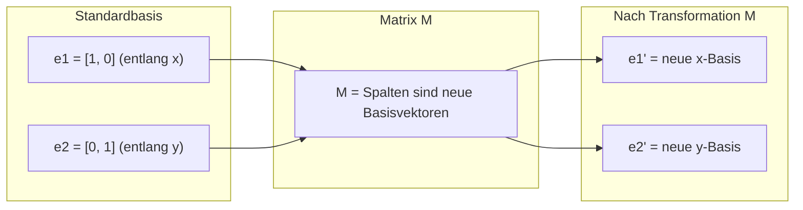
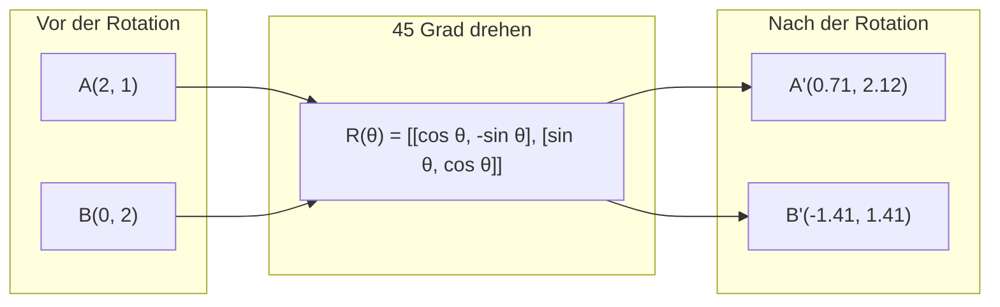
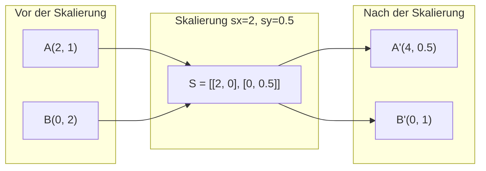
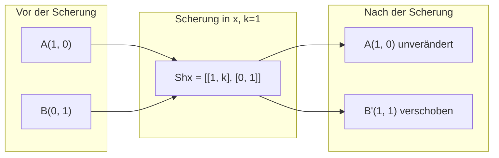
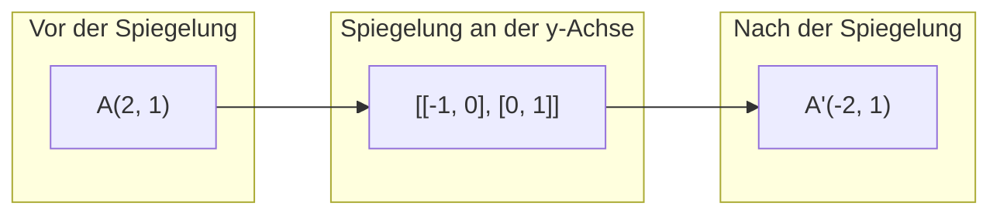
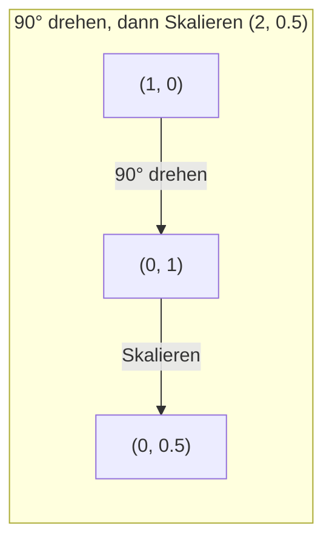
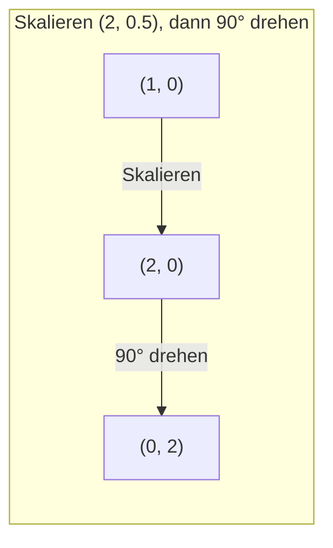

# Matrizentransformationen

> Eine Matrix ist eine Maschine, die den Raum umformt. Lerne, was sie mit jedem Punkt macht, und du verstehst die gesamte Transformation.

**Typ:** Aufbauen
**Sprachen:** Python, Julia
**Voraussetzungen:** Phase 1, Lektionen 01–02 (Lineare Algebra – Intuition, Vektoren & Matrizenoperationen)
**Zeit:** ~75 Minuten

## Lernziele

- Rotations-, Skalierungs-, Scher- und Spiegelungsmatrizen konstruieren und auf 2D- und 3D-Punkte anwenden
- Mehrere Transformationen durch Matrizenmultiplikation zusammensetzen und überprüfen, dass die Reihenfolge wichtig ist
- Eigenwerte und Eigenvektoren von 2×2-Matrizen aus der charakteristischen Gleichung berechnen
- Erklären, warum Eigenwerte PCA-Richtungen, RNN-Stabilität und spektrales Clustering-Verhalten bestimmen

## Das Problem

Du liest über PCA und siehst „finde die Eigenvektoren der Kovarianzmatrix". Du liest über Modellstabilität und siehst „prüfe, ob alle Eigenwerte einen Betrag kleiner als 1 haben". Du liest über Datenaugmentierung und siehst „wende eine zufällige Rotation an". Das alles macht erst Sinn, wenn du verstehst, was Matrizen geometrisch mit dem Raum anstellen.

Matrizen sind nicht nur Zahlenraster. Sie sind räumliche Maschinen. Eine Rotationsmatrix dreht Punkte. Eine Skalierungsmatrix streckt sie. Eine Schermatrix kippt sie. Jede Transformation, die ein neuronales Netz auf Daten anwendet, ist eine dieser Operationen oder eine Komposition davon.

## Das Konzept

### Transformationen als Matrizen

Jede lineare Transformation in 2D kann als 2×2-Matrix geschrieben werden. Die Matrix sagt dir genau, wohin die Basisvektoren [1, 0] und [0, 1] gelangen. Alles andere folgt daraus.



### Rotation

Eine 2D-Rotation um den Winkel theta erhält Abstände und Winkel. Sie bewegt jeden Punkt entlang eines Kreisbogens.



In 3D rotiert man um eine Achse. Jede Achse hat ihre eigene Rotationsmatrix:

```
Rz(theta) = | cos  -sin  0 |     Rotation um die z-Achse
            | sin   cos  0 |     (x-y-Ebene dreht sich, z bleibt)
            |  0     0   1 |

Rx(theta) = | 1   0     0    |   Rotation um die x-Achse
            | 0  cos  -sin   |   (y-z-Ebene dreht sich, x bleibt)
            | 0  sin   cos   |

Ry(theta) = |  cos  0  sin |     Rotation um die y-Achse
            |   0   1   0  |     (x-z-Ebene dreht sich, y bleibt)
            | -sin  0  cos |
```

### Skalierung

Skalierung streckt oder staucht unabhängig entlang jeder Achse.



### Scherung

Scherung kippt eine Achse, während die andere fixiert bleibt. Sie verwandelt Rechtecke in Parallelogramme.



Scherungsmatrizen:
- `Shx = [[1, k], [0, 1]]` verschiebt x um k * y
- `Shy = [[1, 0], [k, 1]]` verschiebt y um k * x

### Spiegelung

Spiegelung spiegelt Punkte an einer Achse oder Geraden.



Spiegelungsmatrizen:
- Spiegelung an der y-Achse: `[[-1, 0], [0, 1]]`
- Spiegelung an der x-Achse: `[[1, 0], [0, -1]]`

### Komposition: Transformationen verketten

Transformation A dann B anwenden ist dasselbe wie ihre Matrizen zu multiplizieren: `result = B @ A @ punkt`. Die Reihenfolge ist wichtig. Erst drehen dann skalieren gibt andere Ergebnisse als erst skalieren dann drehen.



Komponiert: `S @ R = [[0, -2], [0.5, 0]]`



Komponiert: `R @ S = [[0, -0.5], [2, 0]]`

Verschiedene Ergebnisse. Matrizenmultiplikation ist nicht kommutativ.

### Eigenwerte und Eigenvektoren

Die meisten Vektoren ändern ihre Richtung, wenn eine Matrix auf sie trifft. Eigenvektoren sind besonders: die Matrix skaliert sie nur, dreht sie aber nie. Der Skalierungsfaktor ist der Eigenwert.

```
A @ v = lambda * v

v ist der Eigenvektor (Richtung, die erhalten bleibt)
lambda ist der Eigenwert (wie viel gestreckt wird)

Beispiel: A = | 2  1 |
             | 1  2 |

Eigenvektor [1, 1] mit Eigenwert 3:
  A @ [1,1] = [3, 3] = 3 * [1, 1]     (gleiche Richtung, 3-fach skaliert)

Eigenvektor [1, -1] mit Eigenwert 1:
  A @ [1,-1] = [1, -1] = 1 * [1, -1]  (gleiche Richtung, unverändert)
```

Die Matrix streckt den Raum 3× entlang [1, 1] und lässt [1, -1] unverändert.

### Eigenzerlegung

Wenn eine Matrix n linear unabhängige Eigenvektoren hat, kann sie zerlegt werden:

```
A = V @ D @ V^(-1)

V = Matrix, deren Spalten Eigenvektoren sind
D = Diagonalmatrix der Eigenwerte
V^(-1) = Inverse von V

Das bedeutet: in Eigenvektorkoordinaten drehen, entlang jeder Achse skalieren, zurückdrehen.
```

### Warum Eigenwerte wichtig sind

**PCA.** Die Eigenvektoren der Kovarianzmatrix sind die Hauptkomponenten. Die Eigenwerte sagen dir, wie viel Varianz jede Komponente erfasst.

**Stabilität.** In rekurrenten Netzen und dynamischen Systemen verursachen Eigenwerte mit Betrag > 1 explodierende Ausgaben. Betrag < 1 führt zum Verschwinden. Das ist das Vanishing/Exploding-Gradient-Problem in einem Satz.

**Spektrale Methoden.** Graph-Neural-Networks verwenden Eigenwerte der Adjazenzmatrix. Spektrales Clustering verwendet Eigenwerte des Laplacians.

### Determinante als Volumen-Skalierungsfaktor

Die Determinante einer Transformationsmatrix sagt dir, um wie viel sie Fläche (2D) oder Volumen (3D) skaliert.

```
det = 1:   Fläche erhalten (Rotation)
det = 2:   Fläche verdoppelt
det = 0:   Raum in niedrigere Dimension gequetscht (singulär)
det = -1:  Fläche erhalten, aber Orientierung umgekehrt (Spiegelung)

| det(Rotation) | = 1        (immer)
| det(Skalierung sx, sy) | = sx * sy
| det(Scherung) | = 1        (Fläche erhalten)
| det(Spiegelung) | = -1     (Orientierung umgekehrt)
```

## Umsetzung

### Schritt 1: Transformationsmatrizen von Grund auf (Python)

```python
import math

def rotation_2d(theta):
    c, s = math.cos(theta), math.sin(theta)
    return [[c, -s], [s, c]]

def scaling_2d(sx, sy):
    return [[sx, 0], [0, sy]]

def shearing_2d(kx, ky):
    return [[1, kx], [ky, 1]]

def reflection_x():
    return [[1, 0], [0, -1]]

def reflection_y():
    return [[-1, 0], [0, 1]]

def mat_vec_mul(matrix, vector):
    return [
        sum(matrix[i][j] * vector[j] for j in range(len(vector)))
        for i in range(len(matrix))
    ]

def mat_mul(a, b):
    rows_a, cols_b = len(a), len(b[0])
    cols_a = len(a[0])
    return [
        [sum(a[i][k] * b[k][j] for k in range(cols_a)) for j in range(cols_b)]
        for i in range(rows_a)
    ]

point = [1.0, 0.0]
angle = math.pi / 4

rotated = mat_vec_mul(rotation_2d(angle), point)
print(f"(1,0) um 45° drehen: ({rotated[0]:.4f}, {rotated[1]:.4f})")

scaled = mat_vec_mul(scaling_2d(2, 3), [1.0, 1.0])
print(f"(1,1) mit (2,3) skalieren: ({scaled[0]:.1f}, {scaled[1]:.1f})")

sheared = mat_vec_mul(shearing_2d(1, 0), [1.0, 1.0])
print(f"(1,1) scheren kx=1: ({sheared[0]:.1f}, {sheared[1]:.1f})")

reflected = mat_vec_mul(reflection_y(), [2.0, 1.0])
print(f"(2,1) an y spiegeln: ({reflected[0]:.1f}, {reflected[1]:.1f})")
```

### Schritt 2: Komposition von Transformationen

```python
R = rotation_2d(math.pi / 2)
S = scaling_2d(2, 0.5)

rotate_then_scale = mat_mul(S, R)
scale_then_rotate = mat_mul(R, S)

point = [1.0, 0.0]
result1 = mat_vec_mul(rotate_then_scale, point)
result2 = mat_vec_mul(scale_then_rotate, point)

print(f"90° drehen dann skalieren: ({result1[0]:.2f}, {result1[1]:.2f})")
print(f"Skalieren dann 90° drehen: ({result2[0]:.2f}, {result2[1]:.2f})")
print(f"Gleich? {result1 == result2}")
```

### Schritt 3: Eigenwerte von Grund auf (2×2)

Für eine 2×2-Matrix `[[a, b], [c, d]]` lösen Eigenwerte die charakteristische Gleichung: `lambda^2 - (a+d)*lambda + (ad - bc) = 0`.

```python
def eigenvalues_2x2(matrix):
    a, b = matrix[0]
    c, d = matrix[1]
    trace = a + d
    det = a * d - b * c
    discriminant = trace ** 2 - 4 * det
    if discriminant < 0:
        real = trace / 2
        imag = (-discriminant) ** 0.5 / 2
        return (complex(real, imag), complex(real, -imag))
    sqrt_disc = discriminant ** 0.5
    return ((trace + sqrt_disc) / 2, (trace - sqrt_disc) / 2)

def eigenvector_2x2(matrix, eigenvalue):
    a, b = matrix[0]
    c, d = matrix[1]
    if abs(b) > 1e-10:
        v = [b, eigenvalue - a]
    elif abs(c) > 1e-10:
        v = [eigenvalue - d, c]
    else:
        if abs(a - eigenvalue) < 1e-10:
            v = [1, 0]
        else:
            v = [0, 1]
    mag = (v[0] ** 2 + v[1] ** 2) ** 0.5
    return [v[0] / mag, v[1] / mag]

A = [[2, 1], [1, 2]]
vals = eigenvalues_2x2(A)
print(f"Matrix: {A}")
print(f"Eigenwerte: {vals[0]:.4f}, {vals[1]:.4f}")

for val in vals:
    vec = eigenvector_2x2(A, val)
    result = mat_vec_mul(A, vec)
    scaled = [val * vec[0], val * vec[1]]
    print(f"  lambda={val:.1f}, v={[round(x,4) for x in vec]}")
    print(f"    A@v = {[round(x,4) for x in result]}")
    print(f"    l*v = {[round(x,4) for x in scaled]}")
```

### Schritt 4: Determinante als Volumen-Skalierungsfaktor

```python
def det_2x2(matrix):
    return matrix[0][0] * matrix[1][1] - matrix[0][1] * matrix[1][0]

print(f"det(Rotation 45°) = {det_2x2(rotation_2d(math.pi/4)):.4f}")
print(f"det(Skalierung 2,3) = {det_2x2(scaling_2d(2, 3)):.1f}")
print(f"det(Scherung kx=1) = {det_2x2(shearing_2d(1, 0)):.1f}")
print(f"det(Spiegelung y) = {det_2x2(reflection_y()):.1f}")

singular = [[1, 2], [2, 4]]
print(f"det(singulär) = {det_2x2(singular):.1f}")
print("Singulär: Spalten sind proportional, Raum kollabiert zu einer Linie.")
```

## In der Praxis

NumPy behandelt das alles mit optimierten Routinen.

```python
import numpy as np

theta = np.pi / 4
R = np.array([[np.cos(theta), -np.sin(theta)],
              [np.sin(theta),  np.cos(theta)]])

point = np.array([1.0, 0.0])
print(f"(1,0) um 45° drehen: {R @ point}")

S = np.diag([2.0, 3.0])
composed = S @ R
print(f"Skalierung(2,3) nach Rotation(45°): {composed @ point}")

A = np.array([[2, 1], [1, 2]], dtype=float)
eigenvalues, eigenvectors = np.linalg.eig(A)
print(f"\nEigenwerte: {eigenvalues}")
print(f"Eigenvektoren (Spalten):\n{eigenvectors}")

for i in range(len(eigenvalues)):
    v = eigenvectors[:, i]
    lam = eigenvalues[i]
    print(f"  A @ v{i} = {A @ v}, lambda * v{i} = {lam * v}")

print(f"\ndet(R) = {np.linalg.det(R):.4f}")
print(f"det(S) = {np.linalg.det(S):.1f}")

B = np.array([[3, 1], [0, 2]], dtype=float)
vals, vecs = np.linalg.eig(B)
D = np.diag(vals)
V = vecs
reconstructed = V @ D @ np.linalg.inv(V)
print(f"\nEigenzerlegung A = V @ D @ V^-1:")
print(f"Original:\n{B}")
print(f"Rekonstruiert:\n{reconstructed}")
```

### 3D-Rotationen mit NumPy

```python
def rotation_3d_z(theta):
    c, s = np.cos(theta), np.sin(theta)
    return np.array([[c, -s, 0], [s, c, 0], [0, 0, 1]])

def rotation_3d_x(theta):
    c, s = np.cos(theta), np.sin(theta)
    return np.array([[1, 0, 0], [0, c, -s], [0, s, c]])

point_3d = np.array([1.0, 0.0, 0.0])
rotated_z = rotation_3d_z(np.pi / 2) @ point_3d
rotated_x = rotation_3d_x(np.pi / 2) @ point_3d

print(f"\n3D-Punkt: {point_3d}")
print(f"90° um z drehen: {np.round(rotated_z, 4)}")
print(f"90° um x drehen: {np.round(rotated_x, 4)}")
```

## Fertigstellen

Diese Lektion baut die geometrische Grundlage für PCA (Phase 2) und die Analyse neuronaler Netzgewichte. Der hier entwickelte Eigenwert/Eigenvektor-Code ist derselbe Algorithmus, der Dimensionsreduktion, spektrales Clustering und Stabilitätsanalyse in produktiven ML-Systemen antreibt.

## Übungen

1. Wende Rotation, Skalierung und Scherung auf ein Einheitsquadrat an (Ecken bei [0,0], [1,0], [1,1], [0,1]). Drucke die transformierten Ecken für jede aus. Überprüfe, dass Rotation die Abstände zwischen Ecken erhält.

2. Finde die Eigenwerte der Matrix [[4, 2], [1, 3]] von Hand mit der charakteristischen Gleichung. Überprüfe dann mit deiner selbst geschriebenen Funktion und mit NumPy.

3. Erstelle eine Komposition aus drei Transformationen (30° drehen, mit [1.5, 0.8] skalieren, mit kx=0.3 scheren) und wende sie auf 8 im Kreis angeordnete Punkte an. Berechne die Determinante der komponierten Matrix und überprüfe, dass sie gleich dem Produkt der einzelnen Determinanten ist.

## Schlüsselbegriffe

| Begriff | Was man sagt | Was es wirklich bedeutet |
|---------|-------------|--------------------------|
| Rotationsmatrix | „Dreht Dinge" | Eine orthogonale Matrix, die Punkte entlang Kreisbögen bewegt und dabei Abstände und Winkel erhält. Determinante ist immer 1. |
| Skalierungsmatrix | „Macht Dinge größer" | Eine Diagonalmatrix, die unabhängig entlang jeder Achse streckt oder staucht. Determinante ist das Produkt der Skalierungsfaktoren. |
| Scherungsmatrix | „Verneigt Dinge" | Eine Matrix, die eine Koordinate proportional zu einer anderen verschiebt und Rechtecke in Parallelogramme verwandelt. Determinante ist 1. |
| Spiegelung | „Spiegelt Dinge" | Eine Matrix, die den Raum an einer Achse oder Ebene umklappt. Determinante ist -1. |
| Komposition | „Zwei Dinge tun" | Transformationsmatrizen multiplizieren, um Operationen zu verketten. Reihenfolge ist wichtig: B @ A bedeutet zuerst A, dann B anwenden. |
| Eigenvektor | „Besondere Richtung" | Eine Richtung, die die Matrix nur skaliert, nie dreht. Der Fingerabdruck der Transformation. |
| Eigenwert | „Wie viel wird gestreckt" | Der skalare Faktor, mit dem die Matrix ihren Eigenvektor skaliert. Kann negativ (Flip) oder komplex (Rotation) sein. |
| Eigenzerlegung | „Matrix auseinandernehmen" | Eine Matrix als V @ D @ V^(-1) schreiben und in ihre fundamentalen Skalierungsrichtungen und -beträge zerlegen. |
| Determinante | „Eine Zahl aus einer Matrix" | Der Faktor, um den die Transformation Fläche (2D) oder Volumen (3D) skaliert. Null bedeutet, die Transformation ist irreversibel. |
| Charakteristische Gleichung | „Woher Eigenwerte kommen" | det(A - lambda * I) = 0. Das Polynom, dessen Wurzeln die Eigenwerte sind. |

## Weiterführende Literatur

- [3Blue1Brown: Lineare Transformationen](https://www.3blue1brown.com/lessons/linear-transformations) – visuelle Intuition dafür, wie Matrizen den Raum umformen
- [3Blue1Brown: Eigenvektoren und Eigenwerte](https://www.3blue1brown.com/lessons/eigenvalues) – die beste visuelle Erklärung, was Eigenvektoren geometrisch bedeuten
- [MIT 18.06 Vorlesung 21: Eigenwerte und Eigenvektoren](https://ocw.mit.edu/courses/18-06-linear-algebra-spring-2010/) – Gilbert Strangs klassische Behandlung
