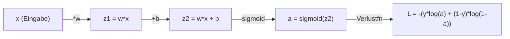
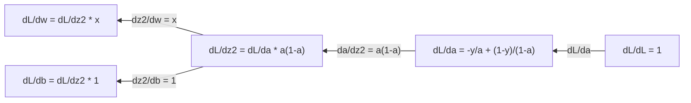
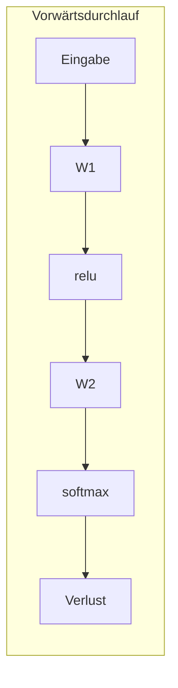
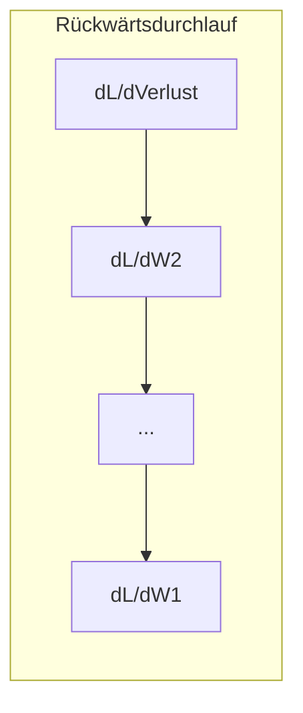

# Differential- und Integralrechnung für ML

> Ableitungen zeigen dir, wo es bergab geht. Das ist alles, was ein neuronales Netz zum Lernen braucht.

**Typ:** Lernen
**Sprachen:** Python
**Voraussetzungen:** Phase 1, Lektionen 01–03
**Zeit:** ~60 Minuten

## Lernziele

- Numerische und analytische Ableitungen für gängige ML-Funktionen (x^2, Sigmoid, Kreuzentropie) berechnen
- Gradientenabstieg von Grund auf implementieren, um eine Verlustfunktion in 1D und 2D zu minimieren
- Den Gradienten eines linearen Regressionsmodells herleiten und es durch manuelle Gewichtsaktualisierungen trainieren
- Die Hesse-Matrix, Taylor-Reihenannäherungen und ihre Verbindung zu Optimierungsverfahren erklären

## Das Problem

Du hast ein neuronales Netz mit Millionen von Gewichten. Jedes Gewicht ist ein Regler. Du musst herausfinden, in welche Richtung jeder einzelne Regler gedreht werden soll, damit das Modell ein bisschen weniger falsch liegt. Die Differentialrechnung gibt dir diese Richtung.

Ohne Differentialrechnung würde das Training eines neuronalen Netzes bedeuten, zufällige Änderungen auszuprobieren und auf das Beste zu hoffen. Mit Ableitungen weißt du genau, wie jedes Gewicht den Fehler beeinflusst. Du drehst jeden Regler jedes Mal in die richtige Richtung.

## Das Konzept

### Was ist eine Ableitung?

Eine Ableitung misst die Änderungsrate. Für eine Funktion y = f(x) sagt dir die Ableitung f'(x): Wenn du x um einen winzigen Betrag verschiebst, wie sehr ändert sich dann y?

Geometrisch gesehen ist die Ableitung die Steigung der Tangente an einem Punkt.

**f(x) = x^2:**

| x | f(x) | f'(x) (Steigung) |
|---|------|-----------------|
| 0 | 0    | 0 (flach, am Tiefpunkt) |
| 1 | 1    | 2 |
| 2 | 4    | 4 (Tangentensteigung an diesem Punkt) |
| 3 | 9    | 6 |

Bei x=2 beträgt die Steigung 4. Wenn du x ein kleines Stück nach rechts verschiebst, erhöht sich y um etwa das 4-Fache dieses Betrags. Bei x=0 ist die Steigung 0. Du bist am Tiefpunkt der Kurve.

Die formale Definition:

```
f'(x) = lim   f(x + h) - f(x)
        h->0  -----------------
                     h
```

Im Code lässt man das Limit weg und verwendet einfach ein sehr kleines h. Das ist die numerische Ableitung.

### Partielle Ableitungen: eine Variable nach der anderen

Echte Funktionen haben viele Eingaben. Ein neuronaler Netz-Verlust hängt von Tausenden von Gewichten ab. Eine partielle Ableitung hält alle Variablen bis auf eine konstant und leitet dann nach dieser einen ab.

```
f(x, y) = x^2 + 3xy + y^2

df/dx = 2x + 3y     (y als Konstante behandeln)
df/dy = 3x + 2y     (x als Konstante behandeln)
```

Jede partielle Ableitung beantwortet die Frage: Wenn ich nur dieses eine Gewicht verändere, wie ändert sich der Verlust?

### Der Gradient: Vektor aller partiellen Ableitungen

Der Gradient fasst alle partiellen Ableitungen in einem Vektor zusammen. Für eine Funktion f(x, y, z) lautet der Gradient:

```
grad f = [ df/dx, df/dy, df/dz ]
```

Der Gradient zeigt in die Richtung des steilsten Anstiegs. Um eine Funktion zu minimieren, geht man in die entgegengesetzte Richtung.

**Konturplot von f(x,y) = x^2 + y^2:**

Die Funktion bildet eine Schüsselform mit konzentrischen Kreisen als Konturlinien. Das Minimum liegt bei (0, 0).

| Punkt | grad f | -grad f (Abstiegsrichtung) |
|-------|--------|---------------------------|
| (1, 1) | [2, 2] (zeigt bergauf, weg vom Minimum) | [-2, -2] (zeigt bergab, zum Minimum) |
| (0, 0) | [0, 0] (flach, am Minimum) | [0, 0] |

Das ist Gradientenabstieg in einem Bild. Gradienten berechnen, negieren, einen Schritt machen.

### Die Verbindung zur Optimierung

Ein neuronales Netz zu trainieren bedeutet Optimierung. Du hast eine Verlustfunktion L(w1, w2, ..., wn), die misst, wie falsch das Modell liegt. Du willst sie minimieren.

```
Aktualisierungsregel des Gradientenabstiegs:

  w_neu = w_alt - lernrate * dL/dw

Für jedes Gewicht:
  1. Die partielle Ableitung des Verlusts bezüglich dieses Gewichts berechnen
  2. Ein kleines Vielfaches davon vom Gewicht abziehen
  3. Wiederholen
```

Die Lernrate steuert die Schrittgröße. Zu groß, und man überschießt. Zu klein, und man kriecht.

**Verlustlandschaft (1D-Schnitt):**

Die Verlustfunktion L(w) bildet eine Kurve mit Höhen und Tiefen, während das Gewicht w variiert.

| Merkmal | Beschreibung |
|---------|-------------|
| Globales Minimum | Der tiefste Punkt der gesamten Kurve – die beste Lösung |
| Lokales Minimum | Ein Tal, das tiefer als seine Nachbarn ist, aber nicht das tiefste insgesamt |
| Steigung | Gradientenabstieg folgt der Steigung bergab von jedem Startpunkt |

Gradientenabstieg folgt der Steigung bergab. Er kann in lokalen Minima steckenbleiben, aber in hochdimensionalen Räumen (Millionen von Gewichten) ist das in der Praxis kaum ein Problem.

### Numerische vs. analytische Ableitungen

Es gibt zwei Möglichkeiten, eine Ableitung zu berechnen.

Analytisch: Rechenregeln von Hand anwenden. Für f(x) = x^2 ist die Ableitung f'(x) = 2x. Exakt. Schnell.

Numerisch: mit der Definition annähern. f(x+h) und f(x-h) für ein winziges h berechnen, dann die Differenz verwenden.

```
Numerisch (zentraler Differenzenquotient):

f'(x) ~= f(x + h) - f(x - h)
          -----------------------
                  2h

h = 0,0001 funktioniert in der Praxis gut
```

Numerische Ableitungen sind langsamer, funktionieren aber für jede Funktion. Analytische Ableitungen sind schnell, erfordern aber das Herleiten der Formel. Neuronale Netz-Frameworks verwenden einen dritten Ansatz: automatische Differentiation, die exakte Ableitungen mechanisch berechnet. Das siehst du in Phase 3.

### Ableitungen per Hand für einfache Funktionen

Das sind die Ableitungen, denen du im ML immer wieder begegnen wirst.

```
Funktion        Ableitung        Verwendet in
--------        ----------       -----------
f(x) = x^2     f'(x) = 2x      Verlustfunktionen (MSE)
f(x) = wx + b  f'(w) = x        Lineare Schicht (Gradient bezgl. Gewicht)
               f'(b) = 1        Lineare Schicht (Gradient bezgl. Bias)
               f'(x) = w        Lineare Schicht (Gradient bezgl. Eingabe)
f(x) = e^x     f'(x) = e^x     Softmax, Attention
f(x) = ln(x)   f'(x) = 1/x     Kreuzentropie-Verlust
f(x) = 1/(1+e^-x)  f'(x) = f(x)(1-f(x))   Sigmoid-Aktivierung
```

Für f(x) = x^2:

```
f(x) = x^2    f'(x) = 2x

  x    f(x)   f'(x)   Bedeutung
  -2    4      -4      Steigung neigt nach links (fallend)
  -1    1      -2      Steigung neigt nach links (fallend)
   0    0       0      flach (Minimum!)
   1    1       2      Steigung neigt nach rechts (steigend)
   2    4       4      Steigung neigt nach rechts (steigend)
```

Für f(w) = wx + b mit x=3, b=1:

```
f(w) = 3w + 1    f'(w) = 3

Die Ableitung nach w ist einfach x.
Wenn x groß ist, führt eine kleine Änderung in w zu einer großen Ausgabeänderung.
```

### Die Kettenregel

Wenn Funktionen zusammengesetzt werden, sagt dir die Kettenregel, wie man ableitet.

```
Wenn y = f(g(x)), dann dy/dx = f'(g(x)) * g'(x)

Beispiel: y = (3x + 1)^2
  äußere: f(u) = u^2       f'(u) = 2u
  innere: g(x) = 3x + 1    g'(x) = 3
  dy/dx = 2(3x + 1) * 3 = 6(3x + 1)
```

Neuronale Netze sind Ketten von Funktionen: Eingabe → linear → Aktivierung → linear → Aktivierung → Verlust. Backpropagation ist die Kettenregel, wiederholt von der Ausgabe zur Eingabe angewendet. Das ist der gesamte Algorithmus.

### Die Hesse-Matrix

Der Gradient sagt dir die Steigung. Die Hesse-Matrix sagt dir die Krümmung.

Die Hesse-Matrix ist die Matrix der partiellen Ableitungen zweiter Ordnung. Für eine Funktion f(x1, x2, ..., xn) ist der Eintrag (i, j) der Hesse-Matrix:

```
H[i][j] = d^2f / (dx_i * dx_j)
```

Für eine Funktion mit zwei Variablen f(x, y):

```
H = | d^2f/dx^2    d^2f/dxdy |
    | d^2f/dydx    d^2f/dy^2 |
```

**Was die Hesse-Matrix an einem kritischen Punkt (wo Gradient = 0) aussagt:**

| Eigenschaft der Hesse-Matrix | Bedeutung | Beispieloberfläche |
|-----------------------------|-----------|-------------------|
| Positiv definit (alle Eigenwerte > 0) | Lokales Minimum | Schüssel nach oben |
| Negativ definit (alle Eigenwerte < 0) | Lokales Maximum | Schüssel nach unten |
| Indefinit (gemischte Eigenwerte) | Sattelpunkt | Pferdesattelform |

**Beispiel:** f(x, y) = x^2 - y^2 (eine Sattelfunktion)

```
df/dx = 2x       df/dy = -2y
d^2f/dx^2 = 2    d^2f/dy^2 = -2    d^2f/dxdy = 0

H = | 2   0 |
    | 0  -2 |

Eigenwerte: 2 und -2 (einer positiv, einer negativ)
--> Sattelpunkt bei (0, 0)
```

Verglichen mit f(x, y) = x^2 + y^2 (eine Schüssel):

```
H = | 2  0 |
    | 0  2 |

Eigenwerte: 2 und 2 (beide positiv)
--> Lokales Minimum bei (0, 0)
```

**Warum die Hesse-Matrix im ML wichtig ist:**

Das Newton-Verfahren verwendet die Hesse-Matrix, um bessere Optimierungsschritte als der Gradientenabstieg zu machen. Statt nur der Steigung zu folgen, berücksichtigt es die Krümmung:

```
Newton-Aktualisierung:     w_neu = w_alt - H^(-1) * Gradient
Gradientenabstieg:         w_neu = w_alt - lr * Gradient
```

Das Newton-Verfahren konvergiert schneller, weil die Hesse-Matrix den Gradienten „umskaliert" – steile Richtungen erhalten kleinere Schritte, flache Richtungen größere.

Der Haken: Für ein neuronales Netz mit N Parametern ist die Hesse-Matrix N × N. Ein Modell mit 1 Million Parametern bräuchte eine Matrix mit 1 Billion Einträgen. Deshalb verwendet man Näherungen.

| Verfahren | Was es verwendet | Kosten | Konvergenz |
|-----------|-----------------|--------|------------|
| Gradientenabstieg | Nur erste Ableitungen | O(N) pro Schritt | Langsam (linear) |
| Newton-Verfahren | Vollständige Hesse-Matrix | O(N^3) pro Schritt | Schnell (quadratisch) |
| L-BFGS | Näherungs-Hesse aus Gradientenhistorie | O(N) pro Schritt | Mittel (superlinear) |
| Adam | Parameterweise adaptive Raten (diag. Hesse-Näherung) | O(N) pro Schritt | Mittel |
| Natural Gradient | Fisher-Informationsmatrix (statistische Hesse) | O(N^2) pro Schritt | Schnell |

In der Praxis ist Adam der Standard-Optimierer für Deep Learning. Er approximiert Informationen zweiter Ordnung günstig, indem er den laufenden Mittelwert und die Varianz der Gradienten pro Parameter verfolgt.

### Taylor-Reihenannäherung

Jede glatte Funktion kann lokal durch ein Polynom angenähert werden:

```
f(x + h) = f(x) + f'(x)*h + (1/2)*f''(x)*h^2 + (1/6)*f'''(x)*h^3 + ...
```

Je mehr Terme man einbezieht, desto besser die Annäherung – aber nur in der Nähe des Punktes x.

**Warum Taylor-Reihen im ML wichtig sind:**

- **Taylor 1. Ordnung = Gradientenabstieg.** Wenn man f(x + h) ~ f(x) + f'(x)*h verwendet, macht man eine lineare Annäherung. Gradientenabstieg minimiert dieses lineare Modell, um h = -lr * f'(x) zu wählen.

- **Taylor 2. Ordnung = Newton-Verfahren.** Mit f(x + h) ~ f(x) + f'(x)*h + (1/2)*f''(x)*h^2 erhält man ein quadratisches Modell. Seine Minimierung ergibt h = -f'(x)/f''(x) – den Newton-Schritt.

- **Verlustfunktions-Design.** MSE und Kreuzentropie sind glatt, was bedeutet, dass ihre Taylor-Entwicklungen gut verhälten. Das ist kein Zufall. Glatte Verluste machen die Optimierung vorhersehbar.

```
Näherungsordnung     Was erfasst wird      Optimierungsverfahren
------------------   ----------------      ---------------------
0. Ordnung (konst.)  Nur den Wert          Zufallssuche
1. Ordnung (linear)  Steigung              Gradientenabstieg
2. Ordnung (quadrat.)Krümmung              Newton-Verfahren
Höhere Ordnungen     Feinere Struktur      Selten im ML verwendet
```

Die wichtigste Erkenntnis: Alle gradientenbasierten Optimierungen approximieren die Verlustfunktion lokal und gehen zum Minimum dieser Annäherung.

### Integrale im ML

Ableitungen sagen dir Änderungsraten. Integrale berechnen Akkumulationen – Fläche unter einer Kurve.

Im ML berechnet man selten Integrale per Hand, aber das Konzept ist überall:

**Wahrscheinlichkeit.** Für eine stetige Zufallsvariable mit Dichte p(x):
```
P(a < X < b) = Integral von a bis b von p(x) dx
```
Die Fläche unter der Wahrscheinlichkeitsdichtekurve zwischen a und b ist die Wahrscheinlichkeit, in diesem Bereich zu landen.

**Erwartungswert.** Der durch Wahrscheinlichkeit gewichtete Durchschnitt:
```
E[f(X)] = Integral von f(x) * p(x) dx
```
Der erwartete Verlust über eine Datenverteilung ist ein Integral. Training minimiert eine empirische Annäherung daran.

**KL-Divergenz.** Misst, wie unterschiedlich zwei Verteilungen sind:
```
KL(p || q) = Integral von p(x) * log(p(x) / q(x)) dx
```
Verwendet in VAEs, Wissens-Destillation und Bayes'scher Inferenz.

**Normierungskonstanten.** In der Bayes'schen Inferenz:
```
p(w | Daten) = p(Daten | w) * p(w) / Integral von p(Daten | w) * p(w) dw
```
Der Nenner ist ein Integral über alle möglichen Parameterwerte. Er ist oft nicht berechenbar, weshalb man Näherungen wie MCMC und Variationsinferenz verwendet.

| Integral-Konzept | Wo es im ML vorkommt |
|-----------------|---------------------|
| Fläche unter der Kurve | Wahrscheinlichkeit aus Dichtefunktionen |
| Erwartungswert | Verlustfunktionen, Risikominimierung |
| KL-Divergenz | VAEs, Policy-Optimierung, Destillation |
| Normierung | Bayes'sche Posteriori, Softmax-Nenner |
| Randwahrscheinlichkeit | Modellvergleich, Evidence Lower Bound (ELBO) |

### Mehrdimensionale Kettenregel in einem Berechnungsgraphen

Die Kettenregel gilt nicht nur für skalare Funktionen in einer Linie. In einem neuronalen Netz verzweigen und vereinigen sich Variablen. So fließen Ableitungen durch einen einfachen Vorwärtsdurchlauf:



Der Rückwärtsdurchlauf berechnet Gradienten von rechts nach links:



Jeder Pfeil multipliziert mit der lokalen Ableitung. Der Gradient für jeden Parameter ist das Produkt aller lokalen Ableitungen entlang des Pfades vom Verlust zu diesem Parameter. Wenn Pfade sich verzweigen und vereinigen, summiert man die Beiträge (mehrdimensionale Kettenregel).

Das ist alles, was Backpropagation ist: die Kettenregel, systematisch durch einen Berechnungsgraphen von Ausgabe zu Eingaben angewendet.

### Die Jacobi-Matrix

Wenn eine Funktion einen Vektor auf einen Vektor abbildet (wie eine neuronale Netzschicht), ist ihre Ableitung eine Matrix. Die Jacobi-Matrix enthält jede partielle Ableitung jeder Ausgabe bezüglich jeder Eingabe.

Für f: R^n -> R^m ist die Jacobi-Matrix J eine m × n-Matrix:

| | x1 | x2 | ... | xn |
|---|---|---|---|---|
| f1 | df1/dx1 | df1/dx2 | ... | df1/dxn |
| f2 | df2/dx1 | df2/dx2 | ... | df2/dxn |
| ... | ... | ... | ... | ... |
| fm | dfm/dx1 | dfm/dx2 | ... | dfm/dxn |

Du wirst Jacobi-Matrizen nicht per Hand für neuronale Netze berechnen. PyTorch erledigt das. Aber das Wissen um ihre Existenz hilft dir, Formen bei der Backpropagation zu verstehen: Wenn eine Schicht R^n auf R^m abbildet, ist ihre Jacobi-Matrix m × n. Der Gradient fließt rückwärts durch die Transponierte dieser Matrix.

### Warum das für neuronale Netze wichtig ist

Jedes Gewicht in einem neuronalen Netz erhält einen Gradienten. Der Gradient sagt dir, wie du dieses Gewicht anpassen sollst, um den Verlust zu reduzieren.





Jede Gewichtsaktualisierung:
- `W1 = W1 - lr * dL/dW1`
- `W2 = W2 - lr * dL/dW2`

Der Vorwärtsdurchlauf berechnet die Vorhersage und den Verlust. Der Rückwärtsdurchlauf berechnet den Gradienten des Verlusts bezüglich jedes Gewichts. Dann macht jedes Gewicht einen kleinen Schritt bergab. Millionen von Schritten wiederholen. Das ist Deep Learning.

## Umsetzung

### Schritt 1: Numerische Ableitung von Grund auf

```python
def numerical_derivative(f, x, h=1e-7):
    return (f(x + h) - f(x - h)) / (2 * h)

def f(x):
    return x ** 2

for x in [-2, -1, 0, 1, 2]:
    numerical = numerical_derivative(f, x)
    analytical = 2 * x
    print(f"x={x:2d}  f'(x) numerisch={numerical:.6f}  analytisch={analytical:.1f}")
```

Die numerische Ableitung stimmt mit der analytischen auf viele Dezimalstellen überein.

### Schritt 2: Partielle Ableitungen und Gradienten

```python
def numerical_gradient(f, point, h=1e-7):
    gradient = []
    for i in range(len(point)):
        point_plus = list(point)
        point_minus = list(point)
        point_plus[i] += h
        point_minus[i] -= h
        partial = (f(point_plus) - f(point_minus)) / (2 * h)
        gradient.append(partial)
    return gradient

def f_multi(point):
    x, y = point
    return x**2 + 3*x*y + y**2

grad = numerical_gradient(f_multi, [1.0, 2.0])
print(f"Numerischer Gradient bei (1,2): {[f'{g:.4f}' for g in grad]}")
print(f"Analytischer Gradient bei (1,2): [2*1+3*2, 3*1+2*2] = [{2*1+3*2}, {3*1+2*2}]")
```

### Schritt 3: Gradientenabstieg zur Minimierung von f(x) = x^2

```python
x = 5.0
lr = 0.1
for step in range(20):
    grad = 2 * x
    x = x - lr * grad
    print(f"Schritt {step:2d}  x={x:8.4f}  f(x)={x**2:10.6f}")
```

Startend bei x=5 nähert sich jeder Schritt x=0 (dem Minimum).

### Schritt 4: Gradientenabstieg auf einer 2D-Funktion

```python
def f_2d(point):
    x, y = point
    return x**2 + y**2

point = [4.0, 3.0]
lr = 0.1
for step in range(30):
    grad = numerical_gradient(f_2d, point)
    point = [p - lr * g for p, g in zip(point, grad)]
    loss = f_2d(point)
    if step % 5 == 0 or step == 29:
        print(f"Schritt {step:2d}  Punkt=({point[0]:7.4f}, {point[1]:7.4f})  f={loss:.6f}")
```

### Schritt 5: Vergleich numerischer und analytischer Ableitungen

```python
import math

test_functions = [
    ("x^2",      lambda x: x**2,          lambda x: 2*x),
    ("x^3",      lambda x: x**3,          lambda x: 3*x**2),
    ("sin(x)",   lambda x: math.sin(x),   lambda x: math.cos(x)),
    ("e^x",      lambda x: math.exp(x),   lambda x: math.exp(x)),
    ("1/x",      lambda x: 1/x,           lambda x: -1/x**2),
]

x = 2.0
print(f"{'Funktion':<12} {'Numerisch':>12} {'Analytisch':>12} {'Fehler':>12}")
print("-" * 50)
for name, f, df in test_functions:
    num = numerical_derivative(f, x)
    ana = df(x)
    err = abs(num - ana)
    print(f"{name:<12} {num:12.6f} {ana:12.6f} {err:12.2e}")
```

### Schritt 6: Die Hesse-Matrix numerisch berechnen

```python
def hessian_2d(f, x, y, h=1e-5):
    fxx = (f(x + h, y) - 2 * f(x, y) + f(x - h, y)) / (h ** 2)
    fyy = (f(x, y + h) - 2 * f(x, y) + f(x, y - h)) / (h ** 2)
    fxy = (f(x + h, y + h) - f(x + h, y - h) - f(x - h, y + h) + f(x - h, y - h)) / (4 * h ** 2)
    return [[fxx, fxy], [fxy, fyy]]

def saddle(x, y):
    return x ** 2 - y ** 2

def bowl(x, y):
    return x ** 2 + y ** 2

H_saddle = hessian_2d(saddle, 0.0, 0.0)
H_bowl = hessian_2d(bowl, 0.0, 0.0)
print(f"Sattel-Hesse: {H_saddle}")  # [[2, 0], [0, -2]] -- gemischte Vorzeichen
print(f"Schüssel-Hesse: {H_bowl}")  # [[2, 0], [0, 2]]  -- beide positiv
```

Die Hesse-Matrix der Sattelfunktion hat Eigenwerte 2 und -2 (gemischte Vorzeichen, bestätigt Sattelpunkt). Die Schüssel hat Eigenwerte 2 und 2 (beide positiv, bestätigt Minimum).

### Schritt 7: Taylor-Annäherung in Aktion

```python
import math

def taylor_approx(f, f_prime, f_double_prime, x0, h, order=2):
    result = f(x0)
    if order >= 1:
        result += f_prime(x0) * h
    if order >= 2:
        result += 0.5 * f_double_prime(x0) * h ** 2
    return result

x0 = 0.0
for h in [0.1, 0.5, 1.0, 2.0]:
    true_val = math.sin(h)
    t1 = taylor_approx(math.sin, math.cos, lambda x: -math.sin(x), x0, h, order=1)
    t2 = taylor_approx(math.sin, math.cos, lambda x: -math.sin(x), x0, h, order=2)
    print(f"h={h:.1f}  sin(h)={true_val:.4f}  Ordnung1={t1:.4f}  Ordnung2={t2:.4f}")
```

In der Nähe von x0=0 gilt sin(x) ~ x (Taylor erster Ordnung). Die Annäherung ist für kleines h ausgezeichnet, bricht aber für großes h zusammen. Deshalb funktioniert Gradientenabstieg am besten mit kleinen Lernraten – jeder Schritt setzt voraus, dass die lineare Annäherung genau ist.

### Schritt 8: Warum das für ein neuronales Netz wichtig ist

```python
import random

random.seed(42)

w = random.gauss(0, 1)
b = random.gauss(0, 1)
lr = 0.01

xs = [1.0, 2.0, 3.0, 4.0, 5.0]
ys = [3.0, 5.0, 7.0, 9.0, 11.0]

for epoch in range(200):
    total_loss = 0
    dw = 0
    db = 0
    for x, y in zip(xs, ys):
        pred = w * x + b
        error = pred - y
        total_loss += error ** 2
        dw += 2 * error * x
        db += 2 * error
    dw /= len(xs)
    db /= len(xs)
    total_loss /= len(xs)
    w -= lr * dw
    b -= lr * db
    if epoch % 40 == 0 or epoch == 199:
        print(f"Epoche {epoch:3d}  w={w:.4f}  b={b:.4f}  Verlust={total_loss:.6f}")

print(f"\nGelernt: y = {w:.2f}x + {b:.2f}")
print(f"Tatsächlich:  y = 2x + 1")
```

Jede gradientenbasierte Trainingsschleife folgt diesem Muster: vorhersagen, Verlust berechnen, Gradienten berechnen, Gewichte aktualisieren.

## In der Praxis

Mit NumPy sind die gleichen Operationen schneller und prägnanter:

```python
import numpy as np

x = np.array([1, 2, 3, 4, 5], dtype=float)
y = np.array([3, 5, 7, 9, 11], dtype=float)

w, b = np.random.randn(), np.random.randn()
lr = 0.01

for epoch in range(200):
    pred = w * x + b
    error = pred - y
    loss = np.mean(error ** 2)
    dw = np.mean(2 * error * x)
    db = np.mean(2 * error)
    w -= lr * dw
    b -= lr * db

print(f"Gelernt: y = {w:.2f}x + {b:.2f}")
```

Du hast gerade Gradientenabstieg von Grund auf gebaut. PyTorch automatisiert die Gradientenberechnung, aber die Aktualisierungsschleife ist identisch.

## Übungen

1. Implementiere `numerical_second_derivative(f, x)` mit zweimaligem Aufruf von `numerical_derivative`. Überprüfe, dass die zweite Ableitung von x^3 bei x=2 gleich 12 ist.
2. Verwende Gradientenabstieg, um das Minimum von f(x, y) = (x - 3)^2 + (y + 1)^2 zu finden. Starte von (0, 0). Die Antwort sollte gegen (3, -1) konvergieren.
3. Füge Momentum zur Gradientenabstiegsschleife hinzu: behalte einen Geschwindigkeitsvektor, der vergangene Gradienten akkumuliert. Vergleiche die Konvergenzgeschwindigkeit mit und ohne Momentum auf f(x) = x^4 - 3x^2.

## Schlüsselbegriffe

| Begriff | Was man sagt | Was es wirklich bedeutet |
|---------|-------------|--------------------------|
| Ableitung | „Die Steigung" | Die Änderungsrate einer Funktion an einem Punkt. Sagt dir, wie stark sich die Ausgabe pro Einheit Eingabe ändert. |
| Partielle Ableitung | „Ableitung nach einer Variable" | Die Ableitung nach einer Variablen, während alle anderen konstant gehalten werden. |
| Gradient | „Richtung des steilsten Anstiegs" | Ein Vektor aller partiellen Ableitungen. Zeigt in die Richtung, in der die Funktion am schnellsten zunimmt. |
| Gradientenabstieg | „Bergab gehen" | Den Gradienten (mal einer Lernrate) von den Parametern abziehen, um den Verlust zu reduzieren. Der Kern des neuronalen Netz-Trainings. |
| Lernrate | „Schrittgröße" | Ein Skalar, der steuert, wie groß jeder Gradientenabstieg-Schritt ist. Zu groß: Divergenz. Zu klein: langsame Konvergenz. |
| Kettenregel | „Ableitungen multiplizieren" | Die Regel zur Differentiation zusammengesetzter Funktionen: df/dx = df/dg * dg/dx. Die mathematische Basis von Backpropagation. |
| Jacobi-Matrix | „Matrix der Ableitungen" | Wenn eine Funktion Vektoren auf Vektoren abbildet, ist die Jacobi-Matrix die Matrix aller partiellen Ableitungen der Ausgaben bezüglich der Eingaben. |
| Numerische Ableitung | „Finite Differenzen" | Annäherung einer Ableitung durch Auswertung der Funktion an zwei nahe beieinander liegenden Punkten. |
| Backpropagation | „Reverse-Mode-Autodiff" | Gradienten schichtweise von der Ausgabe zur Eingabe mit der Kettenregel berechnen. Wie neuronale Netze lernen. |
| Hesse-Matrix | „Matrix zweiter Ableitungen" | Die Matrix aller partiellen Ableitungen zweiter Ordnung. Beschreibt die Krümmung einer Funktion. |
| Taylor-Reihe | „Polynomiale Annäherung" | Eine Funktion in der Nähe eines Punktes durch ihre Ableitungen annähern: f(x+h) ~ f(x) + f'(x)h + (1/2)f''(x)h^2 + ... |
| Integral | „Fläche unter der Kurve" | Die Akkumulation einer Größe über einen Bereich. Im ML definieren Integrale Wahrscheinlichkeiten, Erwartungswerte und KL-Divergenz. |

## Weiterführende Literatur

- [3Blue1Brown: Essence of Calculus](https://www.3blue1brown.com/topics/calculus) – visuelle Intuition für Ableitungen, Integrale und die Kettenregel
- [Stanford CS231n: Backpropagation](https://cs231n.github.io/optimization-2/) – wie Gradienten durch neuronale Netzschichten fließen
