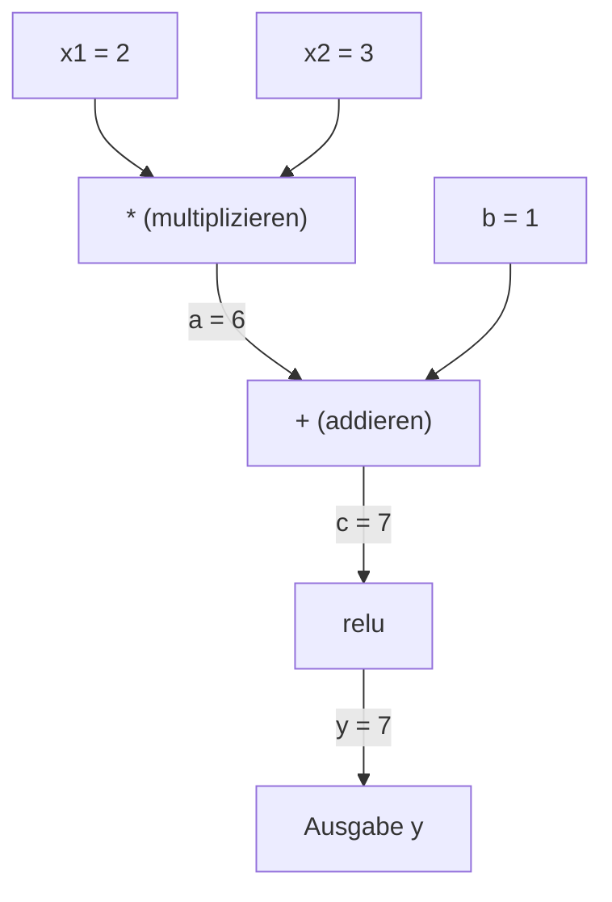
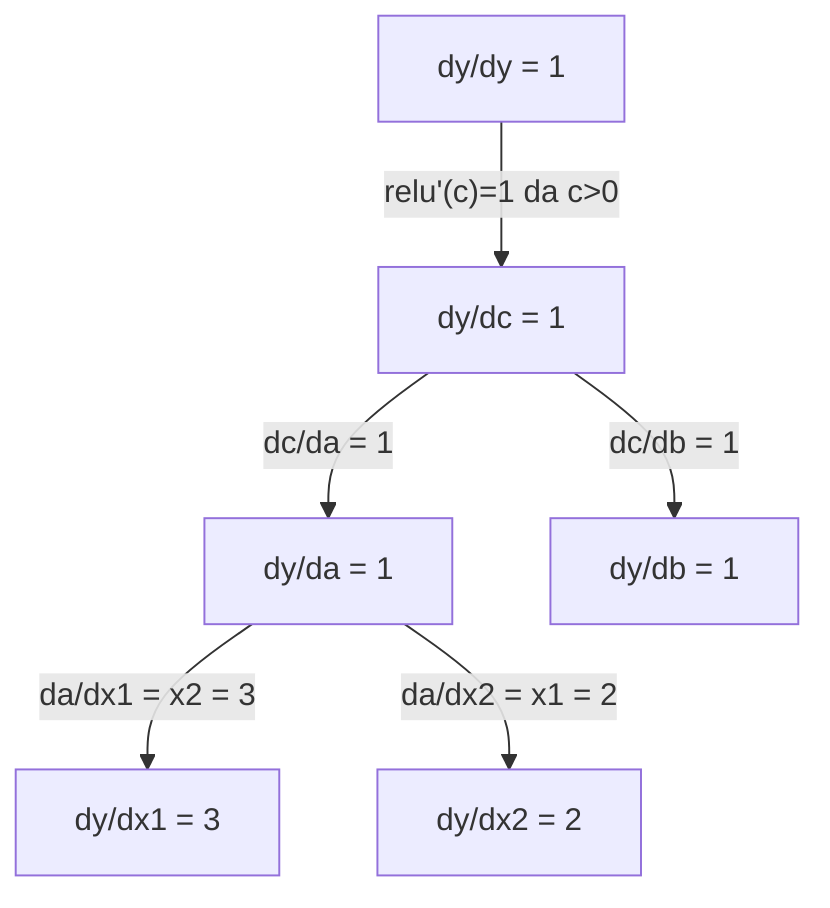

# Kettenregel & Automatische Differentiation

> Die Kettenregel ist der Motor hinter jedem neuronalen Netz, das lernt.

**Typ:** Aufbauen
**Sprachen:** Python
**Voraussetzungen:** Phase 1, Lektion 04 (Ableitungen & Gradienten)
**Zeit:** ~90 Minuten

## Lernziele

- Eine minimale Autograd-Engine (Value-Klasse) bauen, die Operationen aufzeichnet und Gradienten via Reverse-Mode-Autodiff berechnet
- Vorwärts- und Rückwärtsdurchläufe durch einen Berechnungsgraphen mithilfe topologischer Sortierung implementieren
- Ein mehrschichtiges Perzeptron für XOR nur mit der selbstgebauten Autograd-Engine konstruieren und trainieren
- Die Korrektheit von Autodiff durch Gradientenprüfung gegen numerische finite Differenzen verifizieren

## Das Problem

Du kannst Ableitungen einfacher Funktionen berechnen. Aber ein neuronales Netz ist keine einfache Funktion. Es sind Hunderte von zusammengesetzten Funktionen: Matrizenmultiplikation, Bias addieren, Aktivierung anwenden, erneut multiplizieren, Softmax, Kreuzentropie-Verlust. Die Ausgabe ist eine Funktion einer Funktion einer Funktion.

Um das Netz zu trainieren, brauchst du den Gradienten des Verlusts bezüglich jedes einzelnen Gewichts. Das per Hand zu tun ist für Millionen von Parametern unmöglich. Es numerisch zu tun (finite Differenzen) ist zu langsam.

Die Kettenregel gibt dir die Mathematik. Automatische Differentiation gibt dir den Algorithmus. Zusammen lassen sie dich exakte Gradienten durch beliebige Funktionszusammensetzungen in einer Zeit berechnen, die proportional zu einem einzigen Vorwärtsdurchlauf ist.

So funktionieren PyTorch, TensorFlow und JAX. Du wirst eine Miniaturversion von Grund auf bauen.

## Das Konzept

### Die Kettenregel

Wenn `y = f(g(x))`, dann ist die Ableitung von `y` bezüglich `x`:

```
dy/dx = dy/dg * dg/dx = f'(g(x)) * g'(x)
```

Die Ableitungen entlang der Kette multiplizieren. Jedes Glied trägt seine lokale Ableitung bei.

Beispiel: `y = sin(x^2)`

```
g(x) = x^2       g'(x) = 2x
f(g) = sin(g)     f'(g) = cos(g)

dy/dx = cos(x^2) * 2x
```

Für tiefere Zusammensetzungen verlängert sich die Kette:

```
y = f(g(h(x)))

dy/dx = f'(g(h(x))) * g'(h(x)) * h'(x)
```

Jede Schicht in einem neuronalen Netz ist ein Glied in dieser Kette.

### Berechnungsgraphen

Ein Berechnungsgraph macht die Kettenregel visuell. Jede Operation wird ein Knoten. Daten fließen vorwärts durch den Graphen. Gradienten fließen rückwärts.

**Vorwärtsdurchlauf (Werte berechnen):**



**Rückwärtsdurchlauf (Gradienten berechnen):**



Der Rückwärtsdurchlauf wendet die Kettenregel an jedem Knoten an und propagiert Gradienten von der Ausgabe zu den Eingaben.

### Forward Mode vs. Reverse Mode

Es gibt zwei Möglichkeiten, die Kettenregel durch einen Graphen anzuwenden.

**Forward Mode** startet bei den Eingaben und schiebt Ableitungen vorwärts. Es berechnet `dx/dx = 1` und propagiert durch jede Operation. Gut wenn es wenige Eingaben und viele Ausgaben gibt.

```
Forward Mode: Startwert dx/dx = 1, vorwärts propagieren

  x = 2       (dx/dx = 1)
  a = x^2     (da/dx = 2x = 4)
  y = sin(a)  (dy/dx = cos(a) * da/dx = cos(4) * 4 = -2,615)
```

**Reverse Mode** startet bei der Ausgabe und zieht Gradienten rückwärts. Es berechnet `dy/dy = 1` und propagiert durch jede Operation in umgekehrter Reihenfolge. Gut wenn es viele Eingaben und wenige Ausgaben gibt.

```
Reverse Mode: Startwert dy/dy = 1, rückwärts propagieren

  y = sin(a)  (dy/dy = 1)
  a = x^2     (dy/da = cos(a) = cos(4) = -0,654)
  x = 2       (dy/dx = dy/da * da/dx = -0,654 * 4 = -2,615)
```

Neuronale Netze haben Millionen von Eingaben (Gewichte) und eine Ausgabe (Verlust). Reverse Mode berechnet alle Gradienten in einem Rückwärtsdurchlauf. Deshalb verwendet Backpropagation den Reverse Mode.

| Modus | Startwert | Richtung | Am besten wenn |
|-------|-----------|----------|----------------|
| Forward | `dx_i/dx_i = 1` | Eingabe zu Ausgabe | Wenige Eingaben, viele Ausgaben |
| Reverse | `dy/dy = 1` | Ausgabe zu Eingabe | Viele Eingaben, wenige Ausgaben (neuronale Netze) |

### Duale Zahlen für Forward Mode

Forward Mode kann elegant mit dualen Zahlen implementiert werden. Eine duale Zahl hat die Form `a + b*epsilon` wobei `epsilon^2 = 0`.

```
Duale Zahl: (Wert, Ableitung)

(2, 1) bedeutet: Wert ist 2, Ableitung bezgl. x ist 1

Rechenregeln:
  (a, a') + (b, b') = (a+b, a'+b')
  (a, a') * (b, b') = (a*b, a'*b + a*b')
  sin(a, a')         = (sin(a), cos(a)*a')
```

Die Eingabevariable mit Ableitung 1 initialisieren. Die Ableitung propagiert automatisch durch jede Operation.

### Eine Autograd-Engine bauen

Eine Autograd-Engine benötigt drei Dinge:

1. **Value-Wrapping.** Jede Zahl in einem Objekt verpacken, das Wert und Gradient speichert.
2. **Graph-Aufzeichnung.** Jede Operation zeichnet ihre Eingaben und die lokale Gradientenfunktion auf.
3. **Rückwärtsdurchlauf.** Den Graphen topologisch sortieren, dann in umgekehrter Reihenfolge durchlaufen und die Kettenregel an jedem Knoten anwenden.

Genau das macht PyTorchs `autograd`. Die `torch.Tensor`-Klasse verpackt Werte, zeichnet Operationen auf, wenn `requires_grad=True`, und berechnet Gradienten, wenn man `.backward()` aufruft.

### Wie PyTorch Autograd unter der Haube funktioniert

Wenn du PyTorch-Code schreibst:

```python
x = torch.tensor(2.0, requires_grad=True)
y = x ** 2 + 3 * x + 1
y.backward()
print(x.grad)  # 7.0 = 2*x + 3 = 2*2 + 3
```

macht PyTorch intern:

1. Erstellt einen `Tensor`-Knoten für `x` mit `requires_grad=True`
2. Jede Operation (`**`, `*`, `+`) erstellt einen neuen Knoten und zeichnet die Rückwärtsfunktion auf
3. `y.backward()` löst Reverse-Mode-Autodiff durch den aufgezeichneten Graphen aus
4. Jedes `grad_fn` eines Knotens berechnet lokale Gradienten und leitet sie an Elternknoten weiter
5. Gradienten akkumulieren sich in `.grad`-Attributen durch Addition (nicht Ersetzung)

Der Graph ist dynamisch (define-by-run). Bei jedem Vorwärtsdurchlauf wird ein neuer Graph erstellt. Deshalb unterstützt PyTorch Kontrollfluss (if/else, Schleifen) in Modellen.

## Umsetzung

### Schritt 1: Die Value-Klasse

```python
class Value:
    def __init__(self, data, children=(), op=''):
        self.data = data
        self.grad = 0.0
        self._backward = lambda: None
        self._prev = set(children)
        self._op = op

    def __repr__(self):
        return f"Value(data={self.data:.4f}, grad={self.grad:.4f})"
```

Jedes `Value` speichert seine numerischen Daten, seinen Gradienten (anfangs null), eine Rückwärtsfunktion und Zeiger auf Kindknoten, die es erzeugt haben.

### Schritt 2: Arithmetische Operationen mit Gradientenverfolgung

```python
    def __add__(self, other):
        other = other if isinstance(other, Value) else Value(other)
        out = Value(self.data + other.data, (self, other), '+')
        def _backward():
            self.grad += out.grad
            other.grad += out.grad
        out._backward = _backward
        return out

    def __mul__(self, other):
        other = other if isinstance(other, Value) else Value(other)
        out = Value(self.data * other.data, (self, other), '*')
        def _backward():
            self.grad += other.data * out.grad
            other.grad += self.data * out.grad
        out._backward = _backward
        return out

    def relu(self):
        out = Value(max(0, self.data), (self,), 'relu')
        def _backward():
            self.grad += (1.0 if out.data > 0 else 0.0) * out.grad
        out._backward = _backward
        return out
```

Jede Operation erstellt einen Closure, der weiß, wie lokale Gradienten berechnet und mit dem Upstream-Gradienten (`out.grad`) multipliziert werden. Das `+=` behandelt den Fall, dass ein Wert in mehreren Operationen verwendet wird.

### Schritt 3: Der Rückwärtsdurchlauf

```python
    def backward(self):
        topo = []
        visited = set()
        def build_topo(v):
            if v not in visited:
                visited.add(v)
                for child in v._prev:
                    build_topo(child)
                topo.append(v)
        build_topo(self)

        self.grad = 1.0
        for v in reversed(topo):
            v._backward()
```

Topologische Sortierung stellt sicher, dass der Gradient jedes Knotens vollständig berechnet ist, bevor er an seine Kinder propagiert wird. Der Startgradient ist 1,0 (dy/dy = 1).

### Schritt 4: Weitere Operationen für eine vollständige Engine

Die grundlegende Value-Klasse verarbeitet Addition, Multiplikation und ReLU. Eine echte Autograd-Engine braucht mehr. Hier sind die Operationen, die du für neuronale Netze brauchst:

```python
    def __neg__(self):
        return self * -1

    def __sub__(self, other):
        return self + (-other)

    def __radd__(self, other):
        return self + other

    def __rmul__(self, other):
        return self * other

    def __rsub__(self, other):
        return other + (-self)

    def __pow__(self, n):
        out = Value(self.data ** n, (self,), f'**{n}')
        def _backward():
            self.grad += n * (self.data ** (n - 1)) * out.grad
        out._backward = _backward
        return out

    def __truediv__(self, other):
        return self * (other ** -1) if isinstance(other, Value) else self * (Value(other) ** -1)

    def exp(self):
        import math
        e = math.exp(self.data)
        out = Value(e, (self,), 'exp')
        def _backward():
            self.grad += e * out.grad
        out._backward = _backward
        return out

    def log(self):
        import math
        out = Value(math.log(self.data), (self,), 'log')
        def _backward():
            self.grad += (1.0 / self.data) * out.grad
        out._backward = _backward
        return out

    def tanh(self):
        import math
        t = math.tanh(self.data)
        out = Value(t, (self,), 'tanh')
        def _backward():
            self.grad += (1 - t ** 2) * out.grad
        out._backward = _backward
        return out
```

**Warum jede Operation wichtig ist:**

| Operation | Rückwärtsregel | Verwendet in |
|-----------|---------------|--------------|
| `__sub__` | Verwendet add + neg | Verlustberechnung (pred - target) |
| `__pow__` | n * x^(n-1) | Polynomielle Aktivierungen, MSE (Fehler^2) |
| `__truediv__` | Verwendet mul + pow(-1) | Normalisierung, Lernratenskalierung |
| `exp` | exp(x) * Upstream | Softmax, Log-Likelihood |
| `log` | (1/x) * Upstream | Kreuzentropie-Verlust, Log-Wahrscheinlichkeiten |
| `tanh` | (1 - tanh^2) * Upstream | Klassische Aktivierungsfunktion |

Das Clevere: `__sub__` und `__truediv__` sind auf Basis bestehender Operationen definiert. Sie erhalten korrekte Gradienten kostenlos, weil die Kettenregel durch die zugrunde liegenden add/mul/pow-Operationen zusammensetzt.

### Schritt 5: Mini-MLP von Grund auf

Mit einer vollständigen Value-Klasse kann man ein neuronales Netz bauen. Kein PyTorch. Kein NumPy. Nur Values und die Kettenregel.

```python
import random

class Neuron:
    def __init__(self, n_inputs):
        self.w = [Value(random.uniform(-1, 1)) for _ in range(n_inputs)]
        self.b = Value(0.0)

    def __call__(self, x):
        act = sum((wi * xi for wi, xi in zip(self.w, x)), self.b)
        return act.tanh()

    def parameters(self):
        return self.w + [self.b]

class Layer:
    def __init__(self, n_inputs, n_outputs):
        self.neurons = [Neuron(n_inputs) for _ in range(n_outputs)]

    def __call__(self, x):
        return [n(x) for n in self.neurons]

    def parameters(self):
        return [p for n in self.neurons for p in n.parameters()]

class MLP:
    def __init__(self, sizes):
        self.layers = [Layer(sizes[i], sizes[i+1]) for i in range(len(sizes)-1)]

    def __call__(self, x):
        for layer in self.layers:
            x = layer(x)
        return x[0] if len(x) == 1 else x

    def parameters(self):
        return [p for layer in self.layers for p in layer.parameters()]
```

Ein `Neuron` berechnet `tanh(w1*x1 + w2*x2 + ... + b)`. Ein `Layer` ist eine Liste von Neuronen. Ein `MLP` stapelt Schichten. Jedes Gewicht ist ein `Value`, also propagiert der Aufruf von `loss.backward()` Gradienten zu jedem Parameter.

**Training auf XOR:**

```python
random.seed(42)
model = MLP([2, 4, 1])  # 2 Eingaben, 4 versteckte Neuronen, 1 Ausgabe

xs = [[0, 0], [0, 1], [1, 0], [1, 1]]
ys = [-1, 1, 1, -1]  # XOR-Muster (mit -1/1 für tanh)

for step in range(100):
    preds = [model(x) for x in xs]
    loss = sum((p - y) ** 2 for p, y in zip(preds, ys))

    for p in model.parameters():
        p.grad = 0.0
    loss.backward()

    lr = 0.05
    for p in model.parameters():
        p.data -= lr * p.grad

    if step % 20 == 0:
        print(f"Schritt {step:3d}  Verlust = {loss.data:.4f}")

print("\nVorhersagen nach dem Training:")
for x, y in zip(xs, ys):
    print(f"  Eingabe={x}  Ziel={y:2d}  Vorhersage={model(x).data:6.3f}")
```

Das ist Micrograd. Eine vollständige neuronale Netz-Trainingsschleife in reinem Python mit automatischer Differentiation. Jedes kommerzielle Deep-Learning-Framework macht dasselbe im großen Maßstab.

### Schritt 6: Gradientenprüfung

Wie weißt du, dass dein Autodiff korrekt ist? Vergleiche ihn mit numerischen Ableitungen. Das ist Gradientenprüfung (gradient checking).

```python
def gradient_check(build_expr, x_val, h=1e-7):
    x = Value(x_val)
    y = build_expr(x)
    y.backward()
    autodiff_grad = x.grad

    y_plus = build_expr(Value(x_val + h)).data
    y_minus = build_expr(Value(x_val - h)).data
    numerical_grad = (y_plus - y_minus) / (2 * h)

    diff = abs(autodiff_grad - numerical_grad)
    return autodiff_grad, numerical_grad, diff
```

Teste es mit einem komplexen Ausdruck:

```python
def expr(x):
    return (x ** 3 + x * 2 + 1).tanh()

ad, num, diff = gradient_check(expr, 0.5)
print(f"Autodiff:   {ad:.8f}")
print(f"Numerisch:  {num:.8f}")
print(f"Differenz:  {diff:.2e}")
# Differenz sollte < 1e-5 sein
```

Gradientenprüfung ist unerlässlich, wenn neue Operationen implementiert werden. Wenn dein Rückwärtsdurchlauf einen Fehler hat, findet ihn die numerische Prüfung. Jede seriöse Deep-Learning-Implementierung führt Gradientenprüfungen während der Entwicklung durch.

**Wann Gradientenprüfung verwenden:**

| Situation | Gradientenprüfung? |
|-----------|-------------------|
| Neue Operation zur Autograd-Engine hinzufügen | Ja, immer |
| Trainingsschleife debuggen, die nicht konvergiert | Ja, Gradienten zuerst prüfen |
| Produktionstraining | Nein, zu langsam (2× Vorwärtsdurchläufe pro Parameter) |
| Unit-Tests für Autograd-Code | Ja, automatisieren |

### Schritt 7: Gegen manuelle Berechnung verifizieren

```python
x1 = Value(2.0)
x2 = Value(3.0)
a = x1 * x2          # a = 6.0
b = a + Value(1.0)    # b = 7.0
y = b.relu()          # y = 7.0

y.backward()

print(f"y = {y.data}")          # 7.0
print(f"dy/dx1 = {x1.grad}")   # 3.0 (= x2)
print(f"dy/dx2 = {x2.grad}")   # 2.0 (= x1)
```

Manuelle Prüfung: `y = relu(x1*x2 + 1)`. Da `x1*x2 + 1 = 7 > 0`, ist relu die Identität.
`dy/dx1 = x2 = 3`. `dy/dx2 = x1 = 2`. Die Engine stimmt überein.

## In der Praxis

### Gegen PyTorch verifizieren

```python
import torch

x1 = torch.tensor(2.0, requires_grad=True)
x2 = torch.tensor(3.0, requires_grad=True)
a = x1 * x2
b = a + 1.0
y = torch.relu(b)
y.backward()

print(f"PyTorch dy/dx1 = {x1.grad.item()}")  # 3.0
print(f"PyTorch dy/dx2 = {x2.grad.item()}")  # 2.0
```

Gleiche Gradienten. Deine Engine berechnet dasselbe Ergebnis wie PyTorch, weil die Mathematik dieselbe ist: Reverse-Mode-Autodiff via Kettenregel.

### Ein komplexerer Ausdruck

```python
a = Value(2.0)
b = Value(-3.0)
c = Value(10.0)
f = (a * b + c).relu()  # relu(2*(-3) + 10) = relu(4) = 4

f.backward()
print(f"df/da = {a.grad}")  # -3.0 (= b)
print(f"df/db = {b.grad}")  #  2.0 (= a)
print(f"df/dc = {c.grad}")  #  1.0
```

## Fertigstellen

Diese Lektion erzeugt:
- `outputs/skill-autodiff.md` – eine Skill-Beschreibung für das Bauen und Debuggen von Autograd-Systemen
- `code/autodiff.py` – eine minimale Autograd-Engine, die man erweitern kann

Die hier aufgebaute Value-Klasse ist das Fundament für die neuronale Netz-Trainingsschleife in Phase 3.

## Übungen

1. Füge `__pow__` zur Value-Klasse hinzu, damit du `x ** n` berechnen kannst. Verifiziere, dass `d/dx(x^3)` bei `x=2` gleich `12.0` ist.

2. Füge `tanh` als Aktivierungsfunktion hinzu. Verifiziere, dass `tanh'(0) = 1` und `tanh'(2) = 0,0707` (ca.).

3. Baue einen Berechnungsgraphen für ein einzelnes Neuron: `y = relu(w1*x1 + w2*x2 + b)`. Berechne alle fünf Gradienten und verifiziere gegen PyTorch.

4. Implementiere Forward-Mode-Autodiff mithilfe dualer Zahlen. Erstelle eine `Dual`-Klasse und verifiziere, dass sie dieselben Ableitungen wie deine Reverse-Mode-Engine liefert.

## Schlüsselbegriffe

| Begriff | Was man sagt | Was es wirklich bedeutet |
|---------|-------------|--------------------------|
| Kettenregel | „Ableitungen multiplizieren" | Die Ableitung zusammengesetzter Funktionen ist das Produkt der lokalen Ableitung jeder Funktion, ausgewertet am richtigen Punkt |
| Berechnungsgraph | „Das Netzwerkdiagramm" | Ein gerichteter azyklischer Graph, bei dem Knoten Operationen und Kanten Werte (vorwärts) oder Gradienten (rückwärts) tragen |
| Forward Mode | „Ableitungen vorwärts schieben" | Autodiff, der Ableitungen von Eingaben zu Ausgaben propagiert. Ein Durchlauf pro Eingabevariable. |
| Reverse Mode | „Backpropagation" | Autodiff, der Gradienten von Ausgaben zu Eingaben propagiert. Ein Durchlauf pro Ausgabevariable. |
| Autograd | „Automatische Gradienten" | Ein System, das Operationen auf Werten aufzeichnet, einen Graphen erstellt und exakte Gradienten via Kettenregel berechnet |
| Duale Zahlen | „Wert plus Ableitung" | Zahlen der Form a + b*epsilon (epsilon^2 = 0), die Ableitungsinformation durch Arithmetik tragen |
| Topologische Sortierung | „Abhängigkeitsreihenfolge" | Graphknoten so ordnen, dass jeder Knoten nach allen seinen Abhängigkeiten kommt. Notwendig für korrekte Gradientenpropagation. |
| Gradientenakkumulation | „Addieren, nicht ersetzen" | Wenn ein Wert in mehrere Operationen einfließt, ist sein Gradient die Summe aller eingehenden Gradientenbeiträge |
| Dynamischer Graph | „Define by Run" | Ein Berechnungsgraph, der bei jedem Vorwärtsdurchlauf neu erstellt wird, sodass Python-Kontrollfluss in Modellen möglich ist (PyTorch-Stil) |
| Gradientenprüfung | „Numerische Verifikation" | Vergleich von Autodiff-Gradienten mit numerischen Finite-Differenzen-Gradienten zur Korrektheitsverifikation. Unerlässlich zum Debuggen. |
| MLP | „Mehrschichtiges Perzeptron" | Ein neuronales Netz mit einer oder mehreren versteckten Schichten von Neuronen. Jedes Neuron berechnet eine gewichtete Summe plus Bias, dann eine Aktivierungsfunktion. |
| Neuron | „Gewichtete Summe + Aktivierung" | Die Grundeinheit: Ausgabe = Aktivierung(w1*x1 + w2*x2 + ... + b). Die Gewichte und der Bias sind lernbare Parameter. |

## Weiterführende Literatur

- [3Blue1Brown: Backpropagation calculus](https://www.youtube.com/watch?v=tIeHLnjs5U8) – visuelle Erklärung der Kettenregel in neuronalen Netzen
- [PyTorch Autograd mechanics](https://pytorch.org/docs/stable/notes/autograd.html) – wie das echte System funktioniert
- [Baydin et al., Automatic Differentiation in Machine Learning: a Survey](https://arxiv.org/abs/1502.05767) – umfassende Referenz
