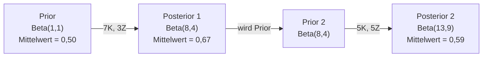

# Satz von Bayes

> Wahrscheinlichkeit handelt davon, was du erwartest. Der Satz von Bayes handelt davon, was du lernst.

**Typ:** Aufbauen
**Sprachen:** Python
**Voraussetzungen:** Phase 1, Lektion 06 (Wahrscheinlichkeitsgrundlagen)
**Zeit:** ~75 Minuten

## Lernziele

- Den Satz von Bayes anwenden, um posteriore Wahrscheinlichkeiten aus Priors, Likelihoods und Evidenz zu berechnen
- Einen Naive-Bayes-Textklassifikator von Grund auf mit Laplace-Glättung und Berechnung im Log-Raum bauen
- MLE und MAP vergleichen und erklären, warum MAP L2-Regularisierung entspricht
- Sequentielle bayesianische Aktualisierung mithilfe konjugierter Beta-Binomial-Priors für A/B-Tests implementieren

## Das Problem

Ein medizinischer Test ist zu 99 % genau. Du testest positiv. Wie hoch ist die Wahrscheinlichkeit, dass du die Krankheit tatsächlich hast?

Die meisten Menschen sagen 99 %. Die wahre Antwort hängt davon ab, wie selten die Krankheit ist. Wenn 1 von 10.000 Menschen sie hat, ergibt ein positives Ergebnis nur etwa 1 % Wahrscheinlichkeit, krank zu sein. Die anderen 99 % der positiven Ergebnisse sind Fehlalarme von gesunden Menschen.

Das ist keine Fangfrage. Das ist der Satz von Bayes. Jeder Spamfilter, jede medizinische Diagnose, jedes ML-Modell, das Unsicherheit quantifiziert, verwendet genau diese Logik. Du beginnst mit einer Überzeugung. Du siehst Evidenz. Du aktualisierst.

Wer ML-Systeme baut, ohne das zu verstehen, wird Modellausgaben falsch interpretieren, schlechte Schwellenwerte setzen und überconfidente Vorhersagen liefern.

## Das Konzept

### Von gemeinsamer Wahrscheinlichkeit zu Bayes

Aus Lektion 06 weißt du bereits, dass bedingte Wahrscheinlichkeit so definiert ist:

```
P(A|B) = P(A und B) / P(B)
```

Und symmetrisch:

```
P(B|A) = P(A und B) / P(A)
```

Beide Ausdrücke teilen denselben Zähler: P(A und B). Gleichsetzen und umformen ergibt:

```
P(A und B) = P(A|B) * P(B) = P(B|A) * P(A)

Daraus folgt:

P(A|B) = P(B|A) * P(A) / P(B)
```

Das ist der Satz von Bayes. Vier Größen, eine Gleichung.

### Die vier Teile

| Teil | Name | Was es bedeutet |
|------|------|-----------------|
| P(A\|B) | Posterior | Deine aktualisierte Überzeugung über A nach Beobachtung der Evidenz B |
| P(B\|A) | Likelihood | Wie wahrscheinlich die Evidenz B ist, wenn A wahr ist |
| P(A) | Prior | Deine Überzeugung über A, bevor du Evidenz gesehen hast |
| P(B) | Evidenz | Gesamtwahrscheinlichkeit, B unter allen Möglichkeiten zu beobachten |

Der Evidenzterm P(B) wirkt als Normierungskonstante. Man kann ihn mithilfe des Satzes der totalen Wahrscheinlichkeit entwickeln:

```
P(B) = P(B|A) * P(A) + P(B|nicht A) * P(nicht A)
```

### Beispiel: Medizinischer Test

Eine Krankheit betrifft 1 von 10.000 Menschen. Der Test ist zu 99 % genau (erkennt 99 % der Kranken, gibt 1 % Falsch-Positiv-Rate).

```
P(krank)             = 0,0001     (Prior: Krankheit ist selten)
P(positiv|krank)     = 0,99       (Likelihood: Test erkennt sie)
P(positiv|gesund)    = 0,01       (Falsch-Positiv-Rate)

P(positiv) = P(positiv|krank) * P(krank) + P(positiv|gesund) * P(gesund)
           = 0,99 * 0,0001 + 0,01 * 0,9999
           = 0,000099 + 0,009999
           = 0,010098

P(krank|positiv) = P(positiv|krank) * P(krank) / P(positiv)
                 = 0,99 * 0,0001 / 0,010098
                 = 0,0098
                 = 0,98 %
```

Weniger als 1 %. Der Prior dominiert. Wenn eine Erkrankung selten ist, produzieren selbst genaue Tests überwiegend Falsch-Positive. Deshalb ordnen Ärzte Bestätigungstests an.

### Beispiel: Spamfilter

Du erhältst eine E-Mail mit dem Wort „Lotterie". Ist es Spam?

```
P(Spam)                    = 0,3      (30 % der E-Mails sind Spam)
P(„Lotterie"|Spam)         = 0,05     (5 % der Spam-E-Mails enthalten „Lotterie")
P(„Lotterie"|kein Spam)    = 0,001    (0,1 % der legitimen E-Mails enthalten „Lotterie")

P(„Lotterie") = 0,05 * 0,3 + 0,001 * 0,7
              = 0,015 + 0,0007
              = 0,0157

P(Spam|„Lotterie") = 0,05 * 0,3 / 0,0157
                   = 0,955
                   = 95,5 %
```

Ein einziges Wort verschiebt die Wahrscheinlichkeit von 30 % auf 95,5 %. Ein echter Spamfilter wendet Bayes auf Hunderte von Wörtern gleichzeitig an.

### Naive Bayes: Unabhängigkeitsannahme

Naive Bayes erweitert das auf mehrere Features, indem es annimmt, dass alle Features bedingt unabhängig gegeben der Klasse sind:

```
P(Klasse | Feature_1, Feature_2, ..., Feature_n)
  = P(Klasse) * P(Feature_1|Klasse) * P(Feature_2|Klasse) * ... * P(Feature_n|Klasse)
    / P(Feature_1, Feature_2, ..., Feature_n)
```

Das „Naive" ist die Unabhängigkeitsannahme. Bei Text sind Wortvorkommen nicht unabhängig (‚New' und ‚York' sind korreliert). Aber die Annahme funktioniert in der Praxis überraschend gut, weil der Klassifikator nur Klassen ranken muss, nicht kalibrierte Wahrscheinlichkeiten liefern.

Da der Nenner für alle Klassen gleich ist, kann man ihn weglassen und einfach die Zähler vergleichen:

```
score(Klasse) = P(Klasse) * Produkt von P(Feature_i | Klasse)
```

Wähle die Klasse mit dem höchsten Score.

### Maximum-Likelihood-Schätzung (MLE)

Wie erhält man P(Feature|Klasse) aus Trainingsdaten? Zählen.

```
P(„kostenlos"|Spam) = (Anzahl Spam-E-Mails mit „kostenlos") / (Gesamte Spam-E-Mails)
```

Das ist MLE: Wähle die Parameterwerte, die die beobachteten Daten am wahrscheinlichsten machen. Du maximierst die Likelihood-Funktion, die für diskrete Zählwerte auf relative Häufigkeit reduziert wird.

Problem: Wenn ein Wort im Training nie in Spam vorkommt, gibt MLE ihm die Wahrscheinlichkeit null. Ein einziges unbekanntes Wort vernichtet das gesamte Produkt. Lösung: Laplace-Glättung:

```
P(Wort|Klasse) = (Anzahl(Wort, Klasse) + 1) / (Gesamtwörter_in_Klasse + Vokabulargröße)
```

Das Addieren von 1 zu jedem Zählwert stellt sicher, dass keine Wahrscheinlichkeit je null wird.

### Maximum a posteriori (MAP)

MLE fragt: Welche Parameter maximieren P(Daten|Parameter)?

MAP fragt: Welche Parameter maximieren P(Parameter|Daten)?

Nach dem Satz von Bayes:

```
P(Parameter|Daten) proportional zu P(Daten|Parameter) * P(Parameter)
```

MAP fügt einen Prior über die Parameter selbst hinzu. Wenn du glaubst, Parameter sollten klein sein, kodierst du das als Prior, der große Werte bestraft. Das ist identisch mit L2-Regularisierung in ML. Der „Ridge"-Penalty in der Ridge-Regression ist buchstäblich ein Gauß-Prior auf den Gewichten.

| Schätzung | Optimiert | ML-Äquivalent |
|-----------|-----------|---------------|
| MLE | P(Daten\|Parameter) | Unregularisiertes Training |
| MAP | P(Daten\|Parameter) * P(Parameter) | L2-/L1-Regularisierung |

### Bayesianisch vs. frequentistisch: der praktische Unterschied

Frequentisten behandeln Parameter als feste Unbekannte. Sie fragen: „Was würde passieren, wenn ich dieses Experiment viele Male wiederhole?"

Bayesianer behandeln Parameter als Verteilungen. Sie fragen: „Gegeben das Beobachtete, was glaube ich über die Parameter?"

Für den Bau von ML-Systemen ist der praktische Unterschied:

| Aspekt | Frequentistisch | Bayesianisch |
|--------|----------------|--------------|
| Ausgabe | Punktschätzung | Verteilung über Werte |
| Unsicherheit | Konfidenzintervalle (über das Verfahren) | Glaubwürdigkeitsintervalle (über den Parameter) |
| Wenig Daten | Kann overfitting produzieren | Prior wirkt als Regularisierung |
| Berechnung | Meist schneller | Erfordert oft Sampling (MCMC) |

Der Großteil des produktiven ML ist frequentistisch (SGD, Punktschätzungen). Bayesianische Methoden glänzen, wenn kalibrierte Unsicherheit benötigt wird (medizinische Entscheidungen, sicherheitskritische Systeme) oder wenn Daten knapp sind (Few-Shot-Lernen, Kaltstart).

### Warum bayesianisches Denken in ML wichtig ist

Die Verbindung ist tiefer als eine bloße Analogie:

**Prior ist Regularisierung.** Ein Gauß-Prior auf Gewichten ist L2-Regularisierung. Ein Laplace-Prior ist L1. Jedes Mal, wenn du einen Regularisierungsterm hinzufügst, machst du eine bayesianische Aussage darüber, welche Parameterwerte du erwartest.

**Posterior ist Unsicherheit.** Eine einzelne vorhergesagte Wahrscheinlichkeit sagt dir nichts darüber, wie sicher das Modell in dieser Schätzung ist. Bayesianische Methoden geben dir eine Verteilung: „Ich denke, P(Spam) liegt zwischen 0,8 und 0,95."

**Bayes-Updates sind Online-Lernen.** Der heutige Posterior wird der morgige Prior. Wenn dein Modell neue Daten sieht, aktualisiert es seine Überzeugungen inkrementell, anstatt von Grund auf neu zu trainieren.

**Modellvergleich ist bayesianisch.** Das Bayesianische Informationskriterium (BIC), die marginale Likelihood und Bayes-Faktoren nutzen alle bayesianisches Denken, um zwischen Modellen zu wählen, ohne Overfitting.

## Umsetzung

### Schritt 1: Bayes-Theorem-Funktion

```python
def bayes(prior, likelihood, false_positive_rate):
    evidence = likelihood * prior + false_positive_rate * (1 - prior)
    posterior = likelihood * prior / evidence
    return posterior

result = bayes(prior=0.0001, likelihood=0.99, false_positive_rate=0.01)
print(f"P(krank|positiv) = {result:.4f}")
```

### Schritt 2: Naive-Bayes-Klassifikator

```python
import math
from collections import defaultdict

class NaiveBayes:
    def __init__(self, smoothing=1.0):
        self.smoothing = smoothing
        self.class_counts = defaultdict(int)
        self.word_counts = defaultdict(lambda: defaultdict(int))
        self.class_word_totals = defaultdict(int)
        self.vocab = set()

    def train(self, documents, labels):
        for doc, label in zip(documents, labels):
            self.class_counts[label] += 1
            words = doc.lower().split()
            for word in words:
                self.word_counts[label][word] += 1
                self.class_word_totals[label] += 1
                self.vocab.add(word)

    def predict(self, document):
        words = document.lower().split()
        total_docs = sum(self.class_counts.values())
        vocab_size = len(self.vocab)
        best_class = None
        best_score = float("-inf")
        for cls in self.class_counts:
            score = math.log(self.class_counts[cls] / total_docs)
            for word in words:
                count = self.word_counts[cls].get(word, 0)
                total = self.class_word_totals[cls]
                score += math.log((count + self.smoothing) / (total + self.smoothing * vocab_size))
            if score > best_score:
                best_score = score
                best_class = cls
        return best_class
```

Log-Wahrscheinlichkeiten verhindern Unterlauf. Das Multiplizieren vieler kleiner Wahrscheinlichkeiten erzeugt Zahlen, die für Floating-Point zu winzig sind. Das Summieren von Log-Wahrscheinlichkeiten ist numerisch stabil und mathematisch äquivalent.

### Schritt 3: Mit Spam-Daten trainieren

```python
train_docs = [
    "win free money now",
    "free lottery ticket winner",
    "claim your prize today free",
    "urgent offer free cash",
    "congratulations you won free",
    "meeting tomorrow at noon",
    "project update attached",
    "can we schedule a call",
    "quarterly report review",
    "lunch on thursday sounds good",
    "team standup notes attached",
    "please review the pull request",
]

train_labels = [
    "spam", "spam", "spam", "spam", "spam",
    "ham", "ham", "ham", "ham", "ham", "ham", "ham",
]

classifier = NaiveBayes()
classifier.train(train_docs, train_labels)

test_messages = [
    "free money waiting for you",
    "meeting rescheduled to friday",
    "you won a free prize",
    "please review the attached report",
]

for msg in test_messages:
    print(f"  '{msg}' -> {classifier.predict(msg)}")
```

### Schritt 4: Gelernte Wahrscheinlichkeiten inspizieren

```python
def show_top_words(classifier, cls, n=5):
    vocab_size = len(classifier.vocab)
    total = classifier.class_word_totals[cls]
    probs = {}
    for word in classifier.vocab:
        count = classifier.word_counts[cls].get(word, 0)
        probs[word] = (count + classifier.smoothing) / (total + classifier.smoothing * vocab_size)
    sorted_words = sorted(probs.items(), key=lambda x: x[1], reverse=True)
    for word, prob in sorted_words[:n]:
        print(f"    {word}: {prob:.4f}")

print("\nTop-Spam-Wörter:")
show_top_words(classifier, "spam")
print("\nTop-Ham-Wörter:")
show_top_words(classifier, "ham")
```

## In der Praxis

Scikit-learn enthält produktionsreife Naive-Bayes-Implementierungen:

```python
from sklearn.feature_extraction.text import CountVectorizer
from sklearn.naive_bayes import MultinomialNB
from sklearn.metrics import classification_report

vectorizer = CountVectorizer()
X_train = vectorizer.fit_transform(train_docs)
clf = MultinomialNB()
clf.fit(X_train, train_labels)

X_test = vectorizer.transform(test_messages)
predictions = clf.predict(X_test)
for msg, pred in zip(test_messages, predictions):
    print(f"  '{msg}' -> {pred}")
```

Gleicher Algorithmus. `CountVectorizer` übernimmt Tokenisierung und Vokabularaufbau. `MultinomialNB` behandelt Glättung und Log-Wahrscheinlichkeiten intern. Deine Von-Grund-auf-Version macht dasselbe in 40 Zeilen.

## Fertigstellen

Die hier erstellte `NaiveBayes`-Klasse demonstriert die vollständige Pipeline: Tokenisierung, Wahrscheinlichkeitsschätzung mit Laplace-Glättung, Vorhersage im Log-Raum. Der Code in `code/bayes.py` läuft ohne Abhängigkeiten außer der Python-Standardbibliothek von Anfang bis Ende.

### Konjugierte Priors

Wenn Prior und Posterior zur selben Verteilungsfamilie gehören, nennt man den Prior „konjugiert". Das macht die bayesianische Aktualisierung algebraisch sauber – man erhält einen Posterior in geschlossener Form ohne numerische Integration.

| Likelihood | Konjugierter Prior | Posterior | Beispiel |
|-----------|-------------------|-----------|---------|
| Bernoulli | Beta(a, b) | Beta(a + Erfolge, b + Misserfolge) | Schätzung der Münzverzerrung |
| Normalverteilung (bekannte Varianz) | Normal(mu_0, sigma_0) | Normal(gewichteter Mittelwert, kleinere Varianz) | Sensorkalibrierung |
| Poisson | Gamma(a, b) | Gamma(a + Summe der Zählwerte, b + n) | Modellierung von Ereignisraten |
| Multinomial | Dirichlet(alpha) | Dirichlet(alpha + Zählwerte) | Topic Modeling, Sprachmodelle |

Warum das wichtig ist: Ohne konjugierte Priors braucht man Monte-Carlo-Sampling oder Variationsinferenz, um den Posterior zu approximieren. Mit konjugierten Priors aktualisiert man einfach zwei Zahlen.

Die Beta-Verteilung ist der häufigste konjugierte Prior in der Praxis. Beta(a, b) repräsentiert die Überzeugung über einen Wahrscheinlichkeitsparameter. Der Mittelwert ist a/(a+b). Je größer a+b, desto konzentrierter (sicherer) ist die Verteilung.

Spezialfälle des Beta-Priors:
- Beta(1, 1) = Gleichverteilung. Du hast keine Meinung über den Parameter.
- Beta(10, 10) = Spitze bei 0,5. Du glaubst stark, der Parameter liegt nahe 0,5.
- Beta(1, 10) = Schief Richtung 0. Du glaubst, der Parameter ist klein.

Die Aktualisierungsregel ist denkbar einfach:

```
Prior:     Beta(a, b)
Daten:     s Erfolge, f Misserfolge
Posterior: Beta(a + s, b + f)
```

Keine Integrale. Kein Sampling. Nur Addition.

### Sequentielle bayesianische Aktualisierung

Bayesianische Inferenz ist von Natur aus sequentiell. Der heutige Posterior wird der morgige Prior. So lernen echte Systeme inkrementell, ohne alle historischen Daten neu verarbeiten zu müssen.

Konkretes Beispiel: Schätzung, ob eine Münze fair ist.

**Tag 1: Noch keine Daten.**
Beginne mit Beta(1, 1) – einem gleichförmigen Prior. Du hast keine Meinung.
- Prior-Mittelwert: 0,5
- Prior ist flach über [0, 1]

**Tag 2: 7 Kopf, 3 Zahl beobachtet.**
Posterior = Beta(1 + 7, 1 + 3) = Beta(8, 4)
- Posterior-Mittelwert: 8/12 = 0,667
- Evidenz legt nahe, die Münze ist Kopf-lastig

**Tag 3: Weitere 5 Kopf, 5 Zahl beobachtet.**
Benutze den gestrigen Posterior als heutigen Prior.
Posterior = Beta(8 + 5, 4 + 5) = Beta(13, 9)
- Posterior-Mittelwert: 13/22 = 0,591
- Die ausgeglichenen neuen Daten zogen die Schätzung zurück Richtung 0,5



Die Reihenfolge der Beobachtungen spielt keine Rolle. Beta(1,1), aktualisiert mit allen 12 Kopf und 8 Zahl auf einmal, ergibt Beta(13, 9) – dasselbe Ergebnis. Sequentielle und Batch-Aktualisierung sind mathematisch äquivalent. Aber sequentielle Aktualisierung erlaubt es, bei jedem Schritt Entscheidungen zu treffen, ohne Rohdaten zu speichern.

Das ist die Grundlage des Online-Lernens in produktiven ML-Systemen. Thompson Sampling für Bandits, inkrementelle Empfehlungssysteme und Streaming-Anomalieerkennung nutzen alle dieses Muster.

### Verbindung zum A/B-Testing

A/B-Testing ist bayesianische Inferenz in Verkleidung.

Aufbau: Du testest zwei Button-Farben. Variante A (blau) und Variante B (grün). Du willst wissen, welche mehr Klicks bekommt.

Der bayesianische A/B-Test:

1. **Prior.** Beginne mit Beta(1, 1) für beide Varianten. Keine Vorabpräferenz.
2. **Daten.** Variante A: 50 Klicks bei 1.000 Aufrufen. Variante B: 65 Klicks bei 1.000 Aufrufen.
3. **Posteriors.**
   - A: Beta(1 + 50, 1 + 950) = Beta(51, 951). Mittelwert = 0,051
   - B: Beta(1 + 65, 1 + 935) = Beta(66, 936). Mittelwert = 0,066
4. **Entscheidung.** Berechne P(B > A) – die Wahrscheinlichkeit, dass Bs wahre Konversionsrate höher als As ist.

P(B > A) analytisch zu berechnen ist schwierig. Aber Monte Carlo macht es trivial:

```
1. Ziehe 100.000 Samples aus Beta(51, 951)  -> samples_A
2. Ziehe 100.000 Samples aus Beta(66, 936)  -> samples_B
3. P(B > A) = Anteil der Samples, bei denen B > A
```

Wenn P(B > A) > 0,95, liefert man Variante B aus. Wenn es zwischen 0,05 und 0,95 liegt, sammelt man weiter Daten. Wenn P(B > A) < 0,05, liefert man Variante A aus.

Vorteile gegenüber frequentistischem A/B-Testing:
- Man erhält eine direkte Wahrscheinlichkeitsaussage: „Es gibt eine 97-prozentige Chance, dass B besser ist"
- Keine p-Wert-Verwirrung. Kein „Nicht ablehnen der Nullhypothese"-Herumdrucksen.
- Man kann Ergebnisse jederzeit prüfen, ohne die Falsch-Positiv-Rate zu erhöhen (kein „Peeking-Problem")
- Man kann Vorwissen einbeziehen (z. B. legen frühere Tests nahe, dass Konversionsraten meist 3–8 % betragen)

| Aspekt | Frequentistisches A/B | Bayesianisches A/B |
|--------|----------------------|-------------------|
| Ausgabe | p-Wert | P(B > A) |
| Interpretation | „Wie überraschend sind diese Daten, wenn A=B?" | „Wie wahrscheinlich ist es, dass B besser als A ist?" |
| Frühzeitiges Stoppen | Erhöht Falsch-Positiv-Rate | Jederzeit sicher (bei gut gewähltem Prior und korrekt spezifiziertem Modell) |
| Vorwissen | Nicht verwendet | Als Beta-Prior kodiert |
| Entscheidungsregel | p < 0,05 | P(B > A) > Schwellenwert |

## Übungen

1. **Mehrfache Tests.** Ein Patient testet zweimal positiv auf unabhängigen Tests (beide 99 % genau, Krankheitsprävalenz 1 von 10.000). Wie groß ist P(krank) nach beiden Tests? Verwende den Posterior des ersten Tests als Prior für den zweiten.

2. **Einfluss der Glättung.** Führe den Spamklassifikator mit Glättungswerten 0,01; 0,1; 1,0 und 10,0 aus. Wie ändern sich die Top-Wort-Wahrscheinlichkeiten? Was passiert mit smoothing=0 und einem Wort, das nur in Ham vorkommt?

3. **Features hinzufügen.** Erweitere die `NaiveBayes`-Klasse, um auch die Nachrichtenlänge (kurz/lang) als Feature neben Wortzählungen zu verwenden. Schätze P(kurz|Spam) und P(kurz|Ham) aus den Trainingsdaten und beziehe sie in den Vorhersage-Score ein.

4. **MAP von Hand.** Berechne die MAP-Schätzung der Verzerrung anhand beobachteter Daten (7 Kopf in 10 Münzwürfen) mit einem Beta(2,2)-Prior. Vergleiche sie mit der MLE-Schätzung (7/10).

## Schlüsselbegriffe

| Begriff | Was man sagt | Was es wirklich bedeutet |
|---------|-------------|--------------------------|
| Prior | „Meine erste Schätzung" | P(Hypothese) vor der Beobachtung von Evidenz. In ML: der Regularisierungsterm. |
| Likelihood | „Wie gut die Daten passen" | P(Evidenz\|Hypothese). Wie wahrscheinlich die beobachteten Daten unter einer bestimmten Hypothese sind. |
| Posterior | „Mein aktualisierter Glaube" | P(Hypothese\|Evidenz). Der Prior multipliziert mit der Likelihood, dann normalisiert. |
| Evidenz | „Die Normierungskonstante" | P(Daten) über alle Hypothesen. Stellt sicher, dass der Posterior sich zu 1 aufaddiert. |
| Naive Bayes | „Der einfache Textklassifikator" | Ein Klassifikator, der annimmt, dass Features gegeben der Klasse unabhängig sind. Funktioniert trotz der falschen Annahme gut. |
| Laplace-Glättung | „Add-one-Glättung" | Addieren eines kleinen Zählwerts zu jedem Feature, um Nullwahrscheinlichkeiten bei unbekannten Daten zu vermeiden. |
| MLE | „Einfach die Häufigkeiten nehmen" | Wähle Parameter, die P(Daten\|Parameter) maximieren. Kein Prior. Kann bei kleinen Datenmengen overfitting produzieren. |
| MAP | „MLE mit Prior" | Wähle Parameter, die P(Daten\|Parameter) * P(Parameter) maximieren. Äquivalent zu regularisiertem MLE. |
| Log-Wahrscheinlichkeit | „Im Log-Raum arbeiten" | Verwendung von log(P) statt P, um Floating-Point-Unterlauf bei der Multiplikation vieler kleiner Zahlen zu vermeiden. |
| Falsch-Positiv | „Ein falscher Alarm" | Der Test meldet positiv, aber der wahre Zustand ist negativ. Treibt den Basisraten-Trugschluss an. |

## Weiterführende Literatur

- [3Blue1Brown: Bayes' theorem](https://www.youtube.com/watch?v=HZGCoVF3YvM) – visuelle Erklärung mit dem medizinischen Test-Beispiel
- [Stanford CS229: Generative Learning Algorithms](https://cs229.stanford.edu/notes2022fall/cs229-notes2.pdf) – Naive Bayes und seine Verbindung zu diskriminativen Modellen
- [Think Bayes](https://greenteapress.com/wp/think-bayes/) – kostenloses Buch, bayesianische Statistik mit Python-Code
- [scikit-learn Naive Bayes](https://scikit-learn.org/stable/modules/naive_bayes.html) – produktionsreife Implementierungen und wann welche Variante zu nutzen ist
