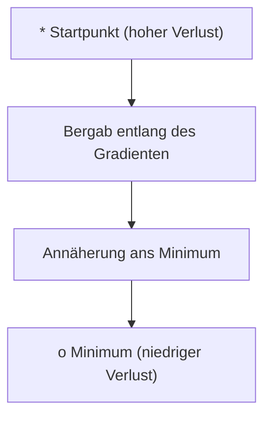
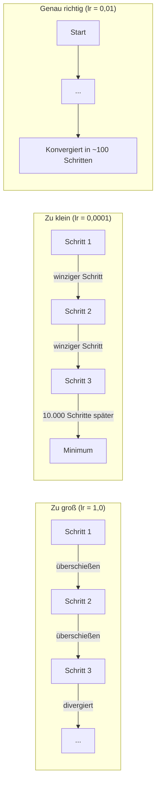
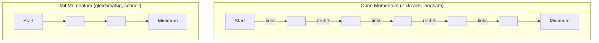
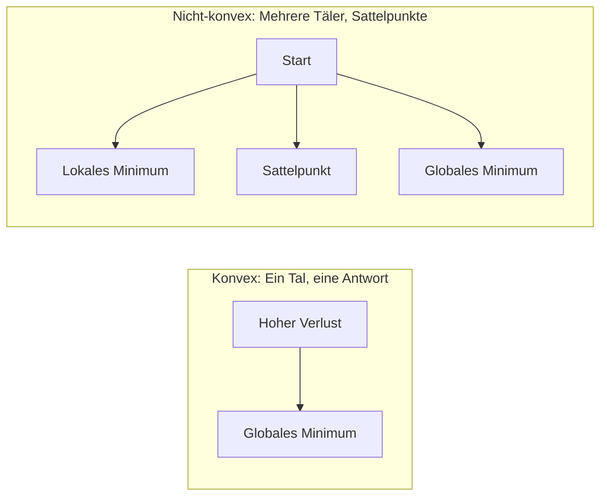
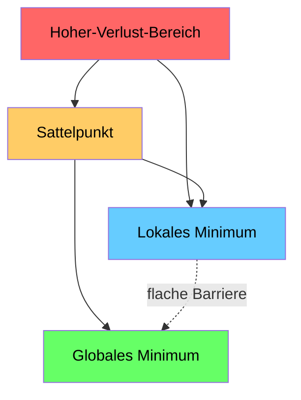

# Optimierung

> Ein neuronales Netz zu trainieren bedeutet nichts anderes, als den Boden eines Tals zu finden.

**Typ:** Aufbauen
**Sprachen:** Python
**Voraussetzungen:** Phase 1, Lektionen 04–05 (Ableitungen, Gradienten)
**Zeit:** ~75 Minuten

## Lernziele

- Einfachen Gradientenabstieg, SGD mit Momentum und Adam von Grund auf implementieren
- Konvergenz der Optimierer auf der Rosenbrock-Funktion vergleichen und erklären, warum Adam gewichtsindividuelle Lernraten anpasst
- Konvexe von nicht-konvexen Verlustlandschaften unterscheiden und die Rolle von Sattelpunkten in hohen Dimensionen erklären
- Lernratenpläne (Schritt-Zerfall, Cosine Annealing, Warmup) für Trainingsstabilität konfigurieren

## Das Problem

Du hast eine Verlustfunktion. Sie sagt dir, wie falsch dein Modell ist. Du hast Gradienten. Sie sagen dir, in welche Richtung der Verlust schlimmer wird. Jetzt brauchst du eine Strategie, um bergab zu gehen.

Der naive Ansatz ist einfach: bewege dich entgegen dem Gradienten. Skaliere den Schritt mit einer Zahl namens Lernrate. Wiederhole. Das ist Gradientenabstieg, und er funktioniert. Aber „funktioniert" hat Einschränkungen. Zu große Lernrate und du überschießt das Tal vollständig, und springst zwischen den Wänden hin und her. Zu kleine und du kriechst über Tausende unnötige Schritte zur Antwort hin. Triffst du auf einen Sattelpunkt, hörst du auf, dich zu bewegen, obwohl du noch kein Minimum gefunden hast.

Jeder Optimierer im Deep Learning ist eine Antwort auf dieselbe Frage: Wie kommst du schneller und zuverlässiger zum Boden des Tals?

## Das Konzept

### Was Optimierung bedeutet

Optimierung bedeutet, die Eingabewerte zu finden, die eine Funktion minimieren (oder maximieren). Im maschinellen Lernen ist die Funktion der Verlust. Die Eingaben sind die Gewichte des Modells. Training ist Optimierung.

```
minimiere L(w) wobei:
  L = Verlustfunktion
  w = Modellgewichte (können Millionen von Parametern sein)
```

### Gradientenabstieg (einfach)

Der einfachste Optimierer. Berechne den Gradienten des Verlusts bezüglich jedes Gewichts. Bewege jedes Gewicht entgegen der Richtung seines Gradienten. Skaliere den Schritt mit der Lernrate.

```
w = w - lr * Gradient
```

Das ist der gesamte Algorithmus. Eine Zeile.



### Lernrate: der wichtigste Hyperparameter

Die Lernrate steuert die Schrittgröße. Sie bestimmt alles über die Konvergenz.



Es gibt keine Formel für die richtige Lernrate. Man findet sie durch Experimente. Übliche Startwerte: 0,001 für Adam, 0,01 für SGD mit Momentum.

### SGD vs. Batch vs. Mini-Batch

Einfacher Gradientenabstieg berechnet den Gradienten über den gesamten Datensatz, bevor er einen Schritt macht. Das nennt man Batch-Gradientenabstieg. Er ist stabil, aber langsam.

Stochastischer Gradientenabstieg (SGD) berechnet den Gradienten auf einem einzelnen zufälligen Sample und macht sofort einen Schritt. Er ist verrauscht, aber schnell.

Mini-Batch-Gradientenabstieg liegt dazwischen. Berechne den Gradienten über eine kleine Batch (32, 64, 128, 256 Samples), dann mache einen Schritt. Das ist das, was tatsächlich jeder verwendet.

| Variante | Batch-Größe | Gradientenqualität | Geschwindigkeit pro Schritt | Rauschen |
|---------|------------|-------------------|---------------------------|----------|
| Batch-GD | Gesamter Datensatz | Exakt | Langsam | Keines |
| SGD | 1 Sample | Sehr verrauscht | Schnell | Hoch |
| Mini-Batch | 32–256 | Gute Schätzung | Ausgeglichen | Mittel |

Das Rauschen in SGD und Mini-Batch ist kein Fehler. Es hilft, flache lokale Minima und Sattelpunkte zu entkommen.

### Momentum: der rollende Ball bergab

Einfacher Gradientenabstieg betrachtet nur den aktuellen Gradienten. Wenn der Gradient Zickzack fährt (häufig in engen Tälern), ist der Fortschritt langsam. Momentum behebt das, indem vergangene Gradienten in einem Geschwindigkeitsterm akkumuliert werden.

```
v = beta * v + Gradient
w = w - lr * v
```

Die Analogie: ein Ball, der bergab rollt. Er stoppt und startet nicht bei jeder Unebenheit neu. Er baut Geschwindigkeit in konsistenten Richtungen auf und dämpft Schwingungen.



`beta` (typischerweise 0,9) steuert, wie viel Verlauf beibehalten wird. Höheres beta bedeutet mehr Momentum, glattere Pfade, aber langsamere Reaktion auf Richtungsänderungen.

### Adam: adaptive Lernraten

Verschiedene Gewichte brauchen verschiedene Lernraten. Ein Gewicht, das selten große Gradienten bekommt, sollte größere Schritte machen, wenn es welche bekommt. Ein Gewicht, das ständig riesige Gradienten bekommt, sollte kleinere Schritte machen.

Adam (Adaptive Moment Estimation) verfolgt zwei Dinge pro Gewicht:

1. Erster Moment (m): laufender Durchschnitt der Gradienten (wie Momentum)
2. Zweiter Moment (v): laufender Durchschnitt der quadrierten Gradienten (Gradientenmagnitude)

```
m = beta1 * m + (1 - beta1) * Gradient
v = beta2 * v + (1 - beta2) * Gradient^2

m_hat = m / (1 - beta1^t)    Bias-Korrektur
v_hat = v / (1 - beta2^t)    Bias-Korrektur

w = w - lr * m_hat / (sqrt(v_hat) + epsilon)
```

Die Division durch `sqrt(v_hat)` ist die entscheidende Erkenntnis. Gewichte mit großen Gradienten werden durch eine große Zahl dividiert (kleiner effektiver Schritt). Gewichte mit kleinen Gradienten werden durch eine kleine Zahl dividiert (großer effektiver Schritt). Jedes Gewicht bekommt seine eigene adaptive Lernrate.

Standard-Hyperparameter: `lr=0,001, beta1=0,9, beta2=0,999, epsilon=1e-8`. Diese Standardwerte funktionieren gut für die meisten Probleme.

### Lernratenpläne

Eine feste Lernrate ist ein Kompromiss. Früh im Training möchte man große Schritte für schnellen Fortschritt. Spät im Training möchte man kleine Schritte für Feinabstimmung nahe dem Minimum.

Häufige Pläne:

| Plan | Formel | Anwendungsfall |
|------|--------|----------------|
| Schritt-Zerfall | lr = lr * Faktor alle N Epochen | Einfach, manuelle Kontrolle |
| Exponentieller Zerfall | lr = lr_0 * decay^t | Gleichmäßige Reduktion |
| Cosine Annealing | lr = lr_min + 0,5 * (lr_max - lr_min) * (1 + cos(pi * t / T)) | Transformer, modernes Training |
| Warmup + Zerfall | Lineares Hochfahren, dann Zerfall | Große Modelle, verhindert frühe Instabilität |

### Konvex vs. nicht-konvex

Eine konvexe Funktion hat ein Minimum. Gradientenabstieg findet es immer. Eine Parabel wie `f(x) = x^2` ist konvex.

Verlustfunktionen neuronaler Netze sind nicht-konvex. Sie haben viele lokale Minima, Sattelpunkte und flache Bereiche.



In der Praxis sind lokale Minima in hochdimensionalen neuronalen Netzen selten ein Problem. Die meisten lokalen Minima haben Verlustwerte nahe am globalen Minimum. Sattelpunkte (flach in einigen Richtungen, gekrümmt in anderen) sind das eigentliche Hindernis. Momentum und Rauschen aus Mini-Batches helfen, ihnen zu entkommen.

### Verlustlandschaft visualisieren

Der Verlust ist eine Funktion aller Gewichte. Für ein Modell mit 1 Million Gewichten lebt die Verlustlandschaft in einem 1.000.001-dimensionalen Raum. Wir visualisieren sie, indem wir zwei zufällige Richtungen im Gewichtsraum wählen und den Verlust entlang dieser Richtungen auftragen – das ergibt eine 2D-Oberfläche.



Scharfe Minima verallgemeinern schlecht. Flache Minima verallgemeinern gut. Das ist ein Grund, warum SGD mit Momentum bei finaler Test-Genauigkeit oft Adam übertrifft: sein Rauschen verhindert das Einpendeln in scharfe Minima.

## Umsetzung

### Schritt 1: Eine Testfunktion definieren

Die Rosenbrock-Funktion ist ein klassisches Optimierungs-Benchmark. Ihr Minimum liegt bei (1, 1) innerhalb eines engen gekrümmten Tals, das leicht zu finden, aber schwer zu folgen ist.

```
f(x, y) = (1 - x)^2 + 100 * (y - x^2)^2
```

```python
def rosenbrock(params):
    x, y = params
    return (1 - x) ** 2 + 100 * (y - x ** 2) ** 2

def rosenbrock_gradient(params):
    x, y = params
    df_dx = -2 * (1 - x) + 200 * (y - x ** 2) * (-2 * x)
    df_dy = 200 * (y - x ** 2)
    return [df_dx, df_dy]
```

### Schritt 2: Einfacher Gradientenabstieg

```python
class GradientDescent:
    def __init__(self, lr=0.001):
        self.lr = lr

    def step(self, params, grads):
        return [p - self.lr * g for p, g in zip(params, grads)]
```

### Schritt 3: SGD mit Momentum

```python
class SGDMomentum:
    def __init__(self, lr=0.001, momentum=0.9):
        self.lr = lr
        self.momentum = momentum
        self.velocity = None

    def step(self, params, grads):
        if self.velocity is None:
            self.velocity = [0.0] * len(params)
        self.velocity = [
            self.momentum * v + g
            for v, g in zip(self.velocity, grads)
        ]
        return [p - self.lr * v for p, v in zip(params, self.velocity)]
```

### Schritt 4: Adam

```python
class Adam:
    def __init__(self, lr=0.001, beta1=0.9, beta2=0.999, epsilon=1e-8):
        self.lr = lr
        self.beta1 = beta1
        self.beta2 = beta2
        self.epsilon = epsilon
        self.m = None
        self.v = None
        self.t = 0

    def step(self, params, grads):
        if self.m is None:
            self.m = [0.0] * len(params)
            self.v = [0.0] * len(params)

        self.t += 1

        self.m = [
            self.beta1 * m + (1 - self.beta1) * g
            for m, g in zip(self.m, grads)
        ]
        self.v = [
            self.beta2 * v + (1 - self.beta2) * g ** 2
            for v, g in zip(self.v, grads)
        ]

        m_hat = [m / (1 - self.beta1 ** self.t) for m in self.m]
        v_hat = [v / (1 - self.beta2 ** self.t) for v in self.v]

        return [
            p - self.lr * mh / (vh ** 0.5 + self.epsilon)
            for p, mh, vh in zip(params, m_hat, v_hat)
        ]
```

### Schritt 5: Ausführen und vergleichen

```python
def optimize(optimizer, func, grad_func, start, steps=5000):
    params = list(start)
    history = [params[:]]
    for _ in range(steps):
        grads = grad_func(params)
        params = optimizer.step(params, grads)
        history.append(params[:])
    return history

start = [-1.0, 1.0]

gd_history = optimize(GradientDescent(lr=0.0005), rosenbrock, rosenbrock_gradient, start)
sgd_history = optimize(SGDMomentum(lr=0.0001, momentum=0.9), rosenbrock, rosenbrock_gradient, start)
adam_history = optimize(Adam(lr=0.01), rosenbrock, rosenbrock_gradient, start)

for name, history in [("GD", gd_history), ("SGD+M", sgd_history), ("Adam", adam_history)]:
    final = history[-1]
    loss = rosenbrock(final)
    print(f"{name:6s} -> x={final[0]:.6f}, y={final[1]:.6f}, Verlust={loss:.8f}")
```

Erwartete Ausgabe: Adam konvergiert am schnellsten. SGD mit Momentum folgt einem gleichmäßigeren Pfad. Einfacher GD macht langsame Fortschritte entlang des engen Tals.

## In der Praxis

In der Praxis nutzt man PyTorch- oder JAX-Optimierer. Sie behandeln Parameter-Gruppen, Weight Decay, Gradientenclipping und GPU-Beschleunigung.

```python
import torch

model = torch.nn.Linear(784, 10)

sgd = torch.optim.SGD(model.parameters(), lr=0.01, momentum=0.9)
adam = torch.optim.Adam(model.parameters(), lr=0.001)
adamw = torch.optim.AdamW(model.parameters(), lr=0.001, weight_decay=0.01)

scheduler = torch.optim.lr_scheduler.CosineAnnealingLR(adam, T_max=100)
```

Faustregeln:

- Beginne mit Adam (lr=0,001). Es funktioniert für die meisten Probleme ohne Abstimmung.
- Wechsle zu SGD mit Momentum (lr=0,01, momentum=0,9), wenn du die beste finale Genauigkeit benötigst und mehr Abstimmungsaufwand leisten kannst.
- Verwende AdamW (Adam mit entkoppeltem Weight Decay) für Transformer.
- Nutze immer einen Lernratenplan für Trainingsläufe länger als wenige Epochen.
- Wenn das Training instabil ist, reduziere die Lernrate. Wenn es zu langsam ist, erhöhe sie.

## Fertigstellen

Diese Lektion erzeugt einen Prompt für die Auswahl des richtigen Optimierers. Siehe `outputs/prompt-optimizer-guide.md`.

Die hier erstellten Optimiererklassen erscheinen in Phase 3 wieder, wenn wir ein neuronales Netz von Grund auf trainieren.

## Übungen

1. **Lernraten-Sweep.** Führe einfachen Gradientenabstieg auf der Rosenbrock-Funktion mit Lernraten [0,0001; 0,0005; 0,001; 0,005; 0,01] aus. Zeichne den finalen Verlust nach 5.000 Schritten für jeden Wert auf oder gib ihn aus. Finde die größte Lernrate, die noch konvergiert.

2. **Momentum-Vergleich.** Führe SGD mit Momentum-Werten [0,0; 0,5; 0,9; 0,99] auf der Rosenbrock-Funktion aus. Verfolge den Verlust bei jedem Schritt. Welcher Momentum-Wert konvergiert am schnellsten? Welcher überschießt?

3. **Sattelpunkt entkommen.** Definiere die Funktion `f(x, y) = x^2 - y^2` (ein Sattelpunkt im Ursprung). Beginne bei (0,01; 0,01). Vergleiche, wie sich einfacher GD, SGD mit Momentum und Adam verhalten. Welcher entkäme dem Sattelpunkt?

4. **Lernratenzerfall implementieren.** Füge einen exponentiellen Zerfallsplan zur `GradientDescent`-Klasse hinzu: `lr = lr_0 * 0,999^Schritt`. Vergleiche die Konvergenz mit und ohne Zerfall auf der Rosenbrock-Funktion.

## Schlüsselbegriffe

| Begriff | Was man sagt | Was es wirklich bedeutet |
|---------|-------------|--------------------------|
| Gradientenabstieg | „Bergab gehen" | Gewichte aktualisieren, indem man den mit der Lernrate skalierten Gradienten subtrahiert. Der einfachste Optimierer. |
| Lernrate | „Schrittgröße" | Ein Skalar, der steuert, wie weit jedes Update die Gewichte bewegt. Zu groß führt zur Divergenz. Zu klein verschwendet Rechenkapazität. |
| Momentum | „Weiterrollen" | Vergangene Gradienten in einem Geschwindigkeitsvektor akkumulieren. Dämpft Schwingungen und beschleunigt Bewegungen in konsistente Richtungen. |
| SGD | „Zufälliges Sampling" | Stochastischer Gradientenabstieg. Gradienten auf einer zufälligen Teilmenge statt auf dem gesamten Datensatz berechnen. Bedeutet in der Praxis fast immer Mini-Batch-SGD. |
| Mini-Batch | „Ein Datenhappen" | Eine kleine Teilmenge der Trainingsdaten (32–256 Samples), die zur Gradientenschätzung verwendet wird. Balanciert Geschwindigkeit und Gradientengenauigkeit. |
| Adam | „Der Standard-Optimierer" | Adaptive Moment Estimation. Verfolgt laufende Durchschnitte von Gradienten und quadrierten Gradienten pro Gewicht, um jedem Gewicht seine eigene Lernrate zu geben. |
| Bias-Korrektur | „Den Kaltstart beheben" | Adams erster und zweiter Moment werden mit null initialisiert. Die Bias-Korrektur dividiert durch (1 - beta^t), um in frühen Schritten zu kompensieren. |
| Lernratenplan | „Lernrate über die Zeit ändern" | Eine Funktion, die die Lernrate während des Trainings anpasst. Große Schritte früh, kleine Schritte spät. |
| Konvexe Funktion | „Ein Tal" | Eine Funktion, bei der jedes lokale Minimum das globale Minimum ist. Gradientenabstieg findet es immer. Verlustfunktionen neuronaler Netze sind nicht konvex. |
| Sattelpunkt | „Flach, aber kein Minimum" | Ein Punkt, an dem der Gradient null ist, der aber in manchen Richtungen ein Minimum und in anderen ein Maximum ist. Häufig in hohen Dimensionen. |
| Verlustlandschaft | „Das Gelände" | Die Verlustfunktion über dem Gewichtsraum aufgetragen. Visualisiert durch Schnitte entlang zweier zufälliger Richtungen. |
| Konvergenz | „Ankommen" | Der Optimierer hat einen Punkt erreicht, an dem weitere Schritte den Verlust nicht mehr nennenswert reduzieren. |

## Weiterführende Literatur

- [Sebastian Ruder: An overview of gradient descent optimization algorithms](https://ruder.io/optimizing-gradient-descent/) – umfassender Überblick über alle wichtigen Optimierer
- [Why Momentum Really Works (Distill)](https://distill.pub/2017/momentum/) – interaktive Visualisierung der Momentum-Dynamik
- [Adam: A Method for Stochastic Optimization (Kingma & Ba, 2014)](https://arxiv.org/abs/1412.6980) – das originale Adam-Paper, lesbar und kurz
- [Visualizing the Loss Landscape of Neural Nets (Li et al., 2018)](https://arxiv.org/abs/1712.09913) – das Paper, das scharfe vs. flache Minima zeigte
