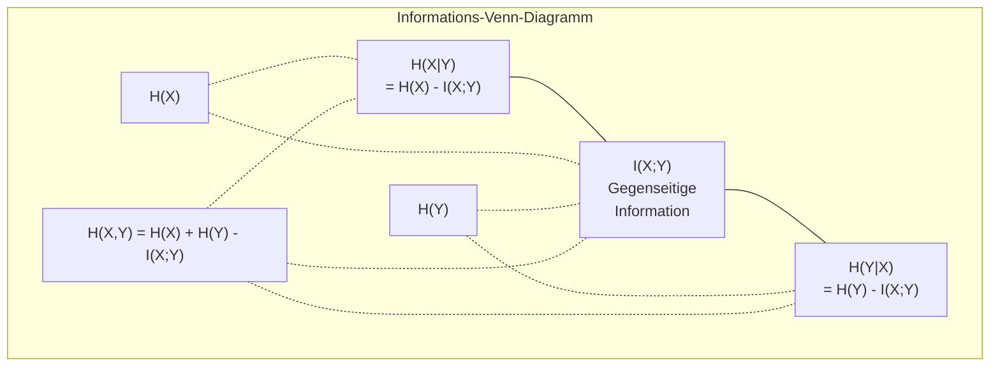

# Informationstheorie

> Informationstheorie misst Überraschung. Verlustfunktionen bauen darauf auf.

**Typ:** Lernen
**Sprachen:** Python
**Voraussetzungen:** Phase 1, Lektion 06 (Wahrscheinlichkeit)
**Zeit:** ~60 Minuten

## Lernziele

- Entropie, Kreuzentropie und KL-Divergenz von Grund auf berechnen und ihre Beziehung erklären
- Herleiten, warum das Minimieren des Kreuzentropie-Verlusts äquivalent zum Maximieren der Log-Likelihood ist
- Mutual Information zwischen Features und einem Ziel berechnen, um Features nach Wichtigkeit zu ordnen
- Perplexity als die effektive Vokabulargröße erklären, aus der ein Sprachmodell wählt

## Das Problem

Du rufst `CrossEntropyLoss()` in jedem Klassifikationsmodell auf, das du trainierst. Du siehst „Perplexity" in jedem Sprachmodell-Paper. Du liest über KL-Divergenz in VAEs, Destillation und RLHF. Das sind keine unverbundenen Konzepte. Sie sind alle dieselbe Idee in verschiedenen Verkleidungen.

Informationstheorie gibt dir die Sprache, um über Unsicherheit, Kompression und Vorhersage nachzudenken. Claude Shannon erfand sie 1948, um Kommunikationsprobleme zu lösen. Es stellt sich heraus: Ein neuronales Netz zu trainieren ist ein Kommunikationsproblem – das Modell versucht, die korrekte Klasse durch einen verrauschten Kanal gelernter Gewichte zu übertragen.

Diese Lektion baut jede Formel von Grund auf, damit du siehst, woher sie kommen und warum sie funktionieren.

## Das Konzept

### Informationsgehalt (Überraschung)

Wenn etwas Unwahrscheinliches passiert, trägt es mehr Information. Eine Münze auf Kopf? Nicht überraschend. Ein Lotteriegewinn? Sehr überraschend.

Der Informationsgehalt eines Ereignisses mit Wahrscheinlichkeit p ist:

```
I(x) = -log(p(x))
```

Logarithmus zur Basis 2 gibt Bits. Natürlicher Logarithmus gibt Nats. Gleiche Idee, verschiedene Einheiten.

```
Ereignis              Wahrscheinlichkeit    Überraschung (Bits)
Faire Münze Kopf      0,5                   1,0
Würfeln einer 6       0,167                 2,58
1-von-1000-Ereignis   0,001                 9,97
Sicheres Ereignis     1,0                   0,0
```

Sichere Ereignisse tragen null Information. Du wusstest bereits, dass sie eintreten würden.

### Entropie (Durchschnittliche Überraschung)

Entropie ist die erwartete Überraschung über alle möglichen Ergebnisse einer Verteilung.

```
H(P) = -sum( p(x) * log(p(x)) )  für alle x
```

Eine faire Münze hat maximale Entropie für eine binäre Variable: 1 Bit. Eine gezinkte Münze (99 % Kopf) hat niedrige Entropie: 0,08 Bits. Du weißt bereits, was passieren wird, also sagt dir jeder Wurf fast nichts.

```
Faire Münze:    H = -(0,5 * log2(0,5) + 0,5 * log2(0,5)) = 1,0 Bit
Gezinkte Münze: H = -(0,99 * log2(0,99) + 0,01 * log2(0,01)) = 0,08 Bits
```

Entropie misst die unreduzierbare Unsicherheit in einer Verteilung. Du kannst nicht darunter komprimieren.

### Kreuzentropie (Die Verlustfunktion, die du täglich nutzt)

Kreuzentropie misst die durchschnittliche Überraschung, wenn du Verteilung Q verwendest, um Ereignisse zu kodieren, die tatsächlich aus Verteilung P stammen.

```
H(P, Q) = -sum( p(x) * log(q(x)) )  für alle x
```

P ist die wahre Verteilung (die Labels). Q sind die Vorhersagen deines Modells. Wenn Q perfekt zu P passt, entspricht Kreuzentropie der Entropie. Jede Abweichung macht sie größer.

Bei der Klassifikation ist P ein One-Hot-Vektor (die wahre Klasse hat Wahrscheinlichkeit 1, alles andere 0). Das vereinfacht die Kreuzentropie zu:

```
H(P, Q) = -log(q(wahre_Klasse))
```

Das ist die gesamte Kreuzentropie-Verlustformel für Klassifikation. Maximiere die vorhergesagte Wahrscheinlichkeit der korrekten Klasse.

### KL-Divergenz (Abstand zwischen Verteilungen)

KL-Divergenz misst, wie viel zusätzliche Überraschung du bekommst, wenn du Q statt P verwendest.

```
D_KL(P || Q) = sum( p(x) * log(p(x) / q(x)) )  für alle x
             = H(P, Q) - H(P)
```

Kreuzentropie ist Entropie plus KL-Divergenz. Da die Entropie der wahren Verteilung während des Trainings konstant ist, ist das Minimieren der Kreuzentropie dasselbe wie das Minimieren der KL-Divergenz. Du drückst die Verteilung deines Modells in Richtung der wahren Verteilung.

KL-Divergenz ist nicht symmetrisch: D_KL(P || Q) ≠ D_KL(Q || P). Sie ist keine echte Distanzmetrik.

### Mutual Information

Mutual Information misst, wie viel das Wissen über eine Variable dir über eine andere sagt.

```
I(X; Y) = H(X) - H(X|Y)
         = H(X) + H(Y) - H(X, Y)
```

Wenn X und Y unabhängig sind, ist Mutual Information null. Das Wissen über eine Variable sagt dir nichts über die andere. Wenn sie perfekt korreliert sind, entspricht Mutual Information der Entropie einer der Variablen.

Bei der Feature-Auswahl bedeutet hohe Mutual Information zwischen einem Feature und dem Ziel, dass das Feature nützlich ist. Niedrige Mutual Information bedeutet, es ist Rauschen.

### Bedingte Entropie

H(Y|X) misst, wie viel Unsicherheit über Y nach Beobachtung von X verbleibt.

```
H(Y|X) = H(X,Y) - H(X)
```

Zwei Extreme:
- Wenn X Y vollständig bestimmt, ist H(Y|X) = 0. Das Wissen über X eliminiert alle Unsicherheit über Y. Beispiel: X = Temperatur in Celsius, Y = Temperatur in Fahrenheit.
- Wenn X dir nichts über Y sagt, ist H(Y|X) = H(Y). Das Wissen über X reduziert deine Unsicherheit überhaupt nicht. Beispiel: X = Münzwurf, Y = das Wetter morgen.

Bedingte Entropie ist immer nicht-negativ und übersteigt nie H(Y):

```
0 <= H(Y|X) <= H(Y)
```

Im maschinellen Lernen erscheint bedingte Entropie in Entscheidungsbäumen. Bei jedem Split wählt der Algorithmus das Feature X, das H(Y|X) minimiert – das Feature, das die meiste Unsicherheit über das Label Y beseitigt.

### Gemeinsame Entropie

H(X,Y) ist die Entropie der gemeinsamen Verteilung von X und Y zusammen.

```
H(X,Y) = -sum sum p(x,y) * log(p(x,y))   für alle x, y
```

Wichtige Eigenschaft:

```
H(X,Y) <= H(X) + H(Y)
```

Gleichheit gilt, wenn X und Y unabhängig sind. Wenn sie Information teilen, ist die gemeinsame Entropie kleiner als die Summe der individuellen Entropien. Die „fehlende" Entropie ist genau die Mutual Information.



Die Beziehungen:
- H(X,Y) = H(X) + H(Y|X) = H(Y) + H(X|Y)
- I(X;Y) = H(X) - H(X|Y) = H(Y) - H(Y|X)
- H(X,Y) = H(X) + H(Y) - I(X;Y)

### Mutual Information (Vertiefung)

Mutual Information I(X;Y) quantifiziert, wie viel das Wissen über eine Variable die Unsicherheit über die andere reduziert.

```
I(X;Y) = H(X) - H(X|Y)
        = H(Y) - H(Y|X)
        = H(X) + H(Y) - H(X,Y)
        = sum sum p(x,y) * log(p(x,y) / (p(x) * p(y)))
```

Eigenschaften:
- I(X;Y) >= 0 immer. Du verlierst nie Information durch Beobachtung.
- I(X;Y) = 0 genau dann, wenn X und Y unabhängig sind.
- I(X;Y) = I(Y;X). Sie ist symmetrisch, im Gegensatz zur KL-Divergenz.
- I(X;X) = H(X). Eine Variable teilt alle ihre Information mit sich selbst.

**Mutual Information zur Feature-Auswahl.** In ML möchtest du Features, die informativ über das Ziel sind. Mutual Information gibt dir eine prinzipielle Möglichkeit, Features zu ranken:

1. Berechne für jedes Feature X_i I(X_i; Y), wobei Y die Zielvariable ist.
2. Ranke Features nach MI-Score.
3. Behalte die obersten k Features.

Das funktioniert für jede Beziehung zwischen Feature und Ziel – linear, nichtlinear, monoton oder nicht. Korrelation erfasst nur lineare Beziehungen. MI erfasst alles.

| Methode | Erkennt | Rechenaufwand | Kategorielle Daten? |
|---------|---------|---------------|---------------------|
| Pearson-Korrelation | Lineare Beziehungen | O(n) | Nein |
| Spearman-Korrelation | Monotone Beziehungen | O(n log n) | Nein |
| Mutual Information | Jede statistische Abhängigkeit | O(n log n) mit Binning | Ja |

### Label Smoothing und Kreuzentropie

Standardklassifikation verwendet harte Ziele: [0, 0, 1, 0]. Die wahre Klasse bekommt Wahrscheinlichkeit 1, alles andere bekommt 0. Label Smoothing ersetzt diese durch weiche Ziele:

```
weiches_Ziel = (1 - epsilon) * hartes_Ziel + epsilon / Anzahl_Klassen
```

Mit epsilon = 0,1 und 4 Klassen:
- Hartes Ziel:  [0, 0, 1, 0]
- Weiches Ziel: [0,025, 0,025, 0,925, 0,025]

Aus informationstheoretischer Perspektive erhöht Label Smoothing die Entropie der Zielverteilung. Harte One-Hot-Ziele haben Entropie 0 – es gibt keine Unsicherheit. Weiche Ziele haben positive Entropie.

Warum das hilft:
- Verhindert, dass das Modell Logits auf extreme Werte treibt (unendliche Logits wären nötig, um ein One-Hot-Ziel unter Kreuzentropie perfekt anzupassen)
- Wirkt als Regularisierung: Das Modell kann nicht 100 % sicher sein
- Verbessert Kalibrierung: Vorhergesagte Wahrscheinlichkeiten spiegeln wahre Unsicherheit besser wider
- Verringert die Lücke zwischen Training- und Inferenzverhalten

Der Kreuzentropie-Verlust mit Label Smoothing wird:

```
L = (1 - epsilon) * CE(hartes_Ziel, Vorhersage) + epsilon * H_gleichförmig(Vorhersage)
```

Der zweite Term bestraft Vorhersagen, die weit von der Gleichverteilung entfernt sind – eine direkte Regularisierung der Konfidenz.

### Warum Kreuzentropie DIE Klassifikations-Verlustfunktion ist

Drei Perspektiven, eine Schlussfolgerung.

**Informationstheoretische Sichtweise.** Kreuzentropie misst, wie viele Bits du verschwendest, indem du die Verteilung deines Modells statt der wahren Verteilung verwendest. Ihr Minimieren macht dein Modell zum effizientesten Kodierer der Realität.

**Maximum-Likelihood-Sichtweise.** Für N Trainingssamples mit wahren Klassen y_i:

```
Likelihood          = Produkt( q(y_i) )
Log-Likelihood      = Summe( log(q(y_i)) )
Negative Log-Likelihood = -Summe( log(q(y_i)) )
```

Diese letzte Zeile ist der Kreuzentropie-Verlust. Kreuzentropie minimieren = Likelihood der Trainingsdaten unter deinem Modell maximieren.

**Gradientenansicht.** Der Gradient der Kreuzentropie bezüglich der Logits ist einfach (vorhergesagt - wahr). Sauber, stabil und schnell zu berechnen. Deshalb passt sie perfekt zu Softmax.

### Bits vs. Nats

Der einzige Unterschied ist die Logarithmenbasis.

```
Logarithmus zur Basis 2   -> Bits      (informationstheoretische Tradition)
Logarithmus zur Basis e   -> Nats      (Konvention in ML)
Logarithmus zur Basis 10  -> Hartleys  (selten verwendet)
```

1 Nat = 1/ln(2) Bits = 1,4427 Bits. PyTorch und TensorFlow verwenden standardmäßig den natürlichen Logarithmus (Nats).

### Perplexity

Perplexity ist der Exponent der Kreuzentropie. Sie sagt dir die effektive Anzahl gleichwahrscheinlicher Wahlmöglichkeiten, zwischen denen das Modell unsicher ist.

```
Perplexity = 2^H(P,Q)   (bei Verwendung von Bits)
Perplexity = e^H(P,Q)   (bei Verwendung von Nats)
```

Ein Sprachmodell mit Perplexity 50 ist im Durchschnitt so verwirrt, als ob es gleichmäßig aus 50 möglichen nächsten Token wählen müsste. Niedriger ist besser.

GPT-2 erreichte Perplexity ~30 auf gängigen Benchmarks. Moderne Modelle liegen bei gut repräsentierten Domänen im einstelligen Bereich.

## Umsetzung

### Schritt 1: Informationsgehalt und Entropie

```python
import math

def information_content(p, base=2):
    if p <= 0 or p > 1:
        return float('inf') if p <= 0 else 0.0
    return -math.log(p) / math.log(base)

def entropy(probs, base=2):
    return sum(
        p * information_content(p, base)
        for p in probs if p > 0
    )

fair_coin = [0.5, 0.5]
biased_coin = [0.99, 0.01]
fair_die = [1/6] * 6

print(f"Entropie faire Münze:    {entropy(fair_coin):.4f} Bits")
print(f"Entropie gezinkte Münze: {entropy(biased_coin):.4f} Bits")
print(f"Entropie fairer Würfel:  {entropy(fair_die):.4f} Bits")
```

### Schritt 2: Kreuzentropie und KL-Divergenz

```python
def cross_entropy(p, q, base=2):
    total = 0.0
    for pi, qi in zip(p, q):
        if pi > 0:
            if qi <= 0:
                return float('inf')
            total += pi * (-math.log(qi) / math.log(base))
    return total

def kl_divergence(p, q, base=2):
    return cross_entropy(p, q, base) - entropy(p, base)

true_dist = [0.7, 0.2, 0.1]
good_model = [0.6, 0.25, 0.15]
bad_model = [0.1, 0.1, 0.8]

print(f"Entropie wahre Vert.:     {entropy(true_dist):.4f} Bits")
print(f"KE (gutes Modell):        {cross_entropy(true_dist, good_model):.4f} Bits")
print(f"KE (schlechtes Modell):   {cross_entropy(true_dist, bad_model):.4f} Bits")
print(f"KL-Divergenz (gut):       {kl_divergence(true_dist, good_model):.4f} Bits")
print(f"KL-Divergenz (schlecht):  {kl_divergence(true_dist, bad_model):.4f} Bits")
```

### Schritt 3: Kreuzentropie als Klassifikationsverlust

```python
def softmax(logits):
    max_logit = max(logits)
    exps = [math.exp(z - max_logit) for z in logits]
    total = sum(exps)
    return [e / total for e in exps]

def cross_entropy_loss(true_class, logits):
    probs = softmax(logits)
    return -math.log(probs[true_class])

logits = [2.0, 1.0, 0.1]
true_class = 0

probs = softmax(logits)
loss = cross_entropy_loss(true_class, logits)

print(f"Logits:         {logits}")
print(f"Softmax:        {[f'{p:.4f}' for p in probs]}")
print(f"Wahre Klasse:   {true_class}")
print(f"Verlust:        {loss:.4f} Nats")
print(f"Perplexity:     {math.exp(loss):.2f}")
```

### Schritt 4: Kreuzentropie entspricht negativer Log-Likelihood

```python
import random

random.seed(42)

n_samples = 1000
n_classes = 3
true_labels = [random.randint(0, n_classes - 1) for _ in range(n_samples)]
model_logits = [[random.gauss(0, 1) for _ in range(n_classes)] for _ in range(n_samples)]

ce_loss = sum(
    cross_entropy_loss(label, logits)
    for label, logits in zip(true_labels, model_logits)
) / n_samples

nll = -sum(
    math.log(softmax(logits)[label])
    for label, logits in zip(true_labels, model_logits)
) / n_samples

print(f"Kreuzentropie-Verlust:       {ce_loss:.6f}")
print(f"Negative Log-Likelihood:     {nll:.6f}")
print(f"Differenz:                   {abs(ce_loss - nll):.2e}")
```

### Schritt 5: Mutual Information

```python
def mutual_information(joint_probs, base=2):
    rows = len(joint_probs)
    cols = len(joint_probs[0])

    margin_x = [sum(joint_probs[i][j] for j in range(cols)) for i in range(rows)]
    margin_y = [sum(joint_probs[i][j] for i in range(rows)) for j in range(cols)]

    mi = 0.0
    for i in range(rows):
        for j in range(cols):
            pxy = joint_probs[i][j]
            if pxy > 0:
                mi += pxy * math.log(pxy / (margin_x[i] * margin_y[j])) / math.log(base)
    return mi

independent = [[0.25, 0.25], [0.25, 0.25]]
dependent = [[0.45, 0.05], [0.05, 0.45]]

print(f"MI (unabhängig): {mutual_information(independent):.4f} Bits")
print(f"MI (abhängig):   {mutual_information(dependent):.4f} Bits")
```

## In der Praxis

Dieselben Konzepte mit NumPy, wie du sie in der Praxis verwenden wirst:

```python
import numpy as np

def np_entropy(p):
    p = np.asarray(p, dtype=float)
    mask = p > 0
    result = np.zeros_like(p)
    result[mask] = p[mask] * np.log(p[mask])
    return -result.sum()

def np_cross_entropy(p, q):
    p, q = np.asarray(p, dtype=float), np.asarray(q, dtype=float)
    mask = p > 0
    return -(p[mask] * np.log(q[mask])).sum()

def np_kl_divergence(p, q):
    return np_cross_entropy(p, q) - np_entropy(p)

true = np.array([0.7, 0.2, 0.1])
pred = np.array([0.6, 0.25, 0.15])
print(f"Entropie:    {np_entropy(true):.4f} Nats")
print(f"Kreuzent.:   {np_cross_entropy(true, pred):.4f} Nats")
print(f"KL-Div.:     {np_kl_divergence(true, pred):.4f} Nats")
```

Du hast von Grund auf gebaut, was `torch.nn.CrossEntropyLoss()` intern tut. Jetzt weißt du, warum der Verlust während des Trainings sinkt: Die vorhergesagte Verteilung deines Modells nähert sich der wahren Verteilung an, gemessen in Nats verschwendeter Information.

## Übungen

1. Berechne die Entropie des deutschen Alphabets unter der Annahme einer Gleichverteilung (26 Buchstaben). Schätze sie dann anhand tatsächlicher Buchstabenhäufigkeiten. Welche ist höher und warum?

2. Ein Modell gibt Logits [5,0; 2,0; 0,5] für ein Sample mit wahrer Klasse 1 aus. Berechne den Kreuzentropie-Verlust von Hand und überprüfe ihn mit deiner `cross_entropy_loss`-Funktion. Welche Logits würden zu einem Verlust von null führen?

3. Zeige, dass KL-Divergenz nicht symmetrisch ist. Wähle zwei Verteilungen P und Q und berechne D_KL(P || Q) und D_KL(Q || P). Erkläre, warum sie sich unterscheiden.

4. Baue eine Funktion, die die Perplexity für eine Folge von Token-Vorhersagen berechnet. Gegeben eine Liste von (wahrer_Token-Index, vorhergesagte_Logits)-Paaren, gib die Perplexity der Folge zurück.

## Schlüsselbegriffe

| Begriff | Was man sagt | Was es wirklich bedeutet |
|---------|-------------|--------------------------|
| Informationsgehalt | „Überraschung" | Die Anzahl der Bits (oder Nats), die zum Kodieren eines Ereignisses benötigt werden: -log(p) |
| Entropie | „Zufälligkeit" | Die durchschnittliche Überraschung über alle Ergebnisse einer Verteilung. Misst die unreduzierbare Unsicherheit. |
| Kreuzentropie | „Die Verlustfunktion" | Durchschnittliche Überraschung, wenn die Modellverteilung Q verwendet wird, um Ereignisse aus der wahren Verteilung P zu kodieren. |
| KL-Divergenz | „Abstand zwischen Verteilungen" | Zusätzliche Bits, die verschwendet werden, wenn Q statt P verwendet wird. Gleich Kreuzentropie minus Entropie. Nicht symmetrisch. |
| Mutual Information | „Wie verwandt sind X und Y" | Reduktion der Unsicherheit über X durch Wissen über Y. Null bedeutet Unabhängigkeit. |
| Softmax | „Logits in Wahrscheinlichkeiten umwandeln" | Exponenzieren und normalisieren. Bildet jeden reellwertigen Vektor auf eine gültige Wahrscheinlichkeitsverteilung ab. |
| Perplexity | „Wie verwirrt das Modell ist" | Exponential der Kreuzentropie. Die effektive Vokabulargröße, aus der das Modell bei jedem Schritt wählt. |
| Bits | „Shannons Einheit" | Information gemessen mit Logarithmus zur Basis 2. Ein Bit löst einen fairen Münzwurf auf. |
| Nats | „Die ML-Einheit" | Information gemessen mit dem natürlichen Logarithmus. Standardmäßig von PyTorch und TensorFlow verwendet. |
| Negative Log-Likelihood | „NLL-Verlust" | Identisch mit dem Kreuzentropie-Verlust bei One-Hot-Labels. Ihre Minimierung maximiert die Wahrscheinlichkeit korrekter Vorhersagen. |

## Weiterführende Literatur

- [Shannon 1948: A Mathematical Theory of Communication](https://people.math.harvard.edu/~ctm/home/text/others/shannon/entropy/entropy.pdf) – das Originalpaper, noch immer lesbar
- [Visual Information Theory (Chris Olah)](https://colah.github.io/posts/2015-09-Visual-Information/) – beste visuelle Erklärung von Entropie und KL-Divergenz
- [PyTorch CrossEntropyLoss docs](https://pytorch.org/docs/stable/generated/torch.nn.CrossEntropyLoss.html) – wie das Framework das implementiert, was du gerade gebaut hast
