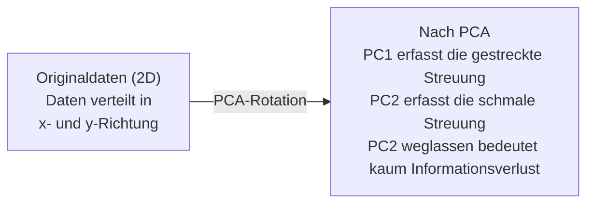

# Dimensionsreduktion

> Hochdimensionale Daten haben Struktur. Man findet sie, indem man aus dem richtigen Winkel schaut.

**Typ:** Aufbauen
**Sprachen:** Python
**Voraussetzungen:** Phase 1, Lektion 01 (Lineare Algebra Intuition), 02 (Vektoren, Matrizen & Operationen), 03 (Eigenwerte & Eigenvektoren), 06 (Wahrscheinlichkeit & Verteilungen)
**Zeit:** ~90 Minuten

## Lernziele

- PCA von Grund auf implementieren: Daten zentrieren, Kovarianzmatrix berechnen, Eigenwertzerlegung durchführen und projizieren
- Erklärte Varianz-Ratio und die Ellbogen-Methode verwenden, um die Anzahl der Hauptkomponenten zu wählen
- PCA, t-SNE und UMAP zur Visualisierung von MNIST-Ziffern in 2D vergleichen und ihre Kompromisse erklären
- Kernel-PCA mit einem RBF-Kernel einsetzen, um nichtlineare Datenstrukturen zu trennen, die Standard-PCA nicht verarbeiten kann

## Das Problem

Du hast einen Datensatz mit 784 Features pro Sample. Vielleicht sind es Pixelwerte handgeschriebener Ziffern. Vielleicht Genexpressionslevels. Vielleicht Nutzerverhaltenssignale. Du kannst 784 Dimensionen nicht visualisieren. Du kannst sie nicht plotten. Du kannst nicht einmal darüber nachdenken.

Aber die meisten dieser 784 Features sind redundant. Die eigentliche Information lebt auf einer viel kleineren Oberfläche. Eine handgeschriebene „7" braucht keine 784 unabhängigen Zahlen, um sie zu beschreiben. Sie braucht ein paar: den Winkel des Strichs, die Länge des Querbalkens, wie stark sie sich neigt. Der Rest ist Rauschen.

Dimensionsreduktion findet diese kleinere Oberfläche. Sie nimmt deine 784-dimensionalen Daten und komprimiert sie auf 2, 10 oder 50 Dimensionen, während sie die relevante Struktur erhält.

## Das Konzept

### Der Fluch der Dimensionalität

Hochdimensionale Räume sind kontraintuitiv. Drei Dinge versagen, wenn Dimensionen zunehmen.

**Abstände werden bedeutungslos.** In hohen Dimensionen konvergiert der Abstand zwischen zwei beliebigen zufälligen Punkten auf denselben Wert. Wenn jeder Punkt ungefähr denselben Abstand von jedem anderen hat, funktioniert die Nächste-Nachbar-Suche nicht mehr.

```
Dimension    Durchschn. Abstandsverhältnis (max/min zwischen Zufallspunkten)
2            ~5,0
10           ~1,8
100          ~1,2
1000         ~1,02
```

**Volumen konzentriert sich in Ecken.** Ein Einheitshyperwürfel in d Dimensionen hat 2^d Ecken. In 100 Dimensionen liegt fast das gesamte Volumen in den Ecken, weit vom Zentrum entfernt. Datenpunkte verteilen sich an die Ränder, und deine Modelle verhungern im Inneren.

**Du benötigst exponentiell mehr Daten.** Um dieselbe Stichprobendichte in einem Raum zu erhalten, benötigst du beim Übergang von 2D auf 20D 10^18-mal mehr Daten. Das hast du nie. Die Dimensionsreduktion bringt die Datendichte zurück auf ein handhabbares Niveau.

### Hauptkomponentenanalyse (PCA): die wichtigen Richtungen finden

Die Hauptkomponentenanalyse (PCA) findet die Achsen, entlang derer deine Daten am stärksten variieren. Sie dreht dein Koordinatensystem so, dass die erste Achse die meiste Varianz erfasst, die zweite die nächstgrößte und so weiter.

Der Algorithmus:

```
1. Daten zentrieren       (Mittelwert von jedem Feature subtrahieren)
2. Kovarianz berechnen    (wie Features sich gemeinsam verändern)
3. Eigenwertzerlegung     (die Hauptrichtungen finden)
4. Nach Eigenwert sortieren (größte Varianz zuerst)
5. Projizieren            (top k Eigenvektoren behalten, Rest verwerfen)
```

Warum Eigenwertzerlegung? Die Kovarianzmatrix ist symmetrisch und positiv semidefinit. Ihre Eigenvektoren sind orthogonale Richtungen im Feature-Raum. Die Eigenwerte geben an, wie viel Varianz jede Richtung erfasst. Der Eigenvektor mit dem größten Eigenwert zeigt in die Richtung maximaler Varianz.



- **Vor PCA:** Datenwolke ist diagonal über x- und y-Achse verteilt
- **Nach PCA:** Das Koordinatensystem ist so gedreht, dass PC1 mit der Richtung maximaler Varianz (gestreckte Streuung) und PC2 mit der Richtung minimaler Varianz (schmale Streuung) ausgerichtet ist
- **Dimensionsreduktion:** PC2 weglassen projiziert die Daten auf PC1, mit sehr geringem Informationsverlust

### Erklärte Varianz-Ratio

Jede Hauptkomponente erfasst einen Bruchteil der Gesamtvarianz. Die erklärte Varianz-Ratio sagt dir, wie viel.

```
Komponente    Eigenwert    Erklärte Ratio    Kumulativ
PC1           4,73         0,473             0,473
PC2           2,51         0,251             0,724
PC3           1,12         0,112             0,836
PC4           0,89         0,089             0,925
...
```

Wenn die kumulative erklärte Varianz 0,95 erreicht, weißt du, dass diese Komponenten 95 % der Information erfassen. Alles danach ist größtenteils Rauschen.

### Anzahl der Komponenten wählen

Drei Strategien:

1. **Schwellenwert.** Behalte genug Komponenten, um 90–95 % der Varianz zu erklären.
2. **Ellbogen-Methode.** Plotte die erklärte Varianz pro Komponente. Suche nach einem starken Abfall.
3. **Downstream-Performance.** Verwende PCA als Vorverarbeitung. Variiere k und messe die Genauigkeit deines Modells. Das beste k liegt dort, wo die Genauigkeit abflacht.

### t-SNE: Nachbarschaften erhalten

t-Distributed Stochastic Neighbor Embedding (t-SNE) ist für die Visualisierung konzipiert. Es bildet hochdimensionale Daten auf 2D (oder 3D) ab und bewahrt dabei die Nähebeziehungen zwischen Punkten.

Die Intuition: Im ursprünglichen Raum wird eine Wahrscheinlichkeitsverteilung über Punktpaare anhand ihrer Abstände berechnet. Nahe Punkte erhalten hohe Wahrscheinlichkeit. Weit entfernte Punkte erhalten niedrige Wahrscheinlichkeit. Dann wird eine 2D-Anordnung gefunden, in der dieselbe Wahrscheinlichkeitsverteilung gilt. Punkte, die in 784 Dimensionen Nachbarn waren, bleiben in 2D Nachbarn.

Wichtige Eigenschaften von t-SNE:
- Nichtlinear. Es kann komplexe Mannigfaltigkeiten entfalten, die PCA nicht kann.
- Stochastisch. Verschiedene Läufe erzeugen unterschiedliche Layouts.
- Der Perplexity-Parameter steuert, wie viele Nachbarn berücksichtigt werden (typischer Bereich: 5–50).
- Abstände zwischen Clustern im Output sind nicht bedeutsam. Nur die Cluster selbst sind es.
- Langsam auf großen Datensätzen. Standardmäßig O(n^2).

### UMAP: schneller, bessere globale Struktur

Uniform Manifold Approximation and Projection (UMAP) funktioniert ähnlich wie t-SNE, hat aber zwei Vorteile:
- Schneller. Es verwendet näherungsweise Nächste-Nachbar-Graphen statt aller paarweisen Abstände.
- Bessere globale Struktur. Die relativen Positionen der Cluster im Output tendieren dazu, bedeutungsvoller zu sein als bei t-SNE.

UMAP erstellt einen gewichteten Graphen im hochdimensionalen Raum (die „unscharfe topologische Repräsentation") und findet dann ein niedrigdimensionales Layout, das diesen Graphen so gut wie möglich erhält.

Wichtige Parameter:
- `n_neighbors`: Wie viele Nachbarn die lokale Struktur definieren (ähnlich wie Perplexity). Höhere Werte erhalten mehr globale Struktur.
- `min_dist`: Wie dicht die Punkte im Output zusammengepackt werden. Niedrigere Werte erzeugen dichtere Cluster.

### Wann welche Methode

| Methode | Anwendungsfall | Erhält | Geschwindigkeit |
|---------|---------------|--------|----------------|
| PCA | Vorverarbeitung vor dem Training | Globale Varianz | Schnell (exakt), funktioniert mit Millionen von Samples |
| PCA | Schnelle explorative Visualisierung | Lineare Struktur | Schnell |
| t-SNE | Publikationsreife 2D-Plots | Lokale Nachbarschaften | Langsam (< 10.000 Samples ideal) |
| UMAP | 2D-Visualisierung im großen Maßstab | Lokale + etwas globale Struktur | Mittel (verarbeitet Millionen) |
| PCA | Feature-Reduktion für Modelle | Varianz-gerankte Features | Schnell |
| t-SNE / UMAP | Cluster-Struktur verstehen | Cluster-Trennung | Mittel bis langsam |

Daumenregel: PCA für Vorverarbeitung und Datenkompression. t-SNE oder UMAP, wenn du Struktur in 2D visualisieren musst.

### Kernel-PCA

Standard-PCA findet lineare Unterräume. Sie dreht dein Koordinatensystem und verwirft Achsen. Aber was, wenn die Daten auf einer nichtlinearen Mannigfaltigkeit liegen? Ein Kreis in 2D kann durch keine Linie getrennt werden. Standard-PCA hilft hier nicht.

Kernel-PCA wendet PCA in einem hochdimensionalen Feature-Raum an, der durch eine Kernel-Funktion induziert wird, ohne die Koordinaten in diesem Raum explizit zu berechnen. Das ist der Kernel-Trick – dieselbe Idee wie bei SVMs.

Der Algorithmus:
1. Berechne die Kernel-Matrix K, wobei K_ij = k(x_i, x_j)
2. Zentriere die Kernel-Matrix im Feature-Raum
3. Eigenwertzerlegung der zentrierten Kernel-Matrix
4. Die top-k Eigenvektoren (skaliert mit 1/sqrt(Eigenwert)) sind die Projektionen

Gängige Kernel-Funktionen:

| Kernel | Formel | Geeignet für |
|--------|--------|-------------|
| RBF (Gauß) | exp(-gamma * \|\|x - y\|\|^2) | Die meisten nichtlinearen Daten, glatte Mannigfaltigkeiten |
| Polynomial | (x · y + c)^d | Polynomielle Beziehungen |
| Sigmoid | tanh(alpha * x · y + c) | Neuronalen Netzen ähnliche Abbildungen |

Wann Kernel-PCA statt Standard-PCA:

| Kriterium | Standard-PCA | Kernel-PCA |
|-----------|-------------|------------|
| Datenstruktur | Linearer Unterraum | Nichtlineare Mannigfaltigkeit |
| Geschwindigkeit | O(min(n^2 d, d^2 n)) | O(n^2 d + n^3) |
| Interpretierbarkeit | Komponenten sind lineare Kombinationen von Features | Komponenten haben keine direkte Feature-Interpretation |
| Skalierbarkeit | Funktioniert mit Millionen von Samples | Kernel-Matrix ist n × n, speicherbegrenzt |
| Rekonstruktion | Direkte inverse Transformation | Benötigt Urbild-Näherung |

Das klassische Beispiel: konzentrische Kreise in 2D. Zwei Ringe von Punkten, einer innerhalb des anderen. Standard-PCA projiziert beide auf dieselbe Linie – für die Klassifikation nutzlos. Kernel-PCA mit einem RBF-Kernel bildet den inneren und den äußeren Kreis auf verschiedene Regionen ab und macht sie linear trennbar.

### Rekonstruktionsfehler

Wie gut ist deine Dimensionsreduktion? Du hast 784 Dimensionen auf 50 komprimiert. Was hast du verloren?

Rekonstruktionsfehler messen:
1. Daten auf k Dimensionen projizieren: X_reduziert = X @ W_k
2. Rekonstruieren: X_hat = X_reduziert @ W_k^T
3. MSE berechnen: mean((X - X_hat)^2)

Bei PCA hat der Rekonstruktionsfehler eine klare Beziehung zur erklärten Varianz:

```
Rekonstruktionsfehler = Summe der NICHT enthaltenen Eigenwerte
Gesamtvarianz = Summe ALLER Eigenwerte
Verlorener Anteil = (Summe der weggelassenen Eigenwerte) / (Summe aller Eigenwerte)
```

Die erklärte Varianz-Ratio für jede Komponente ist:

```
erklärte_ratio_k = eigenwert_k / Summe(alle Eigenwerte)
```

Das Plotten der kumulativen erklärten Varianz gegen die Anzahl der Komponenten ergibt die „Ellbogen"-Kurve. Die richtige Komponentenzahl liegt dort, wo:
- Die Kurve abflacht (abnehmende Renditen)
- Die kumulative Varianz deinen Schwellenwert überschreitet (üblicherweise 0,90 oder 0,95)
- Die Downstream-Task-Performance ein Plateau erreicht

Der Rekonstruktionsfehler ist auch über die Wahl von k hinaus nützlich. Du kannst ihn zur Anomalieerkennung verwenden: Samples mit hohem Rekonstruktionsfehler sind Ausreißer, die nicht in den gelernten Unterraum passen. Das ist die Grundlage von PCA-basierter Anomalieerkennung in Produktionssystemen.

## Umsetzung

### Schritt 1: PCA von Grund auf

```python
import numpy as np

class PCA:
    def __init__(self, n_components):
        self.n_components = n_components
        self.components = None
        self.mean = None
        self.eigenvalues = None
        self.explained_variance_ratio_ = None

    def fit(self, X):
        self.mean = np.mean(X, axis=0)
        X_centered = X - self.mean

        cov_matrix = np.cov(X_centered, rowvar=False)

        eigenvalues, eigenvectors = np.linalg.eigh(cov_matrix)

        sorted_idx = np.argsort(eigenvalues)[::-1]
        eigenvalues = eigenvalues[sorted_idx]
        eigenvectors = eigenvectors[:, sorted_idx]

        self.components = eigenvectors[:, :self.n_components].T
        self.eigenvalues = eigenvalues[:self.n_components]
        total_var = np.sum(eigenvalues)
        self.explained_variance_ratio_ = self.eigenvalues / total_var

        return self

    def transform(self, X):
        X_centered = X - self.mean
        return X_centered @ self.components.T

    def fit_transform(self, X):
        self.fit(X)
        return self.transform(X)
```

### Schritt 2: Test mit synthetischen Daten

```python
np.random.seed(42)
n_samples = 500

t = np.random.uniform(0, 2 * np.pi, n_samples)
x1 = 3 * np.cos(t) + np.random.normal(0, 0.2, n_samples)
x2 = 3 * np.sin(t) + np.random.normal(0, 0.2, n_samples)
x3 = 0.5 * x1 + 0.3 * x2 + np.random.normal(0, 0.1, n_samples)

X_synthetic = np.column_stack([x1, x2, x3])

pca = PCA(n_components=2)
X_reduced = pca.fit_transform(X_synthetic)

print(f"Ursprüngliche Form: {X_synthetic.shape}")
print(f"Reduzierte Form:    {X_reduced.shape}")
print(f"Erklärte Varianz-Ratios: {pca.explained_variance_ratio_}")
print(f"Gesamte erfasste Varianz: {sum(pca.explained_variance_ratio_):.4f}")
```

### Schritt 3: MNIST-Ziffern in 2D

```python
from sklearn.datasets import fetch_openml

mnist = fetch_openml("mnist_784", version=1, as_frame=False, parser="auto")
X_mnist = mnist.data[:5000].astype(float)
y_mnist = mnist.target[:5000].astype(int)

pca_mnist = PCA(n_components=50)
X_pca50 = pca_mnist.fit_transform(X_mnist)
print(f"50 Komponenten erfassen {sum(pca_mnist.explained_variance_ratio_):.2%} der Varianz")

pca_2d = PCA(n_components=2)
X_pca2d = pca_2d.fit_transform(X_mnist)
print(f"2 Komponenten erfassen {sum(pca_2d.explained_variance_ratio_):.2%} der Varianz")
```

### Schritt 4: Vergleich mit sklearn

```python
from sklearn.decomposition import PCA as SklearnPCA
from sklearn.manifold import TSNE

sklearn_pca = SklearnPCA(n_components=2)
X_sklearn_pca = sklearn_pca.fit_transform(X_mnist)

print(f"\nUnsere PCA erklärte Varianz:     {pca_2d.explained_variance_ratio_}")
print(f"Sklearn PCA erklärte Varianz: {sklearn_pca.explained_variance_ratio_}")

diff = np.abs(np.abs(X_pca2d) - np.abs(X_sklearn_pca))
print(f"Maximale absolute Differenz: {diff.max():.10f}")

tsne = TSNE(n_components=2, perplexity=30, random_state=42)
X_tsne = tsne.fit_transform(X_mnist)
print(f"\nt-SNE-Ausgabeform: {X_tsne.shape}")
```

### Schritt 5: UMAP-Vergleich

```python
try:
    from umap import UMAP

    reducer = UMAP(n_components=2, n_neighbors=15, min_dist=0.1, random_state=42)
    X_umap = reducer.fit_transform(X_mnist)
    print(f"UMAP-Ausgabeform: {X_umap.shape}")
except ImportError:
    print("Installiere umap-learn: pip install umap-learn")
```

## In der Praxis

PCA als Vorverarbeitung vor einem Klassifikator:

```python
from sklearn.decomposition import PCA as SklearnPCA
from sklearn.linear_model import LogisticRegression
from sklearn.model_selection import train_test_split
from sklearn.metrics import accuracy_score

X_train, X_test, y_train, y_test = train_test_split(
    X_mnist, y_mnist, test_size=0.2, random_state=42
)

results = {}
for k in [10, 30, 50, 100, 200]:
    pca_k = SklearnPCA(n_components=k)
    X_tr = pca_k.fit_transform(X_train)
    X_te = pca_k.transform(X_test)

    clf = LogisticRegression(max_iter=1000, random_state=42)
    clf.fit(X_tr, y_train)
    acc = accuracy_score(y_test, clf.predict(X_te))
    var_captured = sum(pca_k.explained_variance_ratio_)
    results[k] = (acc, var_captured)
    print(f"k={k:>3d}  Genauigkeit={acc:.4f}  Varianz={var_captured:.4f}")
```

Die Performance flacht weit vor 784 Dimensionen ab. Dieses Plateau ist dein Betriebspunkt.

## Fertigstellen

Diese Lektion erzeugt:
- `outputs/skill-dimensionality-reduction.md` – ein Leitfaden zur Wahl der richtigen Dimensionsreduktionstechnik für eine gegebene Aufgabe

## Übungen

1. Erweitere die PCA-Klasse um `inverse_transform`. Rekonstruiere MNIST-Ziffern aus 10, 50 und 200 Komponenten. Gib den Rekonstruktionsfehler (mittlere quadratische Abweichung vom Original) für jeden Fall aus.

2. Führe t-SNE auf demselben MNIST-Subset mit Perplexity-Werten von 5, 30 und 100 aus. Beschreibe, wie sich der Output verändert. Warum beeinflusst die Perplexity die Cluster-Dichte?

3. Nimm einen Datensatz mit 50 Features, von denen nur 5 informativ sind (erzeuge einen mit `sklearn.datasets.make_classification`). Wende PCA an und überprüfe, ob die erklärte Varianz-Kurve korrekt erkennt, dass die Daten effektiv 5-dimensional sind.

## Schlüsselbegriffe

| Begriff | Was man sagt | Was es wirklich bedeutet |
|---------|-------------|--------------------------|
| Fluch der Dimensionalität | „Zu viele Features" | Abstände, Volumen und Datendichte verhalten sich alle kontraintuitiv, wenn Dimensionen zunehmen. Modelle benötigen exponentiell mehr Daten zum Ausgleich. |
| PCA | „Dimensionen reduzieren" | Das Koordinatensystem so drehen, dass die Achsen mit den Richtungen maximaler Varianz ausgerichtet sind, dann die Achsen mit geringer Varianz verwerfen. |
| Hauptkomponente | „Eine wichtige Richtung" | Ein Eigenvektor der Kovarianzmatrix. Die Richtung im Feature-Raum, entlang derer die Daten am stärksten variieren. |
| Erklärte Varianz-Ratio | „Wie viel Info diese Komponente hat" | Der Anteil der Gesamtvarianz, der von einer Hauptkomponente erfasst wird. Summiere die top-k Ratios, um zu sehen, wie viel k Komponenten erhalten. |
| Kovarianzmatrix | „Wie Features korrelieren" | Eine symmetrische Matrix, bei der Eintrag (i,j) misst, wie sich Feature i und Feature j gemeinsam verändern. Diagonaleinträge sind individuelle Varianzen. |
| t-SNE | „Der Cluster-Plot" | Eine nichtlineare Methode, die hochdimensionale Daten auf 2D abbildet, indem sie paarweise Nachbarschaftswahrscheinlichkeiten erhält. Gut für Visualisierung, nicht für Vorverarbeitung. |
| UMAP | „Schnelleres t-SNE" | Eine nichtlineare Methode basierend auf topologischer Datenanalyse. Erhält sowohl lokale als auch etwas globale Struktur. Skaliert besser als t-SNE. |
| Perplexity | „Ein t-SNE-Regler" | Steuert die effektive Anzahl von Nachbarn, die jeder Punkt berücksichtigt. Niedrige Perplexity fokussiert auf sehr lokale Struktur. Hohe Perplexity erfasst breitere Muster. |
| Mannigfaltigkeit | „Die Oberfläche, auf der die Daten liegen" | Eine niedrigdimensionale Oberfläche, eingebettet in einen höherdimensionalen Raum. Ein im 3D zerknülltes Blatt Papier ist eine 2D-Mannigfaltigkeit. |

## Weiterführende Literatur

- [A Tutorial on Principal Component Analysis](https://arxiv.org/abs/1404.1100) (Shlens) – klare Herleitung von PCA von Grund auf
- [How to Use t-SNE Effectively](https://distill.pub/2016/misread-tsne/) (Wattenberg et al.) – interaktiver Leitfaden zu t-SNE-Fallstricken und Parameterauswahl
- [UMAP-Dokumentation](https://umap-learn.readthedocs.io/) – Theorie und praktische Anleitung von den UMAP-Autoren
