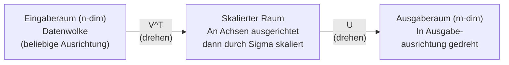

# Singulärwertzerlegung (SVD)

> SVD ist das Schweizer Taschenmesser der linearen Algebra. Jede Matrix hat eine. Jeder Data Scientist braucht eine.

**Typ:** Aufbauen
**Sprachen:** Python, Julia
**Voraussetzungen:** Phase 1, Lektionen 01 (Lineare Algebra – Intuition), 02 (Vektoren & Matrizenoperationen), 03 (Matrizentransformationen)
**Zeit:** ~120 Minuten

## Lernziele

- SVD mittels Potenziteration implementieren und die geometrische Bedeutung von U, Sigma und V^T erklären
- Abgeschnittene SVD für Bildkompression anwenden und das Verhältnis von Kompressionsrate zu Rekonstruktionsfehler messen
- Die Moore-Penrose-Pseudoinverse über SVD berechnen, um überbestimmte Kleinste-Quadrate-Systeme zu lösen
- SVD mit PCA, Empfehlungssystemen (latente Faktoren) und Latenter Semantischer Analyse in NLP verbinden

## Das Problem

Du hast eine 1000×2000-Matrix. Vielleicht sind es Nutzer-Film-Bewertungen. Vielleicht eine Dokument-Term-Häufigkeitstabelle. Vielleicht Pixelwerte eines Bildes. Du musst sie komprimieren, entrauschen, versteckte Strukturen darin finden oder ein Kleinste-Quadrate-System damit lösen. Die Eigenzerlegung funktioniert nur für quadratische Matrizen. Selbst dann erfordert sie, dass die Matrix eine vollständige Menge linear unabhängiger Eigenvektoren hat.

SVD funktioniert für jede Matrix. Beliebige Form. Beliebiger Rang. Keine Bedingungen. Sie zerlegt die Matrix in drei Faktoren, die die Geometrie dessen enthüllen, was die Matrix mit dem Raum macht. Sie ist die allgemeinste und nützlichste Faktorisierung in der gesamten linearen Algebra.

## Das Konzept

### Was SVD geometrisch macht

Jede Matrix, unabhängig von ihrer Form, führt drei Operationen in Folge aus: drehen, skalieren, drehen. SVD macht diese Zerlegung explizit.

```
A = U * Sigma * V^T

      m x n     m x m    m x n    n x n
     (beliebig) (drehen) (skalieren) (drehen)
```

Für jede Matrix A zerlegt SVD sie in:
- V^T dreht Vektoren im Eingaberaum (n-dimensional)
- Sigma skaliert entlang jeder Achse (streckt oder komprimiert)
- U dreht das Ergebnis in den Ausgaberaum (m-dimensional)



### Die vollständige Zerlegung

Für eine Matrix A mit Form m × n:

```
A = U * Sigma * V^T

wobei:
  U     ist m x m, orthogonal (U^T U = I)
  Sigma ist m x n, diagonal (Singulärwerte auf der Diagonale)
  V     ist n x n, orthogonal (V^T V = I)

Die Singulärwerte sigma_1 >= sigma_2 >= ... >= sigma_r > 0
wobei r = Rang(A)
```

Die Spalten von U heißen linke Singulärvektoren. Die Spalten von V heißen rechte Singulärvektoren. Die Diagonaleinträge von Sigma heißen Singulärwerte. Sie sind immer nicht-negativ und werden üblicherweise in absteigender Reihenfolge sortiert.

### Beziehung zur Eigenzerlegung

SVD und Eigenzerlegung sind tief verbunden. Die Singulärwerte und -vektoren von A kommen direkt aus den Eigenwerten und Eigenvektoren von A^T A und A A^T.

```
A^T A = V * Sigma^T * Sigma * V^T = V * D * V^T

Daher:
- Die rechten Singulärvektoren (V) sind Eigenvektoren von A^T A
- Die quadrierten Singulärwerte (sigma_i^2) sind Eigenwerte von A^T A

A A^T = U * Sigma * Sigma^T * U^T

Daher:
- Die linken Singulärvektoren (U) sind Eigenvektoren von A A^T
```

### Abgeschnittene SVD: Niedrigrang-Approximation

Das Eckart-Young-Mirsky-Theorem besagt, dass die beste Rang-k-Approximation an A durch Beibehalten der top k Singulärwerte und ihrer Vektoren erhalten wird:

```
A_k = U_k * Sigma_k * V_k^T

wobei:
  U_k     ist m x k  (erste k Spalten von U)
  Sigma_k ist k x k  (obere linke k x k Teilmatrix von Sigma)
  V_k     ist n x k  (erste k Spalten von V)

Approximationsfehler = sigma_{k+1}  (in Spektralnorm)
```

Das ist nicht nur "eine gute" Approximation. Es ist nachweislich die bestmögliche Approximation von Rang k. Keine andere Rang-k-Matrix ist näher an A.

### Bildkompression mit SVD

Ein Graustufenbild ist eine Matrix von Pixelintensitäten. Ein 800×600-Bild hat 480.000 Werte. SVD ermöglicht eine Approximation mit weit weniger.

```
Originalbild: 800 x 600 = 480.000 Werte

SVD mit Rang k:
  U_k:      800 x k Werte
  Sigma_k:  k Werte
  V_k:      600 x k Werte
  Gesamt:   k * (800 + 600 + 1) = k * 1401 Werte

  k=10:   14.010 Werte   (2,9% des Originals)
  k=50:   70.050 Werte  (14,6% des Originals)
  k=100: 140.100 Werte  (29,2% des Originals)
```

### SVD für Empfehlungssysteme

Der Netflix-Preis hat das berühmt gemacht. Du hast eine Nutzer-Film-Bewertungsmatrix, bei der die meisten Einträge fehlen. Die Idee: diese Bewertungsmatrix hat niedrigen Rang. Nutzer haben keine völlig unabhängigen Geschmäcker. Es gibt eine Handvoll latenter Faktoren (Action vs. Drama, alt vs. neu usw.), die die meisten Präferenzen erklären.

SVD auf der Bewertungsmatrix zerlegt sie in:
- U: Nutzerprofile im latenten Faktorraum
- Sigma: Wichtigkeit jedes latenten Faktors
- V^T: Filmprofile im latenten Faktorraum

### Verbindung zu PCA

PCA IST SVD auf zentrierten Daten. Das ist keine Analogie. Es ist buchstäblich dieselbe Berechnung.

```
Gegeben Datenmatrix X (n_samples x n_features), zentriert:

Kovarianzmatrix: C = (1/(n-1)) * X^T X

X = U * Sigma * V^T    (SVD von X)

X^T X = V * Sigma^2 * V^T

C = (1/(n-1)) * V * Sigma^2 * V^T

Die Hauptkomponenten sind genau die rechten Singulärvektoren V.
Die erklärte Varianz jeder Komponente ist sigma_i^2 / (n-1).
```

## Umsetzung

### Schritt 1: SVD von Grund auf mit Potenziteration

```python
import numpy as np

def power_iteration(M, num_iters=100):
    n = M.shape[1]
    v = np.random.randn(n)
    v = v / np.linalg.norm(v)

    for _ in range(num_iters):
        Mv = M @ v
        v = Mv / np.linalg.norm(Mv)

    eigenvalue = v @ M @ v
    return eigenvalue, v

def svd_from_scratch(A, k=None):
    m, n = A.shape
    if k is None:
        k = min(m, n)

    sigmas = []
    us = []
    vs = []

    A_residual = A.copy().astype(float)

    for _ in range(k):
        AtA = A_residual.T @ A_residual
        eigenvalue, v = power_iteration(AtA, num_iters=200)

        if eigenvalue < 1e-10:
            break

        sigma = np.sqrt(eigenvalue)
        u = A_residual @ v / sigma

        sigmas.append(sigma)
        us.append(u)
        vs.append(v)

        A_residual = A_residual - sigma * np.outer(u, v)

    U = np.column_stack(us) if us else np.empty((m, 0))
    S = np.array(sigmas)
    V = np.column_stack(vs) if vs else np.empty((n, 0))

    return U, S, V
```

### Schritt 2: Vergleich mit NumPy

```python
np.random.seed(42)
A = np.random.randn(5, 4)

U_ours, S_ours, V_ours = svd_from_scratch(A)
U_np, S_np, Vt_np = np.linalg.svd(A, full_matrices=False)

print("Unsere Singulärwerte:", np.round(S_ours, 4))
print("NumPy-Singulärwerte:", np.round(S_np, 4))

A_reconstructed = U_ours @ np.diag(S_ours) @ V_ours.T
print(f"Rekonstruktionsfehler: {np.linalg.norm(A - A_reconstructed):.8f}")
```

### Schritt 3: Bildkompression

```python
def compress_image_svd(image_matrix, k):
    U, S, Vt = np.linalg.svd(image_matrix, full_matrices=False)
    compressed = U[:, :k] @ np.diag(S[:k]) @ Vt[:k, :]
    return compressed

np.random.seed(42)
rows, cols = 200, 300
image = np.random.randn(rows, cols)

for k in [1, 5, 10, 20, 50]:
    compressed = compress_image_svd(image, k)
    error = np.linalg.norm(image - compressed) / np.linalg.norm(image)
    original_size = rows * cols
    compressed_size = k * (rows + cols + 1)
    ratio = compressed_size / original_size
    print(f"k={k:>3d}  Fehler={error:.4f}  Speicher={ratio:.1%}")
```

### Schritt 4: Rauschreduktion

```python
np.random.seed(42)
clean = np.outer(np.sin(np.linspace(0, 4*np.pi, 100)),
                 np.cos(np.linspace(0, 2*np.pi, 80)))
noise = 0.3 * np.random.randn(100, 80)
noisy = clean + noise

U, S, Vt = np.linalg.svd(noisy, full_matrices=False)
denoised = U[:, :5] @ np.diag(S[:5]) @ Vt[:5, :]

print(f"Verrauschter Fehler:    {np.linalg.norm(noisy - clean):.4f}")
print(f"Entrauschter Fehler:    {np.linalg.norm(denoised - clean):.4f}")
print(f"Verbesserung:           {(1 - np.linalg.norm(denoised - clean) / np.linalg.norm(noisy - clean)):.1%}")
```

### Schritt 5: Pseudoinverse

```python
A = np.array([[1, 1], [2, 1], [3, 1]], dtype=float)
b = np.array([3, 5, 6], dtype=float)

U, S, Vt = np.linalg.svd(A, full_matrices=False)
S_inv = np.diag(1.0 / S)
A_pinv = Vt.T @ S_inv @ U.T

x_svd = A_pinv @ b
x_lstsq = np.linalg.lstsq(A, b, rcond=None)[0]
x_pinv = np.linalg.pinv(A) @ b

print(f"SVD Pseudoinverse-Lösung:  {x_svd}")
print(f"np.linalg.lstsq-Lösung:   {x_lstsq}")
print(f"np.linalg.pinv-Lösung:    {x_pinv}")
```

## Übungen

1. Berechne den Rang einer zufälligen 5×3-Matrix mithilfe von SVD (zähle Singulärwerte oberhalb eines Schwellenwerts, z.B. 1e-10). Vergleiche mit `np.linalg.matrix_rank`.

2. Implementiere Latente Semantische Analyse: erstelle eine Term-Dokument-Matrix aus 10 kurzen Sätzen, wende SVD mit Rang 2 an und finde die 3 ähnlichsten Sätze zu einem Abfragesatz mithilfe der Kosinus-Ähnlichkeit in der Niederrangdarstellung.

3. Vergleiche die Konditionszahlen von A und A^T A für eine schlecht konditionierte Matrix (mit weit auseinanderliegenden Singulärwerten). Beobachte, wie das Konditionszahl-Quadrieren die numerische Stabilität beeinträchtigt.

## Schlüsselbegriffe

| Begriff | Was man sagt | Was es wirklich bedeutet |
|---------|-------------|--------------------------|
| SVD | „Singulärwertzerlegung" | A = U Σ V^T: eine Matrix als Komposition von drehen, skalieren, drehen schreiben |
| Singulärvektoren | „Die Eigenvektoren" | Die Spalten von U (links) und V (rechts) – orthonormale Basen für Ausgabe- und Eingaberaum |
| Singulärwerte | „Die Skalierfaktoren" | Die Diagonaleinträge von Sigma – wie stark die Matrix in jede Richtung streckt |
| Abgeschnittene SVD | „Niedrigrang-Approximation" | Nur die top k Singulärwerte behalten – die bestmögliche Rang-k-Approximation |
| Pseudoinverse | „Inverse für nicht-quadratische Matrizen" | A+ = V Sigma+ U^T – löst Kleinste-Quadrate wenn keine exakte Lösung existiert |
| Latente Faktoren | „Versteckte Dimensionen" | Die durch SVD entdeckten Muster – Nutzergeschmäcker, Konzepte in Texten |
