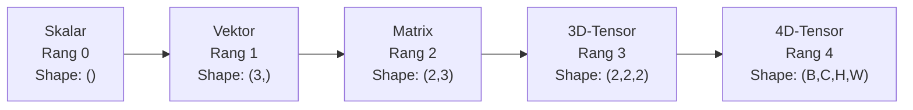
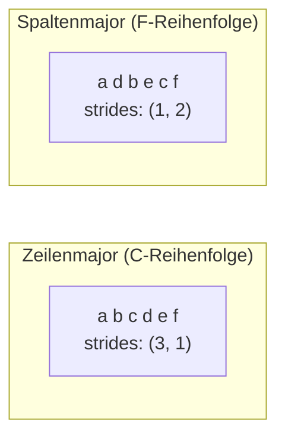
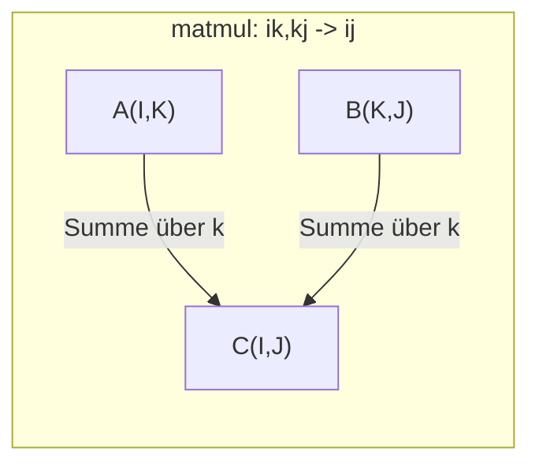

# Tensor-Operationen

> Tensoren sind die gemeinsame Sprache von Daten und Deep Learning. Jedes Bild, jeder Satz und jeder Gradient fließt durch sie.

**Typ:** Aufbauen
**Sprachen:** Python
**Voraussetzungen:** Phase 1, Lektionen 01 (Lineare Algebra – Intuition), 02 (Vektoren, Matrizen & Operationen)
**Zeit:** ~90 Minuten

## Lernziele

- Eine Tensor-Klasse mit Shape, Strides, Reshape, Transpose und elementweisen Operationen von Grund auf implementieren
- Broadcasting-Regeln anwenden, um auf Tensoren unterschiedlicher Shapes ohne Datenkopie zu arbeiten
- Einsum-Ausdrücke für Skalarprodukte, Matrizenmultiplikation, äußere Produkte und Batch-Operationen schreiben
- Die exakten Tensor-Shapes durch jeden Schritt von Multi-Head-Attention nachverfolgen

## Das Problem

Du baust einen Transformer. Der Forward-Pass sieht sauber aus. Du startest ihn und bekommst: `RuntimeError: mat1 and mat2 shapes cannot be multiplied (32x768 and 512x768)`. Du starrst auf die Shapes. Du probierst ein Transpose. Jetzt kommt `Expected 4D input (got 3D input)`. Du fügst ein Unsqueeze ein. Etwas anderes bricht.

Shape-Fehler sind der häufigste Bug in Deep-Learning-Code. Konzeptionell sind sie nicht schwer – jede Operation hat einen Shape-Vertrag –, aber sie vervielfachen sich schnell. Ein Transformer hat Dutzende Reshapes, Transposes und Broadcasts in Ketten. Eine falsche Achse, und der Fehler kaskadiert. Noch schlimmer: Manche Shape-Fehler werfen gar keinen Fehler. Sie erzeugen still Müll, weil entlang der falschen Dimension gebroadcastet oder über die falsche Achse summiert wird.

Matrizen modellieren paarweise Beziehungen zwischen zwei Mengen. Reale Daten passen nicht in zwei Dimensionen. Ein Batch aus 32 RGB-Bildern mit 224x224 ist ein 4D-Tensor: `(32, 3, 224, 224)`. Self-Attention mit 12 Heads ist ebenfalls 4D: `(batch, heads, seq_len, head_dim)`. Du brauchst eine Datenstruktur, die auf beliebig viele Dimensionen verallgemeinert und Operationen bietet, die sauber über alle Dimensionen komponieren. Diese Struktur ist der Tensor. Wenn du seine Operationen beherrschst, werden Shape-Fehler trivial debugbar.

## Das Konzept

### Was ein Tensor ist

Ein Tensor ist ein mehrdimensionales Zahlenarray mit einheitlichem Datentyp. Die Anzahl der Dimensionen ist der **Rang** (oder die **Ordnung**). Jede Dimension ist eine **Achse**. Das **Shape** ist ein Tupel mit den Größen entlang jeder Achse.



Gesamte Elemente = Produkt aller Größen. Ein Shape `(2, 3, 4)` enthält `2 * 3 * 4 = 24` Elemente.

### Tensor-Shapes im Deep Learning

Verschiedene Datentypen entsprechen konventionsgemäß bestimmten Tensor-Shapes.

```mermaid
graph TD
    subgraph Vision
        V1["(B, C, H, W)<br/>32, 3, 224, 224"]
    end
    subgraph NLP
        N1["(B, T, D)<br/>16, 128, 768"]
    end
    subgraph Attention
        A1["(B, H, T, D)<br/>16, 12, 128, 64"]
    end
    subgraph Gewichte
        W1["Linear: (out, in)<br/>Conv2D: (out_c, in_c, kH, kW)<br/>Embedding: (vocab, dim)"]
    end
```



PyTorch nutzt NCHW (channels-first). TensorFlow nutzt standardmäßig NHWC (channels-last). Nicht passende Layouts verursachen stille Verlangsamungen oder Fehler.

### Wie Memory-Layout funktioniert

Ein 2D-Array im Speicher ist eine 1D-Sequenz von Bytes. **Strides** geben an, wie viele Elemente du überspringst, um entlang einer Achse einen Schritt weiterzugehen.



Transpose verschiebt keine Daten. Es vertauscht die Strides und macht den Tensor **nicht zusammenhängend (non-contiguous)** – die Elemente einer Zeile liegen im Speicher nicht mehr nebeneinander.

### Broadcasting-Regeln

Broadcasting erlaubt Operationen auf Tensoren unterschiedlicher Shapes ohne Datenkopie. Richte Shapes von rechts aus. Zwei Dimensionen sind kompatibel, wenn sie gleich sind oder eine von beiden 1 ist. Fehlende Dimensionen werden links mit 1 aufgefüllt.

```
Tensor A:     (8, 1, 6, 1)
Tensor B:        (7, 1, 5)
Padded B:     (1, 7, 1, 5)
Result:       (8, 7, 6, 5)
```

### Einsum: die universelle Tensor-Operation

Die Einstein-Summenkonvention markiert jede Achse mit einem Buchstaben. Achsen, die im Input, aber nicht im Output stehen, werden summiert. Achsen, die in beiden stehen, bleiben erhalten.



Wichtige Muster: `i,i->` (Skalarprodukt), `i,j->ij` (äußeres Produkt), `ii->` (Spur), `ij->ji` (Transpose), `bij,bjk->bik` (Batch-Matmul), `bhtd,bhsd->bhts` (Attention-Scores).

## Umsetzung

Der Code liegt in `code/tensors.py`. Jeder Schritt verweist auf die Implementierung dort.

### Schritt 1: Tensor-Speicher und Strides

Ein Tensor speichert eine flache Liste von Zahlen plus Shape-Metadaten. Strides sagen der Index-Logik, wie mehrdimensionale Indizes auf flache Positionen abgebildet werden.

```python
class Tensor:
    def __init__(self, data, shape=None):
        if isinstance(data, (list, tuple)):
            self._data, self._shape = self._flatten_nested(data)
        elif isinstance(data, np.ndarray):
            self._data = data.flatten().tolist()
            self._shape = tuple(data.shape)
        else:
            self._data = [data]
            self._shape = ()

        if shape is not None:
            total = reduce(lambda a, b: a * b, shape, 1)
            if total != len(self._data):
                raise ValueError(
                    f"Cannot reshape {len(self._data)} elements into shape {shape}"
                )
            self._shape = tuple(shape)

        self._strides = self._compute_strides(self._shape)

    @staticmethod
    def _compute_strides(shape):
        if len(shape) == 0:
            return ()
        strides = [1] * len(shape)
        for i in range(len(shape) - 2, -1, -1):
            strides[i] = strides[i + 1] * shape[i + 1]
        return tuple(strides)
```

Für Shape `(3, 4)` sind die Strides `(4, 1)` – überspringe 4 Elemente für eine neue Zeile, 1 Element für eine neue Spalte.

### Schritt 2: Reshape, Squeeze, Unsqueeze

Reshape ändert das Shape, ohne die Elementreihenfolge zu ändern. Die Gesamtzahl der Elemente muss gleich bleiben. Verwende `-1`, um eine Dimension automatisch abzuleiten.

```python
t = Tensor(list(range(12)), shape=(2, 6))
r = t.reshape((3, 4))
r = t.reshape((-1, 3))
```

Squeeze entfernt Achsen der Größe 1. Unsqueeze fügt eine hinzu. Unsqueeze ist fürs Broadcasting zentral – ein Bias-Vektor `(D,)`, der zu einem Batch `(B, T, D)` addiert wird, muss zu `(1, 1, D)` unsqueezed werden.

```python
t = Tensor(list(range(6)), shape=(1, 3, 1, 2))
s = t.squeeze()
v = Tensor([1, 2, 3])
u = v.unsqueeze(0)
```

### Schritt 3: Transpose und Permute

Transpose vertauscht zwei Achsen. Permute ordnet alle Achsen neu an. So konvertierst du zwischen NCHW und NHWC.

```python
mat = Tensor(list(range(6)), shape=(2, 3))
tr = mat.transpose(0, 1)

t4d = Tensor(list(range(24)), shape=(1, 2, 3, 4))
perm = t4d.permute((0, 2, 3, 1))
```

Nach Transpose oder Permute ist der Tensor im Speicher nicht zusammenhängend. In PyTorch schlägt `view` bei nicht zusammenhängenden Tensoren fehl – nutze `reshape` oder rufe vorher `.contiguous()` auf.

### Schritt 4: Elementweise Operationen und Reduktionen

Elementweise Operationen (addieren, multiplizieren, subtrahieren) arbeiten unabhängig pro Element und erhalten das Shape. Reduktionen (sum, mean, max) reduzieren eine oder mehrere Achsen.

```python
a = Tensor([[1, 2], [3, 4]])
b = Tensor([[10, 20], [30, 40]])
c = a + b
d = a * 2
s = a.sum(axis=0)
```

Global Average Pooling in einem CNN: `(B, C, H, W).mean(axis=[2, 3])` ergibt `(B, C)`. Sequence Mean Pooling in NLP: `(B, T, D).mean(axis=1)` ergibt `(B, D)`.

### Schritt 5: Broadcasting mit NumPy

Die Funktion `demo_broadcasting_numpy()` in `tensors.py` zeigt die Kernmuster.

```python
activations = np.random.randn(4, 3)
bias = np.array([0.1, 0.2, 0.3])
result = activations + bias

images = np.random.randn(2, 3, 4, 4)
scale = np.array([0.5, 1.0, 1.5]).reshape(1, 3, 1, 1)
result = images * scale

a = np.array([1, 2, 3]).reshape(-1, 1)
b = np.array([10, 20, 30, 40]).reshape(1, -1)
outer = a * b
```

Paarweise Distanz via Broadcasting: forme `(M, 2)` zu `(M, 1, 2)` und `(N, 2)` zu `(1, N, 2)` um, subtrahiere, quadriere, summiere über die letzte Achse und ziehe die Wurzel. Ergebnis: `(M, N)`.

### Schritt 6: Einsum-Operationen

Die Funktionen `demo_einsum()` und `demo_einsum_gallery()` führen durch alle gängigen Muster.

```python
a = np.array([1.0, 2.0, 3.0])
b = np.array([4.0, 5.0, 6.0])
dot = np.einsum("i,i->", a, b)

A = np.array([[1, 2], [3, 4], [5, 6]], dtype=float)
B = np.array([[7, 8, 9], [10, 11, 12]], dtype=float)
matmul = np.einsum("ik,kj->ij", A, B)

batch_A = np.random.randn(4, 3, 5)
batch_B = np.random.randn(4, 5, 2)
batch_mm = np.einsum("bij,bjk->bik", batch_A, batch_B)
```

Die Rechenkosten einer Kontraktion sind das Produkt aller Indexgrößen (behalten und summiert). Für `bij,bjk->bik` mit B=32, I=128, J=64, K=128: `32 * 128 * 64 * 128 = 33,554,432` Multiply-Adds.

### Schritt 7: Attention-Mechanismus via Einsum

Die Funktion `demo_attention_einsum()` implementiert Multi-Head-Attention Ende-zu-Ende.

```python
B, H, T, D = 2, 4, 8, 16
E = H * D

X = np.random.randn(B, T, E)
W_q = np.random.randn(E, E) * 0.02

Q = np.einsum("bte,ek->btk", X, W_q)
Q = Q.reshape(B, T, H, D).transpose(0, 2, 1, 3)

scores = np.einsum("bhtd,bhsd->bhts", Q, K) / np.sqrt(D)
weights = softmax(scores, axis=-1)
attn_output = np.einsum("bhts,bhsd->bhtd", weights, V)

concat = attn_output.transpose(0, 2, 1, 3).reshape(B, T, E)
output = np.einsum("bte,ek->btk", concat, W_o)
```

Jeder Schritt ist eine Tensor-Operation: Projektion (Matmul via Einsum), Head-Splitting (Reshape + Transpose), Attention-Scores (Batch-Matmul via Einsum), gewichtete Summe (Batch-Matmul via Einsum), Head-Merging (Transpose + Reshape), Output-Projektion (Matmul via Einsum).

## In der Praxis

### Scratch vs NumPy

| Operation | Scratch (Tensor-Klasse) | NumPy |
|---|---|---|
| Erzeugen | `Tensor([[1,2],[3,4]])` | `np.array([[1,2],[3,4]])` |
| Reshape | `t.reshape((3,4))` | `a.reshape(3,4)` |
| Transpose | `t.transpose(0,1)` | `a.T` or `a.transpose(0,1)` |
| Squeeze | `t.squeeze(0)` | `np.squeeze(a, 0)` |
| Summe | `t.sum(axis=0)` | `a.sum(axis=0)` |
| Einsum | N/A | `np.einsum("ij,jk->ik", a, b)` |

### Scratch vs PyTorch

```python
import torch

t = torch.tensor([[1, 2, 3], [4, 5, 6]], dtype=torch.float32)
t.shape
t.stride()
t.is_contiguous()

t.reshape(3, 2)
t.unsqueeze(0)
t.transpose(0, 1)
t.transpose(0, 1).contiguous()

torch.einsum("ik,kj->ij", A, B)
```

PyTorch ergänzt Autograd, GPU-Support und optimierte BLAS-Kernels. Die Shape-Semantik ist identisch. Wenn du die Scratch-Version verstehst, werden PyTorch-Shape-Fehler lesbar.

### Jede neuronale Netzwerkschicht als Tensor-Operation

| Operation | Tensor-Form | Einsum |
|---|---|---|
| Lineare Schicht | `Y = X @ W.T + b` | `"bd,od->bo"` + Bias |
| Attention QKV | `Q = X @ W_q` | `"btd,dh->bth"` |
| Attention-Scores | `Q @ K.T / sqrt(d)` | `"bhtd,bhsd->bhts"` |
| Attention-Output | `softmax(scores) @ V` | `"bhts,bhsd->bhtd"` |
| Batch-Norm | `(X - mu) / sigma * gamma` | element-wise + broadcast |
| Softmax | `exp(x) / sum(exp(x))` | element-wise + reduction |

## Fertigstellen

Diese Lektion erzeugt zwei wiederverwendbare Prompts:

1. **`outputs/prompt-tensor-shapes.md`** -- Ein systematischer Prompt zum Debuggen von Tensor-Shape-Mismatches. Enthält Entscheidungstabellen für jede häufige Operation (matmul, broadcast, cat, Linear, Conv2d, BatchNorm, softmax) und eine Fix-Nachschlagetabelle.

2. **`outputs/prompt-tensor-debugger.md`** -- Ein Schritt-für-Schritt-Debugging-Prompt, den du in einen KI-Assistenten einfügst, wenn ein Shape-Fehler dich blockiert. Gib Fehlermeldung und Tensor-Shapes an und erhalte den genauen Fix.

## Übungen

1. **Leicht -- Reshape-Roundtrip.** Nimm einen Tensor mit Shape `(2, 3, 4)`. Reshape ihn zu `(6, 4)`, dann zu `(24,)`, dann zurück zu `(2, 3, 4)`. Prüfe bei jedem Schritt per Ausgabe der flachen Daten, dass die Elementreihenfolge gleich bleibt.

2. **Mittel -- Broadcasting implementieren.** Erweitere die `Tensor`-Klasse um eine Methode `broadcast_to(shape)`, die Dimensionen der Größe 1 auf ein Ziel-Shape erweitert. Passe danach `_elementwise_op` so an, dass vor der Operation automatisch gebroadcastet wird. Teste mit Shapes `(3, 1)` und `(1, 4)`, die `(3, 4)` ergeben.

3. **Schwer -- Einsum von Grund auf bauen.** Implementiere eine einfache Funktion `einsum(subscripts, *tensors)`, die mindestens Folgendes unterstützt: Skalarprodukt (`i,i->`), Matrixmultiplikation (`ij,jk->ik`), äußeres Produkt (`i,j->ij`) und Transpose (`ij->ji`). Parse den Subscript-String, identifiziere kontrahierte Indizes und iteriere über alle Indexkombinationen. Vergleiche die Ergebnisse mit `np.einsum`.

4. **Schwer -- Attention-Shape-Tracker.** Schreibe eine Funktion, die `batch_size`, `seq_len`, `embed_dim` und `num_heads` als Input nimmt und in jedem Schritt von Multi-Head-Attention das exakte Shape ausgibt: Input, Q/K/V-Projektion, Head-Split, Attention-Scores, Softmax-Gewichte, gewichtete Summe, Head-Merge, Output-Projektion. Verifiziere gegen die Ausgabe von `demo_attention_einsum()`.

## Schlüsselbegriffe

| Begriff | Was man sagt | Was es wirklich bedeutet |
|---|---|---|
| Tensor | „Eine Matrix mit mehr Dimensionen“ | Ein mehrdimensionales Array mit einheitlichem Typ sowie definiertem Shape, Strides und Operationen |
| Rang | „Die Anzahl der Dimensionen“ | Die Anzahl der Achsen. Eine Matrix hat Rang 2, nicht den mathematischen Matrixrang |
| Shape | „Die Größe des Tensors“ | Ein Tupel mit der Größe entlang jeder Achse. `(2, 3)` bedeutet 2 Zeilen, 3 Spalten |
| Stride | „Wie Speicher angeordnet ist“ | Die Anzahl Elemente, die übersprungen werden, um entlang einer Achse eine Position weiterzugehen |
| Broadcasting | „Das funktioniert einfach bei unterschiedlichen Shapes“ | Ein striktes Regelwerk: von rechts ausrichten, Dimensionen müssen gleich sein oder eine muss 1 sein |
| Contiguous | „Der Tensor ist normal“ | Elemente liegen sequentiell im Speicher, ohne Lücken oder Umordnung gegenüber dem logischen Layout |
| Einsum | „Eine schicke Schreibweise für Matmul“ | Eine allgemeine Notation für Tensor-Kontraktion, äußeres Produkt, Spur oder Transpose in einer Zeile |
| View | „Dasselbe wie Reshape“ | Ein Tensor mit demselben Speicherpuffer, aber anderem Shape/Stride-Metadaten. Scheitert bei nicht zusammenhängenden Daten |
| Kontraktion | „Über einen Index summieren“ | Allgemeine Operation, bei der ein gemeinsamer Index multipliziert und summiert wird und ein Ergebnis mit niedrigerem Rang erzeugt |
| NCHW / NHWC | „PyTorch- vs.-TensorFlow-Format“ | Speicherlayout-Konventionen für Bildtensoren. NCHW setzt Channels vor räumliche Dimensionen, NHWC danach |

## Weiterführende Literatur

- [NumPy Broadcasting](https://numpy.org/doc/stable/user/basics.broadcasting.html) -- Die kanonischen Regeln mit visuellen Beispielen
- [PyTorch Tensor Views](https://pytorch.org/docs/stable/tensor_view.html) -- Wann Views funktionieren und wann sie kopieren
- [einops](https://github.com/arogozhnikov/einops) -- Eine Bibliothek, die Tensor-Reshaping lesbar und sicher macht
- [The Illustrated Transformer](https://jalammar.github.io/illustrated-transformer/) -- Visualisiert Tensor-Shapes im Attention-Flow
- [Einstein Summation in NumPy](https://numpy.org/doc/stable/reference/generated/numpy.einsum.html) -- Vollständige Einsum-Dokumentation mit Beispielen
