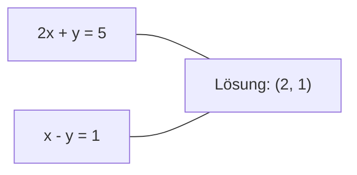
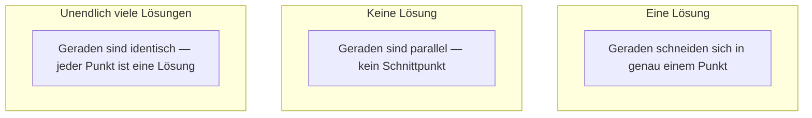

# Lineare Systeme

> Ax = b zu lösen ist das älteste Problem der Mathematik, das noch immer dein neuronales Netz antreibt.

**Typ:** Build
**Sprache:** Python
**Voraussetzungen:** Phase 1, Lektionen 01 (Lineare Algebra Intuition), 02 (Vektoren & Matrizen), 03 (Matrixtransformationen)
**Zeit:** ~120 Minuten

## Lernziele

- Ax = b mit Gauß-Elimination inklusive partieller Pivotisierung und Rückwärtseinsetzen lösen
- Matrizen mit LU-, QR- und Cholesky-Zerlegung faktorisieren und erklären, wann welche Methode passt
- Die Normalgleichungen für kleinste Quadrate herleiten und mit linearer sowie Ridge-Regression verknüpfen
- Schlecht konditionierte Systeme über die Konditionszahl erkennen und mit Regularisierung stabilisieren

## Das Problem

Jedes Mal, wenn du eine lineare Regression trainierst, löst du ein lineares System. Jedes Mal, wenn du einen Least-Squares-Fit berechnest, löst du ein lineares System. Jedes Mal, wenn eine Schicht im neuronalen Netz `y = Wx + b` berechnet, wertet sie eine Seite eines linearen Systems aus. Mit Regularisierung veränderst du das System. Bei Gauß-Prozessen faktorisierst du eine Matrix. Wenn du eine Kovarianzmatrix für die Mahalanobis-Distanz invertierst, löst du ein lineares System.

Die Gleichung Ax = b taucht überall auf. A ist eine Matrix bekannter Koeffizienten. b ist ein Vektor bekannter Ausgaben. x ist der gesuchte Vektor der Unbekannten. In der linearen Regression ist A deine Datenmatrix, b dein Zielvektor und x der Gewichtsvektor. Das ganze Modell reduziert sich auf: Finde x so, dass Ax möglichst nah an b liegt.

In dieser Lektion baust du alle wichtigen Verfahren zur Lösung dieser Gleichung von Grund auf. Du verstehst, warum manche Methoden schnell und andere stabil sind, warum einige nur für quadratische Systeme funktionieren und andere überbestimmte Systeme abdecken, und warum die Konditionszahl deiner Matrix entscheidet, ob dein Ergebnis überhaupt etwas bedeutet.

## Das Konzept

### Was Ax = b geometrisch bedeutet

Ein System linearer Gleichungen hat eine geometrische Interpretation. Jede Gleichung definiert eine Hyperebene. Die Lösung ist der Punkt (oder die Punktmenge), in dem sich alle Hyperebenen schneiden.

```
2x + y = 5          Two lines in 2D.
x - y  = 1          They intersect at x=2, y=1.
```



Drei Dinge können passieren:



In Matrixform bedeutet „eine Lösung“, dass A invertierbar ist. „Keine Lösung“ heißt, das System ist inkonsistent. „Unendlich viele Lösungen“ heißt, A hat einen Nullraum. Die meisten ML-Probleme fallen in die Kategorie „keine exakte Lösung“, weil es mehr Gleichungen (Datenpunkte) als Unbekannte (Parameter) gibt. Genau hier kommen kleinste Quadrate ins Spiel.

### Spaltenbild vs. Zeilenbild

Es gibt zwei Arten, Ax = b zu lesen.

**Zeilenbild.** Jede Zeile von A definiert eine Gleichung. Jede Gleichung ist eine Hyperebene. Die Lösung ist ihr gemeinsamer Schnittpunkt.

**Spaltenbild.** Jede Spalte von A ist ein Vektor. Die Frage lautet dann: Welche Linearkombination der Spalten von A ergibt b?

```
A = | 2  1 |    b = | 5 |
    | 1 -1 |        | 1 |

Row picture: solve 2x + y = 5 and x - y = 1 simultaneously.

Column picture: find x1, x2 such that:
  x1 * [2, 1] + x2 * [1, -1] = [5, 1]
  2 * [2, 1] + 1 * [1, -1] = [4+1, 2-1] = [5, 1]   check.
```

Das Spaltenbild ist grundlegender. Liegt b im Spaltenraum von A, hat das System eine Lösung. Liegt b nicht darin, suchst du den nächstliegenden Punkt im Spaltenraum. Dieser Punkt ist die Least-Squares-Lösung.

### Gauß-Elimination

Die Gauß-Elimination transformiert Ax = b in ein oberes Dreieckssystem Ux = c, das du per Rückwärtseinsetzen löst. Es ist das direkteste Verfahren.

Der Algorithmus:

```
1. For each column k (the pivot column):
   a. Find the largest entry in column k at or below row k (partial pivoting).
   b. Swap that row with row k.
   c. For each row i below k:
      - Compute multiplier m = A[i][k] / A[k][k]
      - Subtract m times row k from row i.
2. Back substitute: solve from the last equation upward.
```

Beispiel:

```
Original:
| 2  1  1 | 8 |       R2 = R2 - (2)R1     | 2  1   1 |  8 |
| 4  3  3 |20 |  -->  R3 = R3 - (1)R1 --> | 0  1   1 |  4 |
| 2  3  1 |12 |                            | 0  2   0 |  4 |

                       R3 = R3 - (2)R2     | 2  1   1 |  8 |
                                       --> | 0  1   1 |  4 |
                                           | 0  0  -2 | -4 |

Back substitute:
  -2 * x3 = -4    -->  x3 = 2
  x2 + 2  = 4     -->  x2 = 2
  2*x1 + 2 + 2 = 8 --> x1 = 2
```

Die Gauß-Elimination kostet O(n^3) Operationen. Für ein 1000x1000-System sind das etwa eine Milliarde Fließkommaoperationen. Schnell, aber wenn du mehrere Systeme mit derselben Matrix A lösen musst, geht es besser.

### Partielle Pivotisierung: warum sie wichtig ist

Ohne Pivotisierung kann die Gauß-Elimination scheitern oder Müll liefern. Ist ein Pivot-Element null, teilst du durch null. Ist es sehr klein, verstärkst du Rundungsfehler.

```
Bad pivot:                       With partial pivoting:
| 0.001  1 | 1.001 |            Swap rows first:
| 1      1 | 2     |            | 1      1 | 2     |
                                 | 0.001  1 | 1.001 |
m = 1/0.001 = 1000              m = 0.001/1 = 0.001
R2 = R2 - 1000*R1               R2 = R2 - 0.001*R1
| 0.001  1     | 1.001   |      | 1      1     | 2     |
| 0     -999   | -999.0  |      | 0      0.999 | 0.999 |

x2 = 1.000 (correct)            x2 = 1.000 (correct)
x1 = (1.001 - 1)/0.001          x1 = (2 - 1)/1 = 1.000 (correct)
   = 0.001/0.001 = 1.000        Stable because the multiplier is small.
```

In Fließkommaarithmetik mit begrenzter Präzision kann die Variante ohne Pivotisierung signifikante Stellen verlieren. Partielle Pivotisierung wählt immer den größten verfügbaren Pivot, um Fehlerverstärkung zu minimieren.

### LU-Zerlegung

Die LU-Zerlegung faktorisiert A in eine untere Dreiecksmatrix L und eine obere Dreiecksmatrix U: A = LU. L speichert die Multiplikatoren aus der Gauß-Elimination. U ist das Ergebnis der Elimination.

```
A = L @ U

| 2  1  1 |   | 1  0  0 |   | 2  1   1 |
| 4  3  3 | = | 2  1  0 | @ | 0  1   1 |
| 2  3  1 |   | 1  2  1 |   | 0  0  -2 |
```

Warum faktorisieren statt direkt eliminieren? Sobald du L und U hast, kostet das Lösen von Ax = b für jedes neue b nur O(n^2):

```
Ax = b
LUx = b
Let y = Ux:
  Ly = b    (forward substitution, O(n^2))
  Ux = y    (back substitution, O(n^2))
```

Die O(n^3)-Kosten zahlst du einmal bei der Faktorisierung. Jede weitere Lösung kostet O(n^2). Wenn du 1000 Systeme mit derselben A, aber unterschiedlichen b-Vektoren lösen musst, spart LU insgesamt etwa den Faktor 1000/3.

Mit partieller Pivotisierung erhältst du PA = LU, wobei P eine Permutationsmatrix ist, die die Zeilentausche speichert.

### QR-Zerlegung

Die QR-Zerlegung faktorisiert A in eine orthogonale Matrix Q und eine obere Dreiecksmatrix R: A = QR.

Eine orthogonale Matrix hat die Eigenschaft Q^T Q = I. Ihre Spalten sind orthonormale Vektoren. Multiplikation mit Q erhält Längen und Winkel.

```
A = Q @ R

Q has orthonormal columns: Q^T Q = I
R is upper triangular

To solve Ax = b:
  QRx = b
  Rx = Q^T b    (just multiply by Q^T, no inversion needed)
  Back substitute to get x.
```

QR ist für Least-Squares-Probleme numerisch stabiler als LU. Der Gram-Schmidt-Prozess baut Q Spalte für Spalte auf:

```
Given columns a1, a2, ... of A:

q1 = a1 / ||a1||

q2 = a2 - (a2 . q1) * q1        (subtract projection onto q1)
q2 = q2 / ||q2||                (normalize)

q3 = a3 - (a3 . q1) * q1 - (a3 . q2) * q2
q3 = q3 / ||q3||

R[i][j] = qi . aj    for i <= j
```

Jeder Schritt entfernt den Anteil entlang aller vorherigen q-Vektoren und lässt nur die neue orthogonale Richtung übrig.

### Cholesky-Zerlegung

Wenn A symmetrisch ist (A = A^T) und positiv definit (alle Eigenwerte positiv), kannst du A als A = L L^T faktorisieren, wobei L untere Dreiecksmatrix ist. Das ist die Cholesky-Zerlegung.

```
A = L @ L^T

| 4  2 |   | 2  0 |   | 2  1 |
| 2  5 | = | 1  2 | @ | 0  2 |

L[i][i] = sqrt(A[i][i] - sum(L[i][k]^2 for k < i))
L[i][j] = (A[i][j] - sum(L[i][k]*L[j][k] for k < j)) / L[j][j]    for i > j
```

Cholesky ist doppelt so schnell wie LU und braucht nur halb so viel Speicher. Es funktioniert nur für symmetrische positiv definite Matrizen, aber die kommen ständig vor:

- Kovarianzmatrizen sind symmetrisch positiv semidefinit (mit Regularisierung positiv definit).
- Die Kernelmatrix bei Gauß-Prozessen ist symmetrisch positiv definit.
- Die Hesse-Matrix einer konvexen Funktion am Minimum ist symmetrisch positiv definit.
- A^T A ist immer symmetrisch positiv semidefinit.

Bei Gauß-Prozessen faktorisiert man die Kernelmatrix K mit Cholesky und löst dann K alpha = y für den prädiktiven Mittelwert. Der Cholesky-Faktor liefert auch die Log-Determinante für die marginale Likelihood: log det(K) = 2 * sum(log(diag(L))).

### Kleinste Quadrate: wenn Ax = b keine exakte Lösung hat

Wenn A m x n mit m > n ist (mehr Gleichungen als Unbekannte), ist das System überbestimmt. Es gibt keine exakte Lösung. Stattdessen minimierst du den quadratischen Fehler:

```
minimize ||Ax - b||^2

This is the sum of squared residuals:
  sum((A[i,:] @ x - b[i])^2 for i in range(m))
```

Der Minimierer erfüllt die Normalgleichungen:

```
A^T A x = A^T b
```

Herleitung: Entwickle ||Ax - b||^2 = (Ax - b)^T (Ax - b) = x^T A^T A x - 2 x^T A^T b + b^T b. Bilde den Gradienten nach x und setze ihn auf null: 2 A^T A x - 2 A^T b = 0.

```
Original system (overdetermined, 4 equations, 2 unknowns):
| 1  1 |         | 3 |
| 1  2 | x     = | 5 |       No exact x satisfies all 4 equations.
| 1  3 |         | 6 |
| 1  4 |         | 8 |

Normal equations:
A^T A = | 4  10 |    A^T b = | 22 |
        | 10 30 |            | 63 |

Solve: x = [1.5, 1.7]

This is linear regression. x[0] is the intercept, x[1] is the slope.
```

### Normalgleichungen = lineare Regression

Die Verbindung ist exakt. In der linearen Regression hat deine Datenmatrix X eine Zeile pro Sample und eine Spalte pro Feature. Dein Zielvektor y hat einen Eintrag pro Sample. Der Gewichtsvektor w erfüllt:

```
X^T X w = X^T y
w = (X^T X)^(-1) X^T y
```

Das ist die geschlossene Lösung der linearen Regression. Jeder Aufruf von `sklearn.linear_model.LinearRegression.fit()` berechnet das (oder ein äquivalentes Verfahren über QR oder SVD).

Fügst du einen Regularisierungsterm lambda * I zur Matrix hinzu, erhältst du Ridge-Regression:

```
(X^T X + lambda * I) w = X^T y
w = (X^T X + lambda * I)^(-1) X^T y
```

Die Regularisierung macht die Matrix besser konditioniert (genauer invertierbar) und verhindert Overfitting, indem die Gewichte in Richtung null gezogen werden. Die Matrix X^T X + lambda * I ist bei lambda > 0 immer symmetrisch positiv definit, daher kannst du sie mit Cholesky lösen.

### Pseudoinverse (Moore-Penrose)

Die Pseudoinverse A+ verallgemeinert die Matrixinversion auf nicht-quadratische und singuläre Matrizen. Für jede Matrix A gilt:

```
x = A+ b

where A+ = V Sigma+ U^T    (computed via SVD)
```

Sigma+ entsteht, indem man zu jedem von null verschiedenen Singulärwert den Kehrwert nimmt und das Ergebnis transponiert. Wenn A = U Sigma V^T, dann A+ = V Sigma+ U^T.

```
A = U Sigma V^T        (SVD)

Sigma = | 5  0 |       Sigma+ = | 1/5  0  0 |
        | 0  2 |                | 0  1/2  0 |
        | 0  0 |

A+ = V Sigma+ U^T
```

Die Pseudoinverse liefert die Least-Squares-Lösung mit minimaler Norm. Wenn das System:
- eine Lösung hat: liefert A+ b genau diese.
- keine Lösung hat: liefert A+ b die Least-Squares-Lösung.
- unendlich viele Lösungen hat: liefert A+ b die mit kleinstem ||x||.

NumPys `np.linalg.lstsq` und `np.linalg.pinv` verwenden intern beide die SVD.

### Konditionszahl

Die Konditionszahl misst, wie empfindlich die Lösung auf kleine Änderungen am Input reagiert. Für eine Matrix A lautet die Konditionszahl:

```
kappa(A) = ||A|| * ||A^(-1)|| = sigma_max / sigma_min
```

wobei sigma_max und sigma_min der größte bzw. kleinste Singulärwert sind.

```
Well-conditioned (kappa ~ 1):        Ill-conditioned (kappa ~ 10^15):
Small change in b -->                Small change in b -->
small change in x                    huge change in x

| 2  0 |   kappa = 2/1 = 2          | 1   1          |   kappa ~ 10^15
| 0  1 |   safe to solve            | 1   1+10^(-15) |   solution is garbage
```

Faustregeln:
- kappa < 100: sicher, Lösung ist präzise.
- kappa ~ 10^k: du verlierst etwa k Stellen Präzision durch Fließkommaarithmetik.
- kappa ~ 10^16 (bei float64): die Lösung ist bedeutungslos. Die Matrix ist effektiv singulär.

In ML tritt schlechte Konditionierung auf, wenn Features nahezu kollinear sind. Regularisierung (lambda * I addieren) verbessert die Konditionszahl von sigma_max / sigma_min zu (sigma_max + lambda) / (sigma_min + lambda).

### Iterative Verfahren: Conjugate Gradient

Für sehr große dünn besetzte Systeme (Millionen Unbekannte) sind direkte Verfahren wie LU oder Cholesky zu teuer. Iterative Verfahren nähern die Lösung an, indem sie einen Schätzwert über viele Iterationen verbessern.

Conjugate Gradient (CG) löst Ax = b, wenn A symmetrisch positiv definit ist. In exakter Arithmetik findet es die exakte Lösung in höchstens n Iterationen, konvergiert aber oft deutlich schneller, wenn die Eigenwerte von A gebündelt sind.

```
Algorithm sketch:
  x0 = initial guess (often zero)
  r0 = b - A x0           (residual)
  p0 = r0                 (search direction)

  For k = 0, 1, 2, ...:
    alpha = (rk . rk) / (pk . A pk)
    x_{k+1} = xk + alpha * pk
    r_{k+1} = rk - alpha * A pk
    beta = (r_{k+1} . r_{k+1}) / (rk . rk)
    p_{k+1} = r_{k+1} + beta * pk
    if ||r_{k+1}|| < tolerance: stop
```

CG wird genutzt für:
- großskalige Optimierung (Newton-CG)
- das Lösen diskretisierter PDEs
- Kernelmethoden, wenn die Kernelmatrix zu groß zum Faktorisieren ist
- Preconditioning für andere iterative Löser

Die Konvergenzrate hängt von der Konditionszahl ab. Besser konditionierte Systeme konvergieren schneller – ein weiterer Grund, warum Regularisierung hilft.

### Das Gesamtbild: welche Methode wann

| Methode | Anforderungen | Kosten | Einsatzfall |
|--------|-------------|------|----------|
| Gauß-Elimination | Quadratische, nicht-singuläre A | O(n^3) | Einmaliges Lösen eines quadratischen Systems |
| LU-Zerlegung | Quadratische, nicht-singuläre A | O(n^3) Faktorisierung + O(n^2) Lösen | Mehrere Lösungen mit derselben A |
| QR-Zerlegung | Beliebige A (m >= n) | O(mn^2) | Kleinste Quadrate, numerisch stabil |
| Cholesky | Symmetrisch positiv definite A | O(n^3/3) | Kovarianzmatrizen, Gauß-Prozesse, Ridge-Regression |
| Normalgleichungen | Überbestimmt (m > n) | O(mn^2 + n^3) | Lineare Regression (kleines n) |
| SVD / Pseudoinverse | Beliebige A | O(mn^2) | Rangdefiziente Systeme, Lösungen minimaler Norm |
| Conjugate Gradient | Symmetrisch positiv definit, dünn besetzte A | O(n * k * nnz) | Große dünn besetzte Systeme, k = Iterationen |

### Verbindung zu ML

Jede Methode dieser Lektion taucht in produktivem ML auf:

**Lineare Regression.** Die geschlossene Lösung löst die Normalgleichungen X^T X w = X^T y. Das geschieht über Cholesky (wenn n klein ist), QR (wenn numerische Stabilität wichtig ist) oder SVD (wenn die Matrix rangdefizient sein kann).

**Ridge-Regression.** Fügt lambda * I zu X^T X hinzu. Das regularisierte System (X^T X + lambda * I) w = X^T y ist bei lambda > 0 immer per Cholesky lösbar, weil X^T X + lambda * I symmetrisch positiv definit ist.

**Gauß-Prozesse.** Für den prädiktiven Mittelwert muss K alpha = y gelöst werden, wobei K die Kernelmatrix ist. Cholesky-Faktorisierung von K ist der Standard. Die log-marginale Likelihood nutzt log det(K) = 2 sum(log(diag(L))).

**Initialisierung neuronaler Netze.** Orthogonale Initialisierung nutzt QR-Zerlegung, um Gewichtsmatrizen mit orthonormalen Spalten zu erzeugen. Das verhindert Signal-Kollaps in tiefen Netzen.

**Preconditioning.** Großskalige Optimierer nutzen unvollständige Cholesky- oder unvollständige LU-Zerlegung als Präkonditionierer für Conjugate-Gradient-Löser.

**Feature Engineering.** Die Konditionszahl von X^T X zeigt, ob deine Features kollinear sind. Ist kappa groß, entferne Features oder füge Regularisierung hinzu.

## Baue es

### Schritt 1: Gauß-Elimination mit partieller Pivotisierung

```python
import numpy as np

def gaussian_elimination(A, b):
    n = len(b)
    Ab = np.hstack([A.astype(float), b.reshape(-1, 1).astype(float)])

    for k in range(n):
        max_row = k + np.argmax(np.abs(Ab[k:, k]))
        Ab[[k, max_row]] = Ab[[max_row, k]]

        if abs(Ab[k, k]) < 1e-12:
            raise ValueError(f"Matrix is singular or nearly singular at pivot {k}")

        for i in range(k + 1, n):
            m = Ab[i, k] / Ab[k, k]
            Ab[i, k:] -= m * Ab[k, k:]

    x = np.zeros(n)
    for i in range(n - 1, -1, -1):
        x[i] = (Ab[i, -1] - Ab[i, i+1:n] @ x[i+1:n]) / Ab[i, i]

    return x
```

### Schritt 2: LU-Zerlegung

```python
def lu_decompose(A):
    n = A.shape[0]
    L = np.eye(n)
    U = A.astype(float).copy()
    P = np.eye(n)

    for k in range(n):
        max_row = k + np.argmax(np.abs(U[k:, k]))
        if max_row != k:
            U[[k, max_row]] = U[[max_row, k]]
            P[[k, max_row]] = P[[max_row, k]]
            if k > 0:
                L[[k, max_row], :k] = L[[max_row, k], :k]

        for i in range(k + 1, n):
            L[i, k] = U[i, k] / U[k, k]
            U[i, k:] -= L[i, k] * U[k, k:]

    return P, L, U

def lu_solve(P, L, U, b):
    n = len(b)
    Pb = P @ b.astype(float)

    y = np.zeros(n)
    for i in range(n):
        y[i] = Pb[i] - L[i, :i] @ y[:i]

    x = np.zeros(n)
    for i in range(n - 1, -1, -1):
        x[i] = (y[i] - U[i, i+1:] @ x[i+1:]) / U[i, i]

    return x
```

### Schritt 3: Cholesky-Zerlegung

```python
def cholesky(A):
    n = A.shape[0]
    L = np.zeros_like(A, dtype=float)

    for i in range(n):
        for j in range(i + 1):
            s = A[i, j] - L[i, :j] @ L[j, :j]
            if i == j:
                if s <= 0:
                    raise ValueError("Matrix is not positive definite")
                L[i, j] = np.sqrt(s)
            else:
                L[i, j] = s / L[j, j]

    return L
```

### Schritt 4: Kleinste Quadrate über Normalgleichungen

```python
def least_squares_normal(A, b):
    AtA = A.T @ A
    Atb = A.T @ b
    return gaussian_elimination(AtA, Atb)

def ridge_regression(A, b, lam):
    n = A.shape[1]
    AtA = A.T @ A + lam * np.eye(n)
    Atb = A.T @ b
    L = cholesky(AtA)
    y = np.zeros(n)
    for i in range(n):
        y[i] = (Atb[i] - L[i, :i] @ y[:i]) / L[i, i]
    x = np.zeros(n)
    for i in range(n - 1, -1, -1):
        x[i] = (y[i] - L.T[i, i+1:] @ x[i+1:]) / L.T[i, i]
    return x
```

### Schritt 5: Konditionszahl

```python
def condition_number(A):
    U, S, Vt = np.linalg.svd(A)
    return S[0] / S[-1]
```

## Verwenden

Alle Bausteine zusammen für lineare Regression und Ridge-Regression auf echten Daten:

```python
np.random.seed(42)
X_raw = np.random.randn(100, 3)
w_true = np.array([2.0, -1.0, 0.5])
y = X_raw @ w_true + np.random.randn(100) * 0.1

X = np.column_stack([np.ones(100), X_raw])

w_ols = least_squares_normal(X, y)
print(f"OLS weights (ours):    {w_ols}")

w_np = np.linalg.lstsq(X, y, rcond=None)[0]
print(f"OLS weights (numpy):   {w_np}")
print(f"Max difference: {np.max(np.abs(w_ols - w_np)):.2e}")

w_ridge = ridge_regression(X, y, lam=1.0)
print(f"Ridge weights (ours):  {w_ridge}")

from sklearn.linear_model import Ridge
ridge_sk = Ridge(alpha=1.0, fit_intercept=False)
ridge_sk.fit(X, y)
print(f"Ridge weights (sklearn): {ridge_sk.coef_}")
```

## Abschließen

Diese Lektion liefert:
- `code/linear_systems.py` mit Implementierungen von Gauß-Elimination, LU-Zerlegung, Cholesky-Zerlegung, kleinsten Quadraten und Ridge-Regression von Grund auf
- Eine funktionierende Demonstration, dass Normalgleichungen und sklearns `LinearRegression` dieselben Gewichte ergeben

## Übungen

1. Löse das System `[[1,2,3],[4,5,6],[7,8,10]] x = [6, 15, 27]` mit deiner Gauß-Elimination, deinem LU-Löser und `np.linalg.solve`. Prüfe, dass alle drei innerhalb der Fließkommatoleranz dieselbe Antwort liefern.

2. Erzeuge eine zufällige 50x5-Matrix X und ein Ziel y = X @ w_true + noise. Löse w über Normalgleichungen, QR (via `np.linalg.qr`), SVD (via `np.linalg.svd`) und `np.linalg.lstsq`. Vergleiche alle vier Lösungen. Miss die Konditionszahl von X^T X und erkläre, wie sie beeinflusst, welcher Methode du vertraust.

3. Erzeuge eine nahezu singuläre Matrix, indem du zwei Spalten fast identisch machst (z. B. Spalte 2 = Spalte 1 + 1e-10 * noise). Berechne ihre Konditionszahl. Löse Ax = b mit und ohne Regularisierung (addiere 0.01 * I). Vergleiche Lösungen und Residuen. Erkläre, warum Regularisierung hilft.

4. Implementiere den Conjugate-Gradient-Algorithmus für eine zufällige symmetrisch positiv definite 100x100-Matrix. Zähle, wie viele Iterationen bis zur Toleranz 1e-8 nötig sind. Vergleiche mit dem theoretischen Maximum von n Iterationen.

5. Messe die Laufzeit deines Cholesky-Lösers vs. deines LU-Lösers vs. `np.linalg.solve` auf symmetrisch positiv definiten Matrizen der Größe 10, 50, 200, 500. Plotte die Ergebnisse. Verifiziere, dass Cholesky ungefähr 2x schneller als LU ist.

## Schlüsselbegriffe

| Begriff | Was man sagt | Was es tatsächlich bedeutet |
|------|----------------|----------------------|
| Lineares System | „Löse nach x auf“ | Eine Menge linearer Gleichungen Ax = b. x zu finden heißt, den Input zu finden, der unter Transformation A den Output b erzeugt. |
| Gauß-Elimination | „Zeilenstufenform bilden“ | Einträge unter der Diagonalen systematisch mit Zeilenoperationen zu null machen, bis ein oberes Dreieckssystem entsteht, das per Rückwärtseinsetzen lösbar ist. O(n^3). |
| Partielle Pivotisierung | „Für Stabilität Zeilen tauschen“ | Vor der Elimination in Spalte k wird die Zeile mit dem größten Absolutwert in dieser Spalte auf die Pivotposition getauscht. Verhindert Division durch kleine Zahlen. |
| LU-Zerlegung | „In Dreiecksmatrizen faktorisieren“ | Schreibe A = LU, wobei L untere Dreiecksmatrix (speichert Multiplikatoren) und U obere Dreiecksmatrix (eliminiertes System) ist. Verteilt die O(n^3)-Kosten auf viele Lösungen. |
| QR-Zerlegung | „Orthogonale Faktorisierung“ | Schreibe A = QR, wobei Q orthonormale Spalten hat und R obere Dreiecksmatrix ist. Für kleinste Quadrate stabiler als LU. |
| Cholesky-Zerlegung | „Quadratwurzel einer Matrix“ | Für symmetrisch positiv definite A: A = LL^T. Halbe Kosten von LU. Genutzt für Kovarianzmatrizen, Kernelmatrizen und Ridge-Regression. |
| Kleinste Quadrate | „Bester Fit, wenn exakt unmöglich“ | Minimiere die Summe quadrierter Residuen ||Ax - b||^2, wenn das System überbestimmt ist (mehr Gleichungen als Unbekannte). |
| Normalgleichungen | „Abkürzung über Analysis“ | A^T A x = A^T b. Entsteht durch Nullsetzen des Gradienten von ||Ax - b||^2. Das IST die geschlossene Lösung der linearen Regression. |
| Pseudoinverse | „Inversion für nicht-quadratische Matrizen“ | A+ = V Sigma+ U^T via SVD. Liefert für jede Matrix (quadratisch/rechteckig, singulär/nicht singulär) die Least-Squares-Lösung minimaler Norm. |
| Konditionszahl | „Wie verlässlich ist das Ergebnis“ | kappa = sigma_max / sigma_min. Misst Empfindlichkeit gegenüber Input-Störungen. Du verlierst etwa log10(kappa) Stellen Präzision. |
| Ridge-Regression | „Regularisierte kleinste Quadrate“ | Löse (X^T X + lambda I) w = X^T y. Das zusätzliche lambda I verbessert die Konditionierung und schrumpft Gewichte Richtung null. Verhindert Overfitting. |
| Conjugate Gradient | „Iteratives Ax=b für große Matrizen“ | Iterativer Löser für symmetrisch positiv definite Systeme. Konvergiert in höchstens n Schritten. Praktisch für große dünn besetzte Systeme, bei denen Faktorisierung zu teuer ist. |
| Überbestimmtes System | „Mehr Daten als Parameter“ | m > n in einem m-mal-n-System. Es gibt keine exakte Lösung. Kleinste Quadrate liefern die beste Näherung. Das ist jedes Regressionsproblem. |
| Rückwärtseinsetzen | „Von unten nach oben lösen“ | Bei einem oberen Dreieckssystem zuerst die letzte Gleichung lösen und dann rückwärts einsetzen. O(n^2). |
| Vorwärtseinsetzen | „Von oben nach unten lösen“ | Bei einem unteren Dreieckssystem zuerst die erste Gleichung lösen und dann vorwärts einsetzen. O(n^2). Wird im L-Schritt bei LU verwendet. |

## Weiterführende Literatur

- [MIT 18.06: Linear Algebra](https://ocw.mit.edu/courses/18-06-linear-algebra-spring-2010/) (Gilbert Strang) -- der maßgebliche Kurs zu linearen Systemen und Matrixfaktorisierungen
- [Numerical Linear Algebra](https://people.maths.ox.ac.uk/trefethen/text.html) (Trefethen & Bau) -- die Standardreferenz für numerische Stabilität, Konditionierung und warum Algorithmen scheitern
- [Matrix Computations](https://www.cs.cornell.edu/cv/GolubVanLoan4/golubandvanloan.htm) (Golub & Van Loan) -- die enzyklopädische Referenz für Matrixalgorithmen
- [3Blue1Brown: Inverse Matrices](https://www.3blue1brown.com/lessons/inverse-matrices) -- visuelle Intuition dafür, was Ax = b geometrisch bedeutet
