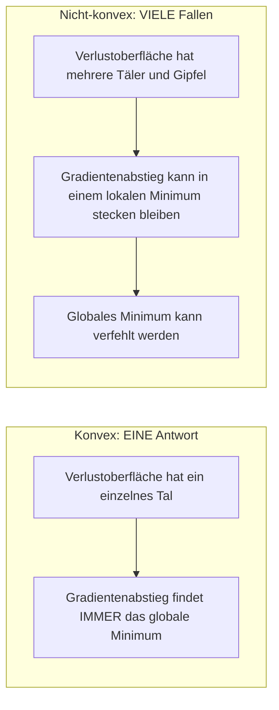
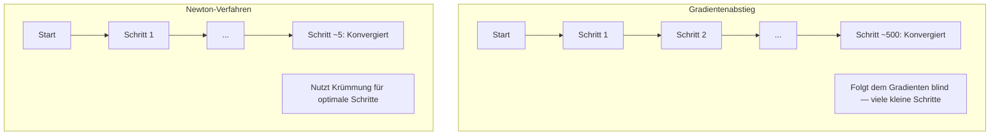
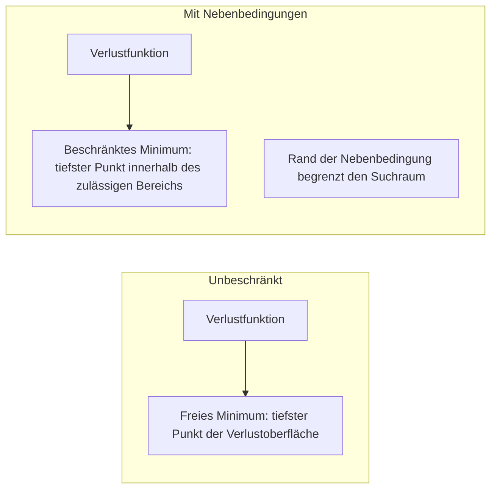
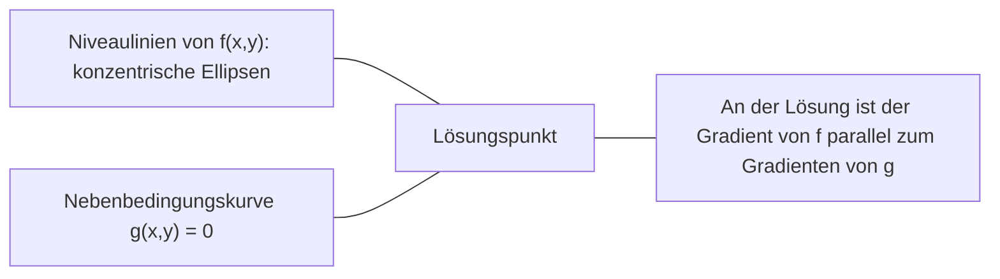

# Konvexe Optimierung

> Konvexe Probleme haben ein Tal. Neuronale Netze haben Millionen. Den Unterschied zu kennen, ist entscheidend.

**Typ:** Aufbauen
**Sprache:** Python
**Voraussetzungen:** Phase 1, Lektionen 04 (Analysis für ML), 08 (Optimierung)
**Zeit:** ~90 Minuten

## Lernziele

- Prüfen, ob eine Funktion konvex ist, mit Definition, zweiter Ableitung und Hesse-Matrix-Kriterien
- Das Newton-Verfahren implementieren und seine quadratische Konvergenz mit Gradientenabstieg vergleichen
- Optimierungsprobleme mit Nebenbedingungen per Lagrange-Multiplikatoren lösen und KKT-Bedingungen interpretieren
- Erklären, warum Verlustlandschaften neuronaler Netze nicht konvex sind und SGD trotzdem gute Lösungen findet

## Das Problem

Lektion 08 hat dir Gradientenabstieg, Momentum und Adam beigebracht. Diese Optimierer gehen auf jeder Oberfläche bergab. Aber sie kommen ohne Garantien. Gradientenabstieg auf einer nicht-konvexen Landschaft kann in einem schlechten lokalen Minimum landen, an einem Sattelpunkt hängen bleiben oder ewig oszillieren. Du hast ihn trotzdem verwendet, weil neuronale Netze nicht-konvex sind und es keine Alternative gibt.

Aber viele Probleme im maschinellen Lernen sind konvex. Lineare Regression, logistische Regression, SVMs, LASSO, Ridge-Regression. Dafür gibt es etwas Stärkeres: Optimierung mit mathematischen Garantien. Ein konvexes Problem hat genau ein Tal. Jeder Algorithmus, der bergab geht, erreicht das globale Minimum. Keine Restarts nötig. Keine Lernratenpläne. Kein Hoffen.

Konvexität zu verstehen bringt dir drei Dinge. Erstens zeigt sie dir, wann dein Problem einfach (konvex) oder schwer (nicht-konvex) ist. Zweitens gibt sie dir schnellere Werkzeuge wie das Newton-Verfahren für konvexe Probleme. Drittens erklärt sie Konzepte, die überall in ML auftauchen: Regularisierung als Nebenbedingung, Dualität in SVMs und warum Deep Learning funktioniert, obwohl es fast jede schöne Eigenschaft der Konvexität verletzt.

## Das Konzept

### Konvexe Mengen

Eine Menge S ist konvex, wenn für je zwei Punkte in S auch die Verbindungsstrecke zwischen ihnen vollständig in S liegt.

| Konvexe Mengen | Nicht konvex |
|---|---|
| **Rechteck**: beliebige zwei Punkte im Inneren lassen sich mit einer Strecke verbinden, die innen bleibt | **Stern-/Mondsichelform**: eine Strecke zwischen zwei inneren Punkten kann außerhalb der Menge verlaufen |
| **Dreieck**: dieselbe Eigenschaft gilt für alle inneren Punkte | **Donut/Annulus**: das Loch bedeutet, dass manche Strecken die Menge verlassen |
| Die Verbindungsstrecke zwischen beliebigen zwei Punkten bleibt in der Menge | Die Verbindungsstrecke zwischen manchen Punktpaaren verlässt die Menge |

Formaler Test: Für beliebige Punkte x, y in S und jedes t in [0, 1] liegt der Punkt tx + (1-t)y ebenfalls in S.

Beispiele für konvexe Mengen:
- Eine Gerade, eine Ebene, ganz R^n
- Eine Kugel (Kreis, Sphäre, Hypersphäre)
- Ein Halbraum: {x : a^T x <= b}
- Der Schnitt beliebig vieler konvexer Mengen

Beispiele für nicht-konvexe Mengen:
- Ein Donut (Annulus)
- Die Vereinigung zweier disjunkter Kreise
- Jede Menge mit einer „Delle" oder einem „Loch"

### Konvexe Funktionen

Eine Funktion f ist konvex, wenn ihr Definitionsbereich eine konvexe Menge ist und für je zwei Punkte x, y in ihrem Definitionsbereich und jedes t in [0, 1] gilt:

```
f(tx + (1-t)y) <= t*f(x) + (1-t)*f(y)
```

Geometrisch: Die Verbindungsstrecke zwischen zwei Punkten auf dem Graphen liegt über dem Graphen oder auf ihm.

| Eigenschaft | Konvexe Funktion | Nicht-konvexe Funktion |
|---|---|---|
| **Streckentest** | Die Strecke zwischen beliebigen zwei Punkten auf dem Graphen liegt **über oder auf** der Kurve | Die Strecke zwischen manchen Punkten auf dem Graphen fällt **unter** die Kurve |
| **Form** | Eine Schüssel/ein Tal, nach oben gekrümmt | Mehrere Gipfel und Täler mit gemischter Krümmung |
| **Lokale Minima** | Jedes lokale Minimum ist das globale Minimum | Es können mehrere lokale Minima auf unterschiedlichen Höhen existieren |

Häufige konvexe Funktionen:
- f(x) = x^2 (Parabel)
- f(x) = |x| (Betrag)
- f(x) = e^x (Exponentialfunktion)
- f(x) = max(0, x) (ReLU, obwohl stückweise linear)
- f(x) = -log(x) für x > 0 (negativer Logarithmus)
- Jede lineare Funktion f(x) = a^T x + b (sowohl konvex als auch konkav)

### Auf Konvexität testen

Drei praktische Tests, vom einfachsten bis zum strengsten.

**Test 1: Test der zweiten Ableitung (1D).** Wenn f''(x) >= 0 für alle x, dann ist f konvex.

- f(x) = x^2: f''(x) = 2 >= 0. Konvex.
- f(x) = x^3: f''(x) = 6x. Negativ für x < 0. Nicht konvex.
- f(x) = e^x: f''(x) = e^x > 0. Konvex.

**Test 2: Hesse-Test (mehrdimensional).** Wenn die Hesse-Matrix H(x) für alle x positiv semidefinit ist, dann ist f konvex. Die Hesse-Matrix ist die Matrix der zweiten partiellen Ableitungen.

**Test 3: Definitionstest.** Prüfe die Ungleichung f(tx + (1-t)y) <= t*f(x) + (1-t)*f(y) direkt. Nützlich bei Funktionen, deren Ableitungen schwer zu berechnen sind.

### Warum Konvexität wichtig ist

Der zentrale Satz der konvexen Optimierung:

**Für eine konvexe Funktion ist jedes lokale Minimum ein globales Minimum.**

Das bedeutet, dass Gradientenabstieg nicht stecken bleiben kann. Jeder Weg bergab führt zur gleichen Antwort. Der Algorithmus konvergiert garantiert zur optimalen Lösung.



Folgen:
- Keine zufälligen Restarts nötig
- Keine ausgefeilten Lernratenpläne nötig
- Konvergenzbeweise sind möglich (Rate hängt von Funktionseigenschaften ab)
- Die Lösung ist eindeutig (abgesehen von flachen Bereichen)

### Konvex vs. nicht-konvex in ML

| Problem | Konvex? | Warum |
|---------|---------|-----|
| Lineare Regression (MSE) | Ja | Verlust ist quadratisch in den Gewichten |
| Logistische Regression | Ja | Log-Loss ist konvex in den Gewichten |
| SVM (Hinge-Loss) | Ja | Maximum linearer Funktionen |
| LASSO (L1-Regression) | Ja | Summe konvexer Funktionen ist konvex |
| Ridge-Regression (L2) | Ja | Quadratisch + quadratisch = konvex |
| Neuronales Netz (beliebiger Loss) | Nein | Nichtlineare Aktivierungen erzeugen eine nicht-konvexe Landschaft |
| k-means-Clustering | Nein | Diskreter Zuordnungsschritt |
| Matrixfaktorisierung | Nein | Produkt unbekannter Größen |

Lineare Modelle mit konvexen Verlusten sind konvex. Sobald du versteckte Schichten mit nichtlinearen Aktivierungen hinzufügst, bricht Konvexität.

### Die Hesse-Matrix

Die Hesse-Matrix H einer Funktion f: R^n -> R ist die n x n Matrix der zweiten partiellen Ableitungen.

```
H[i][j] = d^2 f / (dx_i dx_j)
```

Für f(x, y) = x^2 + 3xy + y^2:

```
df/dx = 2x + 3y       d^2f/dx^2 = 2      d^2f/dxdy = 3
df/dy = 3x + 2y       d^2f/dydx = 3      d^2f/dy^2 = 2

H = [ 2  3 ]
    [ 3  2 ]
```

Die Hesse-Matrix sagt dir etwas über die Krümmung:
- Alle Eigenwerte positiv: die Funktion krümmt sich in jede Richtung nach oben (an diesem Punkt konvex)
- Alle Eigenwerte negativ: krümmt sich in jede Richtung nach unten (konkav, lokales Maximum)
- Gemischte Vorzeichen: Sattelpunkt (in manchen Richtungen nach oben, in anderen nach unten)
- Eigenwert null: in dieser Richtung flach (degeneriert)

Für Konvexität muss die Hesse-Matrix überall positiv semidefinit sein (alle Eigenwerte >= 0), nicht nur an einem Punkt.

### Newton-Verfahren

Gradientenabstieg nutzt Information erster Ordnung (den Gradienten). Das Newton-Verfahren nutzt Information zweiter Ordnung (die Hesse-Matrix). Es passt am aktuellen Punkt eine quadratische Approximation an und springt direkt zum Minimum dieser Quadratik.

```
Update rule:
  x_new = x - H^(-1) * gradient

Compare to gradient descent:
  x_new = x - lr * gradient
```

Das Newton-Verfahren ersetzt die skalare Lernrate durch die inverse Hesse-Matrix. Das passt Schrittgröße und Richtung automatisch an die lokale Krümmung an.



Vorteile:
- Quadratische Konvergenz nahe dem Minimum (der Fehler quadriert sich in jedem Schritt)
- Keine Lernrate zum Abstimmen
- Skaleninvariant (funktioniert unabhängig von der Parametrisierung des Problems)

Nachteile:
- Das Berechnen der Hesse-Matrix kostet O(n^2) Speicher und O(n^3) für die Inversion
- Für ein neuronales Netz mit 1 Million Gewichten sind das 10^12 Einträge und 10^18 Operationen
- Für Deep Learning nicht praktikabel

### Optimierung mit Nebenbedingungen

Unbeschränkte Optimierung: minimiere f(x) über alle x.
Optimierung mit Nebenbedingungen: minimiere f(x) unter Nebenbedingungen.

Reale Probleme haben Nebenbedingungen. Du willst Kosten minimieren, aber dein Budget ist begrenzt. Du willst den Fehler minimieren, aber die Modellkomplexität ist begrenzt.



### Lagrange-Multiplikatoren

Die Methode der Lagrange-Multiplikatoren wandelt ein Problem mit Nebenbedingungen in ein unbeschränktes Problem um.

Problem: minimiere f(x) unter g(x) = 0.

Lösung: Führe eine neue Variable ein (den Lagrange-Multiplikator lambda) und löse das unbeschränkte Problem:

```
L(x, lambda) = f(x) + lambda * g(x)
```

An der Lösung ist der Gradient von L gleich null:

```
dL/dx = df/dx + lambda * dg/dx = 0
dL/dlambda = g(x) = 0
```

Geometrische Intuition: Am beschränkten Minimum muss der Gradient von f parallel zum Gradienten der Nebenbedingung g sein. Wären sie nicht parallel, könntest du dich entlang der Nebenbedingungsfläche bewegen und f weiter reduzieren.



Beispiel: minimiere f(x,y) = x^2 + y^2 unter x + y = 1.

```
L = x^2 + y^2 + lambda(x + y - 1)

dL/dx = 2x + lambda = 0  =>  x = -lambda/2
dL/dy = 2y + lambda = 0  =>  y = -lambda/2
dL/dlambda = x + y - 1 = 0

From first two: x = y
Substituting: 2x = 1, so x = y = 0.5, lambda = -1
```

Der nächstgelegene Punkt auf der Linie x + y = 1 zum Ursprung ist (0.5, 0.5).

### KKT-Bedingungen

Die Karush-Kuhn-Tucker-Bedingungen erweitern Lagrange-Multiplikatoren auf Ungleichungsnebenbedingungen.

Problem: minimiere f(x) unter g_i(x) <= 0 für i = 1, ..., m.

Die KKT-Bedingungen (notwendig für Optimalität):

```
1. Stationarity:    df/dx + sum(lambda_i * dg_i/dx) = 0
2. Primal feasibility:  g_i(x) <= 0  for all i
3. Dual feasibility:    lambda_i >= 0  for all i
4. Complementary slackness:  lambda_i * g_i(x) = 0  for all i
```

Komplementäre Schlupfbedingung ist die zentrale Einsicht: Entweder ist die Nebenbedingung aktiv (g_i = 0, die Lösung liegt auf dem Rand) oder der Multiplikator ist null (die Nebenbedingung spielt keine Rolle). Eine Nebenbedingung, die die Lösung nicht beeinflusst, hat lambda = 0.

KKT-Bedingungen sind zentral für SVMs. Die Support-Vektoren sind die Datenpunkte, bei denen die Nebenbedingung aktiv ist (lambda > 0). Alle anderen Datenpunkte haben lambda = 0 und beeinflussen die Entscheidungsgrenze nicht.

### Regularisierung als Optimierung mit Nebenbedingungen

L1- und L2-Regularisierung sind keine beliebigen Tricks. Es sind verkleidete Optimierungsprobleme mit Nebenbedingungen.

**L2-Regularisierung (Ridge):**

```
minimize  Loss(w)  subject to  ||w||^2 <= t

Equivalent unconstrained form:
minimize  Loss(w) + lambda * ||w||^2
```

Die Nebenbedingung ||w||^2 <= t definiert eine Kugel (Kreis in 2D, Sphäre in 3D). Die Lösung liegt dort, wo die Loss-Niveaulinien diese Kugel zuerst berühren.

**L1-Regularisierung (LASSO):**

```
minimize  Loss(w)  subject to  ||w||_1 <= t

Equivalent unconstrained form:
minimize  Loss(w) + lambda * ||w||_1
```

Die Nebenbedingung ||w||_1 <= t definiert eine Raute (gedrehtes Quadrat in 2D).

| Eigenschaft | L2-Nebenbedingung (Kreis) | L1-Nebenbedingung (Raute) |
|---|---|---|
| **Form der Nebenbedingung** | Kreis (Sphäre in höheren Dimensionen) | Raute (gedrehtes Quadrat in 2D) |
| **Wo die Loss-Niveaulinie berührt** | Glatter Rand — jeder Punkt auf dem Kreis | Ecke — an einer Achse ausgerichtet |
| **Verhalten der Lösung** | Gewichte sind klein, aber nicht null | Manche Gewichte sind exakt null (spärlich) |
| **Ergebnis** | Gewichts-Schrumpfung | Merkmalsauswahl |

Das erklärt, warum L1 spärliche Modelle (Feature Selection) erzeugt, während L2 Gewichte nur schrumpft. Die Raute hat achsenausgerichtete Ecken. Loss-Niveaulinien berühren eher eine Ecke und setzen damit ein oder mehrere Gewichte exakt auf null.

### Dualität

Jedes Optimierungsproblem mit Nebenbedingungen (das primale Problem) hat ein Begleitproblem (das duale Problem). Für konvexe Probleme haben primales und duales Problem denselben optimalen Wert. Das ist starke Dualität.

Die Lagrange-Dualfunktion:

```
Primal: minimize f(x) subject to g(x) <= 0
Lagrangian: L(x, lambda) = f(x) + lambda * g(x)
Dual function: d(lambda) = min_x L(x, lambda)
Dual problem: maximize d(lambda) subject to lambda >= 0
```

Warum Dualität wichtig ist:
- Das duale Problem ist manchmal leichter zu lösen als das primale
- SVMs werden in ihrer dualen Form gelöst, in der das Problem von Skalarprodukten zwischen Datenpunkten abhängt (ermöglicht den Kernel-Trick)
- Das Dual liefert eine untere Schranke für das primale Optimum, nützlich zur Prüfung der Lösungsqualität

Speziell für SVMs:

```
Primal: find w, b that maximize the margin 2/||w|| subject to
        y_i(w^T x_i + b) >= 1 for all i

Dual:   maximize sum(alpha_i) - 0.5 * sum_ij(alpha_i * alpha_j * y_i * y_j * x_i^T x_j)
        subject to alpha_i >= 0 and sum(alpha_i * y_i) = 0

The dual only involves dot products x_i^T x_j.
Replace x_i^T x_j with K(x_i, x_j) to get the kernel trick.
```

### Warum Deep Learning trotz Nicht-Konvexität funktioniert

Verlustfunktionen neuronaler Netze sind stark nicht-konvex. Nach jedem klassischen Maßstab sollte ihre Optimierung scheitern. Trotzdem findet stochastischer Gradientenabstieg zuverlässig gute Lösungen. Mehrere Faktoren erklären das.

**Die meisten lokalen Minima sind gut genug.** In hochdimensionalen Räumen sind zufällige kritische Punkte (wo der Gradient null ist) überwiegend Sattelpunkte, keine lokalen Minima. Die wenigen lokalen Minima, die existieren, haben meist Verlustwerte nahe am globalen Minimum. In einem Parameterraum mit Millionen Dimensionen ist es extrem unwahrscheinlich, in einem sehr schlechten lokalen Minimum zu landen.

**Sattelpunkte, nicht lokale Minima, sind das eigentliche Hindernis.** In einer Funktion mit n Parametern hat ein Sattelpunkt eine Mischung aus positiven und negativen Krümmungsrichtungen. Für einen zufälligen kritischen Punkt in hohen Dimensionen ist die Wahrscheinlichkeit, dass alle n Eigenwerte positiv sind (lokales Minimum), ungefähr 2^(-n). Fast alle kritischen Punkte sind Sattelpunkte. Das Rauschen in SGD hilft, ihnen zu entkommen.

**Überparametrisierung glättet die Landschaft.** Netze mit mehr Parametern als Trainingsbeispielen haben glattere, stärker verbundene Verlustflächen. Breitere Netze haben weniger schlechte lokale Minima. Das wirkt kontraintuitiv, ist aber empirisch konsistent.

**Struktur der Verlustlandschaft:**

| Eigenschaft | Niedrigdimensionaler Raum | Hochdimensionaler Raum |
|---|---|---|
| **Landschaft** | Viele isolierte Gipfel und Täler | Glatt verbundene Täler |
| **Minima** | Viele isolierte lokale Minima | Wenige schlechte lokale Minima; die meisten sind nahe optimal |
| **Navigation** | Globales Minimum schwer zu finden | Viele Wege führen zu guten Lösungen |
| **Kritische Punkte** | Mischung aus lokalen Minima und Sattelpunkten | Überwiegend Sattelpunkte, keine lokalen Minima |

**Stochastisches Rauschen wirkt als implizite Regularisierung.** Mini-Batch-SGD fügt Rauschen hinzu, das verhindert, dass man sich in scharfen Minima festsetzt. Scharfe Minima overfitten; flache Minima generalisieren. Das Rauschen lenkt die Optimierung in Richtung flacher Bereiche der Verlustlandschaft.

### Methoden zweiter Ordnung in der Praxis

Das reine Newton-Verfahren ist für große Modelle unpraktisch. Mehrere Approximationen machen Information zweiter Ordnung nutzbar.

**L-BFGS (Limited-memory BFGS):** Approximiert die inverse Hesse-Matrix mit den letzten m Gradienten-Differenzen. Braucht O(mn) Speicher statt O(n^2). Funktioniert gut für Probleme mit bis zu ~10.000 Parametern. Wird in klassischem ML (logistische Regression, CRFs) genutzt, aber nicht im Deep Learning.

**Natural Gradient:** Nutzt die Fisher-Informationsmatrix (erwartete Hesse-Matrix der Log-Likelihood) statt der Standard-Hesse-Matrix. Das berücksichtigt die Geometrie von Wahrscheinlichkeitsverteilungen. K-FAC (Kronecker-Factored Approximate Curvature) approximiert die Fisher-Matrix als Kronecker-Produkt und macht sie für neuronale Netze praktikabel.

**Hessian-free Optimization:** Nutzt konjugierte Gradienten, um Hx = g zu lösen, ohne H je explizit zu bilden. Benötigt nur Hesse-Vektor-Produkte, die sich per automatischer Differenzierung in O(n)-Zeit berechnen lassen.

**Diagonale Approximationen:** Adams zweiter Moment ist eine diagonale Approximation der Hesse-Diagonale. AdaHessian erweitert das, indem es tatsächliche Diagonalelemente der Hesse-Matrix per Hutchinson-Schätzer nutzt.

| Methode | Speicher | Kosten pro Schritt | Wann einsetzen |
|--------|--------|--------------|-------------|
| Gradientenabstieg | O(n) | O(n) | Basislinie, große Modelle |
| Newton-Verfahren | O(n^2) | O(n^3) | Kleine konvexe Probleme |
| L-BFGS | O(mn) | O(mn) | Mittelgroße konvexe Probleme |
| Adam | O(n) | O(n) | Standard für Deep Learning |
| K-FAC | O(n) | O(n) pro Schicht | Forschung, Training mit großen Batches |

## Umsetzung

### Schritt 1: Konvexitäts-Checker

Baue eine Funktion, die Konvexität empirisch testet, indem sie Punkte sampelt und die Definition prüft.

```python
import random
import math

def check_convexity(f, dim, bounds=(-5, 5), samples=1000):
    violations = 0
    for _ in range(samples):
        x = [random.uniform(*bounds) for _ in range(dim)]
        y = [random.uniform(*bounds) for _ in range(dim)]
        t = random.uniform(0, 1)
        mid = [t * xi + (1 - t) * yi for xi, yi in zip(x, y)]
        lhs = f(mid)
        rhs = t * f(x) + (1 - t) * f(y)
        if lhs > rhs + 1e-10:
            violations += 1
    return violations == 0, violations
```

### Schritt 2: Newton-Verfahren für 2D

Implementiere das Newton-Verfahren mit expliziter Hesse-Matrix. Vergleiche die Konvergenzgeschwindigkeit mit Gradientenabstieg.

```python
def newtons_method(f, grad_f, hessian_f, x0, steps=50, tol=1e-12):
    x = list(x0)
    history = [x[:]]
    for _ in range(steps):
        g = grad_f(x)
        H = hessian_f(x)
        det = H[0][0] * H[1][1] - H[0][1] * H[1][0]
        if abs(det) < 1e-15:
            break
        H_inv = [
            [H[1][1] / det, -H[0][1] / det],
            [-H[1][0] / det, H[0][0] / det],
        ]
        dx = [
            H_inv[0][0] * g[0] + H_inv[0][1] * g[1],
            H_inv[1][0] * g[0] + H_inv[1][1] * g[1],
        ]
        x = [x[0] - dx[0], x[1] - dx[1]]
        history.append(x[:])
        if sum(gi ** 2 for gi in g) < tol:
            break
    return history
```

### Schritt 3: Lagrange-Multiplikator-Löser

Löse Optimierung mit Nebenbedingungen via Gradientenabstieg auf dem Lagrangian.

```python
def lagrange_solve(f_grad, g_val, g_grad, x0, lr=0.01,
                   lr_lambda=0.01, steps=5000):
    x = list(x0)
    lam = 0.0
    history = []
    for _ in range(steps):
        fg = f_grad(x)
        gv = g_val(x)
        gg = g_grad(x)
        x = [
            xi - lr * (fgi + lam * ggi)
            for xi, fgi, ggi in zip(x, fg, gg)
        ]
        lam = lam + lr_lambda * gv
        history.append((x[:], lam, gv))
    return history
```

### Schritt 4: Erste Ordnung vs. zweite Ordnung vergleichen

Führe Gradientenabstieg und Newton-Verfahren auf derselben quadratischen Funktion aus. Zähle die Schritte bis zur Konvergenz.

```python
def quadratic(x):
    return 5 * x[0] ** 2 + x[1] ** 2

def quadratic_grad(x):
    return [10 * x[0], 2 * x[1]]

def quadratic_hessian(x):
    return [[10, 0], [0, 2]]
```

Das Newton-Verfahren konvergiert in 1 Schritt (für quadratische Funktionen ist es exakt). Gradientenabstieg braucht Hunderte Schritte, weil sich die Eigenwerte der Hesse-Matrix um den Faktor 5 unterscheiden und dadurch ein gestrecktes Tal entsteht.

## In der Praxis

Konvexitätsanalyse ist direkt anwendbar, wenn du ML-Modelle und Solver auswählst.

Für konvexe Probleme (logistische Regression, SVMs, LASSO):
- Nutze spezialisierte Solver (liblinear, CVXPY, scipy.optimize.minimize mit method='L-BFGS-B')
- Erwarte eine eindeutige globale Lösung
- Methoden zweiter Ordnung sind praktikabel und schnell

Für nicht-konvexe Probleme (neuronale Netze):
- Nutze Methoden erster Ordnung (SGD, Adam)
- Akzeptiere, dass die Lösung von Initialisierung und Zufall abhängt
- Nutze Überparametrisierung, Rauschen und Lernratenpläne als implizite Regularisierung
- Vergeude keine Zeit mit der Suche nach dem globalen Minimum. Ein gutes lokales Minimum reicht.

```python
from scipy.optimize import minimize

result = minimize(
    fun=lambda w: sum((y - X @ w) ** 2) + 0.1 * sum(w ** 2),
    x0=np.zeros(d),
    method='L-BFGS-B',
    jac=lambda w: -2 * X.T @ (y - X @ w) + 0.2 * w,
)
```

Für SVMs erlaubt die Dualformulierung den Kernel-Trick:

```python
from sklearn.svm import SVC

svm = SVC(kernel='rbf', C=1.0)
svm.fit(X_train, y_train)
print(f"Support vectors: {svm.n_support_}")
```

## Übungen

1. **Konvexitäts-Galerie.** Teste diese Funktionen mit dem Checker auf Konvexität: f(x) = x^4, f(x) = sin(x), f(x,y) = x^2 + y^2, f(x,y) = x*y, f(x) = max(x, 0). Erkläre, warum jedes Ergebnis sinnvoll ist.

2. **Rennen: Newton vs. Gradientenabstieg.** Führe beide Methoden auf f(x,y) = 50*x^2 + y^2 vom Startpunkt (10, 10) aus. Wie viele Schritte braucht jede Methode, um Loss < 1e-10 zu erreichen? Was passiert mit Gradientenabstieg, wenn die Konditionszahl (Verhältnis größter zu kleinster Hesse-Eigenwert) steigt?

3. **Geometrie der Lagrange-Multiplikatoren.** Minimiere f(x,y) = (x-3)^2 + (y-3)^2 unter x + 2y = 4. Verifiziere die Lösung, indem du prüfst, dass der Gradient von f an der Lösung parallel zum Gradient von g ist.

4. **Regularisierungs-Nebenbedingung.** Implementiere L1-beschränkte Optimierung: minimiere (x-3)^2 + (y-2)^2 unter |x| + |y| <= 1. Zeige, dass die Lösung eine Koordinate gleich null hat (Spärlichkeit durch die Rauten-Nebenbedingung).

5. **Hesse-Eigenwertanalyse.** Berechne die Hesse-Matrix der Rosenbrock-Funktion bei (1,1) und bei (-1,1). Berechne die Eigenwerte an beiden Punkten. Was sagen die Eigenwerte über die Krümmung am Minimum gegenüber weit davon entfernt aus?

## Schlüsselbegriffe

| Begriff | Bedeutung |
|------|---------------|
| Konvexe Menge | Eine Menge, in der die Verbindungsstrecke zwischen beliebigen zwei Punkten der Menge innerhalb der Menge bleibt |
| Konvexe Funktion | Eine Funktion, bei der die Strecke zwischen zwei Punkten ihres Graphen über oder auf dem Graphen liegt. Äquivalent: Hesse-Matrix ist überall positiv semidefinit |
| Lokales Minimum | Ein Punkt, der niedriger ist als alle nahegelegenen Punkte. Bei konvexen Funktionen ist jedes lokale Minimum das globale Minimum |
| Globales Minimum | Der niedrigste Punkt einer Funktion über ihren gesamten Definitionsbereich |
| Hesse-Matrix | Die Matrix aller zweiten partiellen Ableitungen. Kodiert Krümmungsinformation |
| Positiv semidefinit | Eine Matrix, deren Eigenwerte alle nicht-negativ sind. Das mehrdimensionale Analog zu „zweite Ableitung >= 0" |
| Konditionszahl | Verhältnis des größten zum kleinsten Eigenwert der Hesse-Matrix. Hohe Konditionszahl bedeutet gestreckte Täler und langsamen Gradientenabstieg |
| Newton-Verfahren | Optimierer zweiter Ordnung, der die inverse Hesse-Matrix für Schrittrichtung und -größe nutzt. Quadratische Konvergenz nahe dem Minimum |
| Lagrange-Multiplikator | Eine Variable, die eingeführt wird, um ein Optimierungsproblem mit Nebenbedingungen in ein unbeschränktes zu überführen |
| KKT-Bedingungen | Notwendige Optimalitätsbedingungen bei Ungleichungsnebenbedingungen. Verallgemeinern Lagrange-Multiplikatoren |
| Komplementäre Schlupfbedingung | An der Lösung ist entweder eine Nebenbedingung aktiv oder ihr Multiplikator ist null. Niemals beides ungleich null |
| Dualität | Jedes Problem mit Nebenbedingungen hat ein zugehöriges duales Problem. Für konvexe Probleme haben beide denselben optimalen Wert |
| Starke Dualität | Primaler und dualer Optimalwert sind gleich. Gilt für konvexe Probleme, die Slaters Bedingung erfüllen |
| L-BFGS | Approximate Methode zweiter Ordnung, die die letzten m Gradienten-Differenzen statt der vollen Hesse-Matrix speichert |
| Sattelpunkt | Ein Punkt, an dem der Gradient null ist, der aber in einigen Richtungen ein Minimum und in anderen ein Maximum ist |
| Überparametrisierung | Mehr Parameter als Trainingsbeispiele verwenden. Glättet die Verlustlandschaft und reduziert schlechte lokale Minima |

## Weiterführende Literatur

- [Boyd & Vandenberghe: Convex Optimization](https://web.stanford.edu/~boyd/cvxbook/) - das Standardlehrbuch, online frei verfügbar
- [Bottou, Curtis, Nocedal: Optimization Methods for Large-Scale Machine Learning (2018)](https://arxiv.org/abs/1606.04838) - verbindet die Theorie konvexer Optimierung mit der Deep-Learning-Praxis
- [Choromanska et al.: The Loss Surfaces of Multilayer Networks (2015)](https://arxiv.org/abs/1412.0233) - warum nicht-konvexe Landschaften neuronaler Netze weniger problematisch sind, als sie wirken
- [Nocedal & Wright: Numerical Optimization](https://link.springer.com/book/10.1007/978-0-387-40065-5) - umfassende Referenz für Newton-Verfahren, L-BFGS und Optimierung mit Nebenbedingungen
