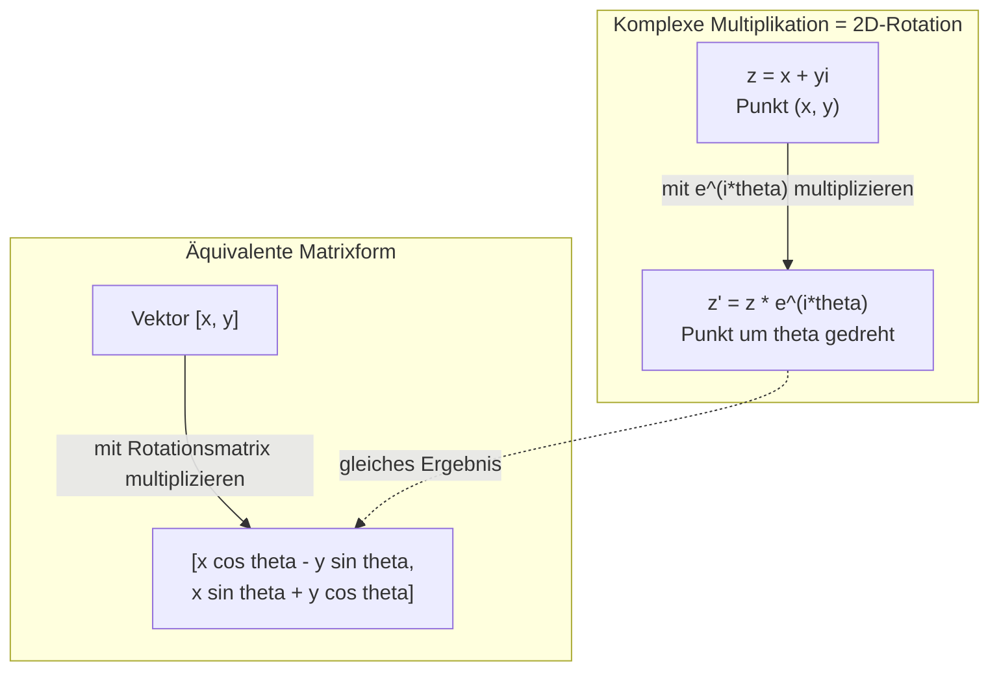
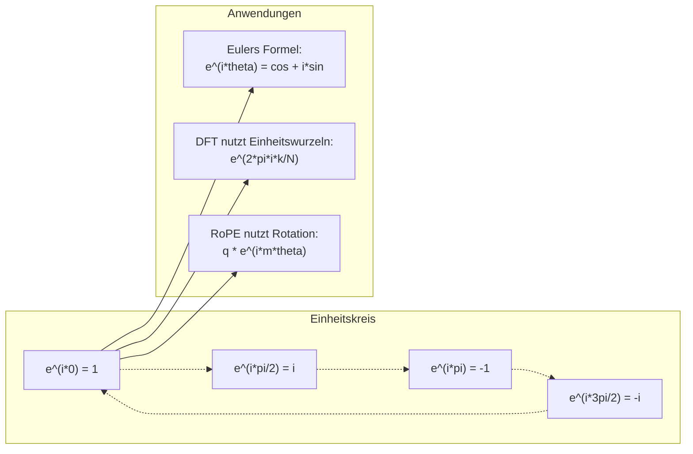

# Komplexe Zahlen für KI

> Die Quadratwurzel aus -1 ist nicht imaginär. Sie ist der Schlüssel zu Rotationen, Frequenzen und der halben Signalverarbeitung.

**Typ:** Learn
**Sprache:** Python
**Voraussetzungen:** Phase 1, Lektionen 01-04 (lineare Algebra, Analysis)
**Zeit:** ~60 Minuten

## Lernziele

- Komplexe Arithmetik (Addition, Multiplikation, Division, Konjugation) in kartesischer und polarer Form anwenden
- Eulers Formel nutzen, um zwischen komplexen Exponentialfunktionen und trigonometrischen Funktionen umzuwandeln
- Die Diskrete Fourier-Transformation mit komplexen Einheitswurzeln implementieren
- Erklären, wie komplexe Rotationen RoPE und sinusförmige Positionskodierungen in Transformern tragen

## Das Problem

Du öffnest ein Paper über Fourier-Transformationen und überall steht `i`. Du schaust dir Positionskodierungen in Transformern an und siehst `sin` und `cos` bei verschiedenen Frequenzen -- die Real- und Imaginärteile komplexer Exponentialfunktionen. Du liest über Quantencomputing und findest alles in komplexen Vektorräumen formuliert.

Komplexe Zahlen wirken abstrakt. Ein Zahlensystem, das auf der Quadratwurzel aus -1 basiert, fühlt sich wie ein mathematischer Trick an. Aber es ist kein Trick. Es ist die natürliche Sprache von Rotationen und Schwingungen. Immer wenn etwas rotiert, vibriert oder oszilliert, sind komplexe Zahlen das richtige Werkzeug.

Ohne Verständnis komplexer Zahlen verstehst du die Diskrete Fourier-Transformation nicht. Du verstehst FFT nicht. Du verstehst nicht, wie RoPE (Rotary Position Embedding) in modernen Sprachmodellen funktioniert. Du verstehst nicht, warum sinusförmige Positionskodierungen im ursprünglichen Transformer-Paper genau diese Frequenzen verwenden.

Diese Lektion baut komplexe Arithmetik von Grund auf auf, verbindet sie mit Geometrie und zeigt dir genau, wo komplexe Zahlen im maschinellen Lernen auftauchen.

## Das Konzept

### Was ist eine komplexe Zahl?

Eine komplexe Zahl hat zwei Teile: einen Realteil und einen Imaginärteil.

```
z = a + bi

where:
  a is the real part
  b is the imaginary part
  i is the imaginary unit, defined by i^2 = -1
```

Das ist alles. Du erweiterst die Zahlengerade zu einer Ebene. Reelle Zahlen liegen auf einer Achse. Imaginäre Zahlen liegen auf der anderen. Jede komplexe Zahl ist ein Punkt in dieser Ebene.

### Komplexe Arithmetik

**Addition.** Addiere die Realteile und die Imaginärteile jeweils getrennt.

```
(a + bi) + (c + di) = (a + c) + (b + d)i

Example: (3 + 2i) + (1 + 4i) = 4 + 6i
```

**Multiplikation.** Nutze das Distributivgesetz und beachte, dass i^2 = -1.

```
(a + bi)(c + di) = ac + adi + bci + bdi^2
                 = ac + adi + bci - bd
                 = (ac - bd) + (ad + bc)i

Example: (3 + 2i)(1 + 4i) = 3 + 12i + 2i + 8i^2
                            = 3 + 14i - 8
                            = -5 + 14i
```

**Konjugation.** Drehe das Vorzeichen des Imaginärteils um.

```
conjugate of (a + bi) = a - bi
```

Das Produkt einer komplexen Zahl mit ihrer Konjugierten ist immer reell:

```
(a + bi)(a - bi) = a^2 + b^2
```

**Division.** Multipliziere Zähler und Nenner mit der Konjugierten des Nenners.

```
(a + bi) / (c + di) = (a + bi)(c - di) / (c^2 + d^2)
```

So verschwindet der Imaginärteil aus dem Nenner, und du erhältst eine saubere komplexe Zahl.

### Die komplexe Ebene

Die komplexe Ebene ordnet jeder komplexen Zahl einen 2D-Punkt zu. Die horizontale Achse ist die reelle Achse, die vertikale Achse die imaginäre Achse.

```
z = 3 + 2i  corresponds to the point (3, 2)
z = -1 + 0i corresponds to the point (-1, 0) on the real axis
z = 0 + 4i  corresponds to the point (0, 4) on the imaginary axis
```

Eine komplexe Zahl ist gleichzeitig ein Punkt und ein Vektor vom Ursprung aus. Diese Doppelinterpretation macht komplexe Zahlen für Geometrie so nützlich.

### Polarform

Jeder Punkt in der Ebene lässt sich durch den Abstand zum Ursprung und den Winkel zur positiven reellen Achse beschreiben.

```
z = r * (cos(theta) + i*sin(theta))

where:
  r = |z| = sqrt(a^2 + b^2)     (magnitude, or modulus)
  theta = atan2(b, a)             (phase, or argument)
```

Die kartesische Form (a + bi) ist gut für Addition. Die Polarform (r, theta) ist gut für Multiplikation.

**Multiplikation in Polarform.** Multipliziere die Beträge und addiere die Winkel.

```
z1 = r1 * e^(i*theta1)
z2 = r2 * e^(i*theta2)

z1 * z2 = (r1 * r2) * e^(i*(theta1 + theta2))
```

Darum sind komplexe Zahlen ideal für Rotationen. Multiplikation mit einer komplexen Zahl vom Betrag 1 ist eine reine Rotation.

### Eulers Formel

Die Brücke zwischen komplexen Exponentialfunktionen und Trigonometrie:

```
e^(i*theta) = cos(theta) + i*sin(theta)
```

Das ist die wichtigste Formel dieser Lektion. Wenn theta = pi:

```
e^(i*pi) = cos(pi) + i*sin(pi) = -1 + 0i = -1

Therefore: e^(i*pi) + 1 = 0
```

Fünf fundamentale Konstanten (e, i, pi, 1, 0) in einer Gleichung verbunden.

### Warum Eulers Formel für ML wichtig ist

Eulers Formel sagt: `e^(i*theta)` läuft bei variierendem theta auf dem Einheitskreis. Bei theta = 0 bist du bei (1, 0). Bei theta = pi/2 bei (0, 1). Bei theta = pi bei (-1, 0). Bei theta = 3*pi/2 bei (0, -1). Eine volle Umdrehung ist theta = 2*pi.

Das bedeutet: Komplexe Exponentialfunktionen SIND Rotationen. Und Rotationen sind überall in Signalverarbeitung und ML.

### Verbindung zu 2D-Rotationen

Wenn du die komplexe Zahl (x + yi) mit e^(i*theta) multiplizierst, wird der Punkt (x, y) um den Winkel theta um den Ursprung gedreht.

```
Rotation via complex multiplication:
  (x + yi) * (cos(theta) + i*sin(theta))
  = (x*cos(theta) - y*sin(theta)) + (x*sin(theta) + y*cos(theta))i

Rotation via matrix multiplication:
  [cos(theta)  -sin(theta)] [x]   [x*cos(theta) - y*sin(theta)]
  [sin(theta)   cos(theta)] [y] = [x*sin(theta) + y*cos(theta)]
```

Beide liefern identische Ergebnisse. Komplexe Multiplikation IST 2D-Rotation. Die Rotationsmatrix ist nur komplexe Multiplikation in Matrixschreibweise.



### Phasoren und rotierende Signale

Eine komplexe Exponentialfunktion e^(i*omega*t) ist ein Punkt, der sich mit der Kreisfrequenz omega auf dem Einheitskreis dreht. Wenn t wächst, zeichnet der Punkt den Kreis nach.

Der Realteil dieses rotierenden Punkts ist cos(omega*t). Der Imaginärteil ist sin(omega*t). Ein sinusförmiges Signal ist der Schatten einer rotierenden komplexen Zahl.

```
e^(i*omega*t) = cos(omega*t) + i*sin(omega*t)

Real part:      cos(omega*t)    -- a cosine wave
Imaginary part: sin(omega*t)    -- a sine wave
```

Das ist die Phasor-Darstellung. Statt einer welligen Sinuskurve verfolgst du einen glatt rotierenden Pfeil. Phasenverschiebungen werden zu Winkel-Offsets. Amplitudenänderungen werden zu Betragsänderungen. Signaladdition wird zu Vektoraddition.

### Einheitswurzeln

Die N-ten Einheitswurzeln sind N gleichmäßig verteilte Punkte auf dem Einheitskreis:

```
w_k = e^(2*pi*i*k/N)    for k = 0, 1, 2, ..., N-1
```

Für N = 4 sind die Wurzeln: 1, i, -1, -i (die vier Himmelsrichtungen).
Für N = 8 bekommst du die vier Himmelsrichtungen plus die vier Diagonalen.

Einheitswurzeln sind die Grundlage der Diskreten Fourier-Transformation. Die DFT zerlegt ein Signal in Komponenten bei diesen N gleichmäßig verteilten Frequenzen.

### Verbindung zur DFT

Die Diskrete Fourier-Transformation eines Signals x[0], x[1], ..., x[N-1] ist:

```
X[k] = sum_{n=0}^{N-1} x[n] * e^(-2*pi*i*k*n/N)
```

Jedes X[k] misst, wie stark das Signal mit der k-ten Einheitswurzel korreliert -- also mit einer komplexen Sinusschwingung bei Frequenz k. Die DFT zerlegt ein Signal in N rotierende Phasoren und liefert Amplitude und Phase jedes Anteils.

### Warum i nicht imaginär ist

Das Wort „imaginär“ ist ein historischer Unfall. Descartes meinte es abwertend. Aber i ist nicht imaginärer als negative Zahlen, als sie noch abgelehnt wurden. Negative Zahlen beantworten „Was musst du von 3 abziehen, um 5 zu bekommen?“. Die imaginäre Einheit beantwortet „Was musst du quadrieren, um -1 zu bekommen?“.

Praktischer: i ist ein Rotationsoperator um 90 Grad. Multiplizierst du eine reelle Zahl einmal mit i, drehst du 90 Grad auf die imaginäre Achse. Multiplizierst du noch einmal mit i (i^2), drehst du weitere 90 Grad -- jetzt zeigst du in die negative reelle Richtung. Darum gilt i^2 = -1. Das ist nicht mysteriös. Es ist eine halbe Drehung aus zwei Vierteldrehungen.

Darum sind komplexe Zahlen überall in der Ingenieurpraxis. Alles, was rotiert -- elektromagnetische Wellen, Quantenzustände, Signalschwingungen, Positionskodierungen -- lässt sich natürlich mit komplexen Zahlen beschreiben.

### Komplexe Exponentialfunktionen vs. trigonometrische Funktionen

Vor Eulers Formel schrieben Ingenieurinnen und Ingenieure Signale als A*cos(omega*t + phi) -- Amplitude A, Frequenz omega, Phase phi. Das funktioniert, macht die Arithmetik aber mühsam. Zwei Kosinusfunktionen mit unterschiedlichen Phasen zu addieren erfordert trigonometrische Identitäten.

Mit komplexen Exponentialfunktionen lautet dasselbe Signal A*e^(i*(omega*t + phi)). Zwei Signale addieren heißt dann nur: zwei komplexe Zahlen addieren. Multiplizieren (Modulation) heißt: Beträge multiplizieren und Winkel addieren. Phasenverschiebungen werden zu Winkeladditionen. Frequenzverschiebungen werden zu Multiplikationen mit Phasoren.

Die gesamte Signalverarbeitung wechselte zur komplexen Exponentialschreibweise, weil die Mathematik sauberer ist. Das „reale Signal“ ist immer nur der Realteil der komplexen Darstellung. Der Imaginärteil läuft als Buchhaltung mit und sorgt dafür, dass die Algebra natürlich aufgeht.

### Verbindung zu Transformern

**Sinusförmige Positionskodierungen** (ursprüngliches Transformer-Paper):

```
PE(pos, 2i) = sin(pos / 10000^(2i/d))
PE(pos, 2i+1) = cos(pos / 10000^(2i/d))
```

Die sin/cos-Paare sind Real- und Imaginärteil komplexer Exponentialfunktionen bei verschiedenen Frequenzen. Jede Frequenz liefert eine andere „Auflösung“ für Positionen. Niedrige Frequenzen ändern sich langsam (grobe Position). Hohe Frequenzen ändern sich schnell (feine Position). Zusammen geben sie jeder Position einen eindeutigen Frequenz-Fingerabdruck.

**RoPE (Rotary Position Embedding)** geht noch weiter. Es multipliziert Query- und Key-Vektoren explizit mit komplexen Rotationsmatrizen. Die relative Position zweier Tokens wird zum Rotationswinkel. Attention wird mit diesen rotierten Vektoren berechnet, sodass das Modell über komplexe Multiplikation für relative Position sensibilisiert wird.

| Operation | Algebraische Form | Geometrische Bedeutung |
|-----------|---------------|-------------------|
| Addition | (a+c) + (b+d)i | Vektoraddition in der Ebene |
| Multiplikation | (ac-bd) + (ad+bc)i | Rotieren und skalieren |
| Konjugation | a - bi | Spiegelung an der reellen Achse |
| Betrag | sqrt(a^2 + b^2) | Abstand vom Ursprung |
| Phase | atan2(b, a) | Winkel zur positiven reellen Achse |
| Division | mit Konjugierter multiplizieren | Rotation rückgängig machen und neu skalieren |
| Potenz | r^n * e^(i*n*theta) | n-mal rotieren, mit r^n skalieren |



## Umsetzung

### Schritt 1: Complex-Klasse

Baue eine Klasse für komplexe Zahlen, die Arithmetik, Betrag, Phase und die Umwandlung zwischen kartesischer und polarer Form unterstützt.

```python
import math

class Complex:
    def __init__(self, real, imag=0.0):
        self.real = real
        self.imag = imag

    def __add__(self, other):
        return Complex(self.real + other.real, self.imag + other.imag)

    def __mul__(self, other):
        r = self.real * other.real - self.imag * other.imag
        i = self.real * other.imag + self.imag * other.real
        return Complex(r, i)

    def __truediv__(self, other):
        denom = other.real ** 2 + other.imag ** 2
        r = (self.real * other.real + self.imag * other.imag) / denom
        i = (self.imag * other.real - self.real * other.imag) / denom
        return Complex(r, i)

    def magnitude(self):
        return math.sqrt(self.real ** 2 + self.imag ** 2)

    def phase(self):
        return math.atan2(self.imag, self.real)

    def conjugate(self):
        return Complex(self.real, -self.imag)
```

### Schritt 2: Polarumwandlung und Eulers Formel

```python
def to_polar(z):
    return z.magnitude(), z.phase()

def from_polar(r, theta):
    return Complex(r * math.cos(theta), r * math.sin(theta))

def euler(theta):
    return Complex(math.cos(theta), math.sin(theta))
```

Verifiziere: `euler(theta).magnitude()` sollte immer 1.0 sein. `euler(0)` sollte (1, 0) liefern. `euler(pi)` sollte (-1, 0) liefern.

### Schritt 3: Rotation

Einen Punkt (x, y) um den Winkel theta zu drehen ist genau eine komplexe Multiplikation:

```python
point = Complex(3, 4)
rotated = point * euler(math.pi / 4)
```

Der Betrag bleibt gleich. Nur der Winkel ändert sich.

### Schritt 4: DFT aus komplexer Arithmetik

```python
def dft(signal):
    N = len(signal)
    result = []
    for k in range(N):
        total = Complex(0, 0)
        for n in range(N):
            angle = -2 * math.pi * k * n / N
            total = total + Complex(signal[n], 0) * euler(angle)
        result.append(total)
    return result
```

Das ist die O(N^2)-DFT. Jeder Output X[k] ist die Summe der Samples, multipliziert mit Einheitswurzeln.

### Schritt 5: Inverse DFT

Die inverse DFT rekonstruiert das ursprüngliche Signal aus seinem Spektrum. Gegenüber der Vorwärts-DFT ändert sich nur: Vorzeichen im Exponenten drehen und durch N teilen.

```python
def idft(spectrum):
    N = len(spectrum)
    result = []
    for n in range(N):
        total = Complex(0, 0)
        for k in range(N):
            angle = 2 * math.pi * k * n / N
            total = total + spectrum[k] * euler(angle)
        result.append(Complex(total.real / N, total.imag / N))
    return result
```

Damit erhältst du perfekte Rekonstruktion. Wende DFT und dann IDFT an, und du bekommst das Originalsignal bis auf Maschinenpräzision zurück. Es geht keine Information verloren.

### Schritt 6: Einheitswurzeln

```python
def roots_of_unity(N):
    return [euler(2 * math.pi * k / N) for k in range(N)]
```

Verifiziere zwei Eigenschaften:
- Jede Wurzel hat exakt den Betrag 1.
- Die Summe aller N Wurzeln ist null (symmetrische Aufhebung).

Diese Eigenschaften machen die DFT invertierbar. Die Einheitswurzeln bilden eine orthogonale Basis für den Frequenzraum.

## In der Praxis

Python hat eingebaute Unterstützung für komplexe Zahlen. Das Literal `j` steht für die imaginäre Einheit.

```python
z = 3 + 2j
w = 1 + 4j

print(z + w)
print(z * w)
print(abs(z))

import cmath
print(cmath.phase(z))
print(cmath.exp(1j * cmath.pi))
```

Für Arrays verarbeitet numpy komplexe Zahlen nativ:

```python
import numpy as np

z = np.array([1+2j, 3+4j, 5+6j])
print(np.abs(z))
print(np.angle(z))
print(np.conj(z))
print(np.real(z))
print(np.imag(z))

signal = np.sin(2 * np.pi * 5 * np.linspace(0, 1, 128))
spectrum = np.fft.fft(signal)
freqs = np.fft.fftfreq(128, d=1/128)
```

## Fertigstellen

Führe `code/complex_numbers.py` aus, um `outputs/skill-complex-arithmetic.md` zu erzeugen.

## Übungen

1. **Komplexe Arithmetik von Hand.** Berechne (2 + 3i) * (4 - i) und prüfe es mit dem Code. Berechne danach (5 + 2i) / (1 - 3i). Zeichne beide Ergebnisse in der komplexen Ebene und prüfe, dass die Multiplikation die erste Zahl rotiert und skaliert.

2. **Rotationsfolge.** Starte mit dem Punkt (1, 0). Multipliziere zwölfmal mit e^(i*pi/6). Prüfe, dass du nach 12 Multiplikationen wieder bei (1, 0) bist. Gib die Koordinaten bei jedem Schritt aus und bestätige, dass sie ein regelmäßiges 12-Eck bilden.

3. **DFT eines bekannten Signals.** Erzeuge ein Signal als Summe aus sin(2*pi*3*t) und 0.5*sin(2*pi*7*t), abgetastet in 32 Punkten. Führe deine DFT aus. Prüfe, dass das Betragspektrum Peaks bei Frequenz 3 und 7 hat, wobei der Peak bei 7 halb so hoch ist wie der bei 3.

4. **Visualisierung der Einheitswurzeln.** Berechne die 8-ten Einheitswurzeln. Prüfe, dass ihre Summe null ist. Prüfe, dass Multiplikation einer beliebigen Wurzel mit der primitiven Wurzel e^(2*pi*i/8) die nächste Wurzel ergibt.

5. **Äquivalenz zur Rotationsmatrix.** Prüfe für 10 zufällige Winkel und 10 zufällige Punkte, dass komplexe Multiplikation dasselbe Ergebnis liefert wie Matrix-Vektor-Multiplikation mit der 2x2-Rotationsmatrix. Gib die maximale numerische Abweichung aus.

## Schlüsselbegriffe

| Begriff | Bedeutung |
|------|---------------|
| Komplexe Zahl | Eine Zahl a + bi, wobei a der Realteil, b der Imaginärteil ist und i^2 = -1 gilt |
| Imaginäre Einheit | Die Zahl i, definiert durch i^2 = -1. Nicht imaginär im philosophischen Sinn -- sie ist ein Rotationsoperator |
| Komplexe Ebene | Die 2D-Ebene, in der die x-Achse reell und die y-Achse imaginär ist. Auch Argand-Ebene genannt |
| Betrag (Modulus) | Der Abstand vom Ursprung: sqrt(a^2 + b^2). Geschrieben als \|z\| |
| Phase (Argument) | Der Winkel zur positiven reellen Achse: atan2(b, a). Geschrieben als arg(z) |
| Konjugierte | Das Spiegelbild an der reellen Achse: Konjugierte von a + bi ist a - bi |
| Polarform | Darstellung von z als r * e^(i*theta) statt a + bi. Macht Multiplikation einfach |
| Eulers Formel | e^(i*theta) = cos(theta) + i*sin(theta). Verbindet Exponentialfunktionen mit Trigonometrie |
| Phasor | Eine rotierende komplexe Zahl e^(i*omega*t), die ein sinusförmiges Signal repräsentiert |
| Einheitswurzeln | Die N komplexen Zahlen e^(2*pi*i*k/N) für k = 0 bis N-1. N gleichmäßig verteilte Punkte auf dem Einheitskreis |
| DFT | Diskrete Fourier-Transformation. Zerlegt ein Signal über Einheitswurzeln in komplexe Sinus-Komponenten |
| RoPE | Rotary Position Embedding. Nutzt komplexe Multiplikation, um relative Position in Transformer-Attention zu kodieren |

## Weiterführende Literatur

- [Visual Introduction to Euler's Formula](https://betterexplained.com/articles/intuitive-understanding-of-eulers-formula/) - baut geometrische Intuition ohne schwere Notation auf
- [Su et al.: RoFormer (2021)](https://arxiv.org/abs/2104.09864) - das Paper, das Rotary Position Embedding mit komplexen Rotationen einführt
- [Vaswani et al.: Attention Is All You Need (2017)](https://arxiv.org/abs/1706.03762) - das ursprüngliche Transformer-Paper mit sinusförmigen Positionskodierungen
- [3Blue1Brown: Euler's formula with introductory group theory](https://www.youtube.com/watch?v=mvmuCPvRoWQ) - visuelle Erklärung, warum e^(i*pi) = -1
- [Needham: Visual Complex Analysis](https://global.oup.com/academic/product/visual-complex-analysis-9780198534464) - die beste visuelle Behandlung komplexer Zahlen mit viel geometrischer Einsicht
- [Strang: Introduction to Linear Algebra, Ch. 10](https://math.mit.edu/~gs/linearalgebra/) - komplexe Zahlen im Kontext von linearer Algebra und Eigenwerten
