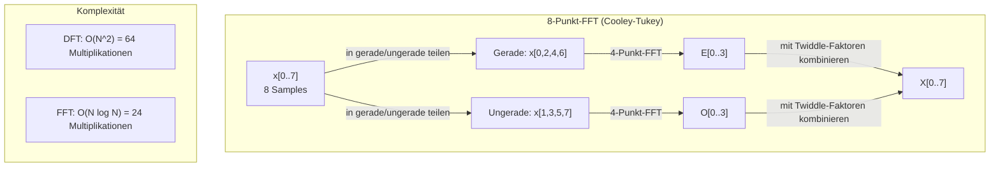
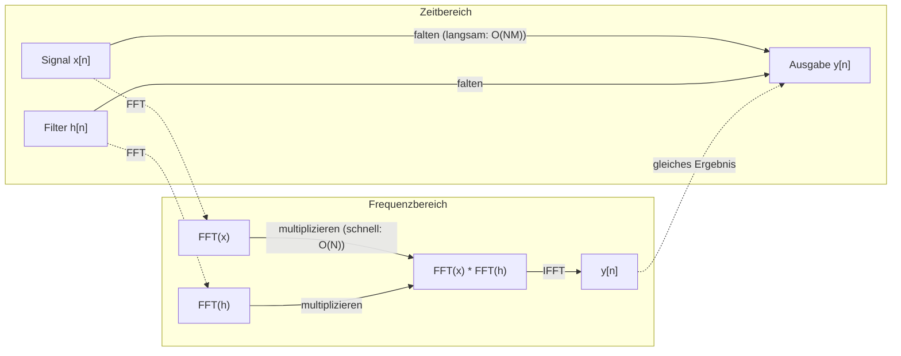

# Die Fourier-Transformation

> Jedes Signal ist eine Summe von Sinuswellen. Die Fourier-Transformation zeigt dir, welche.

**Typ:** Build
**Sprache:** Python
**Voraussetzungen:** Phase 1, Lektionen 01-04, 19 (komplexe Zahlen)
**Zeit:** ~90 Minuten

## Lernziele

- Die DFT von Grund auf implementieren und gegen die O(N log N)-Cooley-Tukey-FFT verifizieren
- Frequenzkoeffizienten interpretieren: Amplitude, Phase und Leistungsspektrum aus einem Signal gewinnen
- Das Faltungstheorem anwenden, um Faltung über FFT-Multiplikation auszuführen
- Fourier-Frequenzzerlegung mit Transformer-Positionskodierungen und CNN-Faltungsschichten verknüpfen

## Das Problem

Eine Audioaufnahme ist eine Folge von Druckmessungen über die Zeit. Ein Aktienkurs ist eine Folge von Werten über Tage. Ein Bild ist ein Raster von Pixelintensitäten über den Raum. Das alles sind Daten im Zeitbereich (oder Ortsbereich). Du siehst Werte, die sich über einen Index ändern.

Viele Muster sind im Zeitbereich aber unsichtbar. Ist dieses Audiosignal ein reiner Ton oder ein Akkord? Hat dieser Aktienkurs einen Wochenzyklus? Hat dieses Bild eine wiederholte Textur? Diese Fragen betreffen Frequenzinhalt, und der Zeitbereich verdeckt ihn.

Die Fourier-Transformation konvertiert Daten vom Zeitbereich in den Frequenzbereich. Sie nimmt ein Signal und zerlegt es in Sinuswellen unterschiedlicher Frequenz. Jede Sinuswelle hat eine Amplitude (wie stark sie ist) und eine Phase (wo sie beginnt). Die Fourier-Transformation liefert beides.

Das ist für ML wichtig, weil Denken im Frequenzbereich überall auftaucht. Convolutional Neural Networks führen Faltungen aus, die im Frequenzbereich Multiplikationen sind. Transformer-Positionskodierungen nutzen Frequenzzerlegung zur Repräsentation von Position. Audiomodelle (Spracherkennung, Musikgenerierung) arbeiten auf Spektrogrammen -- Frequenzdarstellungen von Klang. Zeitreihenmodelle suchen nach periodischen Mustern. Wer Fourier versteht, hat das Vokabular für all das.

## Das Konzept

### Die DFT-Definition

Für N Samples x[0], x[1], ..., x[N-1] erzeugt die Diskrete Fourier-Transformation N Frequenzkoeffizienten X[0], X[1], ..., X[N-1]:

```
X[k] = sum_{n=0}^{N-1} x[n] * e^(-2*pi*i*k*n/N)

for k = 0, 1, ..., N-1
```

Jedes X[k] ist eine komplexe Zahl. Sein Betrag |X[k]| gibt die Amplitude der Frequenz k an. Sein Phasenwinkel angle(X[k]) gibt den Phasenoffset dieser Frequenz an.

Der zentrale Punkt: `e^(-2*pi*i*k*n/N)` ist ein rotierender Phasor bei Frequenz k. Die DFT berechnet die Korrelation zwischen dem Signal und jeder der N gleichmäßig verteilten Frequenzen. Enthält das Signal Energie bei Frequenz k, ist die Korrelation groß. Sonst ist sie nahe null.

### Bedeutung der einzelnen Koeffizienten

**X[0]: die DC-Komponente.** Das ist die Summe aller Samples -- proportional zum Mittelwert. Sie repräsentiert den konstanten (nullfrequenten) Offset des Signals.

```
X[0] = sum_{n=0}^{N-1} x[n] * e^0 = sum of all samples
```

**X[k] für 1 <= k <= N/2: positive Frequenzen.** X[k] repräsentiert k Zyklen pro N Samples. Höheres k bedeutet höhere Frequenz (schnellere Schwingung).

**X[N/2]: die Nyquist-Frequenz.** Die höchste Frequenz, die du mit N Samples darstellen kannst. Darüber entsteht Aliasing -- hohe Frequenzen tarnen sich als niedrige.

**X[k] für N/2 < k < N: negative Frequenzen.** Für reellwertige Signale gilt X[N-k] = conj(X[k]). Die negativen Frequenzen sind Spiegelbilder der positiven. Deshalb steckt die nützliche Information in den ersten N/2 + 1 Koeffizienten.

### Inverse DFT

Die inverse DFT rekonstruiert das ursprüngliche Signal aus den Frequenzkoeffizienten:

```
x[n] = (1/N) * sum_{k=0}^{N-1} X[k] * e^(2*pi*i*k*n/N)

for n = 0, 1, ..., N-1
```

Die einzigen Unterschiede zur Vorwärts-DFT: Das Vorzeichen im Exponenten ist positiv (nicht negativ), und es gibt einen Normierungsfaktor 1/N.

Die inverse DFT ist eine perfekte Rekonstruktion. Es geht keine Information verloren. Du kannst vom Zeitbereich in den Frequenzbereich und zurück ohne Fehler wechseln. Die DFT ist ein Basiswechsel -- dieselbe Information in einem anderen Koordinatensystem.

### Die FFT: schnell gemacht

Die oben definierte DFT ist O(N^2): Für jeden der N Ausgabekoeffizienten summierst du über N Eingangssamples. Für N = 1 Million sind das 10^12 Operationen.

Die Fast Fourier Transform (FFT) berechnet dasselbe Ergebnis in O(N log N). Für N = 1 Million sind das etwa 20 Millionen statt einer Billion Operationen. Genau das macht Frequenzanalyse praktikabel.

Der Cooley-Tukey-Algorithmus (die häufigste FFT) arbeitet per Divide-and-Conquer:

1. Teile das Signal in gerade und ungerade Indizes.
2. Berechne die DFT jeder Hälfte rekursiv.
3. Kombiniere die beiden halbgroßen DFTs mit „Twiddle-Faktoren“ e^(-2*pi*i*k/N).

```
X[k] = E[k] + e^(-2*pi*i*k/N) * O[k]          for k = 0, ..., N/2 - 1
X[k + N/2] = E[k] - e^(-2*pi*i*k/N) * O[k]    for k = 0, ..., N/2 - 1

where E = DFT of even-indexed samples
      O = DFT of odd-indexed samples
```

Die Symmetrie bedeutet: Jede Rekursionsebene macht O(N) Arbeit, und es gibt log2(N) Ebenen. Insgesamt: O(N log N).



Die FFT erfordert eine Signallänge als Zweierpotenz. In der Praxis werden Signale auf die nächste Zweierpotenz mit Nullen aufgefüllt.

### Spektralanalyse

Das **Leistungsspektrum** ist |X[k]|^2 -- der quadrierte Betrag jedes Frequenzkoeffizienten. Es zeigt, wie viel Energie bei jeder Frequenz liegt.

Das **Phasenspektrum** ist angle(X[k]) -- der Phasenoffset jeder Frequenz. Für viele Analyseaufgaben interessiert vor allem das Leistungsspektrum, nicht die Phase.

```
Power at frequency k:  P[k] = |X[k]|^2 = X[k].real^2 + X[k].imag^2
Phase at frequency k:  phi[k] = atan2(X[k].imag, X[k].real)
```

### Frequenzauflösung

Die Frequenzauflösung der DFT hängt von der Anzahl der Samples N und der Abtastrate fs ab.

```
Frequency of bin k:      f_k = k * fs / N
Frequency resolution:    delta_f = fs / N
Maximum frequency:       f_max = fs / 2  (Nyquist)
```

Um zwei nahe Frequenzen zu trennen, brauchst du mehr Samples. Um hohe Frequenzen zu erfassen, brauchst du eine höhere Abtastrate.

### Das Faltungstheorem

Das ist eines der wichtigsten Ergebnisse der Signalverarbeitung und direkt relevant für CNNs.

**Faltung im Zeitbereich entspricht punktweiser Multiplikation im Frequenzbereich.**

```
x * h = IFFT(FFT(x) . FFT(h))

where * is convolution and . is element-wise multiplication
```

Warum das wichtig ist:

- Direkte Faltung zweier Signale der Länge N und M kostet O(N*M) Operationen.
- FFT-basierte Faltung kostet O(N log N): beide transformieren, multiplizieren, zurücktransformieren.
- Für große Kernel ist FFT-Faltung drastisch schneller.
- Genau das passiert in Faltungsschichten mit großen rezeptiven Feldern.

Hinweis: Die DFT berechnet zirkuläre Faltung (Signal wrappt). Für lineare Faltung (ohne Wraparound) beide Signale vorab auf Länge N + M - 1 mit Nullen auffüllen.



### Fensterung

Die DFT nimmt an, dass das Signal periodisch ist -- sie behandelt die N Samples als eine Periode eines unendlich wiederholten Signals. Wenn das Signal nicht mit demselben Wert startet und endet, entsteht am Rand eine Diskontinuität, die als künstlicher Hochfrequenzanteil erscheint. Das heißt Spektralleckage.

Fensterung reduziert Leckage, indem das Signal vor der DFT an beiden Enden gegen null ausläuft.

Gängige Fenster:

| Fenster | Form | Hauptkeulenbreite | Nebenkeulenpegel | Anwendungsfall |
|--------|-------|----------------|-----------------|----------|
| Rechteck | Flach (kein Fenster) | Schmalste | Höchster (-13 dB) | Wenn das Signal in N Samples exakt periodisch ist |
| Hann | Angehobener Kosinus | Mittel | Niedrig (-31 dB) | Allgemeine Spektralanalyse |
| Hamming | Modifizierter Kosinus | Mittel | Niedriger (-42 dB) | Audioverarbeitung, Sprachanalyse |
| Blackman | Dreifach-Kosinus | Breit | Sehr niedrig (-58 dB) | Wenn starke Nebenkeulenunterdrückung nötig ist |

```
Hann window:    w[n] = 0.5 * (1 - cos(2*pi*n / (N-1)))
Hamming window: w[n] = 0.54 - 0.46 * cos(2*pi*n / (N-1))
```

Wende das Fenster an, indem du es vor der DFT elementweise mit dem Signal multiplizierst: `X = DFT(x * w)`.

### DFT-Eigenschaften

| Eigenschaft | Zeitbereich | Frequenzbereich |
|----------|-------------|-----------------|
| Linearität | a*x + b*y | a*X + b*Y |
| Zeitverschiebung | x[n - k] | X[f] * e^(-2*pi*i*f*k/N) |
| Frequenzverschiebung | x[n] * e^(2*pi*i*f0*n/N) | X[f - f0] |
| Faltung | x * h | X * H (punktweise) |
| Multiplikation | x * h (punktweise) | X * H (zirkuläre Faltung, skaliert mit 1/N) |
| Parseval-Theorem | sum \|x[n]\|^2 | (1/N) * sum \|X[k]\|^2 |
| Konjugierte Symmetrie (reeller Input) | x[n] reell | X[k] = conj(X[N-k]) |

Das Parseval-Theorem sagt, dass die Gesamtenergie in beiden Bereichen gleich ist. Energie bleibt durch die Transformation erhalten.

### Verbindung zu Positionskodierungen

Der originale Transformer nutzt sinusförmige Positionskodierungen:

```
PE(pos, 2i)   = sin(pos / 10000^(2i/d_model))
PE(pos, 2i+1) = cos(pos / 10000^(2i/d_model))
```

Jedes Dimensionspaar (2i, 2i+1) schwingt bei einer anderen Frequenz. Die Frequenzen sind geometrisch von hoch (Dimension 0,1) bis niedrig (letzte Dimensionen) verteilt. Dadurch hat jede Position ein eindeutiges Muster über alle Frequenzbänder -- ähnlich wie Fourier-Koeffizienten ein Signal eindeutig beschreiben.

Die wichtigsten Eigenschaften:

- **Eindeutigkeit:** Keine zwei Positionen haben dieselbe Kodierung.
- **Begrenzte Werte:** sin und cos liegen immer in [-1, 1].
- **Relative Position:** Die Kodierung von Position p+k lässt sich als lineare Funktion der Kodierung bei Position p ausdrücken. Das Modell kann lernen, auf relative Positionen zu achten.

### Verbindung zu CNNs

Eine Faltungsschicht wendet einen gelernten Filter (Kernel) auf den Input an, indem sie ihn über Signal oder Bild schiebt. Mathematisch ist das die Faltungsoperation.

Nach dem Faltungstheorem entspricht das:
1. FFT des Inputs
2. FFT des Kernels
3. Multiplikation im Frequenzbereich
4. IFFT des Ergebnisses

Standard-CNNs nutzen direkte Faltung (schneller für kleine 3x3-Kernel). Für große Kernel oder globale Faltung sind FFT-basierte Ansätze aber deutlich schneller. Manche Architekturen (z. B. FNet) ersetzen Attention vollständig durch FFT und erreichen konkurrenzfähige Genauigkeit mit O(N log N) statt O(N^2)-Komplexität.

### Spektrogramme und Short-Time Fourier Transform

Eine einzelne FFT gibt dir den Frequenzinhalt des gesamten Signals, aber nicht, wann Frequenzen auftreten. Ein Chirp (Frequenz steigt über die Zeit) und ein Akkord (alle Frequenzen gleichzeitig) können dasselbe Betragspektrum haben.

Die Short-Time Fourier Transform (STFT) löst das, indem sie FFTs auf überlappenden Fenstern des Signals berechnet. Das Ergebnis ist ein Spektrogramm: eine 2D-Darstellung mit Zeit auf einer Achse und Frequenz auf der anderen. Die Intensität an jedem Punkt zeigt die Energie dieser Frequenz zu diesem Zeitpunkt.

```
STFT procedure:
1. Choose a window size (e.g., 1024 samples)
2. Choose a hop size (e.g., 256 samples -- 75% overlap)
3. For each window position:
   a. Extract the windowed segment
   b. Apply a Hann/Hamming window
   c. Compute FFT
   d. Store the magnitude spectrum as one column of the spectrogram
```

Spektrogramme sind die Standard-Eingabedarstellung für Audio-ML-Modelle. Spracherkennungsmodelle (Whisper, DeepSpeech) arbeiten auf Mel-Spektrogrammen -- Spektrogrammen mit auf die Mel-Skala abgebildeten Frequenzen, die menschlicher Tonwahrnehmung besser entsprechen.

### Aliasing

Wenn ein Signal Frequenzen über fs/2 (Nyquist-Frequenz) enthält, erzeugt Abtastung mit Rate fs aliasierte Kopien. Ein 90-Hz-Signal, abgetastet mit 100 Hz, sieht identisch zu einem 10-Hz-Signal aus. Aus den Samples allein kannst du sie nicht unterscheiden.

```
Example:
  True signal: 90 Hz sine wave
  Sampling rate: 100 Hz
  Apparent frequency: 100 - 90 = 10 Hz

  The samples from the 90 Hz signal at 100 Hz sampling rate
  are identical to the samples from a 10 Hz signal.
  No amount of math can recover the original 90 Hz.
```

Darum enthalten Analog-Digital-Wandler Anti-Aliasing-Filter, die Frequenzen oberhalb von Nyquist vor der Abtastung entfernen. In ML taucht Aliasing auf, wenn Feature-Maps ohne ausreichende Tiefpassfilterung heruntergesampelt werden -- manche Architekturen lösen das mit anti-aliased Pooling.

### Zero-Padding erhöht die Auflösung nicht

Ein häufiger Irrtum: Zero-Padding vor der FFT verbessere die Frequenzauflösung. Das tut es nicht. Zero-Padding interpoliert zwischen vorhandenen Frequenz-Bins und lässt das Spektrum glatter aussehen. Es kann aber keine Frequenzdetails sichtbar machen, die in den Originalsamples nicht enthalten waren.

Die echte Frequenzauflösung hängt nur von der Beobachtungszeit T = N / fs ab. Um zwei Frequenzen mit Abstand delta_f zu trennen, brauchst du mindestens T = 1 / delta_f Sekunden Daten. Kein Zero-Padding ändert diese Grenze.

## Umsetzung

### Schritt 1: DFT von Grund auf

Die O(N^2)-DFT folgt direkt aus der Definition.

```python
import math

class Complex:
    ...

def dft(x):
    N = len(x)
    result = []
    for k in range(N):
        total = Complex(0, 0)
        for n in range(N):
            angle = -2 * math.pi * k * n / N
            w = Complex(math.cos(angle), math.sin(angle))
            xn = x[n] if isinstance(x[n], Complex) else Complex(x[n])
            total = total + xn * w
        result.append(total)
    return result
```

### Schritt 2: Inverse DFT

Gleiche Struktur, positiver Exponent, durch N teilen.

```python
def idft(X):
    N = len(X)
    result = []
    for n in range(N):
        total = Complex(0, 0)
        for k in range(N):
            angle = 2 * math.pi * k * n / N
            w = Complex(math.cos(angle), math.sin(angle))
            total = total + X[k] * w
        result.append(Complex(total.real / N, total.imag / N))
    return result
```

### Schritt 3: FFT (Cooley-Tukey)

Die rekursive FFT braucht eine Länge als Zweierpotenz. Teile in gerade und ungerade Elemente, rekursiv aufrufen, mit Twiddle-Faktoren kombinieren.

```python
def fft(x):
    N = len(x)
    if N <= 1:
        return [x[0] if isinstance(x[0], Complex) else Complex(x[0])]
    if N % 2 != 0:
        return dft(x)

    even = fft([x[i] for i in range(0, N, 2)])
    odd = fft([x[i] for i in range(1, N, 2)])

    result = [Complex(0)] * N
    for k in range(N // 2):
        angle = -2 * math.pi * k / N
        twiddle = Complex(math.cos(angle), math.sin(angle))
        t = twiddle * odd[k]
        result[k] = even[k] + t
        result[k + N // 2] = even[k] - t
    return result
```

### Schritt 4: Hilfsfunktionen für Spektralanalyse

```python
def power_spectrum(X):
    return [xk.real ** 2 + xk.imag ** 2 for xk in X]

def convolve_fft(x, h):
    N = len(x) + len(h) - 1
    padded_N = 1
    while padded_N < N:
        padded_N *= 2

    x_padded = x + [0.0] * (padded_N - len(x))
    h_padded = h + [0.0] * (padded_N - len(h))

    X = fft(x_padded)
    H = fft(h_padded)

    Y = [xk * hk for xk, hk in zip(X, H)]

    y = idft(Y)
    return [y[n].real for n in range(N)]
```

## In der Praxis

Für echte Anwendungen nutze NumPy-FFT, die auf stark optimierten C-Bibliotheken basiert.

```python
import numpy as np

signal = np.sin(2 * np.pi * 5 * np.arange(256) / 256)
spectrum = np.fft.fft(signal)
freqs = np.fft.fftfreq(256, d=1/256)

power = np.abs(spectrum) ** 2

positive_freqs = freqs[:len(freqs)//2]
positive_power = power[:len(power)//2]
```

Für Fensterung und fortgeschrittenere Spektralanalyse:

```python
from scipy.signal import windows, stft

window = windows.hann(256)
windowed = signal * window
spectrum = np.fft.fft(windowed)
```

Für Faltung:

```python
from scipy.signal import fftconvolve

result = fftconvolve(signal, kernel, mode='full')
```

Für Spektrogramme:

```python
from scipy.signal import stft

frequencies, times, Zxx = stft(signal, fs=sample_rate, nperseg=256)
spectrogram = np.abs(Zxx) ** 2
```

Die Spektrogramm-Matrix hat die Form (n_frequencies, n_time_frames). Jede Spalte ist das Leistungsspektrum eines Zeitfensters. Das ist die Eingabe, die Audio-ML-Modelle konsumieren.

## Fertigstellen

Führe `code/fourier.py` aus, um `outputs/prompt-spectral-analyzer.md` zu erzeugen.

## Übungen

1. **Reinen Ton identifizieren.** Erzeuge ein Signal mit einer einzelnen Sinuswelle unbekannter Frequenz (zwischen 1 und 50 Hz), abgetastet mit 128 Hz für 1 Sekunde. Nutze deine DFT zur Frequenzbestimmung. Prüfe die Übereinstimmung. Füge danach gaußsches Rauschen mit Standardabweichung 0.5 hinzu und wiederhole. Wie verändert Rauschen das Spektrum?

2. **FFT- vs. DFT-Verifikation.** Erzeuge ein Zufallssignal der Länge 64. Berechne sowohl DFT (O(N^2)) als auch FFT. Prüfe, dass alle Koeffizienten bis auf 1e-10 übereinstimmen. Messe beide Funktionen für Längen 256, 512, 1024 und 2048. Plotte das Verhältnis DFT-Zeit zu FFT-Zeit.

3. **Faltungstheorem per Beispiel beweisen.** Erzeuge Signal x = [1, 2, 3, 4, 0, 0, 0, 0] und Filter h = [1, 1, 1, 0, 0, 0, 0, 0]. Berechne die zirkuläre Faltung direkt (verschachtelte Schleife). Berechne sie dann per FFT (transformieren, multiplizieren, inverse transformieren). Prüfe, dass die Ergebnisse übereinstimmen. Danach lineare Faltung mit passendem Zero-Padding.

4. **Fensterungseffekte.** Erzeuge ein Signal als Summe zweier Sinuswellen bei 10 Hz und 12 Hz (sehr nah). Sample mit 128 Hz für 1 Sekunde. Berechne das Leistungsspektrum ohne Fenster, mit Hann-Fenster und mit Hamming-Fenster. Bei welchem Fenster lassen sich die beiden Peaks am besten trennen? Warum?

5. **Analyse von Positionskodierungen.** Erzeuge sinusförmige Positionskodierungen für d_model = 128 und max_pos = 512. Berechne für jedes Positionspaar (p1, p2) das Skalarprodukt ihrer Kodierungen. Zeige, dass das Skalarprodukt nur von |p1 - p2| abhängt, nicht von absoluten Positionen. Was passiert mit dem Skalarprodukt, wenn der Abstand wächst?

## Schlüsselbegriffe

| Begriff | Bedeutung |
|------|---------------|
| DFT (Diskrete Fourier-Transformation) | Wandelt N Samples im Zeitbereich in N Koeffizienten im Frequenzbereich um. Jeder Koeffizient ist die Korrelation mit einer komplexen Sinusschwingung dieser Frequenz |
| FFT (Fast Fourier Transform) | Ein O(N log N)-Algorithmus zur Berechnung der DFT. Der Cooley-Tukey-Algorithmus teilt gerade/ungerade Indizes rekursiv |
| Inverse DFT | Rekonstruiert das Signal im Zeitbereich aus Frequenzkoeffizienten. Gleiche Formel wie DFT mit umgedrehtem Exponenten-Vorzeichen und 1/N-Skalierung |
| Frequenz-Bin | Jeder Index k im DFT-Output repräsentiert die Frequenz k*fs/N Hz. Der „Bin“ ist der diskrete Frequenz-Slot |
| DC-Komponente | X[0], der Nullfrequenz-Koeffizient. Proportional zum Mittelwert des Signals |
| Nyquist-Frequenz | fs/2, die maximal darstellbare Frequenz bei Abtastrate fs. Höhere Frequenzen aliasen |
| Leistungsspektrum | \|X[k]\|^2, der quadrierte Betrag jedes Frequenzkoeffizienten. Zeigt die Energieverteilung über Frequenzen |
| Phasenspektrum | angle(X[k]), der Phasenoffset jeder Frequenzkomponente. Wird in der Analyse oft ignoriert |
| Spektralleckage | Künstliche Frequenzanteile, weil ein nichtperiodisches Signal als periodisch behandelt wird. Durch Fensterung reduziert |
| Fensterfunktion | Auslaufende Funktion (Hann, Hamming, Blackman), vor der DFT angewandt, um Spektralleckage zu reduzieren |
| Twiddle-Faktor | Die komplexe Exponentialfunktion e^(-2*pi*i*k/N), mit der in der FFT-Butterfly-Berechnung Teil-DFTs kombiniert werden |
| Faltungstheorem | Faltung im Zeitbereich entspricht punktweiser Multiplikation im Frequenzbereich. Fundamental für Signalverarbeitung und CNNs |
| Zirkuläre Faltung | Faltung, bei der das Signal wrappt. Das berechnet die DFT natürlicherweise |
| Lineare Faltung | Standardfaltung ohne Wraparound. Durch Zero-Padding vor der DFT erreicht |
| Parseval-Theorem | Gesamtenergie bleibt durch die Fourier-Transformation erhalten. sum \|x[n]\|^2 = (1/N) sum \|X[k]\|^2 |
| Aliasing | Frequenzen oberhalb Nyquist erscheinen wegen zu geringer Abtastrate als niedrigere Frequenzen |

## Weiterführende Literatur

- [Cooley & Tukey: An Algorithm for the Machine Calculation of Complex Fourier Series (1965)](https://www.ams.org/journals/mcom/1965-19-090/S0025-5718-1965-0178586-1/) - das ursprüngliche FFT-Paper, das Computing verändert hat
- [3Blue1Brown: But what is the Fourier Transform?](https://www.youtube.com/watch?v=spUNpyF58BY) - die beste visuelle Einführung in Fourier-Transformationen
- [Lee-Thorp et al.: FNet: Mixing Tokens with Fourier Transforms (2021)](https://arxiv.org/abs/2105.03824) - ersetzt Self-Attention in Transformern durch FFT
- [Smith: The Scientist and Engineer's Guide to Digital Signal Processing](http://www.dspguide.com/) - freies Online-Lehrbuch zu FFT, Fensterung und Spektralanalyse
- [Vaswani et al.: Attention Is All You Need (2017)](https://arxiv.org/abs/1706.03762) - sinusförmige Positionskodierungen aus Fourier-Frequenzzerlegung
- [Radford et al.: Whisper (2022)](https://arxiv.org/abs/2212.04356) - Spracherkennung mit Mel-Spektrogrammen als Eingabedarstellung
