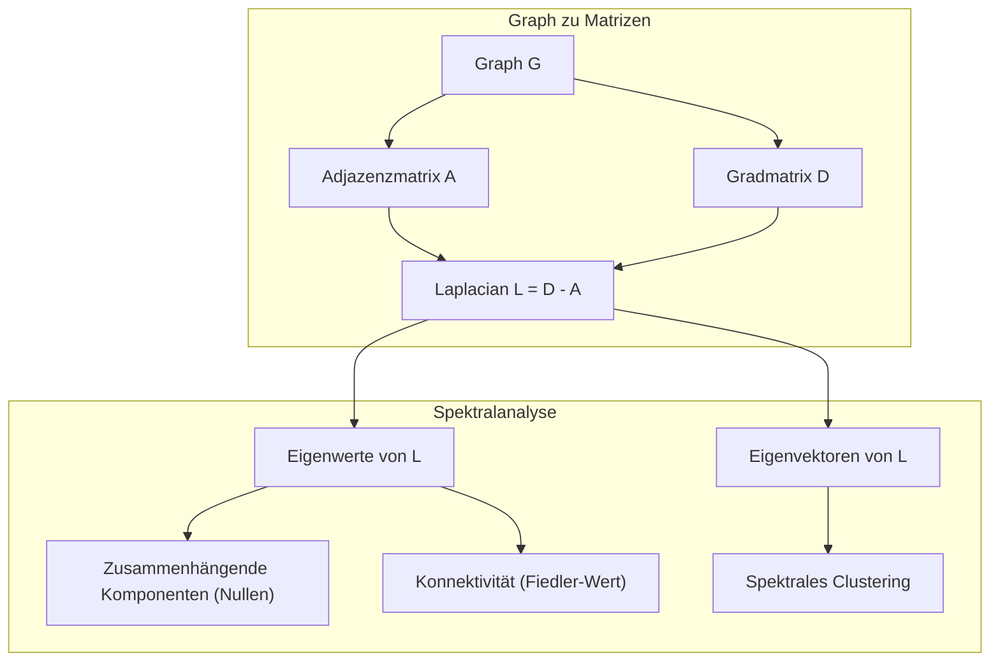
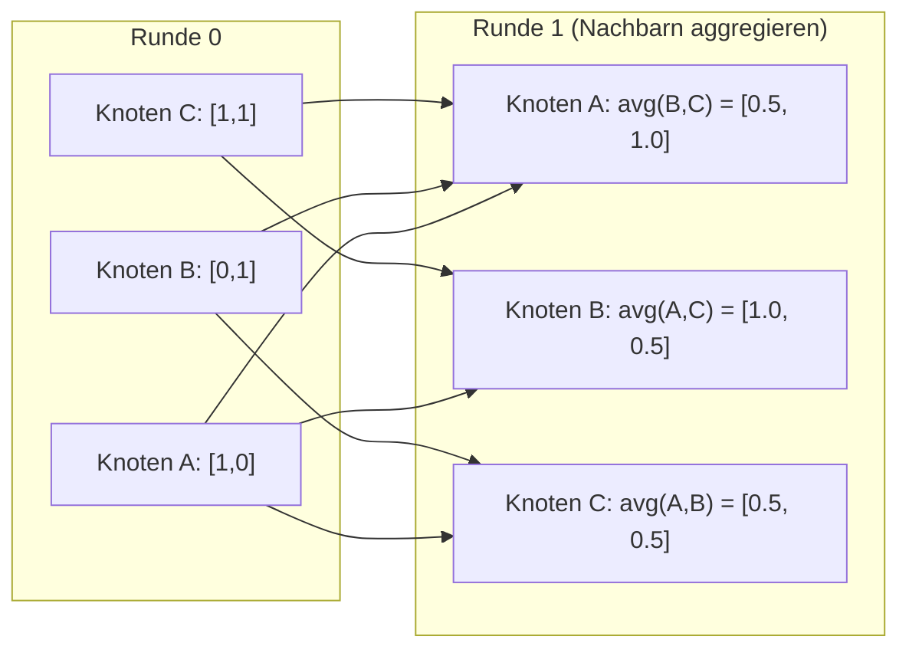

# Graphentheorie für Machine Learning

> Graphen sind die Datenstruktur für Beziehungen. Wenn deine Daten Verbindungen haben, brauchst du Graphentheorie.

**Typ:** Build
**Sprache:** Python
**Voraussetzungen:** Phase 1, Lektionen 01–03 (Lineare Algebra, Matrizen)
**Dauer:** ~90 Minuten

## Lernziele

- Eine Graph-Klasse mit Adjazenzmatrix/-listen-Darstellungen bauen und BFS- sowie DFS-Traversierung implementieren
- Den Graph-Laplacian berechnen und seine Eigenwerte nutzen, um zusammenhängende Komponenten zu erkennen und Knoten zu clustern
- Eine Runde GNN-artiges Message Passing als Multiplikation mit einer normalisierten Adjazenzmatrix implementieren
- Spektrales Clustering anwenden, um einen Graphen mit dem Fiedler-Vektor zu partitionieren

## Das Problem

Soziale Netzwerke, Moleküle, Wissensbasen, Zitationsnetzwerke, Straßenkarten – all das sind Graphen. Klassisches ML behandelt Daten als flache Tabellen. Jede Zeile ist unabhängig. Jedes Feature ist eine Spalte. Aber wenn die Verbindungsstruktur wichtig ist, scheitern Tabellen.

Nimm ein soziales Netzwerk. Du willst vorhersagen, welches Produkt ein Nutzer kauft. Seine Kaufhistorie ist wichtig. Aber die Kaufhistorie seiner Freunde ist oft wichtiger. Die Verbindungen tragen das Signal.

Oder nimm ein Molekül. Du willst vorhersagen, ob es an ein Protein bindet. Die Atome sind wichtig, aber entscheidend ist, wie sie miteinander verbunden sind. Die Struktur ist die Datenbasis.

Graph Neural Networks (GNNs) sind einer der am schnellsten wachsenden Bereiche im Deep Learning. Sie treiben Wirkstoffforschung, soziale Empfehlungssysteme, Betrugserkennung und Wissensgraph-Inferenz an. Jedes GNN baut auf derselben Grundlage auf: grundlegender Graphentheorie.

Du brauchst vier Dinge:
1. Eine Möglichkeit, Graphen als Matrizen darzustellen (damit du sie multiplizieren kannst)
2. Traversierungsalgorithmen, um die Graphstruktur zu erkunden
3. Den Laplacian – die wichtigste Matrix der spektralen Graphentheorie
4. Message Passing – die Operation, die GNNs funktionsfähig macht

## Das Konzept

### Graphen: Knoten und Kanten

Ein Graph G = (V, E) besteht aus Vertices (Knoten) V und Kanten E. Jede Kante verbindet zwei Knoten.

**Gerichtet vs. ungerichtet.** In einem ungerichteten Graphen bedeutet Kante (u, v), dass u mit v verbunden ist UND v mit u. In einem gerichteten Graphen (Digraph) bedeutet Kante (u, v), dass u auf v zeigt, aber nicht zwingend umgekehrt.

**Gewichtet vs. ungewichtet.** In einem ungewichteten Graphen existieren Kanten oder nicht. In einem gewichteten Graphen hat jede Kante ein numerisches Gewicht – eine Distanz, Kosten oder Stärke.

| Graphtyp | Beispiel |
|-----------|---------|
| Ungerichtet, ungewichtet | Facebook-Freundschaftsnetzwerk |
| Gerichtet, ungewichtet | Twitter-Follower-Netzwerk |
| Ungerichtet, gewichtet | Straßenkarte (Distanzen) |
| Gerichtet, gewichtet | Webseiten-Links (PageRank-Scores) |

### Die Adjazenzmatrix

Die Adjazenzmatrix A ist die zentrale Darstellung. Für einen Graphen mit n Knoten:

```
A[i][j] = 1    if there is an edge from node i to node j
A[i][j] = 0    otherwise
```

Für ungerichtete Graphen ist A symmetrisch: A[i][j] = A[j][i]. Für gewichtete Graphen gilt A[i][j] = Gewicht der Kante (i, j).

**Beispiel – ein Dreieck:**

```
Nodes: 0, 1, 2
Edges: (0,1), (1,2), (0,2)

A = [[0, 1, 1],
     [1, 0, 1],
     [1, 1, 0]]
```

Die Adjazenzmatrix ist die Eingabe jedes GNNs. Matrixoperationen auf A entsprechen Operationen auf dem Graphen.

### Grad

Der Grad eines Knotens ist die Anzahl der anliegenden Kanten. Bei gerichteten Graphen gibt es In-Degree (eingehende Kanten) und Out-Degree (ausgehende Kanten).

Die Gradmatrix D ist diagonal:

```
D[i][i] = degree of node i
D[i][j] = 0    for i != j
```

Für das Dreiecksbeispiel: D = diag(2, 2, 2), weil jeder Knoten mit zwei anderen verbunden ist.

Der Grad zeigt die Bedeutung eines Knotens. Hoher Grad = Hub-Knoten. Die Gradverteilung eines Netzwerks verrät seine Struktur. Soziale Netzwerke folgen Potenzgesetzen (wenige Hubs, viele Blätter). Zufallsgraphen haben poissonverteilte Grade.

### BFS und DFS

Die zwei grundlegenden Graph-Traversierungsalgorithmen. Du brauchst beide.

**Breadth-First Search (BFS):** Erst alle Nachbarn, dann Nachbarn der Nachbarn. Nutzt eine Queue (FIFO).

```
BFS from node 0:
  Visit 0
  Queue: [1, 2]        (neighbors of 0)
  Visit 1
  Queue: [2, 3]        (add neighbors of 1)
  Visit 2
  Queue: [3]           (neighbors of 2 already visited)
  Visit 3
  Queue: []            (done)
```

BFS findet kürzeste Pfade in ungewichteten Graphen. Die Distanz vom Start zu einem Knoten entspricht dem BFS-Level, in dem er erstmals gefunden wird. Deshalb nutzt man BFS für Hop-Distanzen in sozialen Netzwerken.

**Depth-First Search (DFS):** So tief wie möglich gehen, dann zurück. Nutzt einen Stack (LIFO) oder Rekursion.

```
DFS from node 0:
  Visit 0
  Stack: [1, 2]        (neighbors of 0)
  Visit 2               (pop from stack)
  Stack: [1, 3]         (add neighbors of 2)
  Visit 3               (pop from stack)
  Stack: [1]
  Visit 1               (pop from stack)
  Stack: []             (done)
```

DFS ist nützlich für:
- Zusammenhängende Komponenten finden (DFS von unbesuchten Knoten starten)
- Zyklenerkennung (Rückkanten im DFS-Baum)
- Topologisches Sortieren (umgekehrte DFS-Fertigstellungsreihenfolge)

| Algorithmus | Datenstruktur | Findet | Anwendungsfall |
|-----------|---------------|-------|----------|
| BFS | Queue | Kürzeste Pfade | Soziale Netzwerkdistanz, Wissensgraph-Traversierung |
| DFS | Stack | Komponenten, Zyklen | Konnektivität, topologisches Sortieren |

### Der Graph-Laplacian

L = D - A. Die wichtigste Matrix der spektralen Graphentheorie.

Für das Dreieck:

```
D = [[2, 0, 0],    A = [[0, 1, 1],    L = [[2, -1, -1],
     [0, 2, 0],         [1, 0, 1],         [-1, 2, -1],
     [0, 0, 2]]         [1, 1, 0]]         [-1, -1,  2]]
```

Der Laplacian hat bemerkenswerte Eigenschaften:

1. **L ist positiv semidefinit.** Alle Eigenwerte sind >= 0.

2. **Die Anzahl der Null-Eigenwerte entspricht der Anzahl zusammenhängender Komponenten.** Ein zusammenhängender Graph hat genau einen Null-Eigenwert. Ein Graph mit 3 getrennten Komponenten hat drei Null-Eigenwerte.

3. **Der kleinste Nicht-Null-Eigenwert (Fiedler-Wert) misst die Konnektivität.** Ein großer Fiedler-Wert bedeutet, der Graph ist gut verbunden. Ein kleiner Fiedler-Wert weist auf eine Schwachstelle hin – einen Engpass.

4. **Der Eigenvektor zum Fiedler-Wert (Fiedler-Vektor) zeigt die beste Aufteilung.** Knoten mit positiven Werten kommen in eine Gruppe, Knoten mit negativen Werten in die andere. Das ist spektrales Clustering.



### Spektrale Eigenschaften

Die Eigenwerte der Adjazenzmatrix und des Laplacian zeigen strukturelle Eigenschaften ohne jede Traversierung.

**Spektrales Clustering** funktioniert so:
1. Laplacian L berechnen
2. Die k kleinsten Eigenvektoren von L finden (den ersten überspringen, der bei zusammenhängenden Graphen nur Einsen enthält)
3. Diese Eigenvektoren als neue Koordinaten pro Knoten verwenden
4. k-means auf diesen Koordinaten ausführen

Warum funktioniert das? Die Eigenvektoren von L kodieren die „glattesten“ Funktionen auf dem Graphen. Gut verbundene Knoten erhalten ähnliche Eigenvektorwerte. Knoten, die durch einen Engpass getrennt sind, erhalten unterschiedliche Werte. Die Eigenvektoren trennen Cluster daher natürlich.

**Bezug zum Random Walk.** Der normalisierte Laplacian hängt mit Random Walks auf dem Graphen zusammen. Die stationäre Verteilung eines Random Walks ist proportional zum Knotengrad. Die Mixing Time (wie schnell der Walk konvergiert) hängt vom Spektralabstand ab.

### Message Passing

Die Kernoperation von Graph Neural Networks. Jeder Knoten sammelt Nachrichten von seinen Nachbarn, aggregiert sie und aktualisiert seinen Zustand.

```
h_v^(k+1) = UPDATE(h_v^(k), AGGREGATE({h_u^(k) : u in neighbors(v)}))
```

In der einfachsten Form ist AGGREGATE = Mittelwert und UPDATE = lineare Transformation + Aktivierung:

```
h_v^(k+1) = sigma(W * mean({h_u^(k) : u in neighbors(v)}))
```

Das ist verkappte Matrixmultiplikation. Wenn H die Matrix aller Knotenfeatures ist und A die Adjazenzmatrix:

```
H^(k+1) = sigma(A_norm * H^(k) * W)
```

wobei A_norm die normalisierte Adjazenzmatrix ist (jede Zeile summiert sich auf 1).

Eine Runde Message Passing lässt jeden Knoten seine direkten Nachbarn „sehen“. Zwei Runden lassen Nachbarn der Nachbarn sichtbar werden. K Runden geben jedem Knoten Information aus seiner K-Hop-Nachbarschaft.



### Konzepte und ML-Anwendungen

| Konzept | ML-Anwendung |
|---------|---------------|
| Adjazenzmatrix | GNN-Eingabedarstellung |
| Graph-Laplacian | Spektrales Clustering, Community Detection |
| BFS/DFS | Wissensgraph-Traversierung, Pfadsuche |
| Gradverteilung | Knotenbedeutung, Feature Engineering |
| Message Passing | GNN-Schichten (GCN, GAT, GraphSAGE) |
| Eigenwerte von L | Community Detection, Graph-Partitionierung |
| Spektrales Clustering | Unüberwachtes Knotengruppieren |
| PageRank | Knotenbedeutung, Websuche |

## Umsetzung

### Schritt 1: Graph class from scratch

```python
class Graph:
    def __init__(self, n_nodes, directed=False):
        self.n = n_nodes
        self.directed = directed
        self.adj = {i: {} for i in range(n_nodes)}

    def add_edge(self, u, v, weight=1.0):
        self.adj[u][v] = weight
        if not self.directed:
            self.adj[v][u] = weight

    def neighbors(self, node):
        return list(self.adj[node].keys())

    def degree(self, node):
        return len(self.adj[node])

    def adjacency_matrix(self):
        import numpy as np
        A = np.zeros((self.n, self.n))
        for u in range(self.n):
            for v, w in self.adj[u].items():
                A[u][v] = w
        return A

    def degree_matrix(self):
        import numpy as np
        D = np.zeros((self.n, self.n))
        for i in range(self.n):
            D[i][i] = self.degree(i)
        return D

    def laplacian(self):
        return self.degree_matrix() - self.adjacency_matrix()
```

Die Adjazenzliste (`self.adj`) speichert Nachbarn effizient. Die Umwandlung in eine Adjazenzmatrix nutzt NumPy, weil alle spektralen Operationen es benötigen.

### Schritt 2: BFS and DFS

```python
from collections import deque

def bfs(graph, start):
    visited = set()
    order = []
    distances = {}
    queue = deque([(start, 0)])
    visited.add(start)
    while queue:
        node, dist = queue.popleft()
        order.append(node)
        distances[node] = dist
        for neighbor in graph.neighbors(node):
            if neighbor not in visited:
                visited.add(neighbor)
                queue.append((neighbor, dist + 1))
    return order, distances


def dfs(graph, start):
    visited = set()
    order = []
    stack = [start]
    while stack:
        node = stack.pop()
        if node in visited:
            continue
        visited.add(node)
        order.append(node)
        for neighbor in reversed(graph.neighbors(node)):
            if neighbor not in visited:
                stack.append(neighbor)
    return order
```

BFS nutzt eine deque (Double-Ended Queue) für O(1)-popleft. DFS nutzt eine Liste als Stack. Beide besuchen jeden Knoten genau einmal – O(V + E) Laufzeit.

### Schritt 3: Connected components and Laplacian eigenvalues

```python
def connected_components(graph):
    visited = set()
    components = []
    for node in range(graph.n):
        if node not in visited:
            order, _ = bfs(graph, node)
            visited.update(order)
            components.append(order)
    return components


def laplacian_eigenvalues(graph):
    import numpy as np
    L = graph.laplacian()
    eigenvalues = np.linalg.eigvalsh(L)
    return eigenvalues
```

`eigvalsh` ist für symmetrische Matrizen – der Laplacian ist bei ungerichteten Graphen immer symmetrisch. Es liefert Eigenwerte in aufsteigender Reihenfolge. Die Anzahl der Nullen ergibt die Zahl der zusammenhängenden Komponenten.

### Schritt 4: Spectral clustering

```python
def spectral_clustering(graph, k=2):
    import numpy as np
    L = graph.laplacian()
    eigenvalues, eigenvectors = np.linalg.eigh(L)
    features = eigenvectors[:, 1:k+1]

    labels = np.zeros(graph.n, dtype=int)
    for i in range(graph.n):
        if features[i, 0] >= 0:
            labels[i] = 0
        else:
            labels[i] = 1
    return labels
```

Für k=2 teilt das Vorzeichen des Fiedler-Vektors den Graphen in zwei Cluster. Für k>2 würdest du k-means auf die ersten k Eigenvektoren anwenden (ohne den trivialen Einsvektor).

### Schritt 5: Message passing

```python
def message_passing(graph, features, weight_matrix):
    import numpy as np
    A = graph.adjacency_matrix()
    row_sums = A.sum(axis=1, keepdims=True)
    row_sums[row_sums == 0] = 1
    A_norm = A / row_sums
    aggregated = A_norm @ features
    output = aggregated @ weight_matrix
    return output
```

Das ist eine Runde GNN-Message-Passing. Die neuen Features jedes Knotens sind der gewichtete Mittelwert seiner Nachbarn, transformiert mit der Gewichtsmatrix. Mehrere Runden propagieren Information weiter.

## Anwendung

Mit networkx und numpy sind dieselben Operationen Einzeiler:

```python
import networkx as nx
import numpy as np

G = nx.karate_club_graph()

A = nx.adjacency_matrix(G).toarray()
L = nx.laplacian_matrix(G).toarray()

eigenvalues = np.linalg.eigvalsh(L.astype(float))
print(f"Smallest eigenvalues: {eigenvalues[:5]}")
print(f"Connected components: {nx.number_connected_components(G)}")

communities = nx.community.greedy_modularity_communities(G)
print(f"Communities found: {len(communities)}")

pr = nx.pagerank(G)
top_nodes = sorted(pr.items(), key=lambda x: x[1], reverse=True)[:5]
print(f"Top 5 PageRank nodes: {top_nodes}")
```

networkx verarbeitet Graphen jeder Größe mit optimierten C-Backends. Nutze es in Produktion. Nutze die Eigenimplementierung, um zu verstehen, was intern passiert.

### numpy spectral analysis

```python
import numpy as np

A = np.array([
    [0, 1, 1, 0, 0],
    [1, 0, 1, 0, 0],
    [1, 1, 0, 1, 0],
    [0, 0, 1, 0, 1],
    [0, 0, 0, 1, 0]
])

D = np.diag(A.sum(axis=1))
L = D - A

eigenvalues, eigenvectors = np.linalg.eigh(L)
print(f"Eigenvalues: {np.round(eigenvalues, 4)}")
print(f"Fiedler value: {eigenvalues[1]:.4f}")
print(f"Fiedler vector: {np.round(eigenvectors[:, 1], 4)}")

fiedler = eigenvectors[:, 1]
group_a = np.where(fiedler >= 0)[0]
group_b = np.where(fiedler < 0)[0]
print(f"Cluster A: {group_a}")
print(f"Cluster B: {group_b}")
```

Der Fiedler-Vektor erledigt die Hauptarbeit. Positive Einträge in einem Cluster, negative im anderen. Keine iterative Optimierung nötig – nur eine Eigenzerlegung.

## Fertigstellen

Diese Lektion erzeugt:
- `outputs/skill-graph-analysis.md` -- eine Skill-Referenz zur Analyse graphstrukturierter Daten

## Verbindungen

| Konzept | Wo es auftaucht |
|---------|------------------|
| Adjazenzmatrix | GCN-, GAT-, GraphSAGE-Eingabe |
| Laplacian | Spektrales Clustering, ChebNet-Filter |
| BFS | Wissensgraph-Traversierung, Shortest-Path-Abfragen |
| Message Passing | Jede GNN-Schicht, neuronales Message Passing |
| Spektralabstand | Graphkonnektivität, Mixing Time von Random Walks |
| Gradverteilung | Potenzgesetz-Netzwerke, Knoten-Feature-Engineering |
| Zusammenhängende Komponenten | Preprocessing, Umgang mit getrennten Graphen |
| PageRank | Ranking der Knotenbedeutung, Aufmerksamkeitsinitialisierung |

GNNs verdienen besondere Erwähnung. Die Graph-Convolution-Operation in GCN (Kipf & Welling, 2017) nutzt die Adjazenzmatrix mit zusätzlichen Self-Loops, A_hat = A + I:

```text
H^(l+1) = sigma(D_hat^(-1/2) * A_hat * D_hat^(-1/2) * H^(l) * W^(l))
```

wobei A_hat = A + I (Adjazenz plus Self-Loops) und D_hat die Gradmatrix von A_hat ist. Die Self-Loops stellen sicher, dass jeder Knoten bei der Aggregation auch seine eigenen Features einbezieht. Das ist exakt Message Passing mit symmetrischer Normalisierung. D_hat^(-1/2) * A_hat * D_hat^(-1/2) ist die normalisierte Adjazenzmatrix. Der Laplacian taucht auf, weil diese Normalisierung mit L_sym = I - D^(-1/2) * A * D^(-1/2) verwandt ist. Den Laplacian zu verstehen heißt zu verstehen, warum GCNs funktionieren.

## Übungen

1. **Implementiere PageRank von Grund auf.** Starte mit gleichmäßigen Scores. In jedem Schritt: score(v) = (1-d)/n + d * sum(score(u)/out_degree(u)) für alle u, die auf v zeigen. Nutze d=0.85. Lauf bis zur Konvergenz (Änderung < 1e-6). Teste auf einem kleinen Webgraphen.

2. **Finde Communities mit spektralem Clustering.** Erstelle einen Graphen mit zwei klar getrennten Clustern (z. B. zwei Cliquen, verbunden durch eine einzelne Kante). Führe spektrales Clustering aus und prüfe, ob die richtige Trennung gefunden wird. Was passiert, wenn du mehr Cluster-übergreifende Kanten hinzufügst?

3. **Implementiere Dijkstras Algorithmus** für kürzeste Pfade in gewichteten Graphen. Vergleiche die Ergebnisse mit BFS auf demselben Graphen mit einheitlichen Gewichten.

4. **Baue ein 2-schichtiges Message-Passing-Netzwerk.** Wende Message Passing zweimal mit unterschiedlichen Gewichtsmatrizen an. Zeige, dass nach 2 Runden jeder Knoten Information aus seiner 2-Hop-Nachbarschaft enthält.

5. **Analysiere einen Real-World-Graphen.** Nutze den Karate-Club-Graphen (34 Knoten, 78 Kanten). Berechne Gradverteilung, Laplacian-Eigenwerte und spektrales Clustering. Vergleiche das Clustering-Ergebnis mit dem bekannten Ground-Truth-Split.

## Schlüsselbegriffe

| Begriff | Was man sagt | Was es tatsächlich bedeutet |
|------|----------------|----------------------|
| Graph | „Knoten und Kanten“ | Eine mathematische Struktur G=(V,E), die paarweise Beziehungen kodiert |
| Adjazenzmatrix | „Die Verbindungstabelle“ | Eine n x n Matrix, bei der A[i][j] = 1 gilt, wenn Knoten i und j verbunden sind |
| Grad | „Wie stark ein Knoten verbunden ist“ | Die Anzahl der Kanten, die an einem Knoten anliegen |
| Laplacian | „D minus A“ | L = D - A, die Matrix, deren Eigenwerte die Graphstruktur zeigen |
| Fiedler-Wert | „Die algebraische Konnektivität“ | Der kleinste Nicht-Null-Eigenwert von L, misst, wie gut der Graph verbunden ist |
| BFS | „Suche Ebene für Ebene“ | Traversierung, die erst alle Nachbarn besucht und kürzeste Pfade findet |
| DFS | „Erst tief gehen“ | Traversierung, die einem Pfad bis zum Ende folgt und dann zurückgeht |
| Message Passing | „Knoten sprechen mit Nachbarn“ | Jeder Knoten aggregiert Information von Nachbarn, der Kern von GNNs |
| Spektrales Clustering | „Mit Eigenvektoren clustern“ | Einen Graphen mithilfe der Eigenvektoren seines Laplacian partitionieren |
| Zusammenhängende Komponente | „Ein getrenntes Teilstück“ | Ein maximaler Teilgraph, in dem jeder Knoten jeden anderen erreichen kann |

## Weiterführende Literatur

- **Kipf & Welling (2017)** -- "Semi-Supervised Classification with Graph Convolutional Networks." Das Paper, das moderne GNNs gestartet hat. Zeigt, dass sich spektrale Graphfaltung auf Message Passing vereinfacht.
- **Spielman (2012)** -- "Spectral Graph Theory" lecture notes. Die maßgebliche Einführung in Laplacians, Spektralabstände und Graph-Partitionierung.
- **Hamilton (2020)** -- "Graph Representation Learning." Buch, das GNNs von Grundlagen bis Anwendungen abdeckt.
- **Bronstein et al. (2021)** -- "Geometric Deep Learning: Grids, Groups, Graphs, Geodesics, and Gauges." Das vereinheitlichende Framework-Paper.
- **Veličković et al. (2018)** -- "Graph Attention Networks." Erweitert Message Passing um Aufmerksamkeitsmechanismen.
