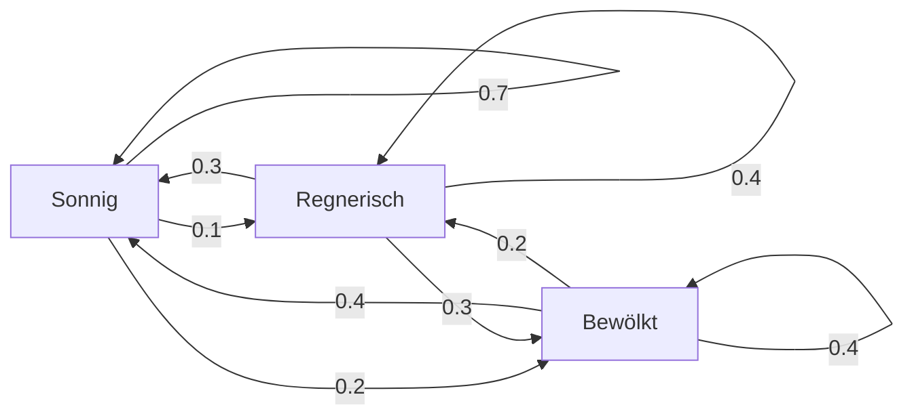
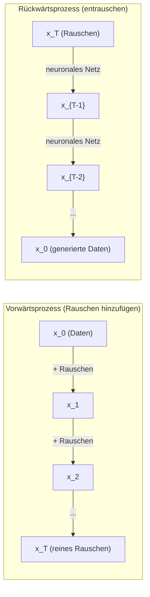

# Stochastische Prozesse

> Zufall mit Struktur. Die Mathematik hinter Random Walks, Markovketten und Diffusionsmodellen.

**Typ:** Learn
**Sprache:** Python
**Voraussetzungen:** Phase 1, Lektionen 06–07 (Wahrscheinlichkeit, Bayes)
**Dauer:** ~75 Minuten

## Lernziele

- 1D- und 2D-Random-Walks simulieren und die sqrt(n)-Skalierung der Auslenkung verifizieren
- Einen Markovketten-Simulator bauen und seine stationäre Verteilung per Eigenzerlegung berechnen
- Metropolis-Hastings-MCMC und Langevin-Dynamik implementieren, um aus Zielverteilungen zu sampeln
- Den Forward-Diffusionsprozess mit Brownscher Bewegung verknüpfen und erklären, wie der Reverse-Prozess Daten erzeugt

## Das Problem

Viele KI-Systeme enthalten Zufall, der sich über die Zeit entwickelt. Kein statischer Zufall – sondern strukturierter, sequenzieller Zufall, bei dem jeder Schritt vom vorherigen abhängt.

Sprachmodelle erzeugen Token nacheinander. Jedes Token hängt vom bisherigen Kontext ab. Das Modell gibt eine Wahrscheinlichkeitsverteilung aus, sampelt daraus und macht weiter. Das ist ein stochastischer Prozess.

Diffusionsmodelle fügen einem Bild Schritt für Schritt Rauschen hinzu, bis nur noch statisches Rauschen bleibt. Danach kehren sie den Prozess um und entrauschen Schritt für Schritt, bis ein neues Bild entsteht. Der Vorwärtsprozess ist eine Markovkette. Der Rückwärtsprozess ist eine gelernte Markovkette in umgekehrter Richtung.

Reinforcement-Learning-Agenten führen in einer Umgebung Aktionen aus. Jede Aktion führt mit gewisser Wahrscheinlichkeit in einen neuen Zustand. Der Agent folgt einer zufälligen Policy in einer zufälligen Welt. Das Ganze ist ein Markov-Entscheidungsprozess.

MCMC-Sampling – das Rückgrat der Bayes'schen Inferenz – konstruiert eine Markovkette, deren stationäre Verteilung genau die Posteriorverteilung ist, aus der du samplen willst.

All das basiert auf vier Kernideen:
1. Random Walks – der einfachste stochastische Prozess
2. Markovketten – strukturierter Zufall mit Übergangsmatrix
3. Langevin-Dynamik – Gradientenabstieg mit Rauschen
4. Metropolis-Hastings – Sampling aus beliebigen Verteilungen

## Das Konzept

### Random Walks

Starte bei Position 0. In jedem Schritt wirfst du eine faire Münze. Kopf: nach rechts (+1). Zahl: nach links (-1).

Nach n Schritten ist deine Position die Summe von n zufälligen +/-1-Werten. Die erwartete Position ist 0 (der Walk ist unverzerrt). Aber die erwartete Entfernung vom Ursprung wächst wie sqrt(n).

Das ist kontraintuitiv. Der Walk ist fair – kein Drift in irgendeine Richtung. Dennoch entfernt er sich mit der Zeit immer weiter vom Startpunkt. Die Standardabweichung nach n Schritten ist sqrt(n).

```
Step 0:  Position = 0
Step 1:  Position = +1 or -1
Step 2:  Position = +2, 0, or -2
...
Step 100: Expected distance from origin ~ 10 (sqrt(100))
Step 10000: Expected distance from origin ~ 100 (sqrt(10000))
```

**In 2D** bewegt sich der Walk mit gleicher Wahrscheinlichkeit nach oben, unten, links oder rechts. Für die Distanz vom Ursprung gilt dieselbe sqrt(n)-Skalierung. Der Pfad wirkt fraktalartig.

**Warum sqrt(n)?** Jeder Schritt ist +1 oder -1 mit gleicher Wahrscheinlichkeit. Nach n Schritten gilt S_n = X_1 + X_2 + ... + X_n, wobei jedes X_i +/-1 ist. Die Varianz jedes Schritts ist 1 und die Schritte sind unabhängig, also Var(S_n) = n. Standardabweichung = sqrt(n). Nach dem zentralen Grenzwertsatz konvergiert S_n / sqrt(n) gegen eine Standardnormalverteilung.

Diese sqrt(n)-Skalierung taucht überall im ML auf. SGD-Rauschen skaliert wie 1/sqrt(batch_size). Embedding-Dimensionen skalieren wie sqrt(d). Die Quadratwurzel ist die Signatur unabhängiger zufälliger Additionen.

**Bezug zur Brownschen Bewegung.** Nimm einen Random Walk mit Schrittweite 1/sqrt(n) und n Schritten pro Zeiteinheit. Für n gegen unendlich konvergiert der Walk zur Brownschen Bewegung B(t) – ein Prozess in kontinuierlicher Zeit, bei dem B(t) normalverteilt ist mit Mittelwert 0 und Varianz t.

Die Brownsche Bewegung ist die mathematische Grundlage der Diffusion. Sie modelliert das zufällige Zittern von Teilchen in einer Flüssigkeit, Schwankungen von Aktienkursen und – zentral – den Rauschprozess in Diffusionsmodellen.

**Ruins problem (Spieler-Ruin).** Ein Random Walker startet bei Position k, mit absorbierenden Barrieren bei 0 und N. Wie groß ist die Wahrscheinlichkeit, N vor 0 zu erreichen? Für einen fairen Walk: P(reach N) = k/N. Überraschend einfach und elegant. Das verbindet zur Martingaltheorie – der faire Random Walk ist ein Martingal (erwarteter Zukunftswert = aktueller Wert).

### Markovketten

Eine Markovkette ist ein System, das zwischen Zuständen gemäß fester Wahrscheinlichkeiten wechselt. Die Schlüsseleigenschaft: Der nächste Zustand hängt nur vom aktuellen Zustand ab, nicht von der Historie.

```
P(X_{t+1} = j | X_t = i, X_{t-1} = ...) = P(X_{t+1} = j | X_t = i)
```

Das ist die Markov-Eigenschaft. Damit lassen sich die gesamten Dynamiken mit einer Übergangsmatrix P beschreiben:

```
P[i][j] = probability of going from state i to state j
```

Jede Zeile von P summiert sich zu 1 (du musst irgendwohin gehen).

**Beispiel – Wetter:**

```
States: Sunny (0), Rainy (1), Cloudy (2)

P = [[0.7, 0.1, 0.2],    (if sunny: 70% sunny, 10% rainy, 20% cloudy)
     [0.3, 0.4, 0.3],    (if rainy: 30% sunny, 40% rainy, 30% cloudy)
     [0.4, 0.2, 0.4]]    (if cloudy: 40% sunny, 20% rainy, 40% cloudy)
```

Starte in einem beliebigen Zustand. Nach vielen Übergängen konvergiert die Zustandsverteilung zur stationären Verteilung pi, wobei pi * P = pi gilt. Das ist der linke Eigenvektor von P zum Eigenwert 1.

Für die Wetterkette könnte die stationäre Verteilung [0.53, 0.18, 0.29] sein – langfristig ist es zu 53 % sonnig, unabhängig vom Startzustand.



**Stationäre Verteilung berechnen.** Es gibt zwei Wege:

1. **Power-Methode**: Eine beliebige Startverteilung wiederholt mit P multiplizieren. Nach genug Iterationen konvergiert sie.
2. **Eigenwert-Methode**: Den linken Eigenvektor von P zum Eigenwert 1 finden. Das ist der Eigenvektor von P^T zum Eigenwert 1.

Beide Ansätze brauchen Konvergenzbedingungen.

**Konvergenzbedingungen.** Eine Markovkette konvergiert zu einer eindeutigen stationären Verteilung, wenn sie:
- **Irreduzibel** ist: Jeder Zustand ist von jedem anderen erreichbar
- **Aperiodisch** ist: Die Kette zyklisiert nicht mit fester Periode

Die meisten Ketten im ML erfüllen beides.

**Absorbierende Zustände.** Ein Zustand ist absorbierend, wenn du ihn nach Eintritt nie wieder verlässt (P[i][i] = 1). Absorbierende Markovketten modellieren Prozesse mit Endzuständen – ein Spiel mit Ende, ein Kunde mit Churn, eine Tokensequenz mit End-of-Text-Token.

**Mixing Time.** Wie viele Schritte braucht die Kette, bis sie der stationären Verteilung „nahe“ ist? Formal: Anzahl Schritte, bis die Total-Variation-Distanz unter einen Schwellenwert fällt. Schnelles Mixing = wenige Schritte. Der Spektralabstand von P (1 minus zweitgrößter Eigenwert) steuert die Mixing Time. Größerer Abstand = schnelleres Mixing.

### Verbindung zu Sprachmodellen

Token-Generierung in einem Sprachmodell ist näherungsweise ein Markovprozess. Gegeben den aktuellen Kontext gibt das Modell eine Verteilung über das nächste Token aus. Die Temperatur steuert die Schärfe:

```
P(token_i) = exp(logit_i / temperature) / sum(exp(logit_j / temperature))
```

- Temperature = 1.0: Standardverteilung
- Temperature < 1.0: schärfer (deterministischer)
- Temperature > 1.0: flacher (zufälliger)
- Temperature -> 0: argmax (greedy)

Top-k-Sampling beschränkt auf die k wahrscheinlichsten Token. Top-p- (Nucleus-) Sampling beschränkt auf die kleinste Tokenmenge, deren kumulative Wahrscheinlichkeit p überschreitet. Beide verändern die Markov-Übergangswahrscheinlichkeiten.

### Brownsche Bewegung

Der kontinuierliche Grenzfall des Random Walks. Die Position B(t) hat drei Eigenschaften:
1. B(0) = 0
2. B(t) - B(s) ist normalverteilt mit Mittelwert 0 und Varianz t - s (für t > s)
3. Inkremente auf disjunkten Intervallen sind unabhängig

Brownsche Bewegung ist stetig, aber nirgends differenzierbar – sie zittert auf jeder Skala. Der Pfad hat in der Ebene fraktale Dimension 2.

In diskreter Simulation approximierst du Brownsche Bewegung durch:

```
B(t + dt) = B(t) + sqrt(dt) * z,    where z ~ N(0, 1)
```

Die sqrt(dt)-Skalierung ist wichtig. Sie folgt aus dem zentralen Grenzwertsatz für Random Walks.

### Langevin-Dynamik

Gradientenabstieg findet das Minimum einer Funktion. Langevin-Dynamik findet die Wahrscheinlichkeitsverteilung proportional zu exp(-U(x)/T), wobei U eine Energiefunktion und T die Temperatur ist.

```
x_{t+1} = x_t - dt * gradient(U(x_t)) + sqrt(2 * T * dt) * z_t
```

Zwei Kräfte wirken auf das Teilchen:
1. **Gradientenkraft** (-dt * gradient(U)): schiebt in Richtung niedriger Energie (wie Gradientenabstieg)
2. **Zufallskraft** (sqrt(2*T*dt) * z): schiebt in zufällige Richtungen (Exploration)

Bei Temperatur T = 0 ist das reiner Gradientenabstieg. Bei hoher Temperatur ist es fast ein Random Walk. Bei passender Temperatur erkundet das Teilchen die Energielandschaft und verbringt mehr Zeit in Regionen niedriger Energie.

**Verbindung zu Diffusionsmodellen.** Der Vorwärtsprozess eines Diffusionsmodells ist:

```
x_t = sqrt(alpha_t) * x_{t-1} + sqrt(1 - alpha_t) * noise
```

Das ist eine Markovkette, die Daten schrittweise mit Rauschen mischt. Nach genug Schritten ist x_T reines Gaußrauschen.

Der Rückwärtsprozess – von Rauschen zurück zu Daten – ist ebenfalls eine Markovkette, aber ihre Übergangswahrscheinlichkeiten werden von einem neuronalen Netz gelernt. Das Netz lernt, das in jedem Schritt hinzugefügte Rauschen vorherzusagen und dann abzuziehen.



### MCMC: Markov Chain Monte Carlo

Manchmal musst du aus einer Verteilung p(x) samplen, die du auswerten kannst (bis auf eine Konstante), aber aus der du nicht direkt samplen kannst. Bayes-Posterioren sind das klassische Beispiel – du kennst Likelihood mal Prior, aber die Normierungskonstante ist nicht tractable.

**Metropolis-Hastings** konstruiert eine Markovkette, deren stationäre Verteilung p(x) ist:

1. Starte bei einer Position x
2. Schlage eine neue Position x' aus einer Vorschlagsverteilung Q(x'|x) vor
3. Berechne das Akzeptanzverhältnis: a = p(x') * Q(x|x') / (p(x) * Q(x'|x))
4. Akzeptiere x' mit Wahrscheinlichkeit min(1, a). Sonst bleibe bei x.
5. Wiederholen.

Wenn Q symmetrisch ist (z. B. Q(x'|x) = Q(x|x') = N(x, sigma^2)), vereinfacht sich das Verhältnis zu a = p(x') / p(x). Du brauchst nur das Wahrscheinlichkeitsverhältnis – die Normierungskonstante kürzt sich weg.

Die Kette konvergiert unter milden Bedingungen garantiert gegen p(x). Aber die Konvergenz kann langsam sein, wenn der Vorschlag zu klein ist (Random Walk) oder zu groß (hohe Ablehnung). Das Tuning des Vorschlags ist die Kunst von MCMC.

**Warum es funktioniert.** Das Akzeptanzverhältnis stellt Detailed Balance sicher: Die Wahrscheinlichkeit, bei x zu sein und nach x' zu wechseln, entspricht der Wahrscheinlichkeit, bei x' zu sein und nach x zu wechseln. Detailed Balance impliziert, dass p(x) die stationäre Verteilung der Kette ist. Nach genug Schritten stammen die Samples daher aus p(x).

**Praktische Aspekte:**
- **Burn-in**: Die ersten N Samples verwerfen. Die Kette braucht Zeit, um von ihrem Startpunkt die stationäre Verteilung zu erreichen.
- **Thinning**: Nur jedes k-te Sample behalten, um Autokorrelation zu reduzieren.
- **Mehrere Ketten**: Mehrere Ketten von verschiedenen Startpunkten laufen lassen. Konvergieren sie zur selben Verteilung, ist das Evidenz für Konvergenz.
- **Akzeptanzrate**: Für Gauß-Vorschläge in d Dimensionen liegt die optimale Akzeptanzrate bei etwa 23 % (Roberts & Rosenthal, 2001). Zu hoch heißt: Kette bewegt sich kaum. Zu niedrig heißt: Sie lehnt fast alles ab.

### Stochastische Prozesse in KI

| Prozess | KI-Anwendung |
|---------|---------------|
| Random Walk | Exploration in RL, Node2Vec-Embeddings |
| Markovkette | Textgenerierung, MCMC-Sampling |
| Brownsche Bewegung | Diffusionsmodelle (Vorwärtsprozess) |
| Langevin-Dynamik | Score-basierte generative Modelle, SGLD |
| Markov-Entscheidungsprozess | Reinforcement Learning |
| Metropolis-Hastings | Bayes'sche Inferenz, Posterior-Sampling |

## Umsetzung

### Schritt 1: Random walk simulator

```python
import numpy as np

def random_walk_1d(n_steps, seed=None):
    rng = np.random.RandomState(seed)
    steps = rng.choice([-1, 1], size=n_steps)
    positions = np.concatenate([[0], np.cumsum(steps)])
    return positions


def random_walk_2d(n_steps, seed=None):
    rng = np.random.RandomState(seed)
    directions = rng.choice(4, size=n_steps)
    dx = np.zeros(n_steps)
    dy = np.zeros(n_steps)
    dx[directions == 0] = 1   # right
    dx[directions == 1] = -1  # left
    dy[directions == 2] = 1   # up
    dy[directions == 3] = -1  # down
    x = np.concatenate([[0], np.cumsum(dx)])
    y = np.concatenate([[0], np.cumsum(dy)])
    return x, y
```

Der 1D-Walk speichert kumulative Summen. Jeder Schritt ist +1 oder -1. Nach n Schritten ist die Position die Summe. Die Varianz wächst linear mit n, daher wächst die Standardabweichung wie sqrt(n).

### Schritt 2: Markov chain

```python
class MarkovChain:
    def __init__(self, transition_matrix, state_names=None):
        self.P = np.array(transition_matrix, dtype=float)
        self.n_states = len(self.P)
        self.state_names = state_names or [str(i) for i in range(self.n_states)]

    def step(self, current_state, rng=None):
        if rng is None:
            rng = np.random.RandomState()
        probs = self.P[current_state]
        return rng.choice(self.n_states, p=probs)

    def simulate(self, start_state, n_steps, seed=None):
        rng = np.random.RandomState(seed)
        states = [start_state]
        current = start_state
        for _ in range(n_steps):
            current = self.step(current, rng)
            states.append(current)
        return states

    def stationary_distribution(self):
        eigenvalues, eigenvectors = np.linalg.eig(self.P.T)
        idx = np.argmin(np.abs(eigenvalues - 1.0))
        stationary = np.real(eigenvectors[:, idx])
        stationary = stationary / stationary.sum()
        return np.abs(stationary)
```

Die stationäre Verteilung ist der linke Eigenvektor von P zum Eigenwert 1. Wir finden ihn über die Eigenvektoren von P^T (durch Transponieren werden linke zu rechten Eigenvektoren).

### Schritt 3: Langevin dynamics

```python
def langevin_dynamics(grad_U, x0, dt, temperature, n_steps, seed=None):
    rng = np.random.RandomState(seed)
    x = np.array(x0, dtype=float)
    trajectory = [x.copy()]
    for _ in range(n_steps):
        noise = rng.randn(*x.shape)
        x = x - dt * grad_U(x) + np.sqrt(2 * temperature * dt) * noise
        trajectory.append(x.copy())
    return np.array(trajectory)
```

Der Gradient schiebt x zu niedriger Energie. Das Rauschen verhindert Feststecken. Im Gleichgewicht ist die Verteilung der Samples proportional zu exp(-U(x)/temperature).

### Schritt 4: Metropolis-Hastings

```python
def metropolis_hastings(target_log_prob, proposal_std, x0, n_samples, seed=None):
    rng = np.random.RandomState(seed)
    x = np.array(x0, dtype=float)
    samples = [x.copy()]
    accepted = 0
    for _ in range(n_samples - 1):
        x_proposed = x + rng.randn(*x.shape) * proposal_std
        log_ratio = target_log_prob(x_proposed) - target_log_prob(x)
        if np.log(rng.rand()) < log_ratio:
            x = x_proposed
            accepted += 1
        samples.append(x.copy())
    acceptance_rate = accepted / (n_samples - 1)
    return np.array(samples), acceptance_rate
```

Der Algorithmus schlägt einen neuen Punkt vor, prüft, ob er höhere Wahrscheinlichkeit hat (oder akzeptiert proportional zum Verhältnis), und wiederholt das. Für gutes Mixing sollte die Akzeptanzrate ungefähr bei 23–50 % liegen.

## Anwendung

In der Praxis nutzt du etablierte Bibliotheken für diese Algorithmen. Aber das Verständnis der Mechanik ist entscheidend fürs Debugging und Tuning.

```python
import numpy as np

rng = np.random.RandomState(42)
walk = np.cumsum(rng.choice([-1, 1], size=10000))
print(f"Final position: {walk[-1]}")
print(f"Expected distance: {np.sqrt(10000):.1f}")
print(f"Actual distance: {abs(walk[-1])}")
```

### numpy for transition matrices

```python
import numpy as np

P = np.array([[0.7, 0.1, 0.2],
              [0.3, 0.4, 0.3],
              [0.4, 0.2, 0.4]])

distribution = np.array([1.0, 0.0, 0.0])
for _ in range(100):
    distribution = distribution @ P

print(f"Stationary distribution: {np.round(distribution, 4)}")
```

Multipliziere die Startverteilung wiederholt mit P. Nach genug Iterationen konvergiert sie zur stationären Verteilung – unabhängig vom Start. Das ist die Power-Methode zur Bestimmung des dominanten linken Eigenvektors.

### Verbindungen to real frameworks

- **PyTorch diffusion:** Der `DDPMScheduler` in Hugging Face `diffusers` implementiert die Vorwärts- und Rückwärts-Markovketten
- **NumPyro / PyMC:** Nutzen MCMC (NUTS-Sampler, verbessert Metropolis-Hastings) für Bayes'sche Inferenz
- **Gymnasium (RL):** Die Environment-Step-Funktion definiert einen Markov-Entscheidungsprozess

### Konvergenz einer Markovkette prüfen

```python
import numpy as np

P = np.array([[0.9, 0.1], [0.3, 0.7]])

eigenvalues = np.linalg.eigvals(P)
spectral_gap = 1 - sorted(np.abs(eigenvalues))[-2]
print(f"Eigenvalues: {eigenvalues}")
print(f"Spectral gap: {spectral_gap:.4f}")
print(f"Approximate mixing time: {1/spectral_gap:.1f} steps")
```

Der Spektralabstand zeigt, wie schnell die Kette ihren Startzustand vergisst. Ein Abstand von 0.2 heißt grob 5 Schritte zum Mischen. Ein Abstand von 0.01 heißt grob 100 Schritte. Prüfe das immer vor langen Simulationen – langsam mischende Ketten verschwenden Rechenzeit.

## Fertigstellen

Diese Lektion erzeugt:
- `outputs/prompt-stochastic-process-advisor.md` -- ein Prompt, der hilft zu erkennen, welches Framework für stochastische Prozesse zu einem Problem passt

## Verbindungen

| Konzept | Wo es auftaucht |
|---------|------------------|
| Random Walk | Node2Vec-Graph-Embeddings, Exploration in RL |
| Markovkette | Token-Generierung in LLMs, MCMC-Sampling |
| Brownsche Bewegung | Vorwärts-Diffusionsprozess in DDPM, SDE-basierte Modelle |
| Langevin-Dynamik | Score-basierte generative Modelle, Stochastic Gradient Langevin Dynamics (SGLD) |
| Stationäre Verteilung | MCMC-Konvergenzziel, PageRank |
| Metropolis-Hastings | Bayes'sches Posterior-Sampling, Simulated Annealing |
| Temperatur | LLM-Sampling, Boltzmann-Exploration in RL, Simulated Annealing |
| Mixing Time | Konvergenzgeschwindigkeit von MCMC, Spektralabstandsanalyse |
| Absorbierender Zustand | End-of-Sequence-Token, terminale Zustände in RL |
| Detailed Balance | Korrektheitsgarantie für MCMC-Sampler |

Diffusionsmodelle verdienen besondere Aufmerksamkeit. DDPM (Ho et al., 2020) definiert eine Vorwärts-Markovkette:

```
q(x_t | x_{t-1}) = N(x_t; sqrt(1-beta_t) * x_{t-1}, beta_t * I)
```

wobei beta_t ein Rausch-Schedule ist. Nach T Schritten ist x_T näherungsweise N(0, I). Der Rückwärtsprozess wird durch ein neuronales Netz parametrisiert, das das Rauschen vorhersagt:

```
p_theta(x_{t-1} | x_t) = N(x_{t-1}; mu_theta(x_t, t), sigma_t^2 * I)
```

Jeder Generierungsschritt ist ein Schritt in einer gelernten Markovkette. Markovketten zu verstehen heißt zu verstehen, wie und warum Diffusionsmodelle Daten erzeugen.

SGLD (Stochastic Gradient Langevin Dynamics) kombiniert Mini-Batch-Gradientenabstieg mit Langevin-Rauschen. Statt des vollständigen Gradienten nutzt du eine stochastische Schätzung und fügst kalibriertes Rauschen hinzu. Wenn die Lernrate sinkt, wechselt SGLD von Optimierung zu Sampling – du bekommst näherungsweise Bayes-Posterior-Samples quasi kostenlos. Das ist einer der einfachsten Wege, Unsicherheitsabschätzungen aus neuronalen Netzen zu erhalten.

Die zentrale Einsicht über all diese Verbindungen hinweg: Stochastische Prozesse sind nicht nur Theorie. Sie sind die Rechenmechanismen moderner KI-Systeme. Wenn du die Temperatur eines LLMs einstellst, justierst du eine Markovkette. Wenn du ein Diffusionsmodell trainierst, lernst du, einen Brownsche-Bewegung-ähnlichen Prozess umzukehren. Wenn du Bayes'sche Inferenz ausführst, konstruierst du eine Kette, die gegen den Posterior konvergiert.

## Übungen

1. **Simuliere 1000 Random Walks mit je 10000 Schritten.** Plotte die Verteilung der Endpositionen. Verifiziere, dass sie näherungsweise gaußförmig ist mit Mittelwert 0 und Standardabweichung sqrt(10000) = 100.

2. **Baue einen Textgenerator mit einer Markovkette.** Trainiere auf einem kleinen Korpus: Zähle für jedes Wort die Übergänge zum nächsten Wort. Erstelle die Übergangsmatrix. Erzeuge neue Sätze durch Sampling aus der Kette.

3. **Implementiere Simulated Annealing** mit Metropolis-Hastings. Starte bei hoher Temperatur (akzeptiert fast alles) und kühle schrittweise ab (akzeptiert nur Verbesserungen). Nutze es, um das Minimum einer Funktion mit vielen lokalen Minima zu finden.

4. **Vergleiche Langevin-Dynamik bei verschiedenen Temperaturen.** Sample aus einem Doppelmulden-Potenzial U(x) = (x^2 - 1)^2. Bei niedriger Temperatur clustern Samples in einer Mulde. Bei hoher Temperatur verteilen sie sich über beide. Finde die kritische Temperatur, bei der die Kette zwischen den Mulden mischt.

5. **Implementiere den Vorwärts-Diffusionsprozess.** Starte mit einem 1D-Signal (z. B. einer Sinuswelle). Füge über 100 Schritte mit linearem Noise-Schedule progressiv Rauschen hinzu. Zeige, wie das Signal zu reinem Rauschen zerfällt. Implementiere dann einen einfachen Denoiser, der den Prozess umkehrt (auch ein naiver, der nur geschätztes Rauschen abzieht).

## Schlüsselbegriffe

| Begriff | Was man sagt | Was es tatsächlich bedeutet |
|------|----------------|----------------------|
| Random Walk | „Münzwurf-Bewegung“ | Ein Prozess, bei dem sich die Position in jedem Schritt um zufällige Inkremente ändert |
| Markov-Eigenschaft | „Gedächtnislos“ | Die Zukunft hängt nur vom aktuellen Zustand ab, nicht von der Historie |
| Übergangsmatrix | „Die Wahrscheinlichkeitstabelle“ | P[i][j] = Wahrscheinlichkeit, von Zustand i nach Zustand j zu wechseln |
| Stationäre Verteilung | „Der Langzeitdurchschnitt“ | Die Verteilung pi mit pi*P = pi – das Gleichgewicht der Kette |
| Brownsche Bewegung | „Zufälliges Zittern“ | Der kontinuierliche Grenzfall eines Random Walks, B(t) ~ N(0, t) |
| Langevin-Dynamik | „Gradientenabstieg mit Rauschen“ | Update-Regel, die deterministischen Gradienten und zufällige Störung kombiniert |
| MCMC | „Zum Ziel hin laufen“ | Eine Markovkette konstruieren, deren stationäre Verteilung die gewünschte ist |
| Metropolis-Hastings | „Vorschlagen und annehmen/ablehnen“ | MCMC-Algorithmus, der mit Akzeptanzverhältnissen Konvergenz sicherstellt |
| Temperatur | „Der Zufallsregler“ | Parameter, der den Trade-off zwischen Exploration und Exploitation steuert |
| Diffusionsprozess | „Rauschen rein, Rauschen raus“ | Vorwärts: schrittweise Rauschen hinzufügen. Rückwärts: schrittweise entfernen. Erzeugt Daten. |

## Weiterführende Literatur

- **Ho, Jain, Abbeel (2020)** -- "Denoising Diffusion Probabilistic Models." Das DDPM-Paper, das die Diffusionsmodell-Revolution auslöste. Klare Herleitung der Vorwärts- und Rückwärts-Markovketten.
- **Song & Ermon (2019)** -- "Generative Modeling by Estimating Gradients of the Data Distribution." Score-basierter Ansatz mit Langevin-Dynamik fürs Sampling.
- **Roberts & Rosenthal (2004)** -- "General state space Markov chains and MCMC algorithms." Die Theorie dahinter, wann und warum MCMC funktioniert.
- **Norris (1997)** -- "Markov Chains." Das Standardlehrbuch. Behandelt Konvergenz, stationäre Verteilungen und Hitting Times.
- **Welling & Teh (2011)** -- "Bayesian Learning via Stochastic Gradient Langevin Dynamics." Kombiniert SGD mit Langevin-Dynamik für skalierbare Bayes-Inferenz.
