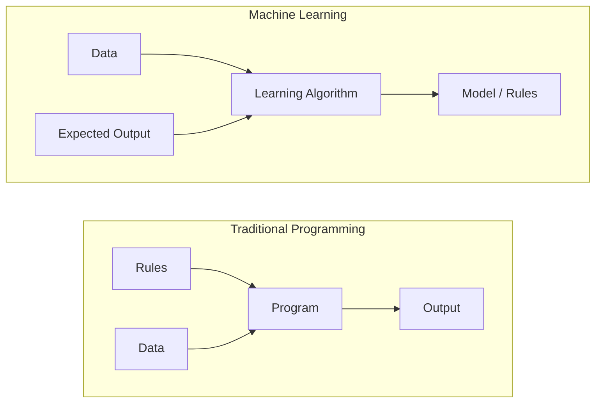
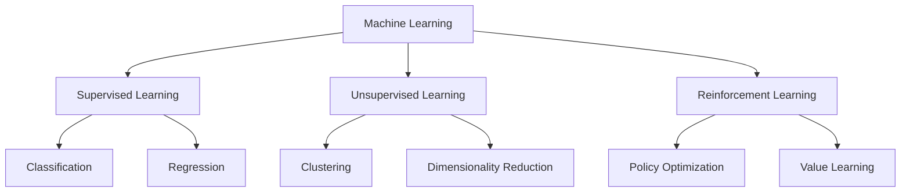
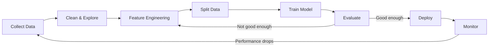
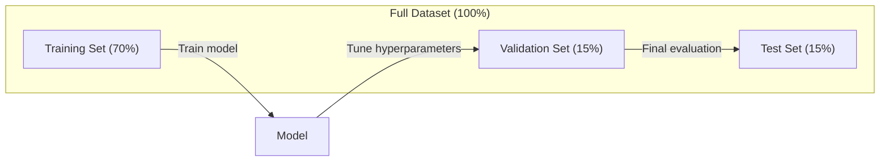
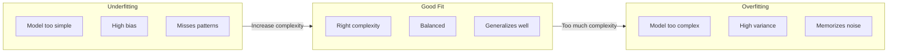
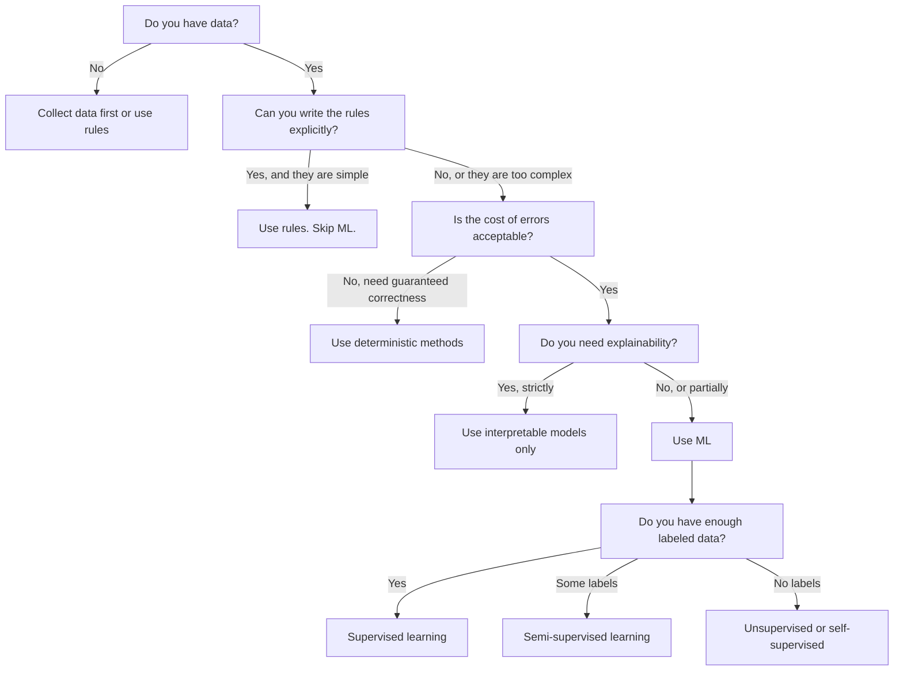

# Was ist maschinelles Lernen

> Maschinelles Lernen bedeutet, Computern beizubringen, Muster in Daten zu finden, statt Regeln von Hand zu schreiben.

**Typ:** Learn
**Sprachen:** Python
**Voraussetzungen:** Phase 1 (Math Foundations)
**Zeit:** ~45 minutes

## Lernziele

- Den Unterschied zwischen überwachtem, unüberwachtem und verstärkendem Lernen erklären und erkennen, welcher Typ auf ein bestimmtes Problem zutrifft
- Einen Nearest-Centroid-Klassifikator von Grund auf implementieren und ihn mit einer zufälligen Basislinie vergleichen
- Zwischen Klassifikations- und Regressionsaufgaben unterscheiden und für jede die passende Verlustfunktion auswählen
- Beurteilen, ob ein gegebenes Geschäftsproblem für ML geeignet ist oder besser mit deterministischen Regeln gelöst wird

## Das Problem

Du möchtest einen Spamfilter bauen. Der traditionelle Ansatz: hinsetzen und Hunderte von Regeln schreiben. „Wenn die E-Mail ‚FREE MONEY‘ enthält, markiere sie als Spam. Wenn sie mehr als 3 Ausrufezeichen hat, markiere sie als Spam.“ Du verbringst Wochen mit dem Schreiben von Regeln. Dann ändern Spammer ihre Formulierungen. Deine Regeln brechen. Du schreibst weitere Regeln. Der Kreislauf endet nie.

Maschinelles Lernen dreht das um. Statt Regeln zu schreiben, gibst du dem Computer Tausende gelabelte E-Mails („Spam“ oder „kein Spam“) und lässt ihn die Regeln selbst herausfinden. Der Computer findet Muster, auf die du nie gekommen wärst. Wenn Spammer ihre Taktik ändern, trainierst du mit neuen Daten neu, statt Code umzuschreiben.

Dieser Wechsel von „Regeln programmieren“ zu „aus Daten lernen“ ist der Kern des maschinellen Lernens. Jede Empfehlungsmaschine, jeder Sprachassistent, jedes selbstfahrende Auto und jedes Sprachmodell funktioniert so.

## Das Konzept

### Aus Daten lernen, nicht aus Regeln

Traditionelles Programmieren und maschinelles Lernen lösen Probleme in entgegengesetzter Richtung.



Traditionelles Programmieren: Du schreibst die Regeln. Das Programm wendet sie auf Daten an, um Ausgaben zu erzeugen.

Maschinelles Lernen: Du gibst Daten und erwartete Ausgaben vor. Der Algorithmus entdeckt die Regeln.

Das „Modell“, das aus dem Training hervorgeht, SIND die Regeln – codiert als Zahlen (Gewichte, Parameter). Es generalisiert von Beispielen, die es gesehen hat, um Vorhersagen für Daten zu machen, die es nie gesehen hat.

### Die drei Arten des maschinellen Lernens



**Überwachtes Lernen**: Du hast Eingabe-Ausgabe-Paare. Das Modell lernt, Eingaben auf Ausgaben abzubilden.
- „Hier sind 10.000 Fotos, gelabelt als Katze oder Hund. Lerne, sie zu unterscheiden.“
- „Hier sind Hausmerkmale und Preise. Lerne, den Preis vorherzusagen.“

**Unüberwachtes Lernen**: Du hast nur Eingaben. Keine Labels. Das Modell findet die Struktur selbst.
- „Hier sind 10.000 Kaufhistorien von Kund:innen. Finde natürliche Gruppierungen.“
- „Hier sind Datenpunkte mit 1.000 Dimensionen. Reduziere sie auf 2 Dimensionen und erhalte die Struktur.“

**Verstärkendes Lernen**: Ein Agent führt Aktionen in einer Umgebung aus und erhält Belohnungen oder Strafen. Er lernt eine Strategie (Policy), um die Gesamtbelohnung zu maximieren.
- „Spiele dieses Spiel. +1 fürs Gewinnen, -1 fürs Verlieren. Finde eine Strategie.“
- „Steuere diesen Roboterarm. +1 fürs Aufheben des Objekts, -0,01 für jede verschwendete Sekunde.“

Das meiste, was du in der Praxis bauen wirst, nutzt überwachtes Lernen. Unüberwachtes Lernen ist häufig bei Vorverarbeitung und Exploration. Verstärkendes Lernen treibt Game-AI, Robotik und RLHF für Sprachmodelle an.

### Jenseits der großen Drei

Die drei Kategorien oben sind sauber, aber ML in der realen Welt verwischt oft die Grenzen.

**Semi-supervised learning** nutzt eine kleine Menge gelabelter Daten und eine große Menge ungelabelter Daten. Du könntest 100 gelabelte medizinische Bilder und 100.000 ungelabelte haben. Techniken sind unter anderem:

- **Label propagation:** Baue einen Graphen, der ähnliche Datenpunkte verbindet. Labels breiten sich über den Graphen von gelabelten Knoten zu ungelabelten Nachbarn aus.
- **Pseudo-labeling:** Trainiere ein Modell auf den gelabelten Daten, nutze es, um Labels für ungelabelte Daten vorherzusagen, und trainiere dann auf allem neu. Das Modell bootstrapped seinen eigenen Trainingssatz.
- **Consistency regularization:** Das Modell sollte für eine Eingabe und eine leicht gestörte Version derselben Eingabe die gleiche Vorhersage liefern. Das funktioniert auch ohne Labels.

**Self-supervised learning** erzeugt Supervision aus den Daten selbst. Es sind überhaupt keine menschlichen Labels nötig. Das Modell erzeugt seine eigene Vorhersageaufgabe aus der Struktur der Daten.

- **Masked language modeling (BERT):** Verstecke 15 % der Wörter in einem Satz und trainiere das Modell, die fehlenden Wörter vorherzusagen. Die „Labels“ stammen aus dem Originaltext.
- **Contrastive learning (SimCLR):** Nimm ein Bild und erzeuge zwei augmentierte Versionen. Trainiere das Modell, zu erkennen, dass beide vom selben Bild stammen, und sie gleichzeitig von augmentierten Versionen anderer Bilder zu unterscheiden.
- **Next-token prediction (GPT):** Sage das nächste Wort anhand aller vorherigen Wörter vorher. Jedes Textdokument wird zu einem Trainingsbeispiel.

Das sind keine separaten Kategorien neben den großen Drei. Es sind Strategien, die überwachte und unüberwachte Ideen kombinieren. Self-supervised learning ist technisch gesehen überwachtes Lernen (das Modell sagt etwas vorher), aber die Labels werden automatisch erzeugt, nicht von Menschen.

### Klassifikation vs. Regression

Das sind die zwei wichtigsten Aufgaben im überwachten Lernen.

| Aspekt | Klassifikation | Regression |
|--------|---------------|------------|
| Ausgabe | Diskrete Kategorien | Kontinuierliche Zahlen |
| Beispiel | „Ist diese E-Mail Spam?“ | „Wie hoch wird der Hauspreis sein?“ |
| Ausgaberaum | {Katze, Hund, Vogel} | Beliebige reelle Zahl |
| Verlustfunktion | Kreuzentropie, Accuracy | Mittlerer quadratischer Fehler, MAE |
| Entscheidung | Grenzen zwischen Klassen | Eine Kurve, die zu den Daten passt |

Klassifikation beantwortet „welche Kategorie?“, Regression beantwortet „wie viel?“

Manche Probleme lassen sich auf beide Arten formulieren. Vorhersagen, ob eine Aktie steigt oder fällt, ist Klassifikation. Den exakten Preis vorherzusagen ist Regression.

### Der ML-Workflow

Jedes Machine-Learning-Projekt folgt derselben Pipeline, unabhängig vom Algorithmus.



**Collect Data**: Rohdaten sammeln. Mehr Daten sind fast immer besser, aber Qualität ist wichtiger als Quantität.

**Clean & Explore**: Mit fehlenden Werten umgehen, Duplikate entfernen, Verteilungen visualisieren, Anomalien erkennen. Dieser Schritt nimmt oft 60–80 % der gesamten Projektzeit ein.

**Feature Engineering**: Rohdaten in Features umwandeln, die das Modell nutzen kann. Aus Datumswerten den Wochentag machen. Numerische Spalten normalisieren. Kategoriale Variablen kodieren. Gute Features sind wichtiger als ausgefallene Algorithmen.

**Split Data**: In Trainings-, Validierungs- und Testsets aufteilen. Das Modell trainiert auf den Trainingsdaten, du stimmst Hyperparameter auf den Validierungsdaten ab und berichtest die finale Leistung auf den Testdaten.

**Train Model**: Trainingsdaten in einen Algorithmus einspeisen. Der Algorithmus passt interne Parameter an, um eine Verlustfunktion zu minimieren.

**Evaluate**: Leistung auf Validierungs-/Testdaten messen. Wenn die Leistung nicht akzeptabel ist, geh zurück und probiere andere Features, Algorithmen oder Hyperparameter.

**Deploy**: Das Modell in Produktion bringen, wo es Vorhersagen für neue Daten macht.

**Monitor**: Leistung über die Zeit verfolgen. Datenverteilungen ändern sich (Data Drift), und Modelle degradieren. Wenn die Leistung sinkt, neu trainieren.

### Trainings-, Validierungs- und Test-Splits

Das ist das wichtigste Konzept, das Anfänger:innen falsch verstehen. Du musst dein Modell auf Daten evaluieren, die es während des Trainings nie gesehen hat. Sonst misst du Auswendiglernen statt Lernen.



| Split | Zweck | Wann verwendet | Typische Größe |
|-------|---------|-----------|-------------|
| Training | Das Modell lernt aus diesen Daten | Während des Trainings | 60-80% |
| Validation | Hyperparameter abstimmen, Modelle vergleichen | Nach jedem Trainingslauf | 10-20% |
| Test | Finale unverzerrte Leistungsschätzung | Einmal, ganz am Ende | 10-20% |

Das Testset ist heilig. Du schaust es dir genau einmal an. Wenn du dein Modell fortlaufend anhand der Testleistung anpasst, trainierst du faktisch auf dem Testset, und deine berichteten Zahlen sind bedeutungslos.

Für kleine Datensätze nutze k-fold cross-validation: Teile die Daten in k Teile, trainiere auf k-1 Teilen, validiere auf dem verbleibenden Teil, rotiere und bilde den Mittelwert der Ergebnisse.

### Overfitting vs Underfitting



**Underfitting**: Das Modell ist zu einfach, um Muster in den Daten zu erfassen. Eine Gerade versucht, eine gekrümmte Beziehung abzubilden. Trainingsfehler ist hoch. Testfehler ist hoch.

**Overfitting**: Das Modell ist zu komplex und merkt sich die Trainingsdaten inklusive ihres Rauschens. Eine stark gewellte Kurve, die durch jeden Trainingspunkt geht, aber bei neuen Daten versagt. Trainingsfehler ist niedrig. Testfehler ist hoch.

**Good fit**: Das Modell erfasst echte Muster, ohne Rauschen auswendig zu lernen. Trainingsfehler und Testfehler sind beide vernünftig niedrig.

Anzeichen für Overfitting:
- Trainingsgenauigkeit ist deutlich höher als Validierungsgenauigkeit
- Das Modell performt gut auf Trainingsdaten, aber schlecht auf neuen Daten
- Mehr Trainingsdaten verbessern die Leistung (das Modell hat auswendig gelernt, nicht gelernt)

Gegenmaßnahmen bei Overfitting:
- Mehr Trainingsdaten beschaffen
- Modellkomplexität reduzieren (weniger Parameter, einfachere Architektur)
- Regularisierung (eine Strafe für große Gewichte hinzufügen)
- Dropout (Neuronen während des Trainings zufällig auf null setzen)
- Early stopping (Training stoppen, wenn der Validierungsfehler steigt)

Gegenmaßnahmen bei Underfitting:
- Ein komplexeres Modell verwenden
- Mehr Features hinzufügen
- Regularisierung reduzieren
- Länger trainieren

### Der Bias-Variance-Tradeoff

Das ist der mathematische Rahmen hinter Overfitting und Underfitting.

**Bias**: Fehler durch falsche Annahmen im Modell. Ein lineares Modell hat hohen Bias, wenn die wahre Beziehung nichtlinear ist. Hoher Bias führt zu Underfitting.

**Variance**: Fehler durch Empfindlichkeit gegenüber kleinen Schwankungen in den Trainingsdaten. Ein Modell mit hoher Varianz gibt sehr unterschiedliche Vorhersagen, wenn es auf verschiedenen Teilmengen der Daten trainiert wird. Hohe Varianz führt zu Overfitting.

| Modellkomplexität | Bias | Varianz | Ergebnis |
|-----------------|------|----------|--------|
| Zu niedrig (lineares Modell für gekrümmte Daten) | Hoch | Niedrig | Underfitting |
| Genau richtig | Mittel | Mittel | Gute Generalisierung |
| Zu hoch (Polynom 20. Grades für 10 Punkte) | Niedrig | Hoch | Overfitting |

Gesamtfehler = Bias^2 + Varianz + irreduzibles Rauschen

Irreduzibles Rauschen kannst du nicht verringern (es ist Zufälligkeit in den Daten selbst). Du willst den Sweet Spot finden, bei dem Bias^2 + Varianz minimiert ist.

### No Free Lunch Theorem

Es gibt keinen einzelnen Algorithmus, der für jedes Problem am besten funktioniert. Ein Algorithmus, der auf einer Problemklasse gut performt, performt auf einer anderen schlecht. Deshalb probieren Data Scientists mehrere Algorithmen aus und vergleichen Ergebnisse.

In der Praxis hängt die Wahl ab von:
- Wie viele Daten du hast
- Wie viele Features es gibt
- Ob die Beziehung linear oder nichtlinear ist
- Ob du Interpretierbarkeit brauchst
- Wie viel Rechenleistung du dir leisten kannst

### Wann man maschinelles Lernen NICHT verwenden sollte

ML ist mächtig, aber nicht immer das richtige Werkzeug. Bevor du zu einem Modell greifst, frag dich, ob du wirklich eins brauchst.

**Verwende ML nicht, wenn:**

- **Regeln einfach und klar definiert sind.** Steuerberechnung, Sortieralgorithmen, Einheitenumrechnung. Wenn du die Logik in ein paar if-Statements schreiben kannst, fügt ein Modell nur Komplexität ohne Nutzen hinzu.
- **Du keine oder sehr wenige Daten hast.** ML braucht Beispiele zum Lernen. Mit 10 Datenpunkten kannst du nichts Sinnvolles trainieren. Sammle zuerst Daten.
- **Die Kosten von Fehlern katastrophal sind und du garantierte Korrektheit brauchst.** Medizinische Dosierungsberechnung, Steuerung von Kernreaktoren, kryptografische Verifikation. ML-Modelle sind probabilistisch. Sie liegen manchmal falsch. Wenn „manchmal falsch“ inakzeptabel ist, nutze deterministische Methoden.
- **Eine Lookup-Tabelle oder Heuristik das Problem löst.** Wenn ein einfacher Schwellenwert oder eine Tabelle 99 % der Fälle abdeckt, erhöht ML nur die Wartungskosten ohne nennenswerte Verbesserung.
- **Du die Entscheidung nicht erklären kannst und Erklärbarkeit erforderlich ist.** Regulierte Branchen (Kreditvergabe, Versicherungen, Strafjustiz) verlangen teils, dass jede Entscheidung vollständig erklärbar ist. Einige ML-Modelle sind interpretierbar (lineare Regression, kleine Entscheidungsbäume). Die meisten nicht.
- **Sich das Problem schneller ändert, als du neu trainieren kannst.** Wenn sich Regeln täglich ändern und Retraining eine Woche dauert, ist das Modell immer veraltet.

Nutze dieses Entscheidungs-Flussdiagramm:



## Bau es

Der Code in `code/ml_intro.py` implementiert einen Nearest-Centroid-Klassifikator von Grund auf – den einfachstmöglichen ML-Algorithmus. Er demonstriert die Kernidee: aus Daten lernen und dann auf neuen Daten vorhersagen.

### Schritt 1: Nearest-Centroid-Klassifikator von Grund auf

Der Nearest-Centroid-Klassifikator berechnet das Zentrum (Mittelwert) jeder Klasse in den Trainingsdaten. Für Vorhersagen weist er jeden neuen Punkt der Klasse zu, deren Zentrum am nächsten liegt.

```python
class NearestCentroid:
    def fit(self, X, y):
        self.classes = np.unique(y)
        self.centroids = np.array([
            X[y == c].mean(axis=0) for c in self.classes
        ])

    def predict(self, X):
        distances = np.array([
            np.sqrt(((X - c) ** 2).sum(axis=1))
            for c in self.centroids
        ])
        return self.classes[distances.argmin(axis=0)]
```

Das ist der gesamte Algorithmus. Fit berechnet zwei Mittelwerte. Predict berechnet Distanzen. Kein Gradient Descent, keine Iteration, keine Hyperparameter.

### Schritt 2: Auf synthetischen Daten trainieren

Wir erzeugen einen 2D-Klassifikationsdatensatz mit zwei Klassen, die sich leicht überlappen. Der Centroid-Klassifikator zieht eine lineare Entscheidungsgrenze zwischen den Klassenzentren.

```python
rng = np.random.RandomState(42)
X_class0 = rng.randn(100, 2) + np.array([1.0, 1.0])
X_class1 = rng.randn(100, 2) + np.array([-1.0, -1.0])
X = np.vstack([X_class0, X_class1])
y = np.array([0] * 100 + [1] * 100)
```

### Schritt 3: Gegen eine Basislinie vergleichen

Jedes ML-Modell sollte gegen eine triviale Basislinie verglichen werden. Hier sagt die Basislinie eine zufällige Klasse voraus. Wenn dein ML-Modell nicht besser als Zufall rät, stimmt etwas nicht.

```python
baseline_preds = rng.choice([0, 1], size=len(y_test))
baseline_acc = np.mean(baseline_preds == y_test)
```

Der Centroid-Klassifikator sollte auf diesem sauberen Datensatz etwa 90 % oder mehr Genauigkeit erreichen. Die zufällige Basislinie liegt bei etwa 50 %.

### Warum das wichtig ist

Der Nearest-Centroid-Klassifikator ist trivial einfach. Er hat keine Hyperparameter, keine Iteration, kein Gradient Descent. Trotzdem zeigt er das grundlegende ML-Muster:

1. **Lernen** einer Repräsentation aus Trainingsdaten (die Zentroiden)
2. **Vorhersagen** auf neuen Daten mit dieser Repräsentation (nächste Distanz)
3. **Evaluieren** gegen eine Basislinie (Zufallsraten)

Jeder ML-Algorithmus, von logistischer Regression bis zu Transformern, folgt demselben Drei-Schritte-Muster. Die Repräsentation wird komplexer, aber der Workflow bleibt gleich.

### Schritt 4: Was der Centroid-Klassifikator nicht kann

Der Nearest-Centroid-Klassifikator nimmt an, dass jede Klasse einen einzelnen Cluster bildet. Er zieht lineare Entscheidungsgrenzen. Er scheitert, wenn:

- Klassen mehrere Cluster haben (z. B. kann die Ziffer „1“ auf verschiedene Arten geschrieben werden)
- Die Entscheidungsgrenze nichtlinear ist (z. B. umschließt eine Klasse eine andere)
- Features sehr unterschiedliche Skalen haben (die Distanz wird vom Feature mit der größten Skala dominiert)

Diese Einschränkungen motivieren jeden weiteren Algorithmus, den du lernen wirst. K-nearest neighbors kann mehrere Cluster handhaben. Entscheidungsbäume handhaben nichtlineare Grenzen. Feature-Skalierung löst das Skalenproblem. Jede Lektion baut auf den Einschränkungen der vorherigen auf.

## Nutze es

sklearn bietet `NearestCentroid` und Generatoren für synthetische Daten:

```python
from sklearn.neighbors import NearestCentroid
from sklearn.datasets import make_classification
from sklearn.model_selection import train_test_split

X, y = make_classification(
    n_samples=500, n_features=2, n_redundant=0,
    n_clusters_per_class=1, random_state=42
)
X_train, X_test, y_train, y_test = train_test_split(X, y, test_size=0.3)

clf = NearestCentroid()
clf.fit(X_train, y_train)
print(f"Accuracy: {clf.score(X_test, y_test):.3f}")
```

## Shippe es

Diese Lektion erzeugt `outputs/prompt-ml-problem-framer.md` -- einen Prompt, der vage Geschäftsprobleme in konkrete ML-Aufgaben überführt. Gib ihm eine Problembeschreibung („wir wollen Churn reduzieren“ oder „Nachfrage für das nächste Quartal vorhersagen“) und er identifiziert den Lerntyp, definiert das Vorhersageziel, listet mögliche Features auf, wählt eine Erfolgsmetrik, legt eine Basislinie fest und markiert Stolperfallen wie Data Leakage oder Class Imbalance. Nutze ihn am Anfang jedes ML-Projekts, um nicht das Falsche zu bauen.

## Schlüsselbegriffe

| Begriff | Was man sagt | Was es tatsächlich bedeutet |
|------|----------------|----------------------|
| Modell | „Die KI“ | Eine mathematische Funktion mit lernbaren Parametern, die Eingaben auf Ausgaben abbildet |
| Training | „Der KI etwas beibringen“ | Ausführen eines Optimierungsalgorithmus, der Modellparameter anpasst, damit Vorhersagen zu bekannten Ausgaben passen |
| Feature | „Eine Eingabespalte“ | Eine messbare Eigenschaft der Daten, die das Modell für Vorhersagen nutzt |
| Label | „Die Antwort“ | Die bekannte Ausgabe für ein Trainingsbeispiel, genutzt zur Berechnung des Fehlersignals |
| Hyperparameter | „Eine Einstellung, an der man dreht“ | Ein vor dem Training gesetzter Parameter, der den Lernprozess steuert (Lernrate, Anzahl der Schichten) |
| Loss function | „Wie falsch das Modell ist“ | Eine Funktion, die die Lücke zwischen vorhergesagten und tatsächlichen Ausgaben misst und die das Training minimieren will |
| Overfitting | „Es hat den Test auswendig gelernt“ | Das Modell hat trainingsspezifisches Rauschen statt allgemeiner Muster gelernt und versagt daher bei neuen Daten |
| Underfitting | „Es hat gar nichts gelernt“ | Das Modell ist zu einfach, um die echten Muster in den Daten zu erfassen |
| Generalization | „Es funktioniert auf neuen Daten“ | Die Fähigkeit des Modells, auf Daten, auf denen es nicht trainiert wurde, genaue Vorhersagen zu machen |
| Cross-validation | „Auf verschiedenen Teilstücken testen“ | Daten wiederholt in Train/Test-Folds teilen und Ergebnisse mitteln, was eine robustere Leistungsschätzung liefert |
| Regularization | „Gewichte klein halten“ | Einen Strafterm zur Verlustfunktion hinzufügen, der übermäßig komplexe Modelle entmutigt |
| Data drift | „Die Welt hat sich verändert“ | Die statistische Verteilung eingehender Daten verschiebt sich über die Zeit und verschlechtert die Modellleistung |

## Übungen

1. Nimm einen beliebigen Datensatz (z. B. Iris, Titanic). Teile ihn in 70/15/15 in Train/Validation/Test. Erkläre, warum du Hyperparameter nicht auf dem Testset abstimmen solltest.
2. Nenne drei reale Probleme. Bestimme für jedes, ob es Klassifikation, Regression oder Clustering ist, und ob es überwacht oder unüberwacht ist.
3. Ein Modell erreicht 99 % Genauigkeit auf Trainingsdaten, aber 60 % auf Testdaten. Diagnostiziere das Problem und nenne drei Dinge, die du zur Behebung versuchen würdest.

## Weiterführende Literatur

- [An Introduction to Statistical Learning](https://www.statlearning.com/) - kostenloses Lehrbuch, das alle klassischen ML-Methoden mit praktischen Beispielen behandelt
- [Google's Machine Learning Crash Course](https://developers.google.com/machine-learning/crash-course) - knappe visuelle Einführung in ML-Konzepte
- [Scikit-learn User Guide](https://scikit-learn.org/stable/user_guide.html) - die praktische Referenz für die Umsetzung von ML in Python
