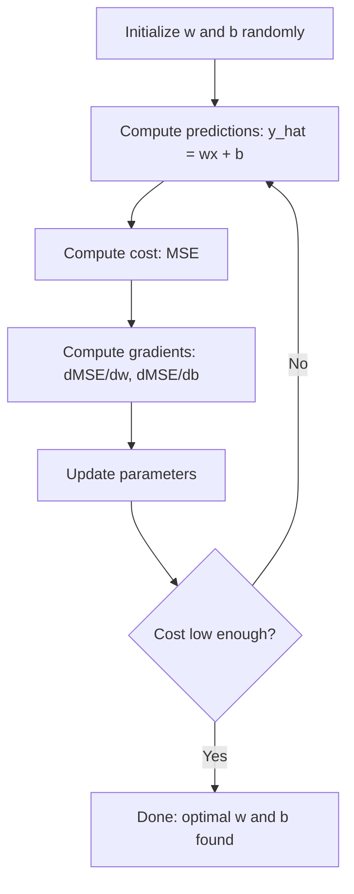

# Lineare Regression

> Die lineare Regression zieht die beste Gerade durch deine Daten. Sie ist das „Hello World“ des maschinellen Lernens.

**Typ:** Build
**Sprachen:** Python
**Voraussetzungen:** Phase 1 (Lineare Algebra, Analysis, Optimierung), Phase 2 Lektion 1
**Dauer:** ~90 Minuten

## Lernziele

- Die Update-Regeln des Gradientenabstiegs für den Mean Squared Error herleiten und lineare Regression von Grund auf implementieren
- Gradientenabstieg und Normalengleichung hinsichtlich Rechenkomplexität vergleichen und wissen, wann welche Methode zu verwenden ist
- Ein multiples lineares Regressionsmodell mit Feature-Standardisierung bauen und die gelernten Gewichte interpretieren
- Erklären, wie Ridge-Regression (L2-Regularisierung) Overfitting verhindert, indem große Gewichte bestraft werden

## Das Problem

Du hast Daten: Hausgrößen und ihre Verkaufspreise. Du möchtest den Preis eines neuen Hauses anhand seiner Größe vorhersagen. Du könntest ihn in einem Streudiagramm schätzen, aber du brauchst eine Formel. Du brauchst eine Gerade, die die Daten bestmöglich trifft, damit du jede beliebige Größe einsetzen und eine Preisvorhersage erhalten kannst.

Lineare Regression liefert dir diese Gerade. Noch wichtiger: Sie führt den gesamten ML-Trainingszyklus ein: ein Modell definieren, eine Kostenfunktion definieren, die Parameter optimieren. Jeder ML-Algorithmus folgt demselben Muster. Beherrsche es hier im einfachsten Fall, und du wirst es überall wiedererkennen.

Das ist nicht nur für einfache Probleme nützlich. Lineare Regression wird in Produktionssystemen für Nachfrageprognosen, A/B-Test-Analysen, Finanzmodellierung und als Baseline für jede Regressionsaufgabe eingesetzt.

## Das Konzept

### Das Modell

Lineare Regression nimmt eine lineare Beziehung zwischen Eingabe (x) und Ausgabe (y) an:

```
y = wx + b
```

- `w` (Gewicht/Steigung): um wie viel sich y ändert, wenn x um 1 steigt
- `b` (Bias/Achsenabschnitt): der Wert von y, wenn x = 0

Für mehrere Eingaben (Features) erweitert sich das zu:

```
y = w1*x1 + w2*x2 + ... + wn*xn + b
```

Oder in Vektorform: `y = w^T * x + b`

Das Ziel: die Werte von w und b finden, die das vorhergesagte y über alle Trainingsbeispiele hinweg so nah wie möglich an das tatsächliche y bringen.

### Die Kostenfunktion (Mean Squared Error)

Wie misst du „so nah wie möglich“? Du brauchst eine einzelne Zahl, die erfasst, wie falsch deine Vorhersagen sind. Die häufigste Wahl ist der Mean Squared Error (MSE):

```
MSE = (1/n) * sum((y_predicted - y_actual)^2)
```

Warum quadrieren? Aus zwei Gründen. Erstens bestraft es große Fehler stärker als kleine Fehler (ein Fehler von 10 ist 100x schlimmer als ein Fehler von 1, nicht 10x). Zweitens ist die quadratische Funktion überall glatt und differenzierbar, was die Optimierung direkt macht.

Die Kostenfunktion erzeugt eine Oberfläche. Für ein einzelnes Gewicht w und Bias b sieht die MSE-Oberfläche wie eine Schüssel aus (ein konvexes Paraboloid). Der Boden der Schüssel ist dort, wo der MSE minimiert wird. Training bedeutet, diesen Boden zu finden.

### Gradientenabstieg

Gradientenabstieg findet den Boden der Schüssel, indem er bergab Schritte macht.



Die Gradienten sagen dir zwei Dinge: in welche Richtung du jeden Parameter bewegen musst und wie stark.

Für MSE mit y_hat = wx + b:

```
dMSE/dw = (2/n) * sum((y_hat - y) * x)
dMSE/db = (2/n) * sum(y_hat - y)
```

Die Update-Regel:

```
w = w - learning_rate * dMSE/dw
b = b - learning_rate * dMSE/db
```

Die Lernrate steuert die Schrittgröße. Zu groß: Du überschießt das Minimum und divergierst. Zu klein: Das Training dauert ewig. Typische Startwerte: 0.01, 0.001 oder 0.0001.

### Die Normalengleichung (Closed-Form-Lösung)

Speziell für lineare Regression gibt es eine direkte Formel, die die optimalen Gewichte ohne Iteration liefert:

```
w = (X^T * X)^(-1) * X^T * y
```

Dabei wird eine Matrix invertiert, um w in einem Schritt zu lösen. Für kleine Datensätze funktioniert das perfekt. Für große Datensätze (Millionen Zeilen oder Tausende Features) wird Gradientenabstieg bevorzugt, weil Matrixinversion in der Anzahl der Features O(n^3) ist.

### Multiple lineare Regression

Mit mehreren Features wird das Modell zu:

```
y = w1*x1 + w2*x2 + ... + wn*xn + b
```

Alles funktioniert gleich: MSE ist die Kostenfunktion, Gradientenabstieg aktualisiert alle Gewichte gleichzeitig. Der einzige Unterschied ist, dass du statt einer Linie eine Hyperebene fitten musst.

Feature-Skalierung ist hier wichtig. Wenn ein Feature von 0 bis 1 reicht und ein anderes von 0 bis 1.000.000, bekommt Gradientenabstieg Probleme, weil die Kostenoberfläche gestreckt wird. Standardisiere Features (Mittelwert abziehen, durch Standardabweichung teilen), bevor du trainierst.

### Polynomiale Regression

Was, wenn die Beziehung nicht linear ist? Du kannst trotzdem lineare Regression verwenden, indem du polynomiale Features erzeugst:

```
y = w1*x + w2*x^2 + w3*x^3 + b
```

Das ist weiterhin „lineare“ Regression, weil das Modell in den Gewichten (w1, w2, w3) linear ist. Du verwendest nur nichtlineare Features von x.

Höhergradige Polynome können komplexere Kurven fitten, riskieren aber Overfitting. Ein Polynom 10. Grades geht durch jeden Punkt in einem Datensatz mit 10 Punkten, sagt aber auf neuen Daten schlecht voraus.

### R-Quadrat-Score

MSE sagt dir, wie falsch du liegst, aber die Zahl hängt von der Skala von y ab. R-Quadrat (R^2) liefert ein skalenunabhängiges Maß:

```
R^2 = 1 - (sum of squared residuals) / (sum of squared deviations from mean)
    = 1 - SS_res / SS_tot
```

- R^2 = 1.0: perfekte Vorhersagen
- R^2 = 0.0: das Modell ist nicht besser, als jedes Mal den Mittelwert vorherzusagen
- R^2 < 0.0: das Modell ist schlechter als die Vorhersage des Mittelwerts

### Vorschau auf Regularisierung (Ridge-Regression)

Wenn du viele Features hast, kann das Modell overfitten, indem es große Gewichte zuweist. Ridge-Regression (L2-Regularisierung) ergänzt eine Strafe:

```
Cost = MSE + lambda * sum(w_i^2)
```

Der Strafterm entmutigt große Gewichte. Der Hyperparameter lambda steuert den Trade-off: höheres lambda bedeutet kleinere Gewichte und mehr Regularisierung. Das behandeln wir in einer späteren Lektion im Detail. Für jetzt reicht: Sie existiert und hilft aus genau diesem Grund.

## Bau es

### Schritt 1: Beispieldaten erzeugen

```python
import random
import math

random.seed(42)

TRUE_W = 3.0
TRUE_B = 7.0
N_SAMPLES = 100

X = [random.uniform(0, 10) for _ in range(N_SAMPLES)]
y = [TRUE_W * x + TRUE_B + random.gauss(0, 2.0) for x in X]

print(f"Generated {N_SAMPLES} samples")
print(f"True relationship: y = {TRUE_W}x + {TRUE_B} (+ noise)")
print(f"First 5 points: {[(round(X[i], 2), round(y[i], 2)) for i in range(5)]}")
```

### Schritt 2: Lineare Regression von Grund auf mit Gradientenabstieg

```python
class LinearRegression:
    def __init__(self, learning_rate=0.01):
        self.w = 0.0
        self.b = 0.0
        self.lr = learning_rate
        self.cost_history = []

    def predict(self, X):
        return [self.w * x + self.b for x in X]

    def compute_cost(self, X, y):
        predictions = self.predict(X)
        n = len(y)
        cost = sum((pred - actual) ** 2 for pred, actual in zip(predictions, y)) / n
        return cost

    def compute_gradients(self, X, y):
        predictions = self.predict(X)
        n = len(y)
        dw = (2 / n) * sum((pred - actual) * x for pred, actual, x in zip(predictions, y, X))
        db = (2 / n) * sum(pred - actual for pred, actual in zip(predictions, y))
        return dw, db

    def fit(self, X, y, epochs=1000, print_every=200):
        for epoch in range(epochs):
            dw, db = self.compute_gradients(X, y)
            self.w -= self.lr * dw
            self.b -= self.lr * db
            cost = self.compute_cost(X, y)
            self.cost_history.append(cost)
            if epoch % print_every == 0:
                print(f"  Epoch {epoch:4d} | Cost: {cost:.4f} | w: {self.w:.4f} | b: {self.b:.4f}")
        return self

    def r_squared(self, X, y):
        predictions = self.predict(X)
        y_mean = sum(y) / len(y)
        ss_res = sum((actual - pred) ** 2 for actual, pred in zip(y, predictions))
        ss_tot = sum((actual - y_mean) ** 2 for actual in y)
        return 1 - (ss_res / ss_tot)


print("=== Training Linear Regression (Gradient Descent) ===")
model = LinearRegression(learning_rate=0.005)
model.fit(X, y, epochs=1000, print_every=200)
print(f"\nLearned: y = {model.w:.4f}x + {model.b:.4f}")
print(f"True:    y = {TRUE_W}x + {TRUE_B}")
print(f"R-squared: {model.r_squared(X, y):.4f}")
```

### Schritt 3: Normalengleichung (Closed-Form-Lösung)

```python
class LinearRegressionNormal:
    def __init__(self):
        self.w = 0.0
        self.b = 0.0

    def fit(self, X, y):
        n = len(X)
        x_mean = sum(X) / n
        y_mean = sum(y) / n
        numerator = sum((X[i] - x_mean) * (y[i] - y_mean) for i in range(n))
        denominator = sum((X[i] - x_mean) ** 2 for i in range(n))
        self.w = numerator / denominator
        self.b = y_mean - self.w * x_mean
        return self

    def predict(self, X):
        return [self.w * x + self.b for x in X]

    def r_squared(self, X, y):
        predictions = self.predict(X)
        y_mean = sum(y) / len(y)
        ss_res = sum((actual - pred) ** 2 for actual, pred in zip(y, predictions))
        ss_tot = sum((actual - y_mean) ** 2 for actual in y)
        return 1 - (ss_res / ss_tot)


print("\n=== Normal Equation (Closed-Form) ===")
model_normal = LinearRegressionNormal()
model_normal.fit(X, y)
print(f"Learned: y = {model_normal.w:.4f}x + {model_normal.b:.4f}")
print(f"R-squared: {model_normal.r_squared(X, y):.4f}")
```

### Schritt 4: Multiple lineare Regression

```python
class MultipleLinearRegression:
    def __init__(self, n_features, learning_rate=0.01):
        self.weights = [0.0] * n_features
        self.bias = 0.0
        self.lr = learning_rate
        self.cost_history = []

    def predict_single(self, x):
        return sum(w * xi for w, xi in zip(self.weights, x)) + self.bias

    def predict(self, X):
        return [self.predict_single(x) for x in X]

    def compute_cost(self, X, y):
        predictions = self.predict(X)
        n = len(y)
        return sum((pred - actual) ** 2 for pred, actual in zip(predictions, y)) / n

    def fit(self, X, y, epochs=1000, print_every=200):
        n = len(y)
        n_features = len(X[0])
        for epoch in range(epochs):
            predictions = self.predict(X)
            errors = [pred - actual for pred, actual in zip(predictions, y)]
            for j in range(n_features):
                grad = (2 / n) * sum(errors[i] * X[i][j] for i in range(n))
                self.weights[j] -= self.lr * grad
            grad_b = (2 / n) * sum(errors)
            self.bias -= self.lr * grad_b
            cost = self.compute_cost(X, y)
            self.cost_history.append(cost)
            if epoch % print_every == 0:
                print(f"  Epoch {epoch:4d} | Cost: {cost:.4f}")
        return self

    def r_squared(self, X, y):
        predictions = self.predict(X)
        y_mean = sum(y) / len(y)
        ss_res = sum((actual - pred) ** 2 for actual, pred in zip(y, predictions))
        ss_tot = sum((actual - y_mean) ** 2 for actual in y)
        return 1 - (ss_res / ss_tot)


random.seed(42)
N = 100
X_multi = []
y_multi = []
for _ in range(N):
    size = random.uniform(500, 3000)
    bedrooms = random.randint(1, 5)
    age = random.uniform(0, 50)
    price = 50 * size + 10000 * bedrooms - 1000 * age + 50000 + random.gauss(0, 20000)
    X_multi.append([size, bedrooms, age])
    y_multi.append(price)


def standardize(X):
    n_features = len(X[0])
    means = [sum(X[i][j] for i in range(len(X))) / len(X) for j in range(n_features)]
    stds = []
    for j in range(n_features):
        variance = sum((X[i][j] - means[j]) ** 2 for i in range(len(X))) / len(X)
        stds.append(variance ** 0.5)
    X_scaled = []
    for i in range(len(X)):
        row = [(X[i][j] - means[j]) / stds[j] if stds[j] > 0 else 0 for j in range(n_features)]
        X_scaled.append(row)
    return X_scaled, means, stds


y_mean_val = sum(y_multi) / len(y_multi)
y_std_val = (sum((yi - y_mean_val) ** 2 for yi in y_multi) / len(y_multi)) ** 0.5
y_scaled = [(yi - y_mean_val) / y_std_val for yi in y_multi]

X_scaled, x_means, x_stds = standardize(X_multi)

print("\n=== Multiple Linear Regression (3 features) ===")
print("Features: house size, bedrooms, age")
multi_model = MultipleLinearRegression(n_features=3, learning_rate=0.01)
multi_model.fit(X_scaled, y_scaled, epochs=1000, print_every=200)

print(f"\nWeights (standardized): {[round(w, 4) for w in multi_model.weights]}")
print(f"Bias (standardized): {multi_model.bias:.4f}")
print(f"R-squared: {multi_model.r_squared(X_scaled, y_scaled):.4f}")
```

### Schritt 5: Polynomiale Regression

```python
class PolynomialRegression:
    def __init__(self, degree, learning_rate=0.01):
        self.degree = degree
        self.weights = [0.0] * degree
        self.bias = 0.0
        self.lr = learning_rate

    def make_features(self, X):
        return [[x ** (d + 1) for d in range(self.degree)] for x in X]

    def predict(self, X):
        features = self.make_features(X)
        return [sum(w * f for w, f in zip(self.weights, row)) + self.bias for row in features]

    def fit(self, X, y, epochs=1000, print_every=200):
        features = self.make_features(X)
        n = len(y)
        for epoch in range(epochs):
            predictions = [sum(w * f for w, f in zip(self.weights, row)) + self.bias for row in features]
            errors = [pred - actual for pred, actual in zip(predictions, y)]
            for j in range(self.degree):
                grad = (2 / n) * sum(errors[i] * features[i][j] for i in range(n))
                self.weights[j] -= self.lr * grad
            grad_b = (2 / n) * sum(errors)
            self.bias -= self.lr * grad_b
            if epoch % print_every == 0:
                cost = sum(e ** 2 for e in errors) / n
                print(f"  Epoch {epoch:4d} | Cost: {cost:.6f}")
        return self

    def r_squared(self, X, y):
        predictions = self.predict(X)
        y_mean = sum(y) / len(y)
        ss_res = sum((actual - pred) ** 2 for actual, pred in zip(y, predictions))
        ss_tot = sum((actual - y_mean) ** 2 for actual in y)
        return 1 - (ss_res / ss_tot)


random.seed(42)
X_poly = [x / 10.0 for x in range(0, 50)]
y_poly = [0.5 * x ** 2 - 2 * x + 3 + random.gauss(0, 1.0) for x in X_poly]

x_max = max(abs(x) for x in X_poly)
X_poly_norm = [x / x_max for x in X_poly]
y_poly_mean = sum(y_poly) / len(y_poly)
y_poly_std = (sum((yi - y_poly_mean) ** 2 for yi in y_poly) / len(y_poly)) ** 0.5
y_poly_norm = [(yi - y_poly_mean) / y_poly_std for yi in y_poly]

print("\n=== Polynomial Regression (degree 2 vs degree 5) ===")
print("True relationship: y = 0.5x^2 - 2x + 3")

print("\nDegree 2:")
poly2 = PolynomialRegression(degree=2, learning_rate=0.1)
poly2.fit(X_poly_norm, y_poly_norm, epochs=2000, print_every=500)
print(f"  R-squared: {poly2.r_squared(X_poly_norm, y_poly_norm):.4f}")

print("\nDegree 5:")
poly5 = PolynomialRegression(degree=5, learning_rate=0.1)
poly5.fit(X_poly_norm, y_poly_norm, epochs=2000, print_every=500)
print(f"  R-squared: {poly5.r_squared(X_poly_norm, y_poly_norm):.4f}")

print("\nDegree 2 fits the true curve well. Degree 5 fits training data slightly better")
print("but risks overfitting on new data.")
```

### Schritt 6: Ridge-Regression (L2-Regularisierung)

```python
class RidgeRegression:
    def __init__(self, n_features, learning_rate=0.01, alpha=1.0):
        self.weights = [0.0] * n_features
        self.bias = 0.0
        self.lr = learning_rate
        self.alpha = alpha

    def predict_single(self, x):
        return sum(w * xi for w, xi in zip(self.weights, x)) + self.bias

    def predict(self, X):
        return [self.predict_single(x) for x in X]

    def fit(self, X, y, epochs=1000, print_every=200):
        n = len(y)
        n_features = len(X[0])
        for epoch in range(epochs):
            predictions = self.predict(X)
            errors = [pred - actual for pred, actual in zip(predictions, y)]
            mse = sum(e ** 2 for e in errors) / n
            reg_term = self.alpha * sum(w ** 2 for w in self.weights)
            cost = mse + reg_term
            for j in range(n_features):
                grad = (2 / n) * sum(errors[i] * X[i][j] for i in range(n))
                grad += 2 * self.alpha * self.weights[j]
                self.weights[j] -= self.lr * grad
            grad_b = (2 / n) * sum(errors)
            self.bias -= self.lr * grad_b
            if epoch % print_every == 0:
                print(f"  Epoch {epoch:4d} | Cost: {cost:.4f} | L2 penalty: {reg_term:.4f}")
        return self


print("\n=== Ridge Regression (L2 Regularization) ===")
print("Same data as multiple regression, with alpha=0.1")
ridge = RidgeRegression(n_features=3, learning_rate=0.01, alpha=0.1)
ridge.fit(X_scaled, y_scaled, epochs=1000, print_every=200)
print(f"\nRidge weights: {[round(w, 4) for w in ridge.weights]}")
print(f"Plain weights: {[round(w, 4) for w in multi_model.weights]}")
print("Ridge weights are smaller (shrunk toward zero) due to the L2 penalty.")
```

## Verwende es

Jetzt dasselbe mit scikit-learn, was du in der Produktion tatsächlich verwenden wirst.

```python
from sklearn.linear_model import LinearRegression as SklearnLR
from sklearn.linear_model import Ridge
from sklearn.preprocessing import PolynomialFeatures, StandardScaler
from sklearn.model_selection import train_test_split
from sklearn.metrics import mean_squared_error, r2_score
import numpy as np

np.random.seed(42)
X_sk = np.random.uniform(0, 10, (100, 1))
y_sk = 3.0 * X_sk.squeeze() + 7.0 + np.random.normal(0, 2.0, 100)

X_train, X_test, y_train, y_test = train_test_split(X_sk, y_sk, test_size=0.2, random_state=42)

lr = SklearnLR()
lr.fit(X_train, y_train)
y_pred = lr.predict(X_test)

print("=== Scikit-learn Linear Regression ===")
print(f"Coefficient (w): {lr.coef_[0]:.4f}")
print(f"Intercept (b): {lr.intercept_:.4f}")
print(f"R-squared (test): {r2_score(y_test, y_pred):.4f}")
print(f"MSE (test): {mean_squared_error(y_test, y_pred):.4f}")

poly = PolynomialFeatures(degree=2, include_bias=False)
X_poly_sk = poly.fit_transform(X_train)
X_poly_test = poly.transform(X_test)

lr_poly = SklearnLR()
lr_poly.fit(X_poly_sk, y_train)
print(f"\nPolynomial degree 2 R-squared: {r2_score(y_test, lr_poly.predict(X_poly_test)):.4f}")

scaler = StandardScaler()
X_train_scaled = scaler.fit_transform(X_train)
X_test_scaled = scaler.transform(X_test)

ridge = Ridge(alpha=1.0)
ridge.fit(X_train_scaled, y_train)
print(f"Ridge R-squared: {r2_score(y_test, ridge.predict(X_test_scaled)):.4f}")
print(f"Ridge coefficient: {ridge.coef_[0]:.4f}")
```

Deine Implementierung von Grund auf und scikit-learn liefern dieselben Ergebnisse. Der Unterschied: scikit-learn behandelt Randfälle, numerische Stabilität und Performance-Optimierungen. Verwende die Bibliothek in Produktion. Verwende die Version von Grund auf, um zu verstehen, was passiert.

## Shippe es

Diese Lektion erzeugt:
- `outputs/skill-regression.md` - eine Fähigkeit zur Auswahl des richtigen Regressionsansatzes basierend auf dem Problem

## Übungen

1. Implementiere Batch-Gradientenabstieg, stochastischen Gradientenabstieg (SGD) und Mini-Batch-Gradientenabstieg. Vergleiche die Konvergenzgeschwindigkeit auf demselben Datensatz. Welche Methode konvergiert am schnellsten? Welche hat die glatteste Kostenkurve?
2. Erzeuge Daten aus einer kubischen Funktion (y = ax^3 + bx^2 + cx + d + noise). Fitte Polynome vom Grad 1, 3 und 10. Vergleiche Trainings-R^2 und Test-R^2. Ab welchem Grad wird Overfitting offensichtlich?
3. Implementiere Lasso-Regression (L1-Regularisierung: penalty = alpha * sum(|w_i|)). Trainiere auf den Hausdaten mit mehreren Features. Vergleiche, welche Gewichte auf null gehen im Vergleich zu Ridge. Warum erzeugt L1 spärliche Lösungen, L2 aber nicht?

## Schlüsselbegriffe

| Begriff | Was man sagt | Was es tatsächlich bedeutet |
|------|----------------|----------------------|
| Lineare Regression | „Zieh eine Linie durch Daten“ | Finde Gewicht w und Bias b, die die Summe der quadrierten Unterschiede zwischen wx+b und den tatsächlichen y-Werten minimieren |
| Kostenfunktion | „Wie schlecht das Modell ist“ | Eine Funktion, die Modellparameter auf eine einzelne Zahl abbildet, die den Vorhersagefehler misst und durch Optimierung minimiert wird |
| Mean Squared Error | „Durchschnitt der quadrierten Fehler“ | (1/n) * Summe von (vorhergesagt - tatsächlich)^2, wobei große Fehler überproportional bestraft werden |
| Gradientenabstieg | „Bergab laufen“ | Parameter iterativ in die Richtung anpassen, die die Kostenfunktion senkt, mithilfe partieller Ableitungen |
| Lernrate | „Schrittgröße“ | Ein Skalar, der steuert, wie stark sich Parameter pro Gradientenabstiegs-Schritt ändern |
| Normalengleichung | „Direkt lösen“ | Die Closed-Form-Lösung w = (X^T X)^-1 X^T y, die optimale Gewichte ohne Iteration liefert |
| R-Quadrat | „Wie gut der Fit ist“ | Der Anteil der Varianz in y, den das Modell erklärt, im Bereich von minus unendlich bis 1.0 |
| Feature-Skalierung | „Features vergleichbar machen“ | Features auf ähnliche Bereiche transformieren (z. B. Mittelwert 0, Varianz 1), damit Gradientenabstieg schneller konvergiert |
| Regularisierung | „Komplexität bestrafen“ | Einen Term zur Kostenfunktion hinzufügen, der Gewichte schrumpft und dadurch Overfitting verhindert |
| Ridge-Regression | „L2-Regularisierung“ | Lineare Regression mit einem Strafterm lambda * sum(w_i^2), der zum MSE addiert wird |
| Polynomiale Regression | „Kurven mit linearer Mathematik fitten“ | Lineare Regression auf polynomialen Features (x, x^2, x^3, ...), weiterhin linear in den Gewichten |
| Overfitting | „Trainingsdaten auswendig lernen“ | Ein so komplexes Modell verwenden, dass es Rauschen in Trainingsdaten fitten kann und auf neuen Daten versagt |

## Weiterführende Literatur

- [An Introduction to Statistical Learning (ISLR)](https://www.statlearning.com/) -- kostenloses PDF, Kapitel 3 und 6 behandeln lineare Regression und Regularisierung mit praktischen R-Beispielen
- [The Elements of Statistical Learning (ESL)](https://hastie.su.domains/ElemStatLearn/) -- kostenloses PDF, das mathematisch tiefere Gegenstück zu ISLR mit ausführlicherer Behandlung von Ridge und Lasso
- [Stanford CS229 Lecture Notes on Linear Regression](https://cs229.stanford.edu/main_notes.pdf) -- Andrew Ngs Notizen, die Normalengleichung und Gradientenabstieg aus ersten Prinzipien herleiten
- [scikit-learn LinearRegression documentation](https://scikit-learn.org/stable/modules/linear_model.html) -- praktisches Nachschlagewerk für LinearRegression, Ridge, Lasso und ElasticNet mit Codebeispielen
