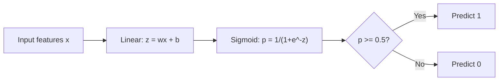
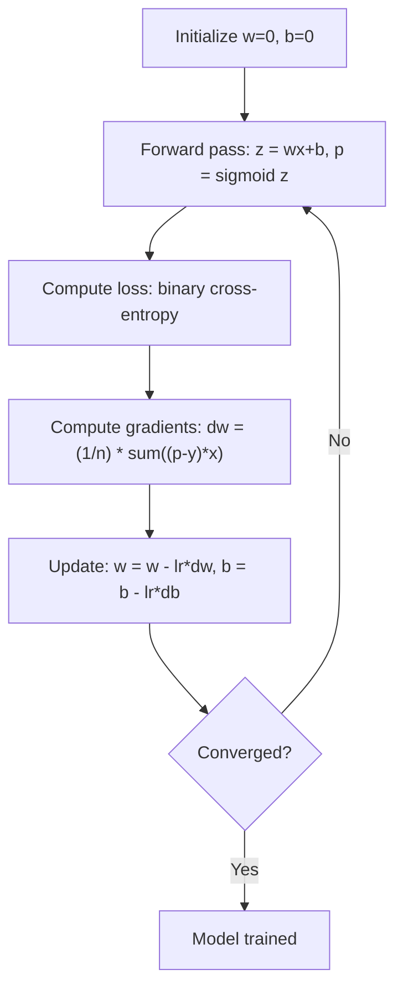

# Logistische Regression

> Die logistische Regression biegt eine gerade Linie zu einer S-Kurve, um Ja/Nein-Fragen mit Wahrscheinlichkeiten zu beantworten.

**Typ:** Build
**Sprachen:** Python
**Voraussetzungen:** Phase 2 Lektion 1-2 (Was ist ML, Lineare Regression)
**Zeit:** ~90 Minuten

## Lernziele

- Logistische Regression von Grund auf mit der Sigmoid-Funktion und dem binären Kreuzentropie-Verlust implementieren
- Präzision, Recall, F1-Score und die Confusion Matrix für binäre Klassifikation berechnen und interpretieren
- Erklären, warum MSE für Klassifikation versagt und warum binäre Kreuzentropie eine konvexe Kostenfläche erzeugt
- Ein Softmax-Regressionsmodell für Mehrklassenklassifikation bauen und die Trade-offs bei der Schwellenwertabstimmung bewerten

## Das Problem

Du möchtest vorhersagen, ob ein Tumor bösartig oder gutartig ist, basierend auf seiner Größe. Du versuchst lineare Regression. Sie gibt Zahlen wie 0.3 oder 1.7 oder -0.5 aus. Was bedeuten diese? Ist 1.7 „sehr bösartig“? Ist -0.5 „sehr gutartig“? Lineare Regression gibt unbeschränkte Zahlen aus. Klassifikation braucht begrenzte Wahrscheinlichkeiten zwischen 0 und 1 und eine klare Entscheidung: ja oder nein.

Die logistische Regression löst das. Sie nimmt dieselbe lineare Kombination (wx + b) und führt sie durch die Sigmoid-Funktion, die jede Zahl in den Bereich (0, 1) quetscht. Die Ausgabe ist eine Wahrscheinlichkeit. Du setzt einen Schwellenwert (meist 0.5) und triffst eine Entscheidung.

Das ist einer der am häufigsten verwendeten Algorithmen in der Praxis. Trotz ihres Namens ist die logistische Regression ein Klassifikationsalgorithmus, kein Regressionsalgorithmus. Der Name stammt von der logistischen (Sigmoid-)Funktion, die sie verwendet.

## Das Konzept

### Warum lineare Regression für Klassifikation versagt

Stell dir vor, du sagst Bestehen/Nichtbestehen (1/0) anhand von Lernstunden vorher. Die lineare Regression passt eine Linie durch die Daten:

```
hours:  1   2   3   4   5   6   7   8   9   10
actual: 0   0   0   0   1   1   1   1   1   1
```

Eine lineare Anpassung könnte Vorhersagen wie -0.2 bei Stunde 1 und 1.3 bei Stunde 10 erzeugen. Diese Werte sind keine Wahrscheinlichkeiten. Sie liegen unter 0 und über 1. Schlimmer noch: Ein einzelner Ausreißer (jemand, der 50 Stunden gelernt hat) würde die gesamte Linie ziehen und die Vorhersagen für alle verändern.

Klassifikation braucht eine Funktion, die:
- Werte zwischen 0 und 1 ausgibt (Wahrscheinlichkeiten)
- Einen scharfen Übergang erzeugt (eine Entscheidungsgrenze)
- Nicht durch Ausreißer weit entfernt von der Grenze verzerrt wird

### Die Sigmoid-Funktion

Die Sigmoid-Funktion macht genau das:

```
sigmoid(z) = 1 / (1 + e^(-z))
```

Eigenschaften:
- Wenn z groß und positiv ist, nähert sich sigmoid(z) 1
- Wenn z groß und negativ ist, nähert sich sigmoid(z) 0
- Wenn z = 0, dann ist sigmoid(z) = 0.5
- Die Ausgabe liegt immer zwischen 0 und 1
- Die Funktion ist überall glatt und differenzierbar

Die Ableitung hat eine praktische Form: sigmoid'(z) = sigmoid(z) * (1 - sigmoid(z)). Das macht die Gradientenberechnung effizient.

### Logistische Regression = Lineares Modell + Sigmoid

Das Modell berechnet z = wx + b (wie bei linearer Regression) und wendet dann Sigmoid an:



Die Ausgabe p wird als P(y=1 | x) interpretiert, die Wahrscheinlichkeit, dass die Eingabe zur Klasse 1 gehört. Die Entscheidungsgrenze liegt dort, wo wx + b = 0 ist, was die Sigmoid-Ausgabe genau auf 0.5 setzt.

### Binärer Kreuzentropie-Verlust

Du kannst für logistische Regression nicht MSE verwenden. MSE mit einem Sigmoid erzeugt eine nicht-konvexe Kostenfläche mit vielen lokalen Minima. Verwende stattdessen binäre Kreuzentropie (Log Loss):

```
Loss = -(1/n) * sum(y * log(p) + (1-y) * log(1-p))
```

Warum das funktioniert:
- Wenn y=1 und p nahe bei 1 ist: log(1) = 0, also ist der Verlust nahe 0 (korrekt, niedrige Kosten)
- Wenn y=1 und p nahe bei 0 ist: log(0) geht gegen minus unendlich, also ist der Verlust riesig (falsch, hohe Kosten)
- Wenn y=0 und p nahe bei 0 ist: log(1) = 0, also ist der Verlust nahe 0 (korrekt, niedrige Kosten)
- Wenn y=0 und p nahe bei 1 ist: log(0) geht gegen minus unendlich, also ist der Verlust riesig (falsch, hohe Kosten)

Diese Verlustfunktion ist für logistische Regression konvex und garantiert ein einziges globales Minimum.

### Gradientenabstieg für logistische Regression

Die Gradienten für binäre Kreuzentropie mit Sigmoid haben eine saubere Form:

```
dL/dw = (1/n) * sum((p - y) * x)
dL/db = (1/n) * sum(p - y)
```

Diese sehen identisch mit den Gradienten der linearen Regression aus. Der Unterschied ist, dass p = sigmoid(wx + b) statt p = wx + b ist. Das Sigmoid bringt die Nichtlinearität hinein, aber die Regel für Gradienten-Updates bleibt gleich.



### Die Entscheidungsgrenze

Für eine 2D-Eingabe (zwei Features) ist die Entscheidungsgrenze die Linie, bei der gilt:

```
w1*x1 + w2*x2 + b = 0
```

Punkte auf der einen Seite werden als 1 klassifiziert, Punkte auf der anderen als 0. Logistische Regression erzeugt immer eine lineare Entscheidungsgrenze. Wenn du eine gekrümmte Grenze brauchst, fügst du entweder Polynom-Features hinzu oder verwendest ein nichtlineares Modell.

### Mehrklassenklassifikation mit Softmax

Binäre logistische Regression behandelt zwei Klassen. Für k Klassen verwende die Softmax-Funktion:

```
softmax(z_i) = e^(z_i) / sum(e^(z_j) for all j)
```

Jede Klasse hat ihren eigenen Gewichtsvektor. Das Modell berechnet einen Score z_i für jede Klasse, dann wandelt Softmax die Scores in Wahrscheinlichkeiten um, die sich zu 1 summieren. Die vorhergesagte Klasse ist die mit der höchsten Wahrscheinlichkeit.

Die Verlustfunktion wird zu kategorischer Kreuzentropie:

```
Loss = -(1/n) * sum(sum(y_k * log(p_k)))
```

wobei y_k für die wahre Klasse 1 und für alle anderen 0 ist (One-Hot-Encoding).

### Evaluationsmetriken

Accuracy allein reicht nicht aus. Für einen Datensatz mit 95% negativ und 5% positiv erreicht ein Modell, das immer negativ vorhersagt, 95% Accuracy, ist aber nutzlos.

**Confusion Matrix**:

| | Predicted Positive | Predicted Negative |
|---|---|---|
| Actually Positive | True Positive (TP) | False Negative (FN) |
| Actually Negative | False Positive (FP) | True Negative (TN) |

**Precision**: Von allen als positiv vorhergesagten Fällen, wie viele sind tatsächlich positiv?
```
Precision = TP / (TP + FP)
```

**Recall** (Sensitivität): Von allen tatsächlich positiven Fällen, wie viele haben wir gefunden?
```
Recall = TP / (TP + FN)
```

**F1-Score**: Harmonisches Mittel aus Precision und Recall. Bringt beide Metriken ins Gleichgewicht.
```
F1 = 2 * (Precision * Recall) / (Precision + Recall)
```

Wann priorisieren:
- **Precision**: wenn False Positives teuer sind (Spamfilter, du willst keine legitime E-Mail blockieren)
- **Recall**: wenn False Negatives teuer sind (Krebsscreening, du willst keinen Tumor übersehen)
- **F1**: wenn du eine einzelne ausgewogene Metrik brauchst

## Bau es

### Schritt 1: Sigmoid-Funktion und Datengenerierung

```python
import random
import math

def sigmoid(z):
    z = max(-500, min(500, z))
    return 1.0 / (1.0 + math.exp(-z))


random.seed(42)
N = 200
X = []
y = []

for _ in range(N // 2):
    X.append([random.gauss(2, 1), random.gauss(2, 1)])
    y.append(0)

for _ in range(N // 2):
    X.append([random.gauss(5, 1), random.gauss(5, 1)])
    y.append(1)

combined = list(zip(X, y))
random.shuffle(combined)
X, y = zip(*combined)
X = list(X)
y = list(y)

print(f"Generated {N} samples (2 classes, 2 features)")
print(f"Class 0 center: (2, 2), Class 1 center: (5, 5)")
print(f"First 5 samples:")
for i in range(5):
    print(f"  Features: [{X[i][0]:.2f}, {X[i][1]:.2f}], Label: {y[i]}")
```

### Schritt 2: Logistische Regression von Grund auf

```python
class LogisticRegression:
    def __init__(self, n_features, learning_rate=0.01):
        self.weights = [0.0] * n_features
        self.bias = 0.0
        self.lr = learning_rate
        self.loss_history = []

    def predict_proba(self, x):
        z = sum(w * xi for w, xi in zip(self.weights, x)) + self.bias
        return sigmoid(z)

    def predict(self, x, threshold=0.5):
        return 1 if self.predict_proba(x) >= threshold else 0

    def compute_loss(self, X, y):
        n = len(y)
        total = 0.0
        for i in range(n):
            p = self.predict_proba(X[i])
            p = max(1e-15, min(1 - 1e-15, p))
            total += y[i] * math.log(p) + (1 - y[i]) * math.log(1 - p)
        return -total / n

    def fit(self, X, y, epochs=1000, print_every=200):
        n = len(y)
        n_features = len(X[0])
        for epoch in range(epochs):
            dw = [0.0] * n_features
            db = 0.0
            for i in range(n):
                p = self.predict_proba(X[i])
                error = p - y[i]
                for j in range(n_features):
                    dw[j] += error * X[i][j]
                db += error
            for j in range(n_features):
                self.weights[j] -= self.lr * (dw[j] / n)
            self.bias -= self.lr * (db / n)
            loss = self.compute_loss(X, y)
            self.loss_history.append(loss)
            if epoch % print_every == 0:
                print(f"  Epoch {epoch:4d} | Loss: {loss:.4f} | w: [{self.weights[0]:.3f}, {self.weights[1]:.3f}] | b: {self.bias:.3f}")
        return self

    def accuracy(self, X, y):
        correct = sum(1 for i in range(len(y)) if self.predict(X[i]) == y[i])
        return correct / len(y)


split = int(0.8 * N)
X_train, X_test = X[:split], X[split:]
y_train, y_test = y[:split], y[split:]

print("\n=== Training Logistic Regression ===")
model = LogisticRegression(n_features=2, learning_rate=0.1)
model.fit(X_train, y_train, epochs=1000, print_every=200)

print(f"\nTrain accuracy: {model.accuracy(X_train, y_train):.4f}")
print(f"Test accuracy:  {model.accuracy(X_test, y_test):.4f}")
print(f"Weights: [{model.weights[0]:.4f}, {model.weights[1]:.4f}]")
print(f"Bias: {model.bias:.4f}")
```

### Schritt 3: Confusion Matrix und Metriken von Grund auf

```python
class ClassificationMetrics:
    def __init__(self, y_true, y_pred):
        self.tp = sum(1 for t, p in zip(y_true, y_pred) if t == 1 and p == 1)
        self.tn = sum(1 for t, p in zip(y_true, y_pred) if t == 0 and p == 0)
        self.fp = sum(1 for t, p in zip(y_true, y_pred) if t == 0 and p == 1)
        self.fn = sum(1 for t, p in zip(y_true, y_pred) if t == 1 and p == 0)

    def accuracy(self):
        total = self.tp + self.tn + self.fp + self.fn
        return (self.tp + self.tn) / total if total > 0 else 0

    def precision(self):
        denom = self.tp + self.fp
        return self.tp / denom if denom > 0 else 0

    def recall(self):
        denom = self.tp + self.fn
        return self.tp / denom if denom > 0 else 0

    def f1(self):
        p = self.precision()
        r = self.recall()
        return 2 * p * r / (p + r) if (p + r) > 0 else 0

    def print_confusion_matrix(self):
        print(f"\n  Confusion Matrix:")
        print(f"                  Predicted")
        print(f"                  Pos   Neg")
        print(f"  Actual Pos     {self.tp:4d}  {self.fn:4d}")
        print(f"  Actual Neg     {self.fp:4d}  {self.tn:4d}")

    def print_report(self):
        self.print_confusion_matrix()
        print(f"\n  Accuracy:  {self.accuracy():.4f}")
        print(f"  Precision: {self.precision():.4f}")
        print(f"  Recall:    {self.recall():.4f}")
        print(f"  F1 Score:  {self.f1():.4f}")


y_pred_test = [model.predict(x) for x in X_test]
print("\n=== Classification Report (Test Set) ===")
metrics = ClassificationMetrics(y_test, y_pred_test)
metrics.print_report()
```

### Schritt 4: Analyse der Entscheidungsgrenze

```python
print("\n=== Decision Boundary ===")
w1, w2 = model.weights
b = model.bias
print(f"Decision boundary: {w1:.4f}*x1 + {w2:.4f}*x2 + {b:.4f} = 0")
if abs(w2) > 1e-10:
    print(f"Solved for x2:     x2 = {-w1/w2:.4f}*x1 + {-b/w2:.4f}")

print("\nSample predictions near the boundary:")
test_points = [
    [3.0, 3.0],
    [3.5, 3.5],
    [4.0, 4.0],
    [2.5, 2.5],
    [5.0, 5.0],
]
for point in test_points:
    prob = model.predict_proba(point)
    pred = model.predict(point)
    print(f"  [{point[0]}, {point[1]}] -> prob={prob:.4f}, class={pred}")
```

### Schritt 5: Mehrklassen mit Softmax

```python
class SoftmaxRegression:
    def __init__(self, n_features, n_classes, learning_rate=0.01):
        self.n_features = n_features
        self.n_classes = n_classes
        self.lr = learning_rate
        self.weights = [[0.0] * n_features for _ in range(n_classes)]
        self.biases = [0.0] * n_classes

    def softmax(self, scores):
        max_score = max(scores)
        exp_scores = [math.exp(s - max_score) for s in scores]
        total = sum(exp_scores)
        return [e / total for e in exp_scores]

    def predict_proba(self, x):
        scores = [
            sum(self.weights[k][j] * x[j] for j in range(self.n_features)) + self.biases[k]
            for k in range(self.n_classes)
        ]
        return self.softmax(scores)

    def predict(self, x):
        probs = self.predict_proba(x)
        return probs.index(max(probs))

    def fit(self, X, y, epochs=1000, print_every=200):
        n = len(y)
        for epoch in range(epochs):
            grad_w = [[0.0] * self.n_features for _ in range(self.n_classes)]
            grad_b = [0.0] * self.n_classes
            total_loss = 0.0
            for i in range(n):
                probs = self.predict_proba(X[i])
                for k in range(self.n_classes):
                    target = 1.0 if y[i] == k else 0.0
                    error = probs[k] - target
                    for j in range(self.n_features):
                        grad_w[k][j] += error * X[i][j]
                    grad_b[k] += error
                true_prob = max(probs[y[i]], 1e-15)
                total_loss -= math.log(true_prob)
            for k in range(self.n_classes):
                for j in range(self.n_features):
                    self.weights[k][j] -= self.lr * (grad_w[k][j] / n)
                self.biases[k] -= self.lr * (grad_b[k] / n)
            if epoch % print_every == 0:
                print(f"  Epoch {epoch:4d} | Loss: {total_loss / n:.4f}")
        return self

    def accuracy(self, X, y):
        correct = sum(1 for i in range(len(y)) if self.predict(X[i]) == y[i])
        return correct / len(y)


random.seed(42)
X_3class = []
y_3class = []

centers = [(1, 1), (5, 1), (3, 5)]
for label, (cx, cy) in enumerate(centers):
    for _ in range(50):
        X_3class.append([random.gauss(cx, 0.8), random.gauss(cy, 0.8)])
        y_3class.append(label)

combined = list(zip(X_3class, y_3class))
random.shuffle(combined)
X_3class, y_3class = zip(*combined)
X_3class = list(X_3class)
y_3class = list(y_3class)

split_3 = int(0.8 * len(X_3class))
X_train_3 = X_3class[:split_3]
y_train_3 = y_3class[:split_3]
X_test_3 = X_3class[split_3:]
y_test_3 = y_3class[split_3:]

print("\n=== Multi-class Softmax Regression (3 classes) ===")
softmax_model = SoftmaxRegression(n_features=2, n_classes=3, learning_rate=0.1)
softmax_model.fit(X_train_3, y_train_3, epochs=1000, print_every=200)
print(f"\nTrain accuracy: {softmax_model.accuracy(X_train_3, y_train_3):.4f}")
print(f"Test accuracy:  {softmax_model.accuracy(X_test_3, y_test_3):.4f}")

print("\nSample predictions:")
for i in range(5):
    probs = softmax_model.predict_proba(X_test_3[i])
    pred = softmax_model.predict(X_test_3[i])
    print(f"  True: {y_test_3[i]}, Predicted: {pred}, Probs: [{', '.join(f'{p:.3f}' for p in probs)}]")
```

### Schritt 6: Schwellenwertabstimmung

```python
print("\n=== Threshold Tuning ===")
print("Default threshold: 0.5. Adjusting the threshold trades precision for recall.\n")

thresholds = [0.3, 0.4, 0.5, 0.6, 0.7]
print(f"{'Threshold':>10} {'Accuracy':>10} {'Precision':>10} {'Recall':>10} {'F1':>10}")
print("-" * 52)

for t in thresholds:
    y_pred_t = [1 if model.predict_proba(x) >= t else 0 for x in X_test]
    m = ClassificationMetrics(y_test, y_pred_t)
    print(f"{t:>10.1f} {m.accuracy():>10.4f} {m.precision():>10.4f} {m.recall():>10.4f} {m.f1():>10.4f}")
```

## Nutze es

Jetzt dasselbe mit scikit-learn.

```python
from sklearn.linear_model import LogisticRegression as SklearnLR
from sklearn.metrics import accuracy_score, precision_score, recall_score, f1_score
from sklearn.metrics import confusion_matrix, classification_report
from sklearn.model_selection import train_test_split
from sklearn.preprocessing import StandardScaler
import numpy as np

np.random.seed(42)
X_0 = np.random.randn(100, 2) + [2, 2]
X_1 = np.random.randn(100, 2) + [5, 5]
X_sk = np.vstack([X_0, X_1])
y_sk = np.array([0] * 100 + [1] * 100)

X_tr, X_te, y_tr, y_te = train_test_split(X_sk, y_sk, test_size=0.2, random_state=42)

scaler = StandardScaler()
X_tr_sc = scaler.fit_transform(X_tr)
X_te_sc = scaler.transform(X_te)

lr = SklearnLR()
lr.fit(X_tr_sc, y_tr)
y_pred = lr.predict(X_te_sc)

print("=== Scikit-learn Logistic Regression ===")
print(f"Accuracy:  {accuracy_score(y_te, y_pred):.4f}")
print(f"Precision: {precision_score(y_te, y_pred):.4f}")
print(f"Recall:    {recall_score(y_te, y_pred):.4f}")
print(f"F1:        {f1_score(y_te, y_pred):.4f}")
print(f"\nConfusion Matrix:\n{confusion_matrix(y_te, y_pred)}")
print(f"\nClassification Report:\n{classification_report(y_te, y_pred)}")
```

Deine From-Scratch-Implementierung erzeugt dieselbe Entscheidungsgrenze und dieselben Metriken. Scikit-learn ergänzt Solver-Optionen (liblinear, lbfgs, saga), automatische Regularisierung, Mehrklassenstrategien (One-vs-Rest, multinomial) und Optimierungen für numerische Stabilität.

## Shippe es

Diese Lektion erzeugt:
- `code/logistic_regression.py` - logistische Regression von Grund auf mit Metriken

## Übungen

1. Erzeuge einen Datensatz, der NICHT linear separierbar ist (z. B. zwei konzentrische Kreise). Trainiere logistische Regression und beobachte ihr Versagen. Füge dann Polynom-Features hinzu (x1^2, x2^2, x1*x2) und trainiere erneut. Zeige, dass sich die Accuracy verbessert.
2. Implementiere eine Mehrklassen-Confusion-Matrix für das 3-Klassen-Softmax-Modell. Berechne Precision und Recall pro Klasse. Welche Klasse ist am schwersten zu klassifizieren?
3. Baue eine ROC-Kurve von Grund auf. Berechne für 100 Schwellenwerte von 0 bis 1 die True-Positive-Rate und False-Positive-Rate. Berechne die AUC (Area Under the Curve) mit der Trapezregel.

## Schlüsselbegriffe

| Begriff | Was man sagt | Was es tatsächlich bedeutet |
|------|----------------|----------------------|
| Logistische Regression | „Regression für Klassifikation“ | Ein lineares Modell gefolgt von einer Sigmoid-Funktion, die Klassenwahrscheinlichkeiten ausgibt |
| Sigmoid-Funktion | „Die S-Kurve“ | Die Funktion 1/(1+e^(-z)), die jede reelle Zahl auf den Bereich (0, 1) abbildet |
| Binäre Kreuzentropie | „Log Loss“ | Die Verlustfunktion -[y*log(p) + (1-y)*log(1-p)], die selbstsichere falsche Vorhersagen stark bestraft |
| Entscheidungsgrenze | „Die Trennlinie“ | Die Fläche, bei der die Ausgabewahrscheinlichkeit des Modells 0.5 ist und vorhergesagte Klassen trennt |
| Softmax | „Sigmoid für mehrere Klassen“ | Eine Funktion, die einen Vektor von Scores in Wahrscheinlichkeiten umwandelt, die sich zu 1 summieren |
| Precision | „Wie viele ausgewählte sind relevant“ | TP / (TP + FP), der Anteil positiver Vorhersagen, die tatsächlich positiv sind |
| Recall | „Wie viele relevante wurden ausgewählt“ | TP / (TP + FN), der Anteil tatsächlicher Positiver, die das Modell korrekt erkennt |
| F1-Score | „Ausgewogene Accuracy“ | Das harmonische Mittel von Precision und Recall: 2*P*R / (P+R) |
| Confusion Matrix | „Die Fehleraufschlüsselung“ | Eine Tabelle mit TP-, TN-, FP-, FN-Anzahlen für jedes Klassenpaar |
| Schwellenwert | „Der Cutoff“ | Der Wahrscheinlichkeitswert, oberhalb dessen das Modell Klasse 1 vorhersagt (Standard 0.5, anpassbar) |
| One-Hot-Encoding | „Binäre Spalten für Kategorien“ | Darstellung von Klasse k als Vektor aus Nullen mit einer 1 an Position k |
| Kategorische Kreuzentropie | „Mehrklassen-Log-Loss“ | Die Erweiterung der binären Kreuzentropie auf k Klassen mit One-Hot-kodierten Labels |
