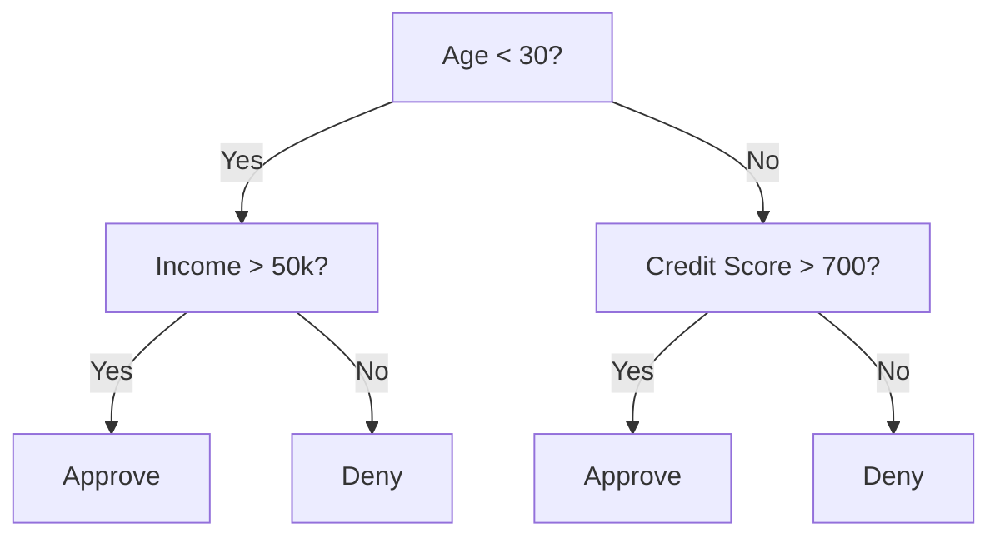
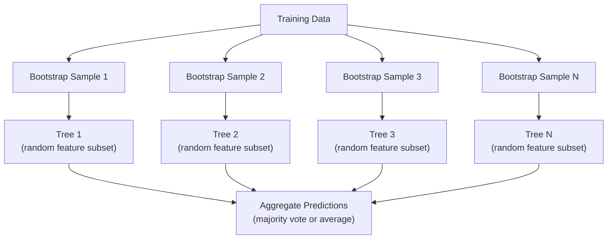

# Entscheidungsbäume und Random Forests

> Ein Entscheidungsbaum ist nur ein Flussdiagramm. Aber ein ganzer Wald davon ist eines der leistungsfähigsten Werkzeuge im ML.

**Typ:** Build
**Sprache:** Python
**Voraussetzungen:** Phase 1 (Lektionen 09 Informationstheorie, 06 Wahrscheinlichkeit)
**Zeit:** ~90 Minuten

## Lernziele

- Gini-Unreinheit, Entropie und Information-Gain-Berechnungen implementieren, um optimale Splits in Entscheidungsbäumen zu finden
- Einen Entscheidungsbaum-Klassifikator von Grund auf mit Pre-Pruning-Kontrollen (maximale Tiefe, minimale Anzahl Samples) bauen
- Einen Random Forest mit Bootstrap-Sampling und Feature-Randomisierung konstruieren und erklären, warum das die Varianz reduziert
- MDI-Feature-Wichtigkeit mit Permutations-Wichtigkeit vergleichen und erkennen, wann MDI verzerrt ist

## Das Problem

Du hast tabellarische Daten. Zeilen sind Samples, Spalten sind Features, und es gibt eine Zielspalte, die du vorhersagen willst. Du könntest ein neuronales Netz darauf werfen. Aber bei tabellarischen Daten übertreffen baumbasierte Modelle (Entscheidungsbäume, Random Forests, Gradient-Boosted Trees) Deep Learning durchgehend. Kaggle-Wettbewerbe mit strukturierten Daten werden von XGBoost und LightGBM dominiert, nicht von Transformern.

Warum? Bäume können gemischte Feature-Typen (numerisch und kategorisch) ohne Vorverarbeitung verarbeiten. Sie können nichtlineare Beziehungen ohne Feature Engineering abbilden. Sie sind interpretierbar: Du kannst den Baum ansehen und exakt nachvollziehen, warum eine Vorhersage getroffen wurde. Und Random Forests, die viele Bäume mitteln, sind bei Datensätzen mittlerer Größe sehr robust gegen Overfitting.

Diese Lektion baut Entscheidungsbäume von Grund auf mit rekursivem Splitting und setzt darauf einen Random Forest auf. Du implementierst die Mathematik hinter den Split-Kriterien (Gini-Unreinheit, Entropie, Information Gain) und verstehst, warum ein Ensemble aus schwachen Lernern stark wird.

## Das Konzept

### Was ein Entscheidungsbaum macht

Ein Entscheidungsbaum partitioniert den Feature-Raum in rechteckige Regionen, indem er eine Folge von Ja/Nein-Fragen stellt.



Jeder innere Knoten testet ein Feature gegen einen Schwellenwert. Jeder Blattknoten macht eine Vorhersage. Um einen neuen Datenpunkt zu klassifizieren, startest du an der Wurzel und folgst den Zweigen, bis du ein Blatt erreichst.

Der Baum wird top-down aufgebaut, indem an jedem Knoten das Feature und der Schwellenwert gewählt werden, die die Daten am besten trennen. „Am besten“ wird durch ein Split-Kriterium definiert.

### Split-Kriterien: Unreinheit messen

An jedem Knoten haben wir eine Menge von Samples. Wir wollen sie so aufteilen, dass die resultierenden Kindknoten möglichst „rein“ sind, das heißt, dass jeder Kindknoten überwiegend nur eine Klasse enthält.

**Gini-Unreinheit** misst die Wahrscheinlichkeit, dass ein zufällig gewähltes Sample falsch klassifiziert würde, wenn es gemäß der Klassenverteilung an diesem Knoten gelabelt würde.

```
Gini(S) = 1 - sum(p_k^2)

where p_k is the proportion of class k in set S.
```

Für einen reinen Knoten (alles eine Klasse) gilt Gini = 0. Für eine binäre Aufteilung mit 50/50-Klassen gilt Gini = 0.5. Niedriger ist besser.

```
Example: 6 cats, 4 dogs

Gini = 1 - (0.6^2 + 0.4^2) = 1 - (0.36 + 0.16) = 0.48
```

**Entropie** misst den Informationsgehalt (Unordnung) in einem Knoten. Behandelt in Phase 1, Lektion 09.

```
Entropy(S) = -sum(p_k * log2(p_k))
```

Für einen reinen Knoten gilt Entropie = 0. Für eine 50/50-binäre Aufteilung gilt Entropie = 1.0. Niedriger ist besser.

```
Example: 6 cats, 4 dogs

Entropy = -(0.6 * log2(0.6) + 0.4 * log2(0.4))
        = -(0.6 * -0.737 + 0.4 * -1.322)
        = 0.442 + 0.529
        = 0.971 bits
```

**Information Gain** ist die Verringerung der Unreinheit (Entropie oder Gini) nach einem Split.

```
IG(S, feature, threshold) = Impurity(S) - weighted_avg(Impurity(S_left), Impurity(S_right))

where the weights are the proportions of samples in each child.
```

Der greedy Algorithmus an jedem Knoten: Probiere jedes Feature und jeden möglichen Schwellenwert aus. Wähle das Paar (Feature, Schwellenwert), das den Information Gain maximiert.

### Wie Splitting funktioniert

Für einen Datensatz mit n Features und m Samples am aktuellen Knoten:

1. Für jedes Feature j (j = 1 bis n):
   - Sortiere die Samples nach Feature j
   - Probiere jeden Mittelpunkt zwischen aufeinanderfolgenden unterschiedlichen Werten als Schwellenwert
   - Berechne den Information Gain für jeden Schwellenwert
2. Wähle das Feature und den Schwellenwert mit dem höchsten Information Gain
3. Teile die Daten in links (feature <= threshold) und rechts (feature > threshold)
4. Rekursiv auf jedem Kindknoten fortfahren

Dieser greedy Ansatz garantiert nicht den global optimalen Baum. Den optimalen Baum zu finden ist NP-schwer. Aber greedy Splitting funktioniert in der Praxis gut.

### Abbruchbedingungen

Ohne Abbruchbedingungen wächst der Baum, bis jedes Blatt rein ist (ein Sample pro Blatt). Das memoriert die Trainingsdaten perfekt und generalisiert sehr schlecht.

**Pre-Pruning** stoppt den Baum, bevor er vollständig wächst:
- Maximale Tiefe: Splitting stoppen, wenn der Baum eine festgelegte Tiefe erreicht
- Minimale Samples pro Blatt: stoppen, wenn ein Knoten weniger als k Samples hat
- Minimaler Information Gain: stoppen, wenn der beste Split die Unreinheit um weniger als einen Schwellenwert verbessert
- Maximale Anzahl Blattknoten: die Gesamtzahl der Blätter begrenzen

**Post-Pruning** wächst den vollständigen Baum und schneidet ihn dann zurück:
- Cost-Complexity-Pruning (in scikit-learn verwendet): fügt eine Strafe proportional zur Anzahl der Blätter hinzu. Erhöhe die Strafe, um kleinere Bäume zu erhalten
- Reduced-Error-Pruning: entferne einen Teilbaum, wenn der Validierungsfehler nicht steigt

Pre-Pruning ist einfacher und schneller. Post-Pruning erzeugt oft bessere Bäume, weil es Splits nicht vorzeitig stoppt, die zu nützlichen weiteren Splits führen könnten.

### Entscheidungsbäume für Regression

Für Regression ist die Blattvorhersage der Mittelwert der Zielwerte in diesem Blatt. Das Split-Kriterium ändert sich ebenfalls:

**Varianzreduktion** ersetzt Information Gain:

```
VR(S, feature, threshold) = Var(S) - weighted_avg(Var(S_left), Var(S_right))
```

Wähle den Split, der die Varianz am stärksten reduziert. Der Baum partitioniert den Eingaberaum in Regionen und sagt in jeder Region einen konstanten Wert (den Mittelwert) voraus.

### Random Forests: die Kraft von Ensembles

Ein einzelner Entscheidungsbaum hat hohe Varianz. Kleine Änderungen in den Daten können komplett andere Bäume erzeugen. Random Forests beheben das, indem sie viele Bäume mitteln.



Zwei Zufallsquellen machen die Bäume divers:

**Bagging (Bootstrap Aggregating):** Jeder Baum wird auf einem Bootstrap-Sample trainiert, also einem zufälligen Sample mit Zurücklegen aus den Trainingsdaten. Etwa 63 % der ursprünglichen Samples erscheinen in jedem Bootstrap (der Rest sind Out-of-Bag-Samples, die zur Validierung genutzt werden können).

**Feature-Randomisierung:** Bei jedem Split wird nur eine zufällige Teilmenge von Features berücksichtigt. Für Klassifikation ist der Standardwert sqrt(n_features). Für Regression n_features/3. Das verhindert, dass alle Bäume auf demselben dominanten Feature splitten.

Die zentrale Erkenntnis: Das Mitteln vieler dekorrelierter Bäume reduziert die Varianz, ohne den Bias zu erhöhen. Jeder einzelne Baum kann mittelmäßig sein. Das Ensemble ist stark.

### Feature-Wichtigkeit

Random Forests liefern von Natur aus Feature-Wichtigkeitswerte. Die gebräuchlichste Methode:

**Mean Decrease in Impurity (MDI):** Für jedes Feature wird die gesamte Verringerung der Unreinheit über alle Bäume und alle Knoten summiert, in denen dieses Feature verwendet wird. Features, die bei frühen Splits größere Verringerungen der Unreinheit erzeugen, sind wichtiger.

```
importance(feature_j) = sum over all nodes where feature_j is used:
    (n_samples_at_node / n_total_samples) * impurity_decrease
```

Das ist schnell (wird während des Trainings berechnet), aber verzerrt zugunsten von Features mit hoher Kardinalität und Features mit vielen möglichen Split-Punkten.

**Permutations-Wichtigkeit** ist die Alternative: Werte eines Features mischen und messen, wie stark die Modellgenauigkeit sinkt. Zuverlässiger, aber langsamer.

### Wann Bäume neuronale Netze schlagen

Bäume und Wälder dominieren neuronale Netze bei tabellarischen Daten. Mehrere Gründe:

| Faktor | Bäume | Neuronale Netze |
|--------|-------|----------------|
| Gemischte Typen (numerisch + kategorisch) | Native Unterstützung | Benötigen Encoding |
| Kleine Datensätze (< 10k Zeilen) | Funktionieren gut | Overfitten |
| Feature-Interaktionen | Werden durch Splits gefunden | Benötigen Architekturdesign |
| Interpretierbarkeit | Volle Transparenz | Black Box |
| Trainingszeit | Minuten | Stunden |
| Hyperparameter-Sensitivität | Niedrig | Hoch |

Neuronale Netze gewinnen, wenn die Daten eine räumliche oder sequentielle Struktur haben (Bilder, Text, Audio). Für flache Feature-Tabellen sind Bäume der Standard.

## Bau es

### Schritt 1: Gini-Unreinheit und Entropie

Baue beide Split-Kriterien von Grund auf und überprüfe, dass sie sich darin einig sind, welche Splits gut sind.

```python
import math

def gini_impurity(labels):
    n = len(labels)
    if n == 0:
        return 0.0
    counts = {}
    for label in labels:
        counts[label] = counts.get(label, 0) + 1
    return 1.0 - sum((c / n) ** 2 for c in counts.values())

def entropy(labels):
    n = len(labels)
    if n == 0:
        return 0.0
    counts = {}
    for label in labels:
        counts[label] = counts.get(label, 0) + 1
    return -sum(
        (c / n) * math.log2(c / n) for c in counts.values() if c > 0
    )
```

### Schritt 2: Den besten Split finden

Probiere jedes Feature und jeden Schwellenwert. Gib den mit dem höchsten Information Gain zurück.

```python
def information_gain(parent_labels, left_labels, right_labels, criterion="gini"):
    measure = gini_impurity if criterion == "gini" else entropy
    n = len(parent_labels)
    n_left = len(left_labels)
    n_right = len(right_labels)
    if n_left == 0 or n_right == 0:
        return 0.0
    parent_impurity = measure(parent_labels)
    child_impurity = (
        (n_left / n) * measure(left_labels) +
        (n_right / n) * measure(right_labels)
    )
    return parent_impurity - child_impurity
```

### Schritt 3: Die Klasse DecisionTree bauen

Rekursives Splitting, Vorhersage und Tracking der Feature-Wichtigkeit.

```python
class DecisionTree:
    def __init__(self, max_depth=None, min_samples_split=2,
                 min_samples_leaf=1, criterion="gini",
                 max_features=None):
        self.max_depth = max_depth
        self.min_samples_split = min_samples_split
        self.min_samples_leaf = min_samples_leaf
        self.criterion = criterion
        self.max_features = max_features
        self.tree = None
        self.feature_importances_ = None

    def fit(self, X, y):
        self.n_features = len(X[0])
        self.feature_importances_ = [0.0] * self.n_features
        self.n_samples = len(X)
        self.tree = self._build(X, y, depth=0)
        total = sum(self.feature_importances_)
        if total > 0:
            self.feature_importances_ = [
                fi / total for fi in self.feature_importances_
            ]

    def predict(self, X):
        return [self._predict_one(x, self.tree) for x in X]
```

### Schritt 4: Die Klasse RandomForest bauen

Bootstrap-Sampling, Feature-Randomisierung und Mehrheitsabstimmung.

```python
class RandomForest:
    def __init__(self, n_trees=100, max_depth=None,
                 min_samples_split=2, max_features="sqrt",
                 criterion="gini"):
        self.n_trees = n_trees
        self.max_depth = max_depth
        self.min_samples_split = min_samples_split
        self.max_features = max_features
        self.criterion = criterion
        self.trees = []

    def fit(self, X, y):
        n = len(X)
        for _ in range(self.n_trees):
            indices = [random.randint(0, n - 1) for _ in range(n)]
            X_boot = [X[i] for i in indices]
            y_boot = [y[i] for i in indices]
            tree = DecisionTree(
                max_depth=self.max_depth,
                min_samples_split=self.min_samples_split,
                max_features=self.max_features,
                criterion=self.criterion,
            )
            tree.fit(X_boot, y_boot)
            self.trees.append(tree)

    def predict(self, X):
        all_preds = [tree.predict(X) for tree in self.trees]
        predictions = []
        for i in range(len(X)):
            votes = {}
            for preds in all_preds:
                v = preds[i]
                votes[v] = votes.get(v, 0) + 1
            predictions.append(max(votes, key=votes.get))
        return predictions
```

Siehe `code/trees.py` für die vollständige Implementierung mit allen Hilfsmethoden.

## Nutze es

Mit scikit-learn ist das Trainieren eines Random Forests drei Zeilen:

```python
from sklearn.ensemble import RandomForestClassifier
from sklearn.datasets import load_iris
from sklearn.model_selection import train_test_split

X, y = load_iris(return_X_y=True)
X_train, X_test, y_train, y_test = train_test_split(X, y, random_state=42)

rf = RandomForestClassifier(n_estimators=100, random_state=42)
rf.fit(X_train, y_train)
print(f"Accuracy: {rf.score(X_test, y_test):.4f}")
print(f"Feature importances: {rf.feature_importances_}")
```

In der Praxis sind Gradient-Boosted Trees (XGBoost, LightGBM, CatBoost) oft stärker als Random Forests, weil sie Bäume sequenziell aufbauen, wobei jeder Baum die Fehler der vorherigen korrigiert. Aber Random Forests sind schwerer falsch zu konfigurieren und benötigen fast kein Hyperparameter-Tuning.

## Shippe es

Diese Lektion erzeugt `outputs/prompt-tree-interpreter.md` -- einen Prompt, der Entscheidungsbaum-Splits für geschäftliche Stakeholder interpretiert. Gib ihm die Struktur eines trainierten Baums (Tiefe, Features, Split-Schwellenwerte, Genauigkeit), und er übersetzt das Modell in Regeln in Klartext, ordnet die Feature-Wichtigkeit, markiert Overfitting oder Leakage und empfiehlt nächste Schritte. Nutze ihn immer dann, wenn du ein baumbasiertes Modell jemandem erklären musst, der keinen Code liest.

## Übungen

1. Trainiere einen einzelnen Entscheidungsbaum auf einem 2D-Datensatz mit 3 Klassen. Verfolge die Splits manuell nach und zeichne die rechteckigen Entscheidungsgrenzen. Vergleiche die Grenzen bei max_depth=2 vs. max_depth=10.

2. Implementiere Varianzreduktion als Split-Kriterium für Regressionsbäume. Erzeuge y = sin(x) + noise für 200 Punkte und fitte deinen Regressionsbaum. Plotte die stückweise konstanten Vorhersagen des Baums gegen die wahre Kurve.

3. Baue einen Random Forest mit 1, 5, 10, 50 und 200 Bäumen. Plotte Trainingsgenauigkeit und Testgenauigkeit gegen die Anzahl der Bäume. Beobachte, dass die Testgenauigkeit ein Plateau erreicht, aber nicht sinkt (Wälder sind robust gegen Overfitting).

4. Vergleiche Gini-Unreinheit vs. Entropie als Split-Kriterien auf 5 verschiedenen Datensätzen. Miss Genauigkeit und Baumtiefe. In den meisten Fällen liefern sie fast identische Ergebnisse. Erkläre warum.

5. Implementiere Permutations-Wichtigkeit. Vergleiche sie mit MDI-Wichtigkeit auf einem Datensatz, bei dem ein Feature zufälliges Rauschen ist, aber hohe Kardinalität hat. MDI wird das Rausch-Feature hoch einstufen. Permutations-Wichtigkeit wird das nicht tun.

## Schlüsselbegriffe

| Begriff | Was man sagt | Was es tatsächlich bedeutet |
|------|----------------|----------------------|
| Entscheidungsbaum | „Ein Flussdiagramm für Vorhersagen“ | Ein Modell, das den Feature-Raum in rechteckige Regionen partitioniert, indem es eine Folge von If/Else-Splits lernt |
| Gini-Unreinheit | „Wie gemischt der Knoten ist“ | Wahrscheinlichkeit, ein zufälliges Sample an einem Knoten falsch zu klassifizieren. 0 = rein, 0.5 = maximale Unreinheit bei binär |
| Entropie | „Die Unordnung in einem Knoten“ | Informationsgehalt an einem Knoten. 0 = rein, 1.0 = maximale Unsicherheit bei binär. Aus der Informationstheorie |
| Information Gain | „Wie gut ein Split ist“ | Verringerung der Unreinheit nach einem Split. Das greedy Kriterium zur Auswahl von Splits |
| Pre-Pruning | „Den Baum früh stoppen“ | Baumwachstum früh stoppen durch Grenzwerte für maximale Tiefe, minimale Samples oder minimalen Gain |
| Post-Pruning | „Baum danach beschneiden“ | Den vollständigen Baum wachsen lassen und dann Teilbäume entfernen, die die Validierungsleistung nicht verbessern |
| Bagging | „Auf zufälligen Teilmengen trainieren“ | Bootstrap Aggregating. Jedes Modell auf einem anderen zufälligen Sample mit Zurücklegen trainieren |
| Random Forest | „Ein Haufen Bäume“ | Ensemble aus Entscheidungsbäumen, jeweils trainiert auf einem Bootstrap-Sample mit zufälligen Feature-Teilmengen bei jedem Split |
| Feature-Wichtigkeit (MDI) | „Welche Features zählen“ | Gesamte Verringerung der Unreinheit pro Feature, summiert über alle Bäume und Knoten |
| Permutations-Wichtigkeit | „Mischen und prüfen“ | Abfall der Genauigkeit, wenn die Werte eines Features zufällig gemischt werden. Zuverlässiger als MDI bei verrauschten Features |
| Varianzreduktion | „Die Regressionsversion von Info Gain“ | Das Regressions-Pendant zu Information Gain. Wählt den Split, der die Zielvarianz am stärksten reduziert |
| Bootstrap-Sample | „Zufallsstichprobe mit Wiederholungen“ | Eine mit Zurücklegen aus dem Originaldatensatz gezogene Zufallsstichprobe. Gleiche Größe, aber mit Duplikaten |

## Weiterführende Literatur

- [Breiman: Random Forests (2001)](https://link.springer.com/article/10.1023/A:1010933404324) - die ursprüngliche Random-Forest-Arbeit
- [Grinsztajn et al.: Why do tree-based models still outperform deep learning on tabular data? (2022)](https://arxiv.org/abs/2207.08815) - rigoroser Vergleich von Bäumen vs. neuronalen Netzen bei tabellarischen Aufgaben
- [scikit-learn Decision Trees documentation](https://scikit-learn.org/stable/modules/tree.html) - praktischer Leitfaden mit Visualisierungswerkzeugen
- [XGBoost: A Scalable Tree Boosting System (Chen & Guestrin, 2016)](https://arxiv.org/abs/1603.02754) - das Gradient-Boosting-Paper, das Kaggle dominiert
