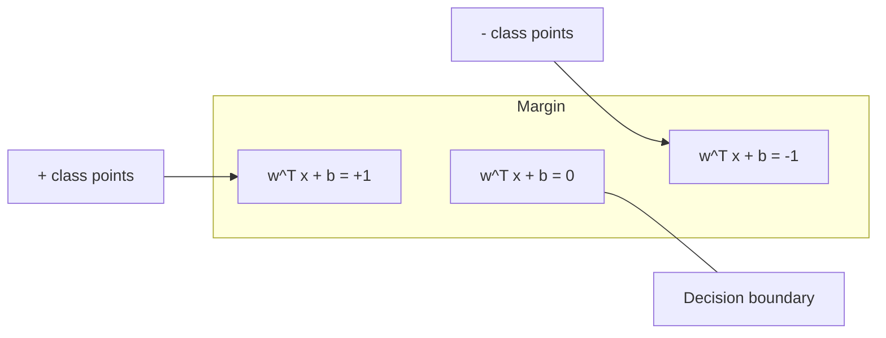
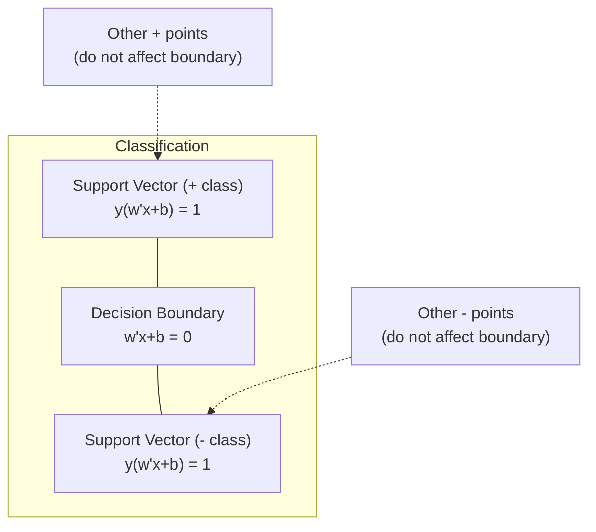
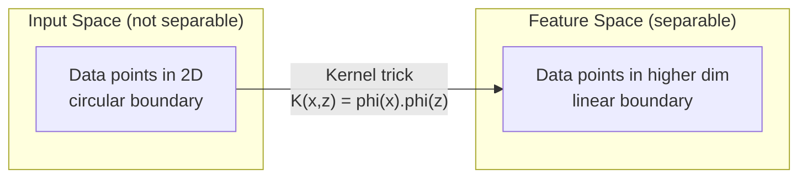

# Support-Vector-Maschinen

> Finde die breiteste Straße zwischen zwei Klassen. Das ist die ganze Idee.

**Typ:** Build
**Sprache:** Python
**Voraussetzungen:** Phase 1 (Lektionen 08 Optimierung, 14 Normen und Distanzen, 18 Konvexe Optimierung)
**Zeit:** ~90 Minuten

## Lernziele

- Implementiere ein lineares SVM von Grund auf mit Hinge Loss und Gradient Descent in der primalen Formulierung
- Erkläre das Prinzip des maximalen Margins und identifiziere Support-Vektoren aus einem trainierten Modell
- Vergleiche lineare, polynomiale und RBF-Kerne und erkläre, wie der Kernel-Trick explizites Mapping in hohe Dimensionen vermeidet
- Bewerte den durch den Parameter C gesteuerten Trade-off zwischen Margin-Breite und Klassifikationsfehlern

## Das Problem

Du hast zwei Klassen von Datenpunkten und musst eine Linie (oder Hyperebene) zeichnen, die sie trennt. Unendlich viele Linien könnten funktionieren. Welche solltest du wählen?

Die mit dem größten Margin. Der Margin ist der Abstand zwischen der Entscheidungsgrenze und den nächstgelegenen Datenpunkten auf jeder Seite. Ein breiterer Margin bedeutet, dass der Klassifikator sicherer ist und besser auf ungesehene Daten generalisiert.

Diese Intuition führt zu Support Vector Machines, einem der mathematisch elegantesten Algorithmen im ML. SVMs waren vor Deep Learning die dominante Methode für Klassifikation und sind weiterhin die beste Wahl für kleine Datensätze, hochdimensionale Daten und Probleme, bei denen du ein fundiertes, gut verstandenes Modell mit theoretischen Garantien brauchst.

SVMs sind direkt mit Phase 1 verbunden: Die Optimierung ist konvex (Lektion 18), der Margin wird mit Normen gemessen (Lektion 14), und der Kernel-Trick nutzt Skalarprodukte, um nichtlineare Grenzen zu behandeln, ohne jemals im hochdimensionalen Raum zu rechnen.

## Das Konzept

### Der Maximum-Margin-Klassifikator

Gegeben linear separierbare Daten mit Labels y_i in {-1, +1} und Feature-Vektoren x_i wollen wir eine Hyperebene w^T x + b = 0, die die Klassen trennt.

Der Abstand eines Punkts x_i zur Hyperebene ist:

```
distance = |w^T x_i + b| / ||w||
```

Für einen korrekt klassifizierten Punkt gilt: y_i * (w^T x_i + b) > 0. Der Margin ist doppelt so groß wie der Abstand von der Hyperebene zum nächstgelegenen Punkt auf jeder Seite.



Das Optimierungsproblem:

```
maximize    2 / ||w||     (the margin width)
subject to  y_i * (w^T x_i + b) >= 1  for all i
```

Äquivalent dazu (||w||^2 zu minimieren ist leichter zu optimieren):

```
minimize    (1/2) ||w||^2
subject to  y_i * (w^T x_i + b) >= 1  for all i
```

Das ist ein konvexes quadratisches Programm. Es hat eine eindeutige globale Lösung. Die Datenpunkte, die genau auf den Margin-Grenzen liegen (wo y_i * (w^T x_i + b) = 1), sind die Support-Vektoren. Sie sind die einzigen Punkte, die die Entscheidungsgrenze bestimmen. Verschiebst oder entfernst du einen Punkt, der kein Support-Vektor ist, ändert sich die Grenze nicht.

### Support-Vektoren: die kritischen wenigen



Die meisten Trainingspunkte sind irrelevant. Nur die Support-Vektoren zählen. Deshalb sind SVMs zur Vorhersagezeit speichereffizient: Du musst nur die Support-Vektoren speichern, nicht den gesamten Trainingssatz.

Die Anzahl der Support-Vektoren liefert außerdem eine Schranke für den Generalisierungsfehler. Weniger Support-Vektoren relativ zur Datensatzgröße bedeuten bessere Generalisierung.

### Soft Margin: Rauschen mit dem C-Parameter behandeln

Reale Daten sind selten perfekt separierbar. Manche Punkte können auf der falschen Seite der Grenze liegen oder innerhalb des Margins. Die Soft-Margin-Formulierung erlaubt Verletzungen durch Einführung von Slack-Variablen.

```
minimize    (1/2) ||w||^2 + C * sum(xi_i)
subject to  y_i * (w^T x_i + b) >= 1 - xi_i
            xi_i >= 0  for all i
```

Die Slack-Variable xi_i misst, wie stark Punkt i den Margin verletzt. C steuert den Trade-off:

| C-Wert | Verhalten |
|---------|----------|
| Großes C | Bestraft Verletzungen stark. Schmaler Margin, weniger Fehlklassifikationen. Overfitting |
| Kleines C | Erlaubt mehr Verletzungen. Breiter Margin, mehr Fehlklassifikationen. Underfitting |

C ist die Regularisierungsstärke, invertiert. Großes C = weniger Regularisierung. Kleines C = mehr Regularisierung.

### Hinge Loss: die Verlustfunktion des SVM

Das Soft-Margin-SVM kann als unbeschränkte Optimierung umgeschrieben werden:

```
minimize    (1/2) ||w||^2 + C * sum(max(0, 1 - y_i * (w^T x_i + b)))
```

Der Term max(0, 1 - y_i * f(x_i)) ist der Hinge Loss. Er ist null, wenn der Punkt korrekt klassifiziert ist und außerhalb des Margins liegt. Er ist linear, wenn der Punkt innerhalb des Margins liegt oder fehlklassifiziert ist.

```
Hinge loss for a single point:

loss
  |
  | \
  |  \
  |   \
  |    \
  |     \_______________
  |
  +-----|-----|-------->  y * f(x)
       0     1

Zero loss when y*f(x) >= 1 (correctly classified, outside margin).
Linear penalty when y*f(x) < 1.
```

Vergleich mit Logistic Loss (logistische Regression):

```
Hinge:     max(0, 1 - y*f(x))          Hard cutoff at margin
Logistic:  log(1 + exp(-y*f(x)))        Smooth, never exactly zero
```

Hinge Loss erzeugt spärliche Lösungen (nur Support-Vektoren haben einen Beitrag ungleich null). Logistic Loss nutzt alle Datenpunkte. Das macht SVMs zur Vorhersagezeit speichereffizienter.

### Ein lineares SVM mit Gradient Descent trainieren

Du kannst ein lineares SVM mit Gradient Descent auf Hinge Loss plus L2-Regularisierung trainieren, ohne das beschränkte QP zu lösen:

```
L(w, b) = (lambda/2) * ||w||^2 + (1/n) * sum(max(0, 1 - y_i * (w^T x_i + b)))

Gradient with respect to w:
  If y_i * (w^T x_i + b) >= 1:  dL/dw = lambda * w
  If y_i * (w^T x_i + b) < 1:   dL/dw = lambda * w - y_i * x_i

Gradient with respect to b:
  If y_i * (w^T x_i + b) >= 1:  dL/db = 0
  If y_i * (w^T x_i + b) < 1:   dL/db = -y_i
```

Das nennt man die primale Formulierung. Sie läuft in O(n * d) pro Epoche, wobei n die Anzahl der Samples und d die Anzahl der Features ist. Für große, sparse, hochdimensionale Daten (Textklassifikation) ist das schnell.

### Die duale Formulierung und der Kernel-Trick

Das Lagrange-Dual des SVM-Problems (aus Phase 1 Lektion 18, KKT-Bedingungen) ist:

```
maximize    sum(alpha_i) - (1/2) * sum_ij(alpha_i * alpha_j * y_i * y_j * (x_i . x_j))
subject to  0 <= alpha_i <= C
            sum(alpha_i * y_i) = 0
```

Das Dual enthält nur Skalarprodukte x_i . x_j zwischen Datenpunkten. Das ist die zentrale Einsicht. Ersetze jedes Skalarprodukt durch eine Kernfunktion K(x_i, x_j), und das SVM kann nichtlineare Grenzen lernen, ohne die Transformation jemals explizit zu berechnen.

```
Linear kernel:      K(x, z) = x . z
Polynomial kernel:  K(x, z) = (x . z + c)^d
RBF (Gaussian):     K(x, z) = exp(-gamma * ||x - z||^2)
```

Der RBF-Kernel bildet Daten in einen unendlichdimensionalen Raum ab. Punkte, die im Eingaberaum nah beieinander liegen, haben einen Kernelwert nahe 1. Punkte, die weit auseinanderliegen, haben einen Kernelwert nahe 0. Er kann jede glatte Entscheidungsgrenze lernen.



Der Kernel-Trick berechnet das Skalarprodukt im hochdimensionalen Raum, ohne jemals dorthin zu gehen. Für den Polynomkernel vom Grad d in D Dimensionen hat der explizite Feature-Raum O(D^d) Dimensionen. Aber K(x, z) wird in O(D)-Zeit berechnet.

### SVM für Regression (SVR)

Support Vector Regression passt eine Röhre mit der Breite epsilon um die Daten an. Punkte innerhalb der Röhre haben null Verlust. Punkte außerhalb der Röhre werden linear bestraft.

```
minimize    (1/2) ||w||^2 + C * sum(xi_i + xi_i*)
subject to  y_i - (w^T x_i + b) <= epsilon + xi_i
            (w^T x_i + b) - y_i <= epsilon + xi_i*
            xi_i, xi_i* >= 0
```

Der Parameter epsilon steuert die Röhrenbreite. Breitere Röhre = weniger Support-Vektoren = glatterer Fit. Schmalere Röhre = mehr Support-Vektoren = engerer Fit.

### Warum SVMs gegen Deep Learning verloren haben (und wann sie noch gewinnen)

SVMs dominierten ML von den späten 1990ern bis in die frühen 2010er. Deep Learning übertraf sie aus mehreren Gründen:

| Faktor | SVMs | Deep Learning |
|--------|------|---------------|
| Feature Engineering | Erfordert es | Lernt Features |
| Skalierbarkeit | O(n^2) bis O(n^3) für Kernel | O(n) pro Epoche mit SGD |
| Bild/Text/Audio | Braucht handgefertigte Features | Lernt aus Rohdaten |
| Große Datensätze (>100k) | Langsam | Skaliert gut |
| GPU-Beschleunigung | Begrenzter Nutzen | Massiver Geschwindigkeitsschub |

SVMs gewinnen weiterhin in diesen Situationen:
- Kleine Datensätze (Hunderte bis niedrige Tausende von Samples)
- Hochdimensionale sparse Daten (Text mit TF-IDF-Features)
- Wenn du mathematische Garantien brauchst (Margin-Schranken)
- Wenn die Trainingszeit minimal sein muss (lineares SVM ist sehr schnell)
- Binäre Klassifikation mit klarer Margin-Struktur
- Anomalieerkennung (One-Class SVM)

## Baue es

### Schritt 1: Hinge Loss und Gradient

Das Fundament. Berechne Hinge Loss für einen Batch und seinen Gradienten.

```python
def hinge_loss(X, y, w, b):
    n = len(X)
    total_loss = 0.0
    for i in range(n):
        margin = y[i] * (dot(w, X[i]) + b)
        total_loss += max(0.0, 1.0 - margin)
    return total_loss / n
```

### Schritt 2: Lineares SVM via Gradient Descent

Trainiere durch Minimieren des regularisierten Hinge Loss. Kein QP-Solver nötig.

```python
class LinearSVM:
    def __init__(self, lr=0.001, lambda_param=0.01, n_epochs=1000):
        self.lr = lr
        self.lambda_param = lambda_param
        self.n_epochs = n_epochs
        self.w = None
        self.b = 0.0

    def fit(self, X, y):
        n_features = len(X[0])
        self.w = [0.0] * n_features
        self.b = 0.0

        for epoch in range(self.n_epochs):
            for i in range(len(X)):
                margin = y[i] * (dot(self.w, X[i]) + self.b)
                if margin >= 1:
                    self.w = [wj - self.lr * self.lambda_param * wj
                              for wj in self.w]
                else:
                    self.w = [wj - self.lr * (self.lambda_param * wj - y[i] * X[i][j])
                              for j, wj in enumerate(self.w)]
                    self.b -= self.lr * (-y[i])

    def predict(self, X):
        return [1 if dot(self.w, x) + self.b >= 0 else -1 for x in X]
```

### Schritt 3: Kernfunktionen

Implementiere lineare, polynomiale und RBF-Kerne.

```python
def linear_kernel(x, z):
    return dot(x, z)

def polynomial_kernel(x, z, degree=3, c=1.0):
    return (dot(x, z) + c) ** degree

def rbf_kernel(x, z, gamma=0.5):
    diff = [xi - zi for xi, zi in zip(x, z)]
    return math.exp(-gamma * dot(diff, diff))
```

### Schritt 4: Margin- und Support-Vektor-Identifikation

Nach dem Training identifiziere, welche Punkte Support-Vektoren sind, und berechne die Margin-Breite.

```python
def find_support_vectors(X, y, w, b, tol=1e-3):
    support_vectors = []
    for i in range(len(X)):
        margin = y[i] * (dot(w, X[i]) + b)
        if abs(margin - 1.0) < tol:
            support_vectors.append(i)
    return support_vectors
```

Siehe `code/svm.py` für die vollständige Implementierung mit allen Demos.

## Nutze es

Mit scikit-learn:

```python
from sklearn.svm import SVC, LinearSVC, SVR
from sklearn.preprocessing import StandardScaler
from sklearn.pipeline import Pipeline

clf = Pipeline([
    ("scaler", StandardScaler()),
    ("svm", SVC(kernel="rbf", C=1.0, gamma="scale")),
])
clf.fit(X_train, y_train)
print(f"Accuracy: {clf.score(X_test, y_test):.4f}")
print(f"Support vectors: {clf['svm'].n_support_}")
```

Wichtig: Skaliere deine Features immer vor dem Training eines SVM. SVMs sind empfindlich gegenüber Feature-Magnituden, weil der Margin von ||w|| abhängt und unskalierte Features die Geometrie verzerren.

Für große Datensätze verwende `LinearSVC` (primale Formulierung, O(n) pro Epoche) statt `SVC` (duale Formulierung, O(n^2) bis O(n^3)):

```python
from sklearn.svm import LinearSVC

clf = Pipeline([
    ("scaler", StandardScaler()),
    ("svm", LinearSVC(C=1.0, max_iter=10000)),
])
```

## Übungen

1. Erzeuge einen 2D-linear-separierbaren Datensatz. Trainiere dein LinearSVM und identifiziere die Support-Vektoren. Verifiziere, dass die Support-Vektoren die Punkte sind, die der Entscheidungsgrenze am nächsten liegen.

2. Variiere C von 0.001 bis 1000 auf einem verrauschten Datensatz. Plotte die Entscheidungsgrenze für jeden C-Wert. Beobachte den Übergang von breitem Margin (Underfitting) zu schmalem Margin (Overfitting).

3. Erstelle einen Datensatz, bei dem Klassengrenzen kreisförmig (nicht linear) sind. Zeige, dass ein lineares SVM versagt. Berechne die RBF-Kernelmatrix und zeige, dass die Klassen im durch den Kernel induzierten Feature-Raum separierbar werden.

4. Vergleiche Hinge Loss vs Logistic Loss auf demselben Datensatz. Trainiere ein lineares SVM und eine logistische Regression. Zähle, wie viele Trainingspunkte zur Entscheidungsgrenze jedes Modells beitragen (Support-Vektoren vs alle Punkte).

5. Implementiere SVR (epsilon-insensitive loss). Fitte es auf y = sin(x) + Rauschen. Plotte die epsilon-Röhre um die Vorhersagen und hebe die Support-Vektoren hervor (Punkte außerhalb der Röhre).

## Schlüsselbegriffe

| Begriff | Was er tatsächlich bedeutet |
|------|----------------------|
| Support-Vektoren | Die Trainingspunkte, die der Entscheidungsgrenze am nächsten liegen. Die einzigen Punkte, die die Hyperebene bestimmen |
| Margin | Der Abstand zwischen der Entscheidungsgrenze und den nächstgelegenen Support-Vektoren. SVMs maximieren ihn |
| Hinge Loss | max(0, 1 - y*f(x)). Null bei korrekter Klassifikation außerhalb des Margins. Sonst lineare Strafe |
| C-Parameter | Trade-off zwischen Margin-Breite und Klassifikationsfehlern. Großes C = schmaler Margin, kleines C = breiter Margin |
| Soft Margin | SVM-Formulierung, die Margin-Verletzungen über Slack-Variablen erlaubt. Behandelt nicht separierbare Daten |
| Kernel-Trick | Berechnung von Skalarprodukten in einem hochdimensionalen Feature-Raum ohne explizites Mapping in diesen Raum |
| Linearer Kernel | K(x, z) = x . z. Entspricht dem Standard-Skalarprodukt. Für linear separierbare Daten |
| RBF-Kernel | K(x, z) = exp(-gamma * \|\|x-z\|\|^2). Bildet auf unendlich viele Dimensionen ab. Lernt jede glatte Grenze |
| Polynomkernel | K(x, z) = (x . z + c)^d. Bildet auf einen Feature-Raum aus polynomialen Kombinationen ab |
| Duale Formulierung | Umformulierung des SVM-Problems, die nur von Skalarprodukten zwischen Datenpunkten abhängt. Ermöglicht Kernel |
| SVR | Support Vector Regression. Passt eine Epsilon-Röhre um die Daten an. Punkte innerhalb der Röhre haben null Verlust |
| Slack-Variablen | xi_i: misst, wie stark ein Punkt den Margin verletzt. Null für korrekt klassifizierte Punkte außerhalb des Margins |
| Maximum Margin | Das Prinzip, die Hyperebene zu wählen, die den Abstand zu den nächstgelegenen Punkten jeder Klasse maximiert |

## Weiterführende Literatur

- [Vapnik: The Nature of Statistical Learning Theory (1995)](https://link.springer.com/book/10.1007/978-1-4757-3264-1) - der grundlegende Text zu SVMs und statistischem Lernen
- [Cortes & Vapnik: Support-vector networks (1995)](https://link.springer.com/article/10.1007/BF00994018) - die ursprüngliche SVM-Arbeit
- [Platt: Sequential Minimal Optimization (1998)](https://www.microsoft.com/en-us/research/publication/sequential-minimal-optimization-a-fast-algorithm-for-training-support-vector-machines/) - der SMO-Algorithmus, der SVM-Training praktikabel machte
- [scikit-learn SVM documentation](https://scikit-learn.org/stable/modules/svm.html) - praxisorientierter Leitfaden mit Implementierungsdetails
- [LIBSVM: A Library for Support Vector Machines](https://www.csie.ntu.edu.tw/~cjlin/libsvm/) - die C++-Bibliothek hinter den meisten SVM-Implementierungen
