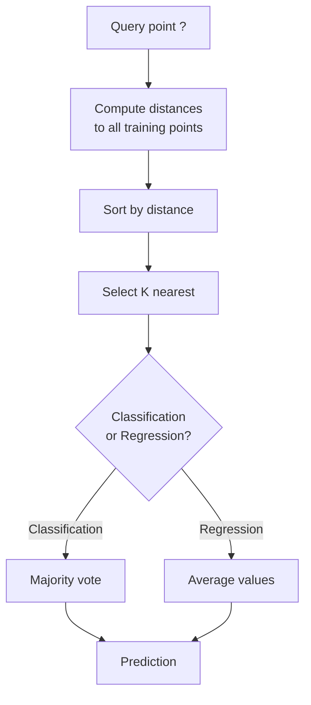
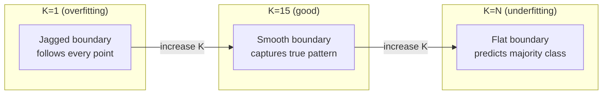
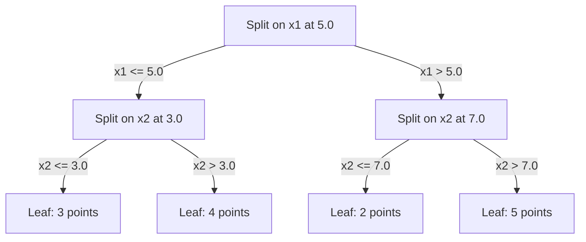

# K-Nächste-Nachbarn und Distanzen

> Speichere alles. Sage vorher, indem du auf deine Nachbarn schaust. Der einfachste Algorithmus, der tatsächlich funktioniert.

**Typ:** Build
**Sprache:** Python
**Voraussetzungen:** Phase 1 (Lektion 14 Normen und Distanzen)
**Zeit:** ~90 Minuten

## Lernziele

- Implementiere KNN-Klassifikation und -Regression von Grund auf mit konfigurierbarem K und distanzgewichteter Abstimmung
- Vergleiche L1-, L2-, Kosinus- und Minkowski-Distanzmetriken und wähle die passende Metrik für einen gegebenen Datentyp
- Erkläre den Fluch der Dimensionalität und zeige, warum KNN in hochdimensionalen Räumen schlechter wird
- Baue einen KD-Baum für effiziente Nächste-Nachbarn-Suche und analysiere, wann er Brute Force übertrifft

## Das Problem

Du hast einen Datensatz. Ein neuer Datenpunkt kommt dazu. Du musst ihn klassifizieren oder seinen Wert vorhersagen. Statt Parameter aus den Daten zu lernen (wie lineare Regression oder SVMs), suchst du einfach die K Trainingspunkte, die dem neuen Punkt am nächsten sind, und lässt sie abstimmen.

Das ist K-Nearest Neighbors. Es gibt keine Trainingsphase. Keine zu lernenden Parameter. Keine Loss-Funktion, die minimiert werden muss. Du speicherst den gesamten Trainingssatz und berechnest Distanzen erst zur Vorhersagezeit.

Es klingt zu einfach, um zu funktionieren. Aber KNN ist für viele Probleme überraschend konkurrenzfähig, besonders bei kleinen bis mittleren Datensätzen, und ein tiefes Verständnis davon zeigt grundlegende Konzepte: die Wahl der Distanzmetrik (Verbindung zu Phase 1 Lektion 14), den Fluch der Dimensionalität und den Unterschied zwischen lazy und eager learning.

KNN taucht außerdem überall in moderner KI auf – nur unter anderen Namen. Vektordatenbanken machen KNN-Suche über Embeddings. Retrieval-Augmented Generation (RAG) findet die K nächsten Dokumentabschnitte. Empfehlungssysteme finden ähnliche Nutzer oder Items. Der Algorithmus ist derselbe. Nur Skalierung und Datenstrukturen unterscheiden sich.

## Das Konzept

### Wie KNN funktioniert

Gegeben ein Datensatz aus gelabelten Punkten und ein neuer Query-Punkt:

1. Berechne die Distanz vom Query-Punkt zu jedem Punkt im Datensatz
2. Sortiere nach Distanz
3. Nimm die K nächstgelegenen Punkte
4. Für Klassifikation: Mehrheitsabstimmung unter den K Nachbarn
5. Für Regression: Mittelwert (oder gewichteter Mittelwert) der Werte der K Nachbarn



Das ist der gesamte Algorithmus. Kein Fitting. Kein Gradient Descent. Keine Epochen.

### K wählen

K ist der einzige Hyperparameter. Er steuert den Bias-Varianz-Trade-off:

| K | Verhalten |
|---|----------|
| K = 1 | Entscheidungsgrenze folgt jedem Punkt. Null Trainingsfehler. Hohe Varianz. Overfitting |
| Kleines K (3-5) | Sensitiv für lokale Struktur. Kann komplexe Grenzen abbilden |
| Großes K | Glattere Grenzen. Robuster gegen Rauschen. Kann underfitten |
| K = N | Sagt für jeden Punkt die Mehrheitsklasse voraus. Maximaler Bias |

Ein üblicher Startwert ist K = sqrt(N) für einen Datensatz mit N Punkten. Nutze bei binärer Klassifikation ein ungerades K, um Gleichstände zu vermeiden.



### Distanzmetriken

Die Distanzfunktion definiert, was „nah“ bedeutet. Unterschiedliche Metriken erzeugen unterschiedliche Nachbarn und damit unterschiedliche Vorhersagen.

**L2 (Euklidisch)** ist der Standard. Luftlinienentfernung.

```
d(a, b) = sqrt(sum((a_i - b_i)^2))
```

Empfindlich gegenüber Feature-Skalierung. Standardisiere Features immer, bevor du L2 mit KNN nutzt.

**L1 (Manhattan)** summiert absolute Differenzen. Robuster gegenüber Ausreißern als L2, weil Differenzen nicht quadriert werden.

```
d(a, b) = sum(|a_i - b_i|)
```

**Kosinus-Distanz** misst den Winkel zwischen Vektoren und ignoriert die Magnitude. Essenziell für Text- und Embedding-Daten.

```
d(a, b) = 1 - (a . b) / (||a|| * ||b||)
```

**Minkowski** verallgemeinert L1 und L2 mit dem Parameter p.

```
d(a, b) = (sum(|a_i - b_i|^p))^(1/p)

p=1: Manhattan
p=2: Euclidean
p->inf: Chebyshev (max absolute difference)
```

Welche Metrik du nutzen solltest, hängt von den Daten ab:

| Datentyp | Beste Metrik | Warum |
|-----------|------------|-----|
| Numerische Features, ähnliche Skala | L2 (Euklidisch) | Standard, funktioniert gut für räumliche Daten |
| Numerische Features, Ausreißer | L1 (Manhattan) | Robust, verstärkt große Unterschiede nicht |
| Text-Embeddings | Kosinus | Magnitude ist Rauschen, Richtung ist Bedeutung |
| Hochdimensional und sparse | Kosinus oder L1 | L2 leidet unter dem Fluch der Dimensionalität |
| Gemischte Typen | Benutzerdefinierte Distanz | Metriken je Feature-Typ kombinieren |

### Gewichtetes KNN

Standard-KNN gibt allen K Nachbarn gleiches Gewicht. Aber ein Nachbar mit Distanz 0.1 sollte mehr zählen als einer mit Distanz 5.0.

**Distanzgewichtetes KNN** gewichtet jeden Nachbarn invers zur Distanz:

```
weight_i = 1 / (distance_i + epsilon)

For classification: weighted vote
For regression:     weighted average = sum(w_i * y_i) / sum(w_i)
```

Das epsilon verhindert Division durch null, wenn ein Query-Punkt exakt einem Trainingspunkt entspricht.

Gewichtetes KNN ist weniger empfindlich gegenüber der Wahl von K, weil weit entfernte Nachbarn ohnehin kaum beitragen.

### Der Fluch der Dimensionalität

Die KNN-Performance verschlechtert sich in hohen Dimensionen. Das ist keine vage Sorge. Das ist eine mathematische Tatsache.

**Problem 1: Distanzen konvergieren.** Mit steigender Dimensionalität nähert sich das Verhältnis aus maximaler zu minimaler Distanz dem Wert 1. Alle Punkte sind für den Query nahezu gleich „weit weg“.

```
In d dimensions, for random uniform points:

d=2:    max_dist / min_dist = varies widely
d=100:  max_dist / min_dist ~ 1.01
d=1000: max_dist / min_dist ~ 1.001

When all distances are nearly equal, "nearest" is meaningless.
```

**Problem 2: Volumen explodiert.** Um K Nachbarn innerhalb eines festen Datenanteils zu erfassen, musst du den Suchradius auf einen viel größeren Anteil des Feature-Raums ausdehnen. Die „Nachbarschaft“ umfasst in hohen Dimensionen den Großteil des Raums.

**Problem 3: Ecken dominieren.** In einem Einheits-Hyperwürfel in d Dimensionen konzentriert sich das meiste Volumen nahe den Ecken, nicht im Zentrum. Eine im Würfel einbeschriebene Kugel enthält mit wachsendem d einen verschwindend kleinen Anteil des Volumens.

Praktische Konsequenz: KNN funktioniert gut bis etwa 20–50 Features. Darüber hinaus brauchst du Dimensionalitätsreduktion (PCA, UMAP, t-SNE) vor KNN oder baumbasierte Suchstrukturen, die die intrinsisch niedrigere Dimensionalität der Daten ausnutzen.

### KD-Bäume: schnelle Nächste-Nachbarn-Suche

Brute-Force-KNN berechnet die Distanz vom Query zu jedem Trainingspunkt. Das ist O(n * d) pro Query. Für große Datensätze ist das zu langsam.

Ein KD-Baum partitioniert den Raum rekursiv entlang von Feature-Achsen. Auf jeder Ebene wird entlang einer Dimension am Median gesplittet.



Um den nächsten Nachbarn zu finden, läufst du zum Blatt, das den Query enthält, dann backtrackst du und prüfst benachbarte Partitionen nur dann, wenn sie nähere Punkte enthalten könnten.

Durchschnittliche Query-Zeit: O(log n) bei niedrigen Dimensionen. Aber KD-Bäume degenerieren zu O(n) in hohen Dimensionen (d > 20), weil das Backtracking immer weniger Äste ausschließt.

### Ball Trees: besser für mittlere Dimensionen

Ball Trees partitionieren Daten in verschachtelte Hypersphären statt in achsenparallele Boxen. Jeder Knoten definiert eine Kugel (Zentrum + Radius), die alle Punkte im Teilbaum enthält.

Vorteile gegenüber KD-Bäumen:
- Funktionieren besser in mittleren Dimensionen (bis ~50)
- Kommen mit nicht achsenparalleler Struktur besser klar
- Engere Bounding-Volumen bedeuten, dass bei der Suche mehr Äste abgeschnitten werden

Sowohl KD-Bäume als auch Ball Trees sind exakte Algorithmen. Für wirklich große Suche (Millionen Punkte, Hunderte Dimensionen) nutzt man stattdessen Approximate-Nearest-Neighbor-Methoden (HNSW, IVF, Produktquantisierung). Diese werden in Phase 1 Lektion 14 behandelt.

### Lazy Learning vs Eager Learning

KNN ist ein Lazy Learner: kein Aufwand beim Training, gesamter Aufwand bei der Vorhersage. Die meisten anderen Algorithmen (lineare Regression, SVMs, neuronale Netze) sind Eager Learner: hoher Rechenaufwand beim Training für ein kompaktes Modell, danach sind Vorhersagen schnell.

| Aspekt | Lazy (KNN) | Eager (SVM, neuronales Netz) |
|--------|------------|------------------------|
| Trainingszeit | O(1), nur Daten speichern | O(n * epochs) |
| Vorhersagezeit | O(n * d) pro Query | O(d) oder O(parameters) |
| Speicher bei Vorhersage | Gesamten Trainingssatz speichern | Nur Modellparameter speichern |
| Anpassung an neue Daten | Punkte sofort hinzufügen | Modell neu trainieren |
| Entscheidungsgrenze | Implizit, on-the-fly berechnet | Explizit, nach Training fix |

Lazy Learning ist ideal, wenn:
- Der Datensatz sich häufig ändert (Punkte hinzufügen/entfernen ohne Retraining)
- Du Vorhersagen nur für sehr wenige Queries brauchst
- Du null Trainingszeit willst
- Der Datensatz klein genug ist, dass Brute-Force-Suche schnell ist

### KNN für Regression

Statt Mehrheitsabstimmung bildet KNN für Regression den Mittelwert der Zielwerte der K Nachbarn.

```
prediction = (1/K) * sum(y_i for i in K nearest neighbors)

Or with distance weighting:
prediction = sum(w_i * y_i) / sum(w_i)
where w_i = 1 / distance_i
```

KNN-Regression liefert stückweise konstante (oder bei Gewichtung stückweise glatte) Vorhersagen. Sie kann nicht außerhalb des Bereichs der Trainingsdaten extrapolieren. Liegen alle Trainingsziele zwischen 0 und 100, wird KNN nie 200 vorhersagen.

## Baue es

### Schritt 1: Distanzfunktionen

Implementiere L1-, L2-, Kosinus- und Minkowski-Distanzen. Diese knüpfen direkt an Phase 1 Lektion 14 an.

```python
import math

def l2_distance(a, b):
    return math.sqrt(sum((ai - bi) ** 2 for ai, bi in zip(a, b)))

def l1_distance(a, b):
    return sum(abs(ai - bi) for ai, bi in zip(a, b))

def cosine_distance(a, b):
    dot_val = sum(ai * bi for ai, bi in zip(a, b))
    norm_a = math.sqrt(sum(ai ** 2 for ai in a))
    norm_b = math.sqrt(sum(bi ** 2 for bi in b))
    if norm_a == 0 or norm_b == 0:
        return 1.0
    return 1.0 - dot_val / (norm_a * norm_b)

def minkowski_distance(a, b, p=2):
    if p == float('inf'):
        return max(abs(ai - bi) for ai, bi in zip(a, b))
    return sum(abs(ai - bi) ** p for ai, bi in zip(a, b)) ** (1 / p)
```

### Schritt 2: KNN-Klassifikator und -Regressor

Baue vollständiges KNN mit konfigurierbarem K, Distanzmetrik und optionaler Distanzgewichtung.

```python
class KNN:
    def __init__(self, k=5, distance_fn=l2_distance, weighted=False,
                 task="classification"):
        self.k = k
        self.distance_fn = distance_fn
        self.weighted = weighted
        self.task = task
        self.X_train = None
        self.y_train = None

    def fit(self, X, y):
        self.X_train = X
        self.y_train = y

    def predict(self, X):
        return [self._predict_one(x) for x in X]
```

### Schritt 3: KD-Baum für effiziente Suche

Baue einen KD-Baum von Grund auf, der rekursiv am Median jeder Dimension splittet.

```python
class KDTree:
    def __init__(self, X, indices=None, depth=0):
        # Recursively partition the data
        self.axis = depth % len(X[0])
        # Split on median of the current axis
        ...

    def query(self, point, k=1):
        # Traverse to leaf, then backtrack
        ...
```

Siehe `code/knn.py` für die vollständige Implementierung mit allen Hilfsmethoden und Demos.

### Schritt 4: Feature-Skalierung

KNN braucht Feature-Skalierung, weil Distanzen sensitiv auf Feature-Magnituden sind. Ein Feature von 0 bis 1000 dominiert ein Feature von 0 bis 1.

```python
def standardize(X):
    n = len(X)
    d = len(X[0])
    means = [sum(X[i][j] for i in range(n)) / n for j in range(d)]
    stds = [
        max(1e-10, (sum((X[i][j] - means[j]) ** 2 for i in range(n)) / n) ** 0.5)
        for j in range(d)
    ]
    return [[((X[i][j] - means[j]) / stds[j]) for j in range(d)] for i in range(n)], means, stds
```

## Nutze es

Mit scikit-learn:

```python
from sklearn.neighbors import KNeighborsClassifier
from sklearn.preprocessing import StandardScaler
from sklearn.pipeline import Pipeline

clf = Pipeline([
    ("scaler", StandardScaler()),
    ("knn", KNeighborsClassifier(n_neighbors=5, metric="euclidean")),
])
clf.fit(X_train, y_train)
print(f"Accuracy: {clf.score(X_test, y_test):.4f}")
```

Scikit-learn nutzt automatisch KD-Bäume oder Ball Trees, wenn der Datensatz groß genug und die Dimensionalität niedrig genug ist. Bei hochdimensionalen Daten fällt es auf Brute Force zurück. Das kannst du über den Parameter `algorithm` steuern.

Für großskalige Nächste-Nachbarn-Suche (Millionen Vektoren) nutze FAISS, Annoy oder eine Vektordatenbank:

```python
import faiss

index = faiss.IndexFlatL2(dimension)
index.add(embeddings)
distances, indices = index.search(query_vectors, k=5)
```

## Übungen

1. Implementiere KNN-Klassifikation auf einem 2D-Datensatz mit 3 Klassen. Plotte die Entscheidungsgrenze für K=1, K=5, K=15 und K=N. Beobachte den Übergang von Overfitting zu Underfitting.

2. Generiere 1000 Zufallspunkte in 2, 5, 10, 50, 100 und 500 Dimensionen. Berechne für jede Dimensionalität das Verhältnis der maximalen zur minimalen paarweisen Distanz. Plotte das Verhältnis gegen die Dimensionalität, um den Fluch der Dimensionalität zu visualisieren.

3. Vergleiche L1-, L2- und Kosinus-Distanz für KNN bei einem Textklassifikationsproblem (mit TF-IDF-Vektoren). Welche Metrik liefert die beste Accuracy? Warum gewinnt bei Text oft Kosinus?

4. Implementiere einen KD-Baum und miss die Query-Zeit gegenüber Brute Force für Datensätze mit 1k, 10k und 100k Punkten in 2D, 10D und 50D. Ab welcher Dimensionalität ist der KD-Baum nicht mehr schneller als Brute Force?

5. Baue einen gewichteten KNN-Regressor für y = sin(x) + noise. Vergleiche mit ungewichtetem KNN für K=3, 10, 30. Zeige, dass Gewichtung glattere Vorhersagen erzeugt, besonders bei großem K.

## Schlüsselbegriffe

| Begriff | Was er tatsächlich bedeutet |
|------|----------------------|
| K-nearest neighbors | Nichtparametrischer Algorithmus, der durch die K nächstgelegenen Trainingspunkte zum Query vorhersagt |
| Lazy learning | Keine Berechnung zur Trainingszeit. Alle Arbeit passiert bei der Vorhersage. KNN ist das kanonische Beispiel |
| Eager learning | Hoher Rechenaufwand zur Trainingszeit, um ein kompaktes Modell zu bauen. Die meisten ML-Algorithmen sind eager |
| Curse of dimensionality | In hohen Dimensionen konvergieren Distanzen und Nachbarschaften weiten sich auf den Großteil des Raums aus; KNN wird ineffektiv |
| KD-tree | Binärbaum, der den Raum rekursiv entlang von Feature-Achsen partitioniert. O(log n)-Queries in niedrigen Dimensionen |
| Ball tree | Baum aus verschachtelten Hypersphären. Funktioniert besser als KD-Bäume in mittleren Dimensionen (bis ~50) |
| Weighted KNN | Nachbarn werden invers zur Distanz gewichtet. Nähere Nachbarn haben mehr Einfluss auf die Vorhersage |
| Feature scaling | Features auf vergleichbare Bereiche normalisieren. Für distanzbasierte Methoden wie KNN erforderlich |
| Majority vote | Klassifikation durch Zählen, welche Klasse unter K Nachbarn am häufigsten ist |
| Brute force search | Distanz zu jedem Trainingspunkt berechnen. O(n*d) pro Query. Exakt, aber langsam bei großem n |
| Approximate nearest neighbor | Algorithmen (HNSW, LSH, IVF), die annähernd nächste Punkte deutlich schneller finden als exakte Suche |
| Voronoi diagram | Zerlegung des Raums, bei der jede Region alle Punkte enthält, die einem Trainingspunkt näher sind als jedem anderen. K=1-KNN erzeugt Voronoi-Grenzen |

## Weiterführende Literatur

- [Cover & Hart: Nearest Neighbor Pattern Classification (1967)](https://ieeexplore.ieee.org/document/1053964) - die grundlegende KNN-Arbeit, die zeigt, dass die Fehlerrate höchstens doppelt so hoch wie das Bayes-Optimum ist
- [Friedman, Bentley, Finkel: An Algorithm for Finding Best Matches in Logarithmic Expected Time (1977)](https://dl.acm.org/doi/10.1145/355744.355745) - die ursprüngliche KD-Baum-Arbeit
- [Beyer et al.: When Is "Nearest Neighbor" Meaningful? (1999)](https://link.springer.com/chapter/10.1007/3-540-49257-7_15) - formale Analyse des Fluchs der Dimensionalität für Nearest Neighbor
- [scikit-learn Nearest Neighbors documentation](https://scikit-learn.org/stable/modules/neighbors.html) - praxisnaher Leitfaden mit Algorithmusauswahl
- [FAISS: A Library for Efficient Similarity Search](https://github.com/facebookresearch/faiss) - Metas Bibliothek für Approximate Nearest Neighbor im Milliardenmaßstab
