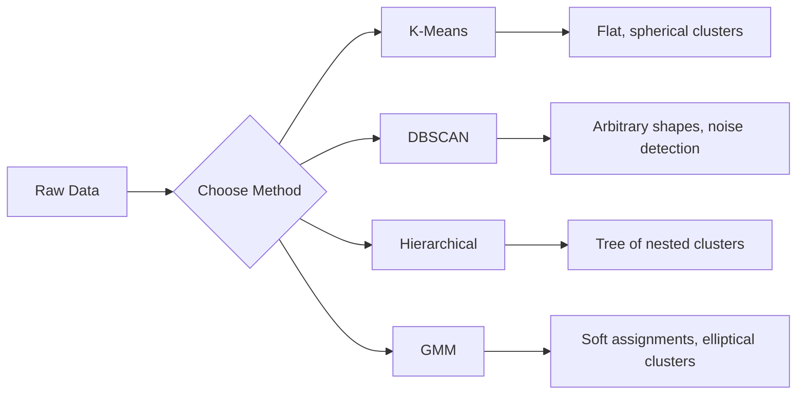

# Unüberwachtes Lernen

> Keine Labels, kein Lehrer. Der Algorithmus findet die Struktur selbst.

**Typ:** Build
**Sprachen:** Python
**Voraussetzungen:** Phase 1 (Normen & Distanzen, Wahrscheinlichkeit & Verteilungen), Phase 2 Lektionen 1-6
**Zeit:** ~90 Minuten

## Lernziele

- Implementiere K-Means, DBSCAN und Gaussian Mixture Models von Grund auf und vergleiche ihr Clustering-Verhalten
- Bewerte Cluster-Qualität mit dem Silhouette-Score und der Elbow-Methode, um das optimale K zu wählen
- Erkläre, wann DBSCAN K-Means übertrifft, und erkenne, welcher Algorithmus nicht-sphärische Cluster und Ausreißer besser handhabt
- Baue eine Anomaly-Detection-Pipeline mit Clustering-Methoden, um Punkte zu markieren, die vom Normalmuster abweichen

## Das Problem

Bisher ging jede ML-Lektion von gelabelten Daten aus: „Hier ist ein Input, hier ist der korrekte Output.“ In der realen Welt sind Labels teuer. Ein Krankenhaus hat Millionen Patientendatensätze, aber niemand hat jeden einzelnen manuell einer Krankheitskategorie zugeordnet. Ein E-Commerce-System hat Millionen Nutzersitzungen, aber niemand hat Kundensegmente händisch gelabelt. Ein Security-Team hat Netzwerk-Logs, aber niemand hat jede Anomalie markiert.

Unüberwachtes Lernen findet Muster, ohne gesagt zu bekommen, wonach gesucht werden soll. Es gruppiert ähnliche Datenpunkte, entdeckt verborgene Strukturen und macht Anomalien sichtbar. Wenn überwachtes Lernen wie Lernen mit einem Lehrbuch samt Lösungsschlüssel ist, dann ist unüberwachtes Lernen wie langes Betrachten roher Daten, bis sich die Muster selbst zeigen.

Der Haken: Ohne Labels kannst du nicht direkt „richtig“ oder „falsch“ messen. Du brauchst andere Werkzeuge, um zu bewerten, ob die gefundene Struktur sinnvoll ist.

## Das Konzept

### Clustering: Ähnliche Dinge zusammenfassen

Clustering weist jedem Datenpunkt eine Gruppe (Cluster) zu, sodass Punkte innerhalb derselben Gruppe einander ähnlicher sind als Punkten in anderen Gruppen. Die zentrale Frage ist immer: Was bedeutet „ähnlich“?



### K-Means: Das Arbeitspferd

K-Means teilt Daten in genau K Cluster. Jeder Cluster hat einen Zentroiden (seinen Schwerpunkt), und jeder Punkt gehört zum nächstgelegenen Zentroiden.

Lloyds Algorithmus:

1. Wähle K zufällige Punkte als initiale Zentroiden
2. Weise jeden Datenpunkt dem nächstgelegenen Zentroiden zu
3. Berechne jeden Zentroiden als Mittelwert seiner zugewiesenen Punkte neu
4. Wiederhole Schritte 2-3, bis sich die Zuweisungen nicht mehr ändern

Die Zielfunktion (Inertia) misst die gesamte quadrierte Distanz jedes Punkts zu seinem zugewiesenen Zentroiden. K-Means minimiert sie, findet aber nur ein lokales Minimum. Unterschiedliche Initialisierungen können unterschiedliche Ergebnisse liefern.

### K wählen

Zwei Standardmethoden:

**Elbow-Methode:** Führe K-Means für K = 1, 2, 3, ..., n aus. Plotte Inertia gegen K. Suche den „Knick“, bei dem zusätzliche Cluster die Inertia nicht mehr deutlich reduzieren.

**Silhouette-Score:** Miss für jeden Punkt, wie ähnlich er seinem eigenen Cluster ist (a) im Vergleich zum nächstgelegenen anderen Cluster (b). Der Silhouette-Koeffizient ist (b - a) / max(a, b) und liegt zwischen -1 (falscher Cluster) und +1 (gut geclustert). Über alle Punkte gemittelt erhältst du einen globalen Score.

### DBSCAN: Dichtebasiertes Clustering

K-Means nimmt sphärische Cluster an und verlangt, dass du K im Voraus festlegst. DBSCAN macht keine dieser Annahmen. Es findet Cluster als dichte Regionen, getrennt durch dünn besetzte Regionen.

Zwei Parameter:
- **eps**: der Radius einer Nachbarschaft
- **min_samples**: die minimale Punktanzahl, die eine dichte Region bilden muss

Drei Punkttypen:
- **Core point**: hat mindestens min_samples Punkte innerhalb der eps-Distanz
- **Border point**: liegt innerhalb eps eines Core-Points, ist aber selbst kein Core-Point
- **Noise point**: weder Core noch Border. Das sind Ausreißer.

DBSCAN verbindet Core-Points, die innerhalb eps zueinander liegen, zu demselben Cluster. Border-Points schließen sich dem Cluster eines nahen Core-Points an. Noise-Points gehören zu keinem Cluster.

Stärken: findet Cluster beliebiger Form, bestimmt die Clusteranzahl automatisch, erkennt Ausreißer. Schwäche: Probleme bei Clustern mit stark unterschiedlicher Dichte.

### Hierarchisches Clustering

Erzeugt einen Baum (Dendrogramm) aus verschachtelten Clustern.

Agglomerativ (bottom-up):
1. Starte mit jedem Punkt als eigenem Cluster
2. Führe die zwei nächstgelegenen Cluster zusammen
3. Wiederhole, bis nur noch ein Cluster übrig ist
4. Schneide das Dendrogramm auf der gewünschten Höhe, um K Cluster zu erhalten

Die „Nähe“ zwischen Clustern kann so gemessen werden:
- **Single Linkage**: minimale Distanz zwischen zwei Punkten aus den beiden Clustern
- **Complete Linkage**: maximale Distanz zwischen zwei Punkten
- **Average Linkage**: durchschnittliche Distanz über alle Punktpaare
- **Ward-Methode**: der Merge mit der kleinsten Zunahme der gesamten Intra-Cluster-Varianz

### Gaussian Mixture Models (GMM)

K-Means macht harte Zuweisungen: Jeder Punkt gehört genau zu einem Cluster. GMM macht weiche Zuweisungen: Jeder Punkt hat eine Wahrscheinlichkeit, zu jedem Cluster zu gehören.

GMM nimmt an, dass die Daten aus einer Mischung von K Gauß-Verteilungen erzeugt wurden, jeweils mit eigenem Mittelwert und eigener Kovarianz. Der Expectation-Maximization-(EM)-Algorithmus wechselt zwischen:

- **E-Step**: berechne die Wahrscheinlichkeit, dass jeder Punkt zu jeder Gauß-Verteilung gehört
- **M-Step**: aktualisiere Mittelwert, Kovarianz und Mischungsgewicht jeder Gauß-Verteilung, um die Datenwahrscheinlichkeit zu maximieren

GMM kann elliptische Cluster modellieren (nicht nur sphärische wie K-Means) und überlappende Cluster natürlich handhaben.

### Wann welches Verfahren?

| Method | Best for | Avoid when |
|--------|----------|------------|
| K-Means | Large datasets, spherical clusters, known K | Irregular shapes, outliers present |
| DBSCAN | Unknown K, arbitrary shapes, outlier detection | Varying densities, very high dimensions |
| Hierarchical | Small datasets, need dendrogram, unknown K | Large datasets (O(n^2) memory) |
| GMM | Overlapping clusters, soft assignments needed | Very large datasets, too many dimensions |

### Anomaly Detection mit Clustering

Clustering unterstützt Anomaly Detection auf natürliche Weise:
- **K-Means**: Punkte weit weg von allen Zentroiden sind Anomalien
- **DBSCAN**: Noise-Points sind per Definition Anomalien
- **GMM**: Punkte mit niedriger Wahrscheinlichkeit unter allen Gauß-Verteilungen sind Anomalien

## Baue es

### Schritt 1: K-Means von Grund auf

```python
import math
import random


def euclidean_distance(a, b):
    return math.sqrt(sum((ai - bi) ** 2 for ai, bi in zip(a, b)))


def kmeans(data, k, max_iterations=100, seed=42):
    random.seed(seed)
    n_features = len(data[0])

    centroids = random.sample(data, k)

    for iteration in range(max_iterations):
        clusters = [[] for _ in range(k)]
        assignments = []

        for point in data:
            distances = [euclidean_distance(point, c) for c in centroids]
            nearest = distances.index(min(distances))
            clusters[nearest].append(point)
            assignments.append(nearest)

        new_centroids = []
        for cluster in clusters:
            if len(cluster) == 0:
                new_centroids.append(random.choice(data))
                continue
            centroid = [
                sum(point[j] for point in cluster) / len(cluster)
                for j in range(n_features)
            ]
            new_centroids.append(centroid)

        if all(
            euclidean_distance(old, new) < 1e-6
            for old, new in zip(centroids, new_centroids)
        ):
            print(f"  Converged at iteration {iteration + 1}")
            break

        centroids = new_centroids

    return assignments, centroids
```

### Schritt 2: Elbow-Methode und Silhouette-Score

```python
def compute_inertia(data, assignments, centroids):
    total = 0.0
    for point, cluster_id in zip(data, assignments):
        total += euclidean_distance(point, centroids[cluster_id]) ** 2
    return total


def silhouette_score(data, assignments):
    n = len(data)
    if n < 2:
        return 0.0

    clusters = {}
    for i, c in enumerate(assignments):
        clusters.setdefault(c, []).append(i)

    if len(clusters) < 2:
        return 0.0

    scores = []
    for i in range(n):
        own_cluster = assignments[i]
        own_members = [j for j in clusters[own_cluster] if j != i]

        if len(own_members) == 0:
            scores.append(0.0)
            continue

        a = sum(euclidean_distance(data[i], data[j]) for j in own_members) / len(own_members)

        b = float("inf")
        for cluster_id, members in clusters.items():
            if cluster_id == own_cluster:
                continue
            avg_dist = sum(euclidean_distance(data[i], data[j]) for j in members) / len(members)
            b = min(b, avg_dist)

        if max(a, b) == 0:
            scores.append(0.0)
        else:
            scores.append((b - a) / max(a, b))

    return sum(scores) / len(scores)


def find_best_k(data, max_k=10):
    print("Elbow method:")
    inertias = []
    for k in range(1, max_k + 1):
        assignments, centroids = kmeans(data, k)
        inertia = compute_inertia(data, assignments, centroids)
        inertias.append(inertia)
        print(f"  K={k}: inertia={inertia:.2f}")

    print("\nSilhouette scores:")
    for k in range(2, max_k + 1):
        assignments, centroids = kmeans(data, k)
        score = silhouette_score(data, assignments)
        print(f"  K={k}: silhouette={score:.4f}")

    return inertias
```

### Schritt 3: DBSCAN von Grund auf

```python
def dbscan(data, eps, min_samples):
    n = len(data)
    labels = [-1] * n
    cluster_id = 0

    def region_query(point_idx):
        neighbors = []
        for i in range(n):
            if euclidean_distance(data[point_idx], data[i]) <= eps:
                neighbors.append(i)
        return neighbors

    visited = [False] * n

    for i in range(n):
        if visited[i]:
            continue
        visited[i] = True

        neighbors = region_query(i)

        if len(neighbors) < min_samples:
            labels[i] = -1
            continue

        labels[i] = cluster_id
        seed_set = list(neighbors)
        seed_set.remove(i)

        j = 0
        while j < len(seed_set):
            q = seed_set[j]

            if not visited[q]:
                visited[q] = True
                q_neighbors = region_query(q)
                if len(q_neighbors) >= min_samples:
                    for nb in q_neighbors:
                        if nb not in seed_set:
                            seed_set.append(nb)

            if labels[q] == -1:
                labels[q] = cluster_id

            j += 1

        cluster_id += 1

    return labels
```

### Schritt 4: Gaussian Mixture Model (EM-Algorithmus)

```python
def gmm(data, k, max_iterations=100, seed=42):
    random.seed(seed)
    n = len(data)
    d = len(data[0])

    indices = random.sample(range(n), k)
    means = [list(data[i]) for i in indices]
    variances = [1.0] * k
    weights = [1.0 / k] * k

    def gaussian_pdf(x, mean, variance):
        d = len(x)
        coeff = 1.0 / ((2 * math.pi * variance) ** (d / 2))
        exponent = -sum((xi - mi) ** 2 for xi, mi in zip(x, mean)) / (2 * variance)
        return coeff * math.exp(max(exponent, -500))

    for iteration in range(max_iterations):
        responsibilities = []
        for i in range(n):
            probs = []
            for j in range(k):
                probs.append(weights[j] * gaussian_pdf(data[i], means[j], variances[j]))
            total = sum(probs)
            if total == 0:
                total = 1e-300
            responsibilities.append([p / total for p in probs])

        old_means = [list(m) for m in means]

        for j in range(k):
            r_sum = sum(responsibilities[i][j] for i in range(n))
            if r_sum < 1e-10:
                continue

            weights[j] = r_sum / n

            for dim in range(d):
                means[j][dim] = sum(
                    responsibilities[i][j] * data[i][dim] for i in range(n)
                ) / r_sum

            variances[j] = sum(
                responsibilities[i][j]
                * sum((data[i][dim] - means[j][dim]) ** 2 for dim in range(d))
                for i in range(n)
            ) / (r_sum * d)
            variances[j] = max(variances[j], 1e-6)

        shift = sum(
            euclidean_distance(old_means[j], means[j]) for j in range(k)
        )
        if shift < 1e-6:
            print(f"  GMM converged at iteration {iteration + 1}")
            break

    assignments = []
    for i in range(n):
        assignments.append(responsibilities[i].index(max(responsibilities[i])))

    return assignments, means, weights, responsibilities
```

### Schritt 5: Testdaten erzeugen und alles ausführen

```python
def make_blobs(centers, n_per_cluster=50, spread=0.5, seed=42):
    random.seed(seed)
    data = []
    true_labels = []
    for label, (cx, cy) in enumerate(centers):
        for _ in range(n_per_cluster):
            x = cx + random.gauss(0, spread)
            y = cy + random.gauss(0, spread)
            data.append([x, y])
            true_labels.append(label)
    return data, true_labels


def make_moons(n_samples=200, noise=0.1, seed=42):
    random.seed(seed)
    data = []
    labels = []
    n_half = n_samples // 2
    for i in range(n_half):
        angle = math.pi * i / n_half
        x = math.cos(angle) + random.gauss(0, noise)
        y = math.sin(angle) + random.gauss(0, noise)
        data.append([x, y])
        labels.append(0)
    for i in range(n_half):
        angle = math.pi * i / n_half
        x = 1 - math.cos(angle) + random.gauss(0, noise)
        y = 1 - math.sin(angle) - 0.5 + random.gauss(0, noise)
        data.append([x, y])
        labels.append(1)
    return data, labels


if __name__ == "__main__":
    centers = [[2, 2], [8, 3], [5, 8]]
    data, true_labels = make_blobs(centers, n_per_cluster=50, spread=0.8)

    print("=== K-Means on 3 blobs ===")
    assignments, centroids = kmeans(data, k=3)
    print(f"  Centroids: {[[round(c, 2) for c in cent] for cent in centroids]}")
    sil = silhouette_score(data, assignments)
    print(f"  Silhouette score: {sil:.4f}")

    print("\n=== Elbow Method ===")
    find_best_k(data, max_k=6)

    print("\n=== DBSCAN on 3 blobs ===")
    db_labels = dbscan(data, eps=1.5, min_samples=5)
    n_clusters = len(set(db_labels) - {-1})
    n_noise = db_labels.count(-1)
    print(f"  Found {n_clusters} clusters, {n_noise} noise points")

    print("\n=== GMM on 3 blobs ===")
    gmm_assignments, gmm_means, gmm_weights, _ = gmm(data, k=3)
    print(f"  Means: {[[round(m, 2) for m in mean] for mean in gmm_means]}")
    print(f"  Weights: {[round(w, 3) for w in gmm_weights]}")
    gmm_sil = silhouette_score(data, gmm_assignments)
    print(f"  Silhouette score: {gmm_sil:.4f}")

    print("\n=== DBSCAN on moons (non-spherical clusters) ===")
    moon_data, moon_labels = make_moons(n_samples=200, noise=0.1)
    moon_db = dbscan(moon_data, eps=0.3, min_samples=5)
    n_moon_clusters = len(set(moon_db) - {-1})
    n_moon_noise = moon_db.count(-1)
    print(f"  Found {n_moon_clusters} clusters, {n_moon_noise} noise points")

    print("\n=== K-Means on moons (will fail to separate) ===")
    moon_km, moon_centroids = kmeans(moon_data, k=2)
    moon_sil = silhouette_score(moon_data, moon_km)
    print(f"  Silhouette score: {moon_sil:.4f}")
    print("  K-Means splits moons poorly because they are not spherical")

    print("\n=== Anomaly detection with DBSCAN ===")
    anomaly_data = list(data)
    anomaly_data.append([20.0, 20.0])
    anomaly_data.append([-5.0, -5.0])
    anomaly_data.append([15.0, 0.0])
    anomaly_labels = dbscan(anomaly_data, eps=1.5, min_samples=5)
    anomalies = [
        anomaly_data[i]
        for i in range(len(anomaly_labels))
        if anomaly_labels[i] == -1
    ]
    print(f"  Detected {len(anomalies)} anomalies")
    for a in anomalies[-3:]:
        print(f"    Point {[round(v, 2) for v in a]}")
```

## Nutze es

Mit scikit-learn sind dieselben Algorithmen Einzeiler:

```python
from sklearn.cluster import KMeans, DBSCAN, AgglomerativeClustering
from sklearn.mixture import GaussianMixture
from sklearn.metrics import silhouette_score as sklearn_silhouette

km = KMeans(n_clusters=3, random_state=42).fit(data)
db = DBSCAN(eps=1.5, min_samples=5).fit(data)
agg = AgglomerativeClustering(n_clusters=3).fit(data)
gmm_model = GaussianMixture(n_components=3, random_state=42).fit(data)
```

Die Versionen von Grund auf zeigen dir exakt, was diese Bibliotheken berechnen. K-Means wechselt zwischen Zuweisen und Neuberechnen. DBSCAN wächst Cluster aus dichten Seeds. GMM alterniert zwischen Expectation und Maximization. Die Bibliotheksversionen ergänzen numerische Stabilität, bessere Initialisierung (K-Means++) und GPU-Beschleunigung, aber die Kernlogik bleibt gleich.

## Ship It

Diese Lektion liefert funktionierende Implementierungen von K-Means, DBSCAN und GMM von Grund auf. Der Clustering-Code kann als Basis für fortgeschrittene unüberwachte Methoden wiederverwendet werden.

## Übungen

1. Implementiere K-Means++-Initialisierung: Statt zufällige Zentroiden zu wählen, wähle den ersten zufällig und jeden weiteren mit Wahrscheinlichkeit proportional zur quadrierten Distanz zum nächsten vorhandenen Zentroiden. Vergleiche die Konvergenzgeschwindigkeit mit zufälliger Initialisierung.
2. Ergänze hierarchisches agglomeratives Clustering im Code. Implementiere Ward-Linkage und erzeuge ein Dendrogramm (als verschachtelte Liste von Merges). Schneide es auf verschiedenen Ebenen und vergleiche mit K-Means-Ergebnissen.
3. Baue eine einfache Anomaly-Detection-Pipeline: Führe DBSCAN und GMM auf denselben Daten aus, markiere Punkte, die von beiden Methoden als Ausreißer erkannt werden (Noise in DBSCAN, niedrige Wahrscheinlichkeit in GMM). Miss die Überlappung und diskutiere, wann die Methoden auseinanderliegen.

## Schlüsselbegriffe

| Begriff | Was man sagt | Was es tatsächlich bedeutet |
|------|----------------|----------------------|
| Clustering | „Ähnliche Dinge gruppieren“ | Daten in Teilmengen partitionieren, bei denen die Ähnlichkeit innerhalb der Gruppe größer ist als zwischen Gruppen, gemessen mit einer konkreten Distanzmetrik |
| Centroid | „Das Zentrum eines Clusters“ | Der Mittelwert aller einem Cluster zugewiesenen Punkte; in K-Means der Cluster-Repräsentant |
| Inertia | „Wie kompakt die Cluster sind“ | Summe der quadrierten Distanzen jedes Punkts zu seinem zugewiesenen Zentroiden; kleiner ist kompakter |
| Silhouette score | „Wie gut Cluster getrennt sind“ | Für jeden Punkt: (b - a) / max(a, b), wobei a die mittlere Intra-Cluster-Distanz und b die mittlere Distanz zum nächsten Cluster ist |
| Core point | „Ein Punkt in einer dichten Region“ | Ein Punkt mit mindestens min_samples Nachbarn innerhalb eps-Distanz in DBSCAN |
| EM algorithm | „Soft K-Means“ | Expectation-Maximization: iteratives Berechnen von Zugehörigkeitswahrscheinlichkeiten (E-Step) und Aktualisieren von Verteilungsparametern (M-Step) |
| Dendrogram | „Ein Cluster-Baum“ | Baumdiagramm, das Reihenfolge und Distanz der Cluster-Zusammenführungen im hierarchischen Clustering zeigt |
| Anomaly | „Ein Ausreißer“ | Ein Datenpunkt, der nicht dem erwarteten Muster folgt; als Noise von DBSCAN oder als niedrige Wahrscheinlichkeit in GMM erkannt |

## Weiterführende Literatur

- [Stanford CS229 - Unsupervised Learning](https://cs229.stanford.edu/notes2022fall/main_notes.pdf) - Andrew Ngs Vorlesungsnotizen zu Clustering und EM
- [scikit-learn Clustering Guide](https://scikit-learn.org/stable/modules/clustering.html) - praxisorientierter Vergleich aller Clustering-Algorithmen mit visuellen Beispielen
- [DBSCAN original paper (Ester et al., 1996)](https://www.aaai.org/Papers/KDD/1996/KDD96-037.pdf) - die Arbeit, die dichtebasiertes Clustering eingeführt hat
