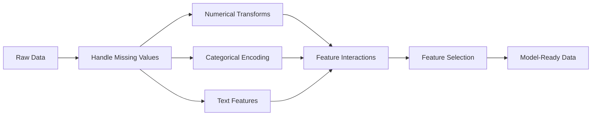

# Feature Engineering & Selektion

> Ein gutes Feature ist tausend Datenpunkte wert.

**Typ:** Build
**Sprache:** Python
**Voraussetzungen:** Phase 1 (Statistik für ML, Lineare Algebra), Phase 2 Lektionen 1-7
**Zeit:** ~90 Minuten

## Lernziele

- Implementiere numerische Transformationen (Standardisierung, Min-Max-Skalierung, Log-Transformation, Binning) und erkläre, wann jede davon sinnvoll ist
- Baue One-Hot-, Label- und Target-Encoding für kategoriale Features und erkenne das Data-Leakage-Risiko beim Target-Encoding
- Konstruiere einen TF-IDF-Vektorisierer von Grund auf und erkläre, warum er rohe Worthäufigkeiten bei der Textklassifikation übertrifft
- Wende filterbasierte Feature-Selektion (Varianzschwelle, Korrelation, Mutual Information) an, um die Dimensionalität zu reduzieren

## Das Problem

Du hast einen Datensatz. Du wählst einen Algorithmus. Du trainierst ihn. Die Ergebnisse sind mittelmäßig. Du probierst einen ausgefeilteren Algorithmus. Immer noch mittelmäßig. Du verbringst eine Woche mit Hyperparameter-Tuning. Kaum Verbesserung.

Dann transformiert jemand die Rohdaten in bessere Features und eine einfache logistische Regression schlägt dein getuntes Gradient-Boosted-Ensemble.

Das passiert ständig. Im klassischen ML ist die Darstellung der Daten wichtiger als die Wahl des Algorithmus. Ein Modell für Hauspreise mit „Wohnfläche“ und „Anzahl Schlafzimmer“ wird ein Modell mit „Adresse als Rohstring“ schlagen, egal wie ausgefeilt der Lernalgorithmus ist. Der Algorithmus kann nur mit dem arbeiten, was du ihm gibst.

Feature Engineering ist der Prozess, Rohdaten in Darstellungen zu transformieren, in denen Modelle Muster leichter finden. Feature-Selektion ist der Prozess, Features wegzuwerfen, die Rauschen hinzufügen, aber kein Signal. Zusammen sind sie die wirkungsvollste Aktivität im klassischen ML.

## Das Konzept

### Die Feature-Pipeline



### Numerische Features

Rohzahlen sind selten direkt modellbereit. Häufige Transformationen:

**Skalierung:** Bringt Features auf denselben Wertebereich, damit distanzbasierte Algorithmen (K-Means, KNN, SVM) alle Features gleich behandeln. Min-Max-Skalierung bildet auf [0, 1] ab. Standardisierung (Z-Score) bildet auf Mittelwert=0, Standardabweichung=1 ab.

**Log-Transformation:** Komprimiert rechtsschiefe Verteilungen (Einkommen, Bevölkerungsgröße, Worthäufigkeiten). Macht multiplikative Beziehungen additiv.

**Binning:** Wandelt kontinuierliche Werte in Kategorien um. Nützlich, wenn die Beziehung zwischen Feature und Ziel nichtlinear, aber stufenweise ist (z. B. Altersgruppen).

**Polynomiale Features:** Erzeugt x^2-, x^3- und x1*x2-Terme. Damit können lineare Modelle nichtlineare Zusammenhänge abbilden – auf Kosten zusätzlicher Features.

### Kategoriale Features

Modelle brauchen Zahlen. Kategorien müssen encodiert werden.

**One-Hot-Encoding:** Erzeugt eine binäre Spalte für jede Kategorie. „color = red/blue/green“ wird zu drei Spalten: is_red, is_blue, is_green. Funktioniert gut für Features mit geringer Kardinalität, explodiert aber bei vielen Kategorien.

**Label-Encoding:** Ordnet jeder Kategorie eine Ganzzahl zu: red=0, blue=1, green=2. Führt eine falsche Ordnung ein (das Modell könnte denken green > blue > red). Nur sinnvoll für baumbasierte Modelle, die auf einzelnen Werten splitten.

**Target-Encoding:** Ersetzt jede Kategorie durch den Mittelwert der Zielvariable für diese Kategorie. Leistungsfähig, aber gefährlich: hohes Risiko für Data Leakage. Darf nur auf Trainingsdaten berechnet und dann auf Testdaten angewendet werden.

### Text-Features

**Count Vectorizer:** Zählt, wie oft jedes Wort in einem Dokument vorkommt. „the cat sat on the mat“ wird zu {the: 2, cat: 1, sat: 1, on: 1, mat: 1}.

**TF-IDF:** Term Frequency-Inverse Document Frequency. Gewichtet Wörter danach, wie einzigartig sie über Dokumente hinweg sind. Häufige Wörter wie „the“ bekommen ein geringes Gewicht. Seltene, charakteristische Wörter bekommen ein hohes Gewicht.

```
TF(word, doc) = count(word in doc) / total words in doc
IDF(word) = log(total docs / docs containing word)
TF-IDF = TF * IDF
```

### Fehlende Werte

Echte Daten haben Lücken. Strategien:

- **Zeilen entfernen:** Nur wenn fehlende Daten selten und zufällig sind
- **Mittelwert-/Median-Imputation:** Einfach, erhält die Form der Verteilung (Median ist robuster gegenüber Ausreißern)
- **Modus-Imputation:** Für kategoriale Features
- **Indikatorspalte:** Vor der Imputation eine binäre Spalte „war_dies_fehlend“ hinzufügen. Die Tatsache, dass Daten fehlen, kann selbst informativ sein
- **Forward/Backward Fill:** Für Zeitreihendaten

### Feature-Interaktionen

Manchmal steckt der Zusammenhang in der Kombination. „Größe“ und „Gewicht“ allein sind weniger aussagekräftig als „BMI = Gewicht / Größe^2“. Feature-Interaktionen vervielfachen den Feature-Raum, daher sollte Domänenwissen genutzt werden, um die richtigen auszuwählen.

### Feature-Selektion

Mehr Features sind nicht immer besser. Irrelevante Features fügen Rauschen hinzu, erhöhen die Trainingszeit und können Overfitting verursachen.

**Filter-Methoden (vor dem Modell):**
- Korrelation: entferne Features, die stark miteinander korrelieren (redundant)
- Mutual Information: misst, wie stark das Wissen über ein Feature die Unsicherheit über das Ziel reduziert
- Varianzschwelle: entferne Features, die kaum variieren

**Wrapper-Methoden (modellbasiert):**
- L1-Regularisierung (Lasso): drückt irrelevante Feature-Gewichte exakt auf null
- Rekursive Feature-Elimination: trainieren, unwichtigstes Feature entfernen, wiederholen

**Warum Selektion wichtig ist:** Ein Modell mit 10 guten Features wird in der Regel ein Modell mit 10 guten und 90 verrauschten Features schlagen. Die verrauschten Features geben dem Modell Möglichkeiten, sich an Muster in den Trainingsdaten anzupassen, die nicht generalisieren.

## Baue es

### Schritt 1: Numerische Transformationen von Grund auf

```python
import math


def min_max_scale(values):
    min_val = min(values)
    max_val = max(values)
    if max_val == min_val:
        return [0.0] * len(values)
    return [(v - min_val) / (max_val - min_val) for v in values]


def standardize(values):
    n = len(values)
    mean = sum(values) / n
    variance = sum((v - mean) ** 2 for v in values) / n
    std = math.sqrt(variance) if variance > 0 else 1.0
    return [(v - mean) / std for v in values]


def log_transform(values):
    return [math.log(v + 1) for v in values]


def bin_values(values, n_bins=5):
    min_val = min(values)
    max_val = max(values)
    bin_width = (max_val - min_val) / n_bins
    if bin_width == 0:
        return [0] * len(values)
    result = []
    for v in values:
        bin_idx = int((v - min_val) / bin_width)
        bin_idx = min(bin_idx, n_bins - 1)
        result.append(bin_idx)
    return result


def polynomial_features(row, degree=2):
    n = len(row)
    result = list(row)
    if degree >= 2:
        for i in range(n):
            result.append(row[i] ** 2)
        for i in range(n):
            for j in range(i + 1, n):
                result.append(row[i] * row[j])
    return result
```

### Schritt 2: Kategoriales Encoding von Grund auf

```python
def one_hot_encode(values):
    categories = sorted(set(values))
    cat_to_idx = {cat: i for i, cat in enumerate(categories)}
    n_cats = len(categories)

    encoded = []
    for v in values:
        row = [0] * n_cats
        row[cat_to_idx[v]] = 1
        encoded.append(row)

    return encoded, categories


def label_encode(values):
    categories = sorted(set(values))
    cat_to_int = {cat: i for i, cat in enumerate(categories)}
    return [cat_to_int[v] for v in values], cat_to_int


def target_encode(feature_values, target_values, smoothing=10):
    global_mean = sum(target_values) / len(target_values)

    category_stats = {}
    for feat, target in zip(feature_values, target_values):
        if feat not in category_stats:
            category_stats[feat] = {"sum": 0.0, "count": 0}
        category_stats[feat]["sum"] += target
        category_stats[feat]["count"] += 1

    encoding = {}
    for cat, stats in category_stats.items():
        cat_mean = stats["sum"] / stats["count"]
        weight = stats["count"] / (stats["count"] + smoothing)
        encoding[cat] = weight * cat_mean + (1 - weight) * global_mean

    return [encoding[v] for v in feature_values], encoding
```

### Schritt 3: Text-Features von Grund auf

```python
def count_vectorize(documents):
    vocab = {}
    idx = 0
    for doc in documents:
        for word in doc.lower().split():
            if word not in vocab:
                vocab[word] = idx
                idx += 1

    vectors = []
    for doc in documents:
        vec = [0] * len(vocab)
        for word in doc.lower().split():
            vec[vocab[word]] += 1
        vectors.append(vec)

    return vectors, vocab


def tfidf(documents):
    n_docs = len(documents)

    vocab = {}
    idx = 0
    for doc in documents:
        for word in doc.lower().split():
            if word not in vocab:
                vocab[word] = idx
                idx += 1

    doc_freq = {}
    for doc in documents:
        seen = set()
        for word in doc.lower().split():
            if word not in seen:
                doc_freq[word] = doc_freq.get(word, 0) + 1
                seen.add(word)

    vectors = []
    for doc in documents:
        words = doc.lower().split()
        word_count = len(words)
        tf_map = {}
        for word in words:
            tf_map[word] = tf_map.get(word, 0) + 1

        vec = [0.0] * len(vocab)
        for word, count in tf_map.items():
            tf = count / word_count
            idf = math.log(n_docs / doc_freq[word])
            vec[vocab[word]] = tf * idf
        vectors.append(vec)

    return vectors, vocab
```

### Schritt 4: Imputation fehlender Werte von Grund auf

```python
def impute_mean(values):
    present = [v for v in values if v is not None]
    if not present:
        return [0.0] * len(values), 0.0
    mean = sum(present) / len(present)
    return [v if v is not None else mean for v in values], mean


def impute_median(values):
    present = sorted(v for v in values if v is not None)
    if not present:
        return [0.0] * len(values), 0.0
    n = len(present)
    if n % 2 == 0:
        median = (present[n // 2 - 1] + present[n // 2]) / 2
    else:
        median = present[n // 2]
    return [v if v is not None else median for v in values], median


def impute_mode(values):
    present = [v for v in values if v is not None]
    if not present:
        return values, None
    counts = {}
    for v in present:
        counts[v] = counts.get(v, 0) + 1
    mode = max(counts, key=counts.get)
    return [v if v is not None else mode for v in values], mode


def add_missing_indicator(values):
    return [0 if v is not None else 1 for v in values]
```

### Schritt 5: Feature-Selektion von Grund auf

```python
def correlation(x, y):
    n = len(x)
    mean_x = sum(x) / n
    mean_y = sum(y) / n
    cov = sum((xi - mean_x) * (yi - mean_y) for xi, yi in zip(x, y)) / n
    std_x = math.sqrt(sum((xi - mean_x) ** 2 for xi in x) / n)
    std_y = math.sqrt(sum((yi - mean_y) ** 2 for yi in y) / n)
    if std_x == 0 or std_y == 0:
        return 0.0
    return cov / (std_x * std_y)


def mutual_information(feature, target, n_bins=10):
    feat_min = min(feature)
    feat_max = max(feature)
    bin_width = (feat_max - feat_min) / n_bins if feat_max != feat_min else 1.0
    feat_binned = [
        min(int((f - feat_min) / bin_width), n_bins - 1) for f in feature
    ]

    n = len(feature)
    target_classes = sorted(set(target))

    feat_bins = sorted(set(feat_binned))
    p_feat = {}
    for b in feat_bins:
        p_feat[b] = feat_binned.count(b) / n

    p_target = {}
    for t in target_classes:
        p_target[t] = target.count(t) / n

    mi = 0.0
    for b in feat_bins:
        for t in target_classes:
            joint_count = sum(
                1 for fb, tv in zip(feat_binned, target) if fb == b and tv == t
            )
            p_joint = joint_count / n
            if p_joint > 0:
                mi += p_joint * math.log(p_joint / (p_feat[b] * p_target[t]))

    return mi


def variance_threshold(features, threshold=0.01):
    n_features = len(features[0])
    n_samples = len(features)
    selected = []

    for j in range(n_features):
        col = [features[i][j] for i in range(n_samples)]
        mean = sum(col) / n_samples
        var = sum((v - mean) ** 2 for v in col) / n_samples
        if var >= threshold:
            selected.append(j)

    return selected


def remove_correlated(features, threshold=0.9):
    n_features = len(features[0])
    n_samples = len(features)

    to_remove = set()
    for i in range(n_features):
        if i in to_remove:
            continue
        col_i = [features[r][i] for r in range(n_samples)]
        for j in range(i + 1, n_features):
            if j in to_remove:
                continue
            col_j = [features[r][j] for r in range(n_samples)]
            corr = abs(correlation(col_i, col_j))
            if corr >= threshold:
                to_remove.add(j)

    return [i for i in range(n_features) if i not in to_remove]
```

### Schritt 6: Vollständige Pipeline und Demo

```python
import random


def make_housing_data(n=200, seed=42):
    random.seed(seed)
    data = []
    for _ in range(n):
        sqft = random.uniform(500, 5000)
        bedrooms = random.choice([1, 2, 3, 4, 5])
        age = random.uniform(0, 50)
        neighborhood = random.choice(["downtown", "suburbs", "rural"])
        has_pool = random.choice([True, False])

        sqft_with_missing = sqft if random.random() > 0.05 else None
        age_with_missing = age if random.random() > 0.08 else None

        price = (
            50 * sqft
            + 20000 * bedrooms
            - 1000 * age
            + (50000 if neighborhood == "downtown" else 10000 if neighborhood == "suburbs" else 0)
            + (15000 if has_pool else 0)
            + random.gauss(0, 20000)
        )

        data.append({
            "sqft": sqft_with_missing,
            "bedrooms": bedrooms,
            "age": age_with_missing,
            "neighborhood": neighborhood,
            "has_pool": has_pool,
            "price": price,
        })
    return data


if __name__ == "__main__":
    data = make_housing_data(200)

    print("=== Raw Data Sample ===")
    for row in data[:3]:
        print(f"  {row}")

    sqft_raw = [d["sqft"] for d in data]
    age_raw = [d["age"] for d in data]
    prices = [d["price"] for d in data]

    print("\n=== Missing Value Handling ===")
    sqft_missing = sum(1 for v in sqft_raw if v is None)
    age_missing = sum(1 for v in age_raw if v is None)
    print(f"  sqft missing: {sqft_missing}/{len(sqft_raw)}")
    print(f"  age missing: {age_missing}/{len(age_raw)}")

    sqft_indicator = add_missing_indicator(sqft_raw)
    age_indicator = add_missing_indicator(age_raw)
    sqft_imputed, sqft_fill = impute_median(sqft_raw)
    age_imputed, age_fill = impute_mean(age_raw)
    print(f"  sqft filled with median: {sqft_fill:.0f}")
    print(f"  age filled with mean: {age_fill:.1f}")

    print("\n=== Numerical Transforms ===")
    sqft_scaled = standardize(sqft_imputed)
    age_scaled = min_max_scale(age_imputed)
    sqft_log = log_transform(sqft_imputed)
    age_binned = bin_values(age_imputed, n_bins=5)
    print(f"  sqft standardized: mean={sum(sqft_scaled)/len(sqft_scaled):.4f}, std={math.sqrt(sum(v**2 for v in sqft_scaled)/len(sqft_scaled)):.4f}")
    print(f"  age min-max: [{min(age_scaled):.2f}, {max(age_scaled):.2f}]")
    print(f"  age bins: {sorted(set(age_binned))}")

    print("\n=== Categorical Encoding ===")
    neighborhoods = [d["neighborhood"] for d in data]

    ohe, ohe_cats = one_hot_encode(neighborhoods)
    print(f"  One-hot categories: {ohe_cats}")
    print(f"  Sample encoding: {neighborhoods[0]} -> {ohe[0]}")

    le, le_map = label_encode(neighborhoods)
    print(f"  Label encoding map: {le_map}")

    te, te_map = target_encode(neighborhoods, prices, smoothing=10)
    print(f"  Target encoding: {({k: round(v) for k, v in te_map.items()})}")

    print("\n=== Text Features ===")
    descriptions = [
        "large modern house with pool",
        "small cozy cottage near downtown",
        "spacious family home with large yard",
        "modern apartment downtown with view",
        "rustic cabin in rural area",
    ]
    cv, cv_vocab = count_vectorize(descriptions)
    print(f"  Vocabulary size: {len(cv_vocab)}")
    print(f"  Doc 0 non-zero features: {sum(1 for v in cv[0] if v > 0)}")

    tf, tf_vocab = tfidf(descriptions)
    print(f"  TF-IDF vocabulary size: {len(tf_vocab)}")
    top_words = sorted(tf_vocab.keys(), key=lambda w: tf[0][tf_vocab[w]], reverse=True)[:3]
    print(f"  Doc 0 top TF-IDF words: {top_words}")

    print("\n=== Polynomial Features ===")
    sample_row = [sqft_scaled[0], age_scaled[0]]
    poly = polynomial_features(sample_row, degree=2)
    print(f"  Input: {[round(v, 4) for v in sample_row]}")
    print(f"  Polynomial: {[round(v, 4) for v in poly]}")
    print(f"  Features: [x1, x2, x1^2, x2^2, x1*x2]")

    print("\n=== Feature Selection ===")
    feature_matrix = [
        [sqft_scaled[i], age_scaled[i], float(sqft_indicator[i]), float(age_indicator[i])]
        + ohe[i]
        for i in range(len(data))
    ]

    print(f"  Total features: {len(feature_matrix[0])}")

    surviving_var = variance_threshold(feature_matrix, threshold=0.01)
    print(f"  After variance threshold (0.01): {len(surviving_var)} features kept")

    surviving_corr = remove_correlated(feature_matrix, threshold=0.9)
    print(f"  After correlation filter (0.9): {len(surviving_corr)} features kept")

    binary_prices = [1 if p > sum(prices) / len(prices) else 0 for p in prices]
    print("\n  Mutual information with target:")
    feature_names = ["sqft", "age", "sqft_missing", "age_missing"] + [f"neigh_{c}" for c in ohe_cats]
    for j in range(len(feature_matrix[0])):
        col = [feature_matrix[i][j] for i in range(len(feature_matrix))]
        mi = mutual_information(col, binary_prices, n_bins=10)
        print(f"    {feature_names[j]}: MI={mi:.4f}")

    print("\n  Correlation with price:")
    for j in range(len(feature_matrix[0])):
        col = [feature_matrix[i][j] for i in range(len(feature_matrix))]
        corr = correlation(col, prices)
        print(f"    {feature_names[j]}: r={corr:.4f}")
```

## Nutze es

Mit scikit-learn lassen sich diese Transformationen als Pipelines kombinieren:

```python
from sklearn.preprocessing import StandardScaler, OneHotEncoder, PolynomialFeatures
from sklearn.impute import SimpleImputer
from sklearn.feature_extraction.text import TfidfVectorizer
from sklearn.feature_selection import mutual_info_classif, VarianceThreshold
from sklearn.compose import ColumnTransformer
from sklearn.pipeline import Pipeline

numeric_pipe = Pipeline([
    ("imputer", SimpleImputer(strategy="median")),
    ("scaler", StandardScaler()),
])

categorical_pipe = Pipeline([
    ("encoder", OneHotEncoder(sparse_output=False)),
])

preprocessor = ColumnTransformer([
    ("num", numeric_pipe, ["sqft", "age"]),
    ("cat", categorical_pipe, ["neighborhood"]),
])
```

Die Versionen von Grund auf zeigen dir exakt, was innerhalb jeder Transformation passiert. Die Bibliotheksversionen ergänzen Edge-Case-Behandlung, Sparse-Matrix-Support und Pipeline-Komposition, aber die Mathematik ist dieselbe.

## Ship It

Diese Lektion erzeugt:
- `outputs/prompt-feature-engineer.md` - einen Prompt, um Features systematisch aus Rohdaten zu entwickeln

## Übungen

1. Ergänze robuste Skalierung (mit Median und Interquartilsabstand statt Mittelwert und Standardabweichung) zu den numerischen Transformationen. Vergleiche sie mit Standardisierung auf Daten mit extremen Ausreißern.
2. Implementiere Leave-One-Out-Target-Encoding: Berechne für jede Zeile den Zielmittelwert ohne den eigenen Zielwert dieser Zeile. Zeige, wie das Overfitting im Vergleich zu naivem Target-Encoding reduziert.
3. Baue eine automatisierte Feature-Selektions-Pipeline, die Varianzschwelle, Korrelationsfilterung und Mutual-Information-Ranking kombiniert. Wende sie auf den Housing-Datensatz an und vergleiche die Modellleistung (mit einer einfachen linearen Regression) zwischen allen Features und den selektierten Features.

## Schlüsselbegriffe

| Begriff | Was man sagt | Was es tatsächlich bedeutet |
|------|----------------|----------------------|
| Feature engineering | „Neue Spalten bauen“ | Rohdaten in Darstellungen transformieren, die Muster für das Modell sichtbar machen |
| Standardisierung | „Es normal machen“ | Den Mittelwert abziehen und durch die Standardabweichung teilen, sodass das Feature Mittelwert=0 und Std=1 hat |
| One-hot encoding | „Dummy-Variablen erzeugen“ | Eine binäre Spalte pro Kategorie erzeugen, wobei pro Zeile genau eine Spalte den Wert 1 hat |
| Target encoding | „Die Antwort zum Encodieren nutzen“ | Jede Kategorie durch den durchschnittlichen Zielwert dieser Kategorie ersetzen, mit Glättung gegen Overfitting |
| TF-IDF | „Aufwendige Worthäufigkeiten“ | Term Frequency mal Inverse Document Frequency: Wörter gewichtet danach, wie unterscheidend sie im Korpus sind |
| Imputation | „Lücken auffüllen“ | Fehlende Werte durch Schätzwerte ersetzen (Mittelwert, Median, Modus oder Modellvorhersage) |
| Feature selection | „Schlechte Spalten wegwerfen“ | Features entfernen, die Rauschen oder Redundanz hinzufügen, und nur die mit Signal über das Ziel behalten |
| Mutual information | „Wie viel eine Sache über eine andere verrät“ | Ein Maß dafür, wie stark die Unsicherheit über Variable Y sinkt, wenn Variable X beobachtet wird |
| Data leakage | „Aus Versehen schummeln“ | Beim Training Informationen nutzen, die zur Vorhersagezeit nicht verfügbar wären, und dadurch zu optimistische Ergebnisse erhalten |

## Weiterführende Literatur

- [Feature Engineering and Selection (Max Kuhn & Kjell Johnson)](http://www.feat.engineering/) - kostenloses Online-Buch, das die gesamte Bandbreite des Feature Engineerings abdeckt
- [scikit-learn Preprocessing Guide](https://scikit-learn.org/stable/modules/preprocessing.html) - praxisnahes Nachschlagewerk für alle Standard-Transformationen
- [Target Encoding Done Right (Micci-Barreca, 2001)](https://dl.acm.org/doi/10.1145/507533.507538) - die Originalarbeit zu Target-Encoding mit Glättung
